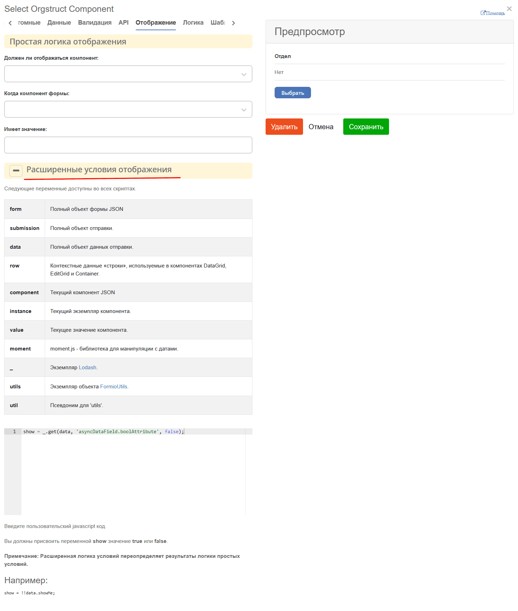
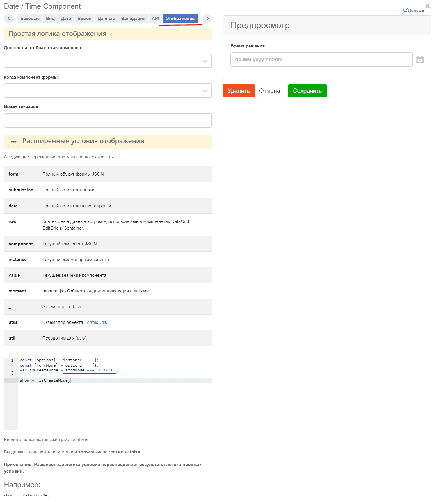
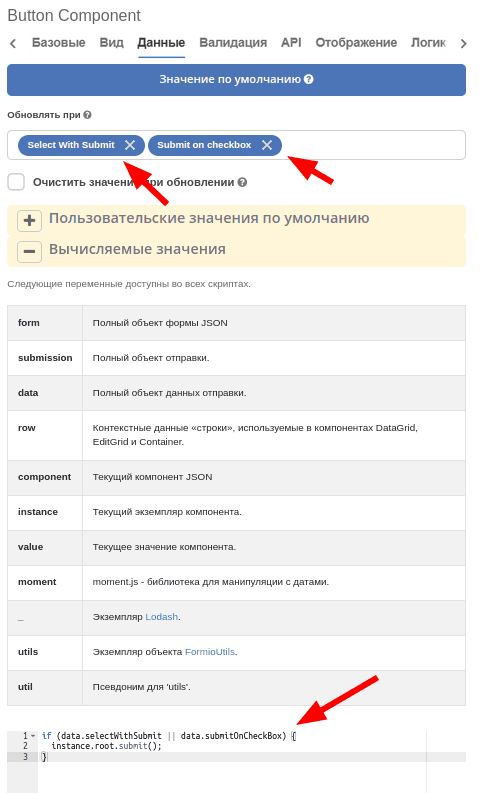
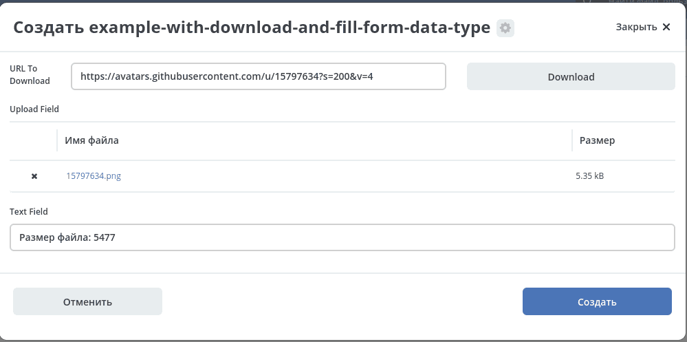

.. _form_examples:

Component Examples. How to
==========================

.. contents::
     :depth: 3

This section contains practical examples of configuring form components in the Citeck platform, as well as typical scenarios («How to») — scripts and configurations for solving common tasks: managing field visibility, auto-filling, event handling, and others.

Columns
--------

.. _sample_columns_component:

The **Columns** component allows convenient arrangement of form components.

 .. image:: _static/form_examples/columns_1.png
       :width: 200
       :align: center

**Column Properties** - the main configuration parameter, allows defining how the component will be divided into columns. The component is based on Bootstrap Grid.

 .. image:: _static/form_examples/columns_2.png
       :width: 600
       :align: center

On the **«Display»** tab in the **Column Properties** section, specify the number of columns and their size.

 .. image:: _static/form_examples/columns_3.png
       :width: 400
       :align: center

Then click **"Save"**. Result:

 .. image:: _static/form_examples/columns_4.png
       :width: 600
       :align: center

Text field
------------

.. _sample_text_field_component:

**Text field** - text component.

On the **«Basic»** tab, fill in:

- **Field Label** - the name of the component as it will appear on the form **(1)**.
- **Property Name** - the property name in the data type **(2)**.

Field requirement is set with a separate checkbox. **(3)**

 .. image:: _static/form_examples/Text_field_1.png
       :width: 600
       :align: center

Autofocus - automatically sets the input cursor without the need to click on it with the mouse:

 .. image:: _static/form_examples/Text_field_2.png
       :width: 600
       :align: center

ECOS Select Component
----------------------

.. _sample_ecos_select_component:

**ECOS Select Component** - form component for selecting a value from a list.

On the **«Basic»** tab, fill in:

- **Field Label** - the name of the component as it will appear on the form **(1)**.
- **Property Name** - the property name in the data type **(2)**.

Field requirement is set with a separate checkbox. **(3)**

 .. image:: _static/form_examples/ECOS_Select_1.png
       :width: 600
       :align: center

On the **«Data»** tab in **"Data Source Type"** select **Values** **(1)**.

**Data Source Values** is filled with values that should be available for selection in the list **(2)**:

- **Field Label** - display name,
- **Value** - the contained value.

 .. image:: _static/form_examples/ECOS_Select_2.png
       :width: 400
       :align: center

Date / Time Component
----------------------

.. _sample_date_time_component:

**Date / Time Component** - date/time component.

On the **«Basic»** tab, fill in:

- **Field Label** - the name of the component as it will appear on the form **(1)**.
- **Property Name** - the property name in the data type **(2)**.

Field requirement is set with a separate checkbox. **(3)**

 .. image:: _static/form_examples/Date_Time_1.png
       :width: 600
       :align: center

On the **«Display»** tab, specify the date format **(5)** and the possibility of manual input **(4)**.

 .. image:: _static/form_examples/Date_Time_2.png
       :width: 400
       :align: center

To change the date/time format, go to the tab - **«Display» tab - Format**:

 .. image:: _static/form_examples/Date_Time_3.png
       :width: 600
       :align: center

Default value — current date
~~~~~~~~~~~~~~~~~~~~~~~~~~~~~~~~~~~~~~

To set the current date as the default value, use the **customDefaultValue** property on the **«Data»** tab. The property accepts a JavaScript expression, the result of which is assigned to the ``value`` variable.

.. note::

   The static ``defaultValue`` property does not support dynamic values (for example, ``"now"`` does not work). For dynamic values, always use ``customDefaultValue``.

Configuration example:

.. code-block:: json

   {
     "key": "startDate",
     "type": "datetime",
     "input": true,
     "format": "yyyy-MM-dd",
     "enableTime": false,
     "customDefaultValue": "value = new Date();",
     "defaultValue": ""
   }

In the **Custom Default Value** field in the form builder, enter:

.. code-block:: javascript

   value = new Date();

When opening the form for creation, the field will be automatically filled with the current date.

Select Journal Component
-------------------------

.. _sample_select_journal_component:

**Select Journal Component** - component for selecting a value from a journal.

On the **«Basic»** tab, fill in:

- **Field Label** - the name of the component as it will appear on the form **(1)**.
- **Property Name** - the property name in the data type **(2)**.

Field requirement is set with a separate checkbox. **(3)**

 .. image:: _static/form_examples/Select_Journal_1.png
       :width: 600
       :align: center

On the **«Data»** tab, fill in **Journal ID** - the identifier of the journal that will be used in the component. (4)

 .. image:: _static/form_examples/Select_Journal_2.png
       :width: 400
       :align: center

Select Orgstruct Component
----------------------------

.. _sample_select_orgstruct_component:

**Select Orgstruct Component** - component for selection from the organizational structure.

On the **«Basic»** tab, fill in:

- **Field Label** - the name of the component as it will appear on the form **(1)**.
- **Property Name** - the property name in the data type **(2)**.

 .. image:: _static/form_examples/form_4.png
       :width: 600
       :align: center

On the **«Custom»** tab - you can specify:

- allowed **«Allowed Authority Type»** **(3)**
- **Current User by Default** - a setting that allows substituting the user who opened the form for creation into the component **(4)**.

Current User by Default
~~~~~~~~~~~~~~~~~~~~~~~~~~~~~~~~~~~~

To automatically substitute the current user when creating a record, use the **currentUserByDefault** property. The setting works only in form creation mode (``formMode = CREATE``).

Configuration example:

.. code-block:: json

   {
     "key": "responsible",
     "type": "selectOrgstruct",
     "input": true,
     "allowedAuthorityType": "USER",
     "currentUserByDefault": true,
     "defaultValue": ""
   }

.. note::

   The ``currentUserByDefault`` property is a built-in setting of the ``selectOrgstruct`` component. For other component types, use ``customDefaultValue`` (see :ref:`Custom Default Value <custom_default_value>`).

 .. image:: _static/form_examples/form_5.png
       :width: 600
       :align: center

For selecting a department:

 .. image:: _static/form_examples/form_5_1.png
       :width: 600
       :align: center

Button Component
---------------------

.. _sample_button_component:

**Button Component** - component for adding buttons to perform various actions in the form.

On the **«Basic»** tab, fill in:

- **Field Label** - the name of the button as it will appear on the form **(1)**.
- **Property Name** - the button property name **(2)**.
- **Actions** - specify the button action **(3)**

 .. image:: _static/form_examples/button.png
       :width: 600
       :align: center

To display the button across the full width of the cell, on the **"Display"** tab, check the **"Block"** checkbox:

  .. image:: _static/form_examples/button_1.png
       :width: 600
       :align: center

Panel
-------

.. _sample_panel_component:

**Panel** - a component - a header that contains semantically related components.

 .. image:: _static/form_examples/form_2.png
       :width: 200
       :align: center

Fill in **«Property Name»** - the component name.

 .. image:: _static/form_examples/form_3.png
       :width: 600
       :align: center

And on the **"Display"** tab, fill in **"Property Label"** **(2)**:

 .. image:: _static/form_examples/form_14.png
       :width: 600
       :align: center

Async Data Component
----------------------

.. _sample_async_data_component:

**Async Data Component** - asynchronous component.

 .. image:: _static/form_examples/form_12_1.png
       :width: 500
       :align: center

The **Grade** reference (data type hr-grades-type) contains information about the position (offerposition), salary range (gradesSalary) and bonus (gradesPrize).

When selecting a **Position**, the corresponding **Grade** and **Salary Range and Bonus** fields will be automatically filled:

 .. image:: _static/form_examples/form_6.png
       :width: 200
       :align: center

On the **«Async Data»** tab, fill in:

- **Field Label** - the name of the component as it will appear on the form **(1)**.
- **Data Type** - data type **(2)**.

 .. image:: _static/form_examples/form_7.png
       :width: 600
       :align: center

Script explanations **(3)**:

 .. image:: _static/form_examples/form_8.png
       :width: 500
       :align: center

- **emodel/type@hr-grades-type** - the type from which data needs to be obtained.
- **gradesSimpleRoleTypeAssoc** - the type property being compared, from which we get data.
- **offerPosition** - the property we use to compare with the type property from which we get data.

In **«Attributes»**, specify the attributes that need to be obtained **(4)**.

On the **«Advanced Settings»** tab, fill in:

- **Update On** - parameter where the form element to track is specified **(5)**.

 .. image:: _static/form_examples/form_9.png
       :width: 400
       :align: center

On the **«API»** tab, fill in:

- **Property Name** - the component property name **(6)**.

 .. image:: _static/form_examples/form_10.png
       :width: 400
       :align: center

For the form component to respond to the async component, make the following settings on the **«Data»** tab in the **Grade** component:

 .. image:: _static/form_examples/form_11.png
       :width: 400
       :align: center

In **Update On**, specify the component whose changes will trigger the component that needs to get data from the async component.

In **Calculated Values**:

 .. image:: _static/form_examples/form_12.png
       :width: 400
       :align: center

Now when selecting a **Position**, the **«Grade»** form component will automatically be set with a value depending on the **«Position»** component value.

:ref:`More about Async Data<async_data_component>`

How to
------------

Make a component non-editable
~~~~~~~~~~~~~~~~~~~~~~~~~~~~~~~~~~~~

- **«Display» tab - Hide Field** - makes the component non-editable.

 .. image:: _static/form_examples/form_13.png
       :width: 600
       :align: center

Hide a field on the form if it is empty
~~~~~~~~~~~~~~~~~~~~~~~~~~~~~~~~~~~~~~~

Useful, for example, on :ref:`kanban board<kanban_board>`:

 .. image:: _static/form_examples/form_15.png
       :width: 450
       :align: center

Script text:

.. code-block::

      show = !_.isEmpty(value)

Status
~~~~~~~~~~~~~~~~~~

On the document form, :ref:`status<associations>` can be displayed as follows:

 .. image:: _static/form_examples/form_status.png
       :width: 700
       :align: center

In the :ref:`Text field <Text_Field>` component:

- field label can be any,
- property name - **_status**,
- hide and disable input if it should not be displayed on the form.

Show field via "logic"
~~~~~~~~~~~~~~~~~~~~~~~~~~~~~~~~~~~~

On the **«Display»** tab, go to **Advanced Display Conditions**:

.. code-block::

      show = _.get(data, 'asyncDataField.boolAttribute', false);

Instead of **asyncDataField** and **boolAttribute**, use your data. If needed, the logic in the script can be extended.

If logic for multiple attributes is needed, you can use the **Panel** component. Place the required attributes inside it. Visually, the panel can be configured so its presence is not displayed.

Show field only in a specific form mode
~~~~~~~~~~~~~~~~~~~~~~~~~~~~~~~~~~~~~~~~~~~~~~~~~~~~~~

On the **«Display»** tab, go to **Advanced Display Conditions**:

.. code-block::

      const {options} = instance || {};
      const {formMode} = options || {};
      var isCreateMode = formMode === 'CREATE';

      show = !isCreateMode;

where **formMode** can be:

  - **CREATE** - creation form;
  - **VIEW** - view form;
  - **EDIT** - edit form

Processing form results for checkbox elements, dropdown lists / submit for dropdown checkbox lists
~~~~~~~~~~~~~~~~~~~~~~~~~~~~~~~~~~~~~~~~~~~~~~~~~~~~~~~~~~~~~~~~~~~~~~~~~~~~~~~~~~~~~~~~~~~~~~~~~~~~~~~~~~~~~~~~~~~~~~~~~~~~~~

To make the form submit when selecting an element in a dropdown list or clicking a checkbox, on the submit button in the **"Data"** tab:

1. In the **"Update On"** field, add a dependency on form components whose changes we are interested in.
2. In the **"Calculated Values"** field, add logic for auto-submit triggering:

.. code-block::

      if (data.selectWithSubmit || data.submitOnCheckBox) {
      instance.root.submit();
      }

where

      - **data** - form data;
      - **selectWithSubmit** and **submitOnCheckbox** - keys of components on the form;
      - **instance** - current component (button);
      - **instance.root** - current form where the button is added.

Configuration example:

:download:`json with form data <../files/submit-on-select-example.json>`

How to load an image from external file storage to a form?
~~~~~~~~~~~~~~~~~~~~~~~~~~~~~~~~~~~~~~~~~~~~~~~~~~~~~~~~~~~~~~~~~~~~~~~~

For auto-filling form fields, you can add a button and set **"Actions"** = **Custom**. With this choice, a field for entering custom javascript code appears at the bottom. In this field, you can load the required data and set it on the form as follows:

.. code-block::

      const submission = instance.root.submission;
      instance.root.submission = {
      ...submission,
      data: {
      ...(submission.data),
      // Fill the file field
      uploadField: contentData,
      // Fill the text field
      textField: 'File size: ' + contentData[0].size
      }
      };

where

      - **instance** - current component (button);
      - **instance.root** - the form containing our button;
      - **instance.root.submission** - form data.

With simple text/numeric/boolean fields, you can simply put the required value in **data**. For content fields, you need to first upload the content to the server as a temporary file.

.. code-block::

      const formData = new FormData();

      formData.append('file', file);
      formData.append('ecosType', 'temp-file');
      formData.append('mimeType', file.type);
      formData.append('name', file.name);

      return ecosFetch('/gateway/emodel/api/ecos/webapp/content', {
      method: 'POST',
      body: formData
      }).then(r => r.json()).then(data => data.entityRef);

where

- **file** - File instance - https://developer.mozilla.org/en-US/docs/Web/API/File

As a result of this request, we will get a **RecordRef** of the temporary file.

Then you need to get a **json description** from the temporary file, which is needed for the form component:

.. code-block::

      Records.get(tempFile).load('_as.content-data[]?json').then(it => it.map(element => {
      element.data = { 'entityRef': element.recordRef };
      }));

The obtained data can be set on the form as shown in the first script.

Configuration example:

Type and form example:

:download:`yaml with type data <../files/example-with-download-and-fill-form-data-type.yml>`

:download:`json with form data <../files/example-with-download-and-fill-form-data.json>`

You can load these artifacts, open the journal http://localhost/v2/journals?journalId=type$example-with-download-and-fill-form-data-type , create a new entity and click the **Download** button on the form.

How to provide text highlighting based on a flag?
~~~~~~~~~~~~~~~~~~~~~~~~~~~~~~~~~~~~~~~~~~~~~~~~~~~~~~

1. **To configure custom styles inside a form, you can**

      a) Add a panel (**Layout → Panel**) to the form, place all form elements inside it, and configure a **"Custom CSS Class"** on the **"Display"** tab that will uniquely identify our form. This is needed to avoid style influence on other parts of the system (let's call this class ROOT_PANEL_CLASS in our example).

      b) Add an html component (**Advanced → HTML Element**) to the form, configure it as follows:

            1. On the **"Basic"** tab, check **"Hide Field"**

            2. On the **"Display"** tab in the **"Content"** field, first write arbitrary text (this is needed so the component is visible in the editor and can be edited) and then place opening and closing ** tags, inside which configure custom styles. For styles to work only within our form, they need to be described in the format .ROOT_PANEL_CLASS .inner_class { __styles__ }, where **ROOT_PANEL_CLASS** is the class we configured in step 1, and inner_class is the class of the element inside the form.

2. To **highlight certain text based on a flag value**, you can do the following:

      a) Add an HTML component to the form

            1. In the **"Display" → "Custom CSS Class"** field, enter a class that will uniquely identify our html component (for example, HTML_TO_HIGHLIGHT)

            2. In the **"Display" → "Content"** field, write arbitrary text that will be displayed to the user and mark up the parts of this text that need to be highlighted depending on conditions using classes.

            For example:

            .. code-block::

              Text before text to highlight text after

      b) Add a **"Basic Components" → Checkbox** to the form and make it hidden in **"Basic" → "Hide Field"** if the user doesn't need to know or change its value.

      c) Add another html component:

            3. Set **"Basic" → "Hide Field" → "Yes"**

            4. In the **"Display" → "Content"** field, write arbitrary text so the field is visible in the editor

            5. **Data → Update On → Checkbox** (from step b)

            6. In the **"Logic"** tab, add new logic:

              Trigger: Simple logic - when the form component **Checkbox** (from step b) equals **true**.

              Actions: Type - Property, Component Property: Content, In the appeared **Content** field, enter our styles inside ** tags, not forgetting to specify the class from step **(a)** to avoid accidentally changing the appearance of other parts of the system. For example:

              .. code-block::

                  

Attached is a form with a configuration example:

:download:`json with form data <../files/html-highlight-example.json>`

.. list-table::
      :widths: 20 20
      :align: center

      * - |

            .. image:: _static/form_examples/highlight_01.png
                  :width: 500
                  :align: center

        - |

            .. image:: _static/form_examples/highlight_02.png
                  :width: 500
                  :align: center
