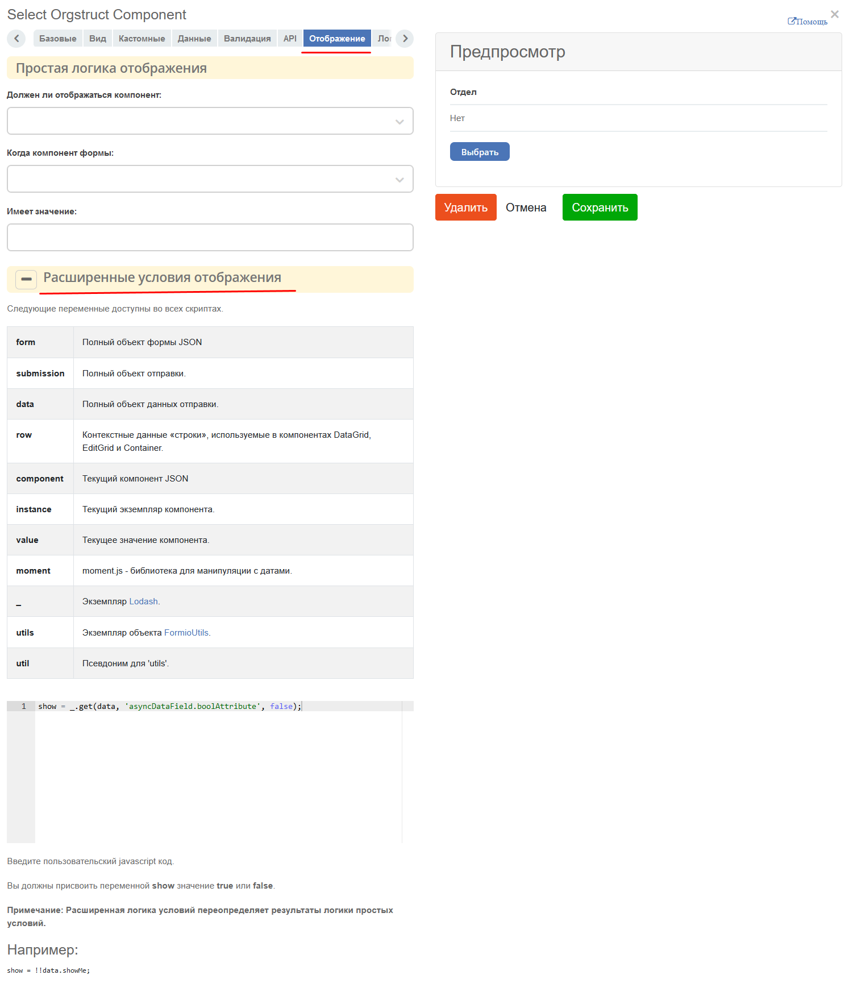
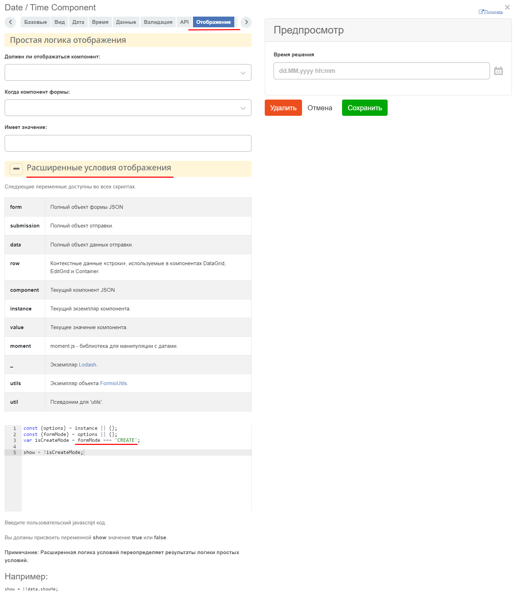
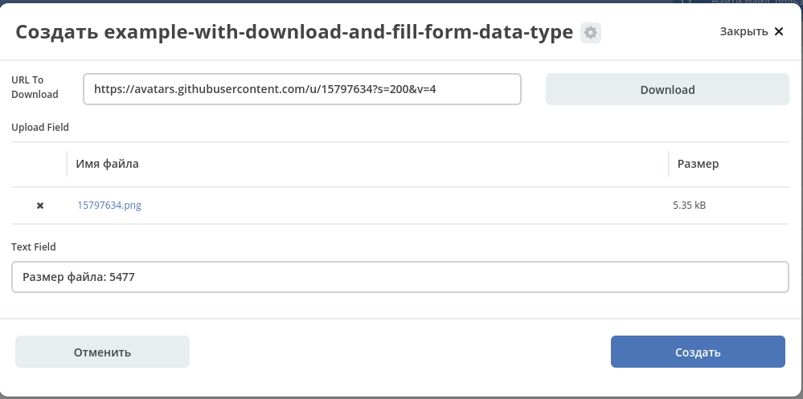

.. _form_examples:

Примеры компонент. How to
==========================

.. contents::
     :depth: 3

Columns
--------

.. _sample_columns_component:

Компонент **Columns** позволяет удобно расположить компоненты формы.

 .. image:: _static/form_examples/columns_1.png
       :width: 200
       :align: center

**Свойства столбца** - основной параметр настройки, позволяет определить как по колонкам будет разбиваться компонент. Компонент основан на использовании Bootstrap Grid.

 .. image:: _static/form_examples/columns_2.png
       :width: 600
       :align: center

На вкладке **«Вид»** в разделе **Свойства столбца** указать количество столбцов и их размер. 

 .. image:: _static/form_examples/columns_3.png
       :width: 400
       :align: center

Далее нажать **"Сохранить"**. Результат:

 .. image:: _static/form_examples/columns_4.png
       :width: 600
       :align: center

Text field
------------

.. _sample_text_field_component:

**Text field** - текстовый компонент. 

На вкладке **«Базовые»** заполняется: 

- **Название поля** - имя компонента, как оно будет отражаться на форме **(1)**.
- **Имя свойства** - имя свойства в типе данных **(2)**.

Обязательность поля выставляется отдельным чекбоксом. **(3)**

 .. image:: _static/form_examples/Text_field_1.png
       :width: 600
       :align: center

Автофокус - автоматическая устанавка курсора ввода, без необходимости кликать на него мышью:

 .. image:: _static/form_examples/Text_field_2.png
       :width: 600
       :align: center

ECOS Select Component
----------------------

.. _sample_ecos_select_component:

**ECOS Select Component** - компонент формы для выбора значения из списка.

На вкладке **«Базовые»** заполняется: 

- **Название поля** - имя компонента, как оно будет отражаться на форме **(1)**.
- **Имя свойства** - имя свойства в типе данных **(2)**.

Обязательность поля выставляется отдельным чекбоксом. **(3)**

 .. image:: _static/form_examples/ECOS_Select_1.png
       :width: 600
       :align: center

На вкладке **«Данные»** в **"Типе источника данных"** выбрать **Values** **(1)**.

**Data Source Values**  заполняется значениями, которые должны быть для выбора в списке **(2)**: 

- **Название поле** - отображаемое имя, 
- **Значение** - значение, которое содержится.

 .. image:: _static/form_examples/ECOS_Select_2.png
       :width: 400
       :align: center

Date / Time Component
----------------------

.. _sample_date_time_component:

**Date / Time Component** - компонент даты / времени. 

На вкладке **«Базовые»** заполняется: 

- **Название поля** - имя компонента, как оно будет отражаться на форме **(1)**.
- **Имя свойства** - имя свойства в типе данных **(2)**.

Обязательность поля выставляется отдельным чекбоксом. **(3)**

 .. image:: _static/form_examples/Date_Time_1.png
       :width: 600
       :align: center

На вкладке **«Вид»** указать формат даты **(5)** и возможность ручного ввода **(4)**. 

 .. image:: _static/form_examples/Date_Time_2.png
       :width: 400
       :align: center

Для изменения формата даты/времени перейдите во вкладку - **вкладка «Вид» - Формат**:

 .. image:: _static/form_examples/Date_Time_3.png
       :width: 600
       :align: center

Select Journal Component
-------------------------

.. _sample_select_journal_component:

**Select Journal Component** - компонент для выбора значения из журнала.

На вкладке **«Базовые»** заполняется: 

- **Название поля** - имя компонента, как оно будет отражаться на форме **(1)**.
- **Имя свойства** - имя свойства в типе данных **(2)**.

Обязательность поля выставляется отдельным чекбоксом. **(3)**

 .. image:: _static/form_examples/Select_Journal_1.png
       :width: 600
       :align: center

На вкладке **«Данные»** заполняется **ID журнала** - идентификатор журнала, который будет использовать в компоненте. (4)

 .. image:: _static/form_examples/Select_Journal_2.png
       :width: 400
       :align: center

Select Orgstruct Component
----------------------------

.. _sample_select_orgstruct_component:

**Select Orgstruct Component**  - компонент для выбора из оргструктуры. 

На вкладке **«Базовые»** заполняется: 

- **Название поля** - имя компонента, как оно будет отражаться на форме **(1)**.
- **Имя свойства** - имя свойства в типе данных **(2)**.

 .. image:: _static/form_examples/form_4.png
       :width: 600
       :align: center

На вкладке **«Кастомные»** - можно указать:

- допустимый **«Разрешенный тип полномочий»** **(3)**
- **Текущий пользователь по умолчанию** - настройка, позволяющая подставить в компонент пользователя, который открыл форму на создание **(4)**.

 .. image:: _static/form_examples/form_5.png
       :width: 600
       :align: center

Для выбора подразделения:

 .. image:: _static/form_examples/form_5_1.png
       :width: 600
       :align: center

Button Component 
---------------------

.. _sample_button_component:

**Button Component** - компонент для добавления кнопок для выполнения различных действий в форме.

На вкладке **«Базовые»** заполняются: 

- **Название поля** - наименование кнопки, как оно будет отражаться на форме **(1)**.
- **Имя свойства** - имя свойства кнопки **(2)**.
- **Действия** - указать действие кнопки **(3)**
  

 .. image:: _static/form_examples/button.png
       :width: 600
       :align: center

Для отображения кнопки на всю ширину ячейки необходимо на вкладке **"Вид"** выставить чекбокс **"Блокировать"**:

  .. image:: _static/form_examples/button_1.png
       :width: 600
       :align: center

Panel
-------

.. _sample_panel_component:

**Panel**  - компонент - заголовок, в который помещаются близкие по смыслу компоненты.

 .. image:: _static/form_examples/form_2.png
       :width: 200
       :align: center

Заполняется **«Имя свойства»** - имя компонента.

 .. image:: _static/form_examples/form_3.png
       :width: 600
       :align: center

И на вкладке **"Вид"** заполнить **"Название свойства"** **(2)**:

 .. image:: _static/form_examples/form_14.png
       :width: 600
       :align: center

Async Data Component 
----------------------

.. _sample_async_data_component:

**Async Data Component** - асинхронный компонент.

 .. image:: _static/form_examples/form_12_1.png
       :width: 500
       :align: center

Справочник **Грейд** (тип данных hr-grades-type) содержит в себе информацию о должности (offerposition), вилке оклада (gradesSalary) и премии (gradesPrize).

При выборе **Должности** автоматически заполнятся соответствующие ей поля **Грейд** и **Зарплатная вилка и премия**:

 .. image:: _static/form_examples/form_6.png
       :width: 200
       :align: center

На вкладке **«Асинхронные данные»** заполняется: 

- **Название поля** - имя компонента, как оно будет отражаться на форме **(1)**.
- **Тип данных** - тип данных **(2)**.

 .. image:: _static/form_examples/form_7.png
       :width: 600
       :align: center

Пояснения к скрипту **(3)**:

 .. image:: _static/form_examples/form_8.png
       :width: 500
       :align: center

- **emodel/type@hr-grades-type** - тип, из которого необходимо получить данные.
- **gradesSimpleRoleTypeAssoc** - сравниваемое свойство типа, из которого получаем данные.
- **offerPosition** - свойство, которое используем для сравнения со свойством типа, из которого получаем данные.

В **«Атрибуты»** указываются атрибуты, который необходимо получить **(4)**.

На вкладке **«Расширенные настройки»** заполняется:

- **Обновлять при** -параметр, в котором указывается элемент формы, которые следует отслеживать **(5)**.

 .. image:: _static/form_examples/form_9.png
       :width: 400
       :align: center

На вкладке **«API»** заполняется:

- **Имя свойства** - имя свойства компонента **(6)**.

 .. image:: _static/form_examples/form_10.png
       :width: 400
       :align: center

Чтобы компонент формы реагировал на асинхронный компонент, необходимо сделать следующие настройки во вкладке **«Данные»** в компоненте **Грейд**:

 .. image:: _static/form_examples/form_11.png
       :width: 400
       :align: center

В **Обновлять при** указать компонент, при изменении которого будет реагировать компонент, для которого необходимо получить данные из асинхронного компонента.

В **Вычисляемые значения**:

 .. image:: _static/form_examples/form_12.png
       :width: 400
       :align: center

Теперь при выборе **Должности** в компонент формы **«Грейд»** в зависимости от значения компонента **«Должность»**, будет автоматически выставлено значение.

:ref:`Подробнее об Async Data<async_data_component>`

How to
-------

Сделать компонент нередактируемым
~~~~~~~~~~~~~~~~~~~~~~~~~~~~~~~~~~~~

- **вкладка «Вид» - Скрыть поле** - делает компонент нередактируемым.

 .. image:: _static/form_examples/form_13.png
       :width: 600
       :align: center

Скрыть поле на форме, если оно пустое 
~~~~~~~~~~~~~~~~~~~~~~~~~~~~~~~~~~~~~~~~

Полезно, например, на :ref:`канбан-доске<kanban_board>`:

 .. image:: _static/form_examples/form_15.png
       :width: 450
       :align: center

Текст скрипта:

.. code-block::

      show = !_.isEmpty(value)

Статус
~~~~~~~~~

На форме документа :ref:`статус<associations>` может быть отражен следующим образом:

 .. image:: _static/form_examples/form_status.png
       :width: 700
       :align: center

В компоненте  :ref:`Text field <Text_Field>`:

- название поля может быть любым, 
- имя свойства -  **_status**, 
- скрыть и заблокировать на ввод, если необходимо не отображать на форме.

Показывать поле  через "логику"
~~~~~~~~~~~~~~~~~~~~~~~~~~~~~~~~~~~~~~~~~~

На вкладке **«Отображение»** перейдите в **Расширенные условия отображения**:

.. code-block::

      show = _.get(data, 'asyncDataField.boolAttribute', false);

Вместо **asyncDataField** и **boolAttribute** ваши данные. Если нужно, то логику в скрипте можно расширить.

Если необходима логика на несколько атрибутов, то можно использовать компонент **Панель**. И внутри нее уже разместить нужные атрибуты. Визуально панель можно настроить, чтобы её присустствие никак не отображалось.

Показывать поле только в определенном режиме формы
~~~~~~~~~~~~~~~~~~~~~~~~~~~~~~~~~~~~~~~~~~~~~~~~~~~~~~~

На вкладке **«Отображение»** перейдите в **Расширенные условия отображения**:

.. code-block::

      const {options} = instance || {};
      const {formMode} = options || {};
      var isCreateMode = formMode === 'CREATE';

      show = !isCreateMode;

где **formMode** может быть:

  - **CREATE** -  форма создания;
  - **VIEW** - форма просмотра;
  - **EDIT** -  форма редактирования

Обработка результатов формы по элементам чекбокс, выпадающим спискам / submit для выпадающих списков checkbox
~~~~~~~~~~~~~~~~~~~~~~~~~~~~~~~~~~~~~~~~~~~~~~~~~~~~~~~~~~~~~~~~~~~~~~~~~~~~~~~~~~~~~~~~~~~~~~~~~~~~~~~~~~~~~~~~

Для того чтобы при выборе элемента в выпадающем списке или при клике на чекбокс происходил сабмит формы можно на submit кнопке во вкладке **"Данные"**:

1. В поле **"Обновлять при"** добавить зависимость от компонентов на форме, изменение которых нам интересно.
2. В поле **"Вычисляемые значения"** добавить логику для срабатывания авто-сабмита:

.. code-block::

      if (data.selectWithSubmit || data.submitOnCheckBox) {
      instance.root.submit();
      }

где

      - **data** - данные формы;
      - **selectWithSubmit** и **submitOnCheckbox** - ключи компонентов на форме;
      - **instance** - текущий компонент (кнопка);
      - **instance.root** - текущая форма, в которой добавлена кнопка.

Пример конфигурации:

:download:`json с данными формы <../files/submit-on-select-example.json>` 

Как загрузить на форму изображение с внешнего файлового хранилища?
~~~~~~~~~~~~~~~~~~~~~~~~~~~~~~~~~~~~~~~~~~~~~~~~~~~~~~~~~~~~~~~~~~~~

Для автозаполнения полей на форме можно добавить кнопку и настроить **"Действия"** = **Custom**. При этом выборе внизу появляется поле для ввода произвольного javascript кода. В это поле можно загрузить нужные данные и проставить их на форму следующим образом:

.. code-block::

      const submission = instance.root.submission;
      instance.root.submission = {
      ...submission,
      data: {
      ...(submission.data),
      // Заполняем поле с файлом
      uploadField: contentData,
      // Заполняем текстовое поле
      textField: 'Размер файла: ' + contentData[0].size
      }
      };

где

      - **instance** - текущий компонент (кнопка);
      - **instance.root** - форма, в которой находится наша кнопка;
      - **instance.root.submission** - данные формы.

С простыми текстовыми/числовыми/булевыми полями в **data** можно просто положить требуемое значение. Для полей с контентом нужно предварительно загрузить контент на сервер как временный файл.

.. code-block::

      const formData = new FormData();
      
      formData.append('file', file);
      formData.append('ecosType', 'temp-file');
      formData.append('mimeType', file.type);
      formData.append('name', file.name);
      
      return ecosFetch('/gateway/emodel/api/ecos/webapp/content', {
      method: 'POST',
      body: formData
      }).then(r => r.json()).then(data => data.entityRef);

где

- **file** - инстанс File - https://developer.mozilla.org/en-US/docs/Web/API/File

В результате этого запроса получим **RecordRef** временного файла.

Затем нужно из временного файла получить **json описание**, которое нужно для компонента на форме:

.. code-block::

      Records.get(tempFile).load('_as.content-data[]?json').then(it => it.map(element => {
      element.data = { 'entityRef': element.recordRef };
      }));

Полученные данные можно проставить на форму, как показано в первом скрипте.

Пример конфигурации:

Пример типа и формы:

:download:`yaml с данными типа <../files/example-with-download-and-fill-form-data-type.yml>` 

:download:`json с данными формы <../files/example-with-download-and-fill-form-data.json>` 

Можно загрузить эти артефакты, открыть журнал http://localhost/v2/journals?journalId=type$example-with-download-and-fill-form-data-type , создать новую сущность и нажать на форме кнопку **Download**.

Как обеспечить подсветку/выделение текста по флагу?
~~~~~~~~~~~~~~~~~~~~~~~~~~~~~~~~~~~~~~~~~~~~~~~~~~~

1. **Для настройки произвольных стилей внутри формы можно**

      а) Добавить на форму панель (**Макет → Panel**), в которую добавить все элементы формы и настроить **"Пользовательский CSS класс"** на вкладке **"Вид"**, который будет однозначно идентифицировать нашу форму. Это нужно чтобы избежать влияния стилей на другие части системы (назовем этот класс в нашем примере ROOT_PANEL_CLASS).

      б) Добавить на форму компонент html (**Расширенные → HTML Element**), который настраиваем следующим образом:

            1. В вкладке **"Базовые"** ставим галку на **"Скрыть поле"**

            2. В вкладке **"Вид"** в поле **"Контент"** пишем вначале  произвольный текст (это нужно чтобы компонент было видно в редакторе и была возможность его отредактировать) и затем размещаем открывающий и закрывающий тэги **, внутри которых настраиваем произвольные стили. Чтобы стили работали только в пределах нашей формы нужно их описывать в формате .ROOT_PANEL_CLASS .inner_class { __стили__ }, где **ROOT_PANEL_CLASS** - класс, который мы настроили в п.1, а inner_class - класс элемента внутри формы.

2. Для того чтобы **по значению флага выделялся некоторый текст** можно сделать следующее:

      а) Добавить на форму HTML компонент

            1. В поле **"Вид" → "Пользовательский CSS класс"** вводим класс, который будет однозначно идентифицировать наш html компонент (допустим HTML_TO_HIGHLIGHT)

            2. В поле **"Вид" → "Контент"** пишем произвольный текст, который будет отображаться пользователю и размечаем части этого текста, которые нужно будет подсветить в зависимости от условий используя классы.

            Например: 

            .. code-block::

              Текст до текст для выделения текст после

      б) Добавить на форму **"Основные компоненты" → Checkbox** и делаем его скрытым в **"Базовые" → "Скрыть поле"**  если пользователю его значение знать и менять не нужно.

      в) Добавить еще один html компонент:

            3. Выставить **"Базовые" → "Скрыть поле" → "Да"**

            4. В поле **"Вид" → "Контент"** написать произвольный текст, чтобы поле было видно в редакторе

            5. **Данные → Обновлять при → Checkbox** (из пункта б)

            6. Во вкладке **"Логика"** добавляем новую логику:

              Триггер: Простая логика - когда компонент формы **Checkbox** (из пункта б) равен **true**.

              Действия:  Тип - Свойство, Свойство компонента: Content, В появившемся поле **Content** вводим наши стили внутри тэгов ** не забывая про  указание класса из пункта **(а)**, чтобы случайно не поменять вид других частей системы. Например:

              .. code-block::

                  

Во вложении форма с примером настройки:

:download:`json с данными формы <../files/html-highlight-example.json>` 

.. list-table::
      :widths: 20 20
      :align: center

      * - |

            .. image:: _static/form_examples/highlight_01.png
                  :width: 500
                  :align: center

        - |

            .. image:: _static/form_examples/highlight_02.png
                  :width: 500
                  :align: center

