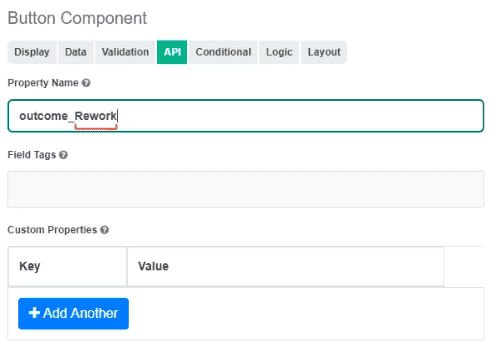

.. _form_to_task:

Связь формы с задачей
=====================

.. contents::
   :depth: 3

Завершение задачи (outcome)
---------------------------

Для кнопок, которые должны завершать задачу, следует указывать свойство **Имя свойства/Property Name** по следующему формату:

``outcome_******``

 где ``******`` - результат выполнения задачи.

В процессе можно добавлять **exclusive gateway** с несколькими выходами по условию нажатой кнопки.

Для проверки нажатой кнопки следует проверить переменную ``form_{{FORM_KEY}}_outcome`` или ``outcome``. Например:

.. code-block::

    form_testkey_outcome == 'Rework'

Атрибуты задачи
------------------

Комментарий
~~~~~~~~~~~

Для атрибута **"комментарий"** свойство **Имя свойства/Property Name (warning)** должно быть **comment**.

.. note::

   Для миграции существующих форм, где ключ отличается, следует сделать невидимое поле с нужным ключом, которое будет копировать значение из поля **comment**.

Атрибуты из привязанного документа
~~~~~~~~~~~~~~~~~~~~~~~~~~~~~~~~~~

Для атрибутов, которые должны загружаться из привязанного к задаче документа, следует указывать префикс **_ECM_**.

Пример:

.. code-block::

    _ECM_title

Атрибуты, хранящиеся в задаче
~~~~~~~~~~~~~~~~~~~~~~~~~~~~~

Все атрибуты, которые хранятся непосредственно в задаче, доступны по прямому имени без преобразований.

Вид формы задачи
------------------

1. Кнопки должны располагаться с левого края под полем комментария.
2. Кнопки, несущие отрицательный характер, должны быть всегда слева от кнопок, несущих положительный характер.
3. Если кнопок 3, то располагать в соответствии со смыслом: от отрицательного к положительному решению.
4. По ширине кнопки и отступы между кнопками не должны быть слишком большими.

Примеры:

.. grid:: 2
   :gutter: 2

   .. grid-item::

      .. image:: _static/for_task/for_task_4.png
         :width: 500
         :align: left

   .. grid-item::

      .. image:: _static/for_task/for_task_5.png
         :width: 500
         :align: left

