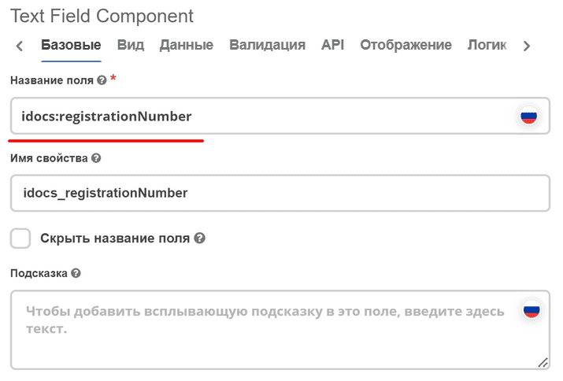
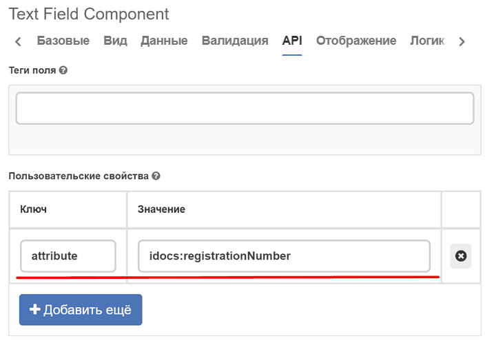
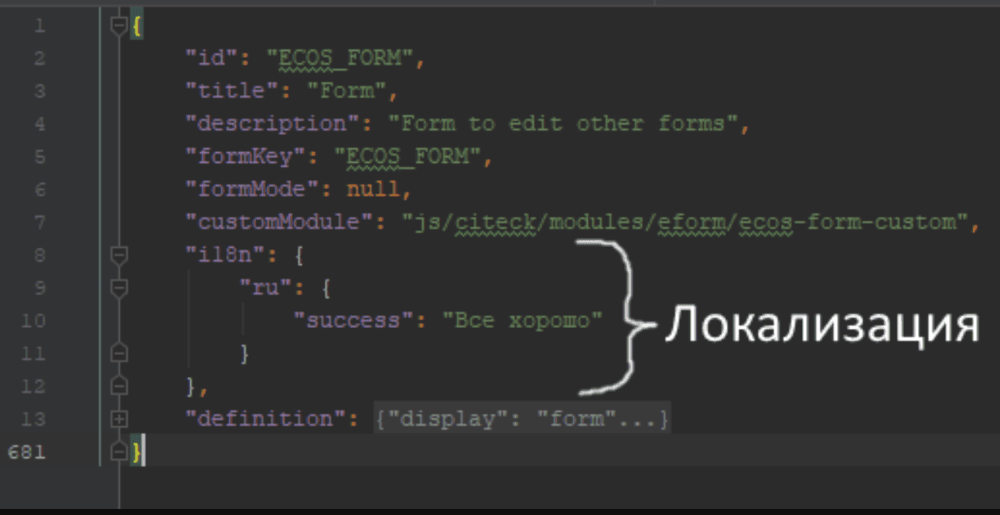

Localization
============

.. _form_localisation:

All **Label** fields on the form go through a localization stage before rendering. If a localization key is not found, the string written in the **Label** field of the component is rendered.

**1. Global Localization**

All localization that has the prefix **ecos.forms** goes into forms. For example, ``ecos.forms.someTitle="123"`` will appear in forms as: ``{"someTitle":"123"}``.

Global localization uses localization from ``site-messages/*.properties`` files of ``*-share`` modules.

**2. Attribute Localization**

If the **Field Label** of a field matches the attribute being edited, a request is made to the server for the title of that field. If the title is found, the field will be localized.

|

**3. Form Localization**

In the form's ``json`` configuration, you can set localization that will only apply within this specific form. Example:

This option is suitable if you need to add custom localization for error messages, hints, etc. To set the localization, you need to go to the :guilabel:`Localization` form and place your localization there. After that, it can be used on the form itself by key. For naming keys, it is best to use Latin characters.

.. list-table::
      :widths: 20 20
      :align: center

      * - |

            .. image:: _static/form_localisation/Forms_local_4.png
                  :width: 500
                  :align: center

        - |

            .. image:: _static/form_localisation/Forms_local_5.png
                  :width: 500
                  :align: center

**4. Localization of Form Component Field Text**

For localizing the text of form component fields (Field Label, Tooltip), the :ref:`ML Text<ML_Text>` component is provided - a text field with a switch in the form of a Russian/USA flag. After selecting the language, the text is entered in the field.

.. list-table::
      :widths: 20 20
      :align: center

      * - |

            .. image:: _static/form_localisation/Forms_local_11.png
                  :width: 500
                  :align: center

        - |

            .. image:: _static/form_localisation/Forms_local_12.png
                  :width: 500
                  :align: center

Both entered values are saved.

