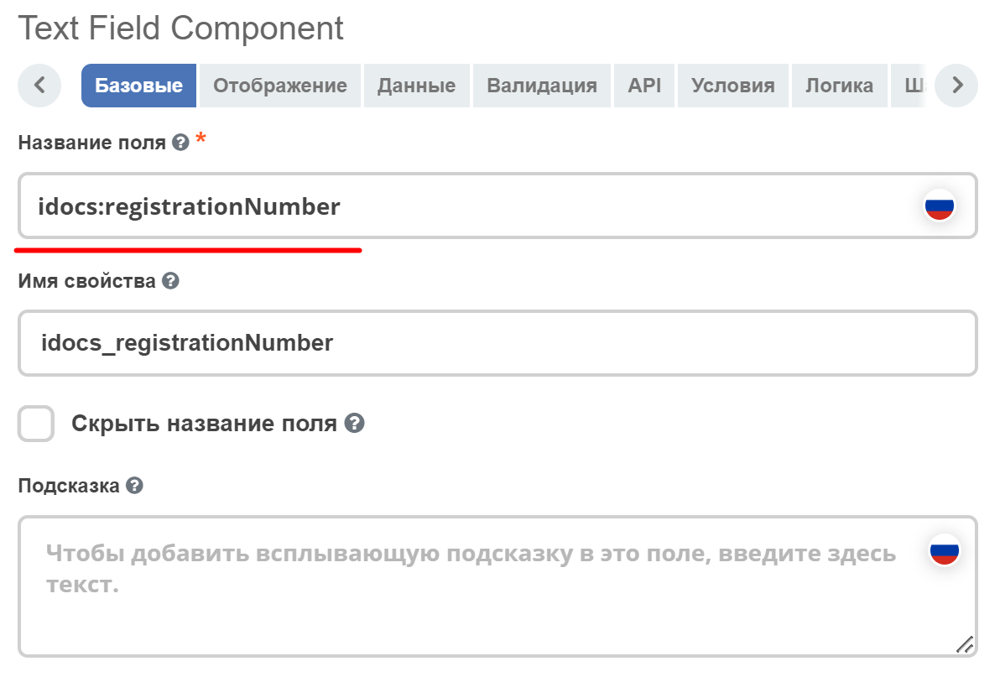
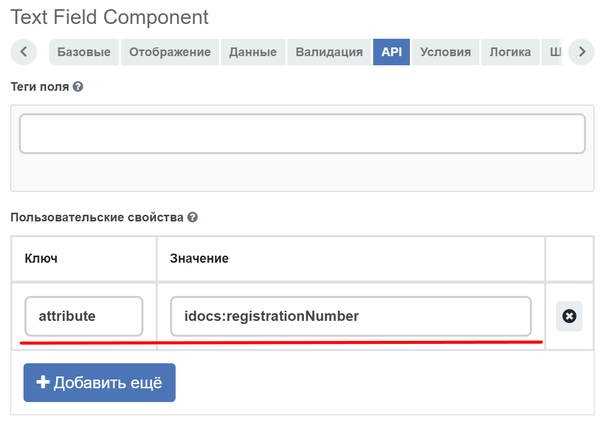
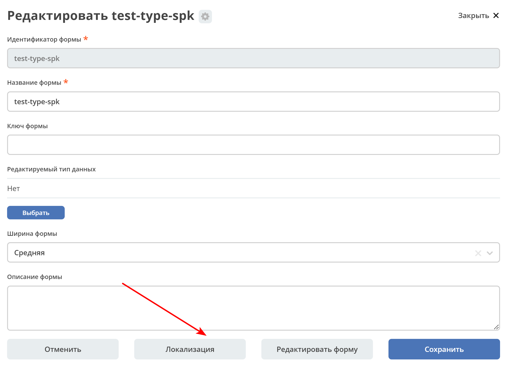
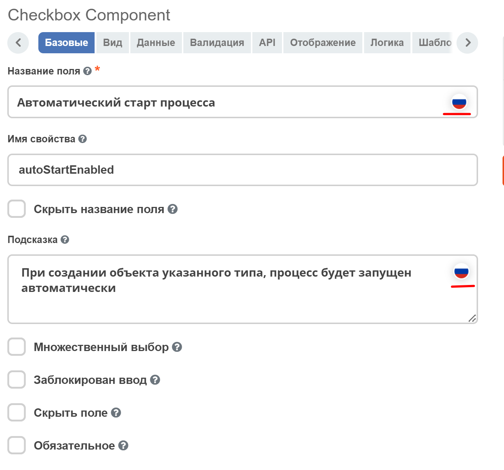
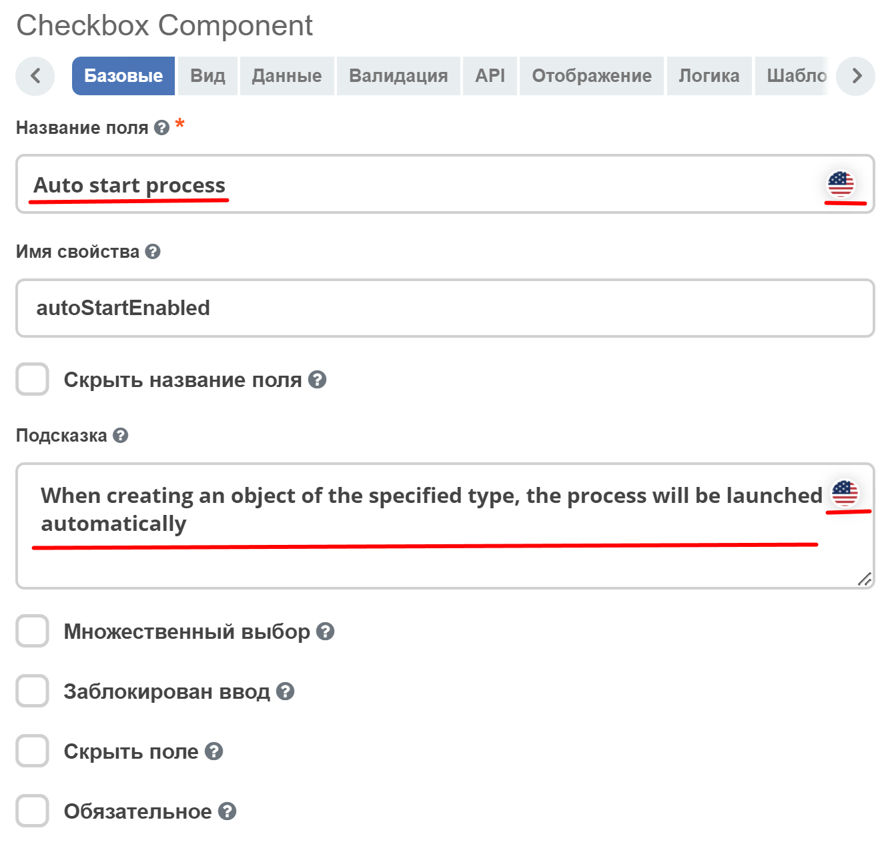

Локализация
============

Все **Label** у полей на форме перед рендером проходят через этап локализации. Если ключа локализации не найдено, то рендерится строка, которая записана в поле **Label** у поля.

**1. Глобальная локализация**
   
Вся локализация, которая имеет префикс **ecos.forms**. попадает в формы. Например ``ecos.forms.someTitle="123"``попадет в формы в виде: ``{"someTitle":"123"}``.

В качестве глобальной локализации используется локализация из ``site-messages/*.properties`` файлов ``*-share`` модулей.

**2. Локализация атрибутов**

Если **Название поля** у поля совпадает с редактируемым атрибутом, то происходит запрос на сервер за заголовком для такого поля. Если заголовок найден, то поле будет локализовано.

|

**3. Локализация формы**

В ``json`` конфигурации формы можно задать локализацию, которая будет действовать только в пределах данной формы. Пример:

.. image:: _static/form_localisation/Forms_local_3.png
       :width: 400
       :align: center

Такой вариант подходит, если требуется добавить пользовательскую локализацию для сообщений об ошибке, подсказок и т. д. Чтобы установить локализацию, необходимо перейти на форму :guilabel:`Локализация` и поместить свою локализацию туда. После чего её можно будет использовать на самой форме по ключу. Для именования ключей лучше всего использовать символы латиницы.

|

**4. Локализация текста полей компонента формы**

Для локализации текста полей компонента формы (Название поля, Подсказка) предусмотрен компонент :ref:`ML Text<ML_Text>` - текстовое поле с переключателем в виде флага России /США. После выбора языка в поле вводится текст.

|

Сохраняются оба введенных зачения.

