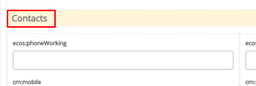

Локализация
============

Все **Label** у полей на форме перед рендером проходят через этап локализации. Если ключа локализации не найдено, то рендерится строка, которая записана в поле **Label** у поля.

Локализация в новых формах может быть в 4 видах:

**1. Глобальная локализация**
   
Вся локализация, которая имеет префикс **ecos.forms**. попадает в новые формы. Например **ecos.forms.someTitle="123"** попадет в формы в виде: **{"someTitle":"123"}**.

На момент 16.05.19 в качестве глобальной локализации используется локализация из ``site-messages/*.properties`` файлов ``*-share`` модулей.

**2. Локализация атрибутов**

Если **Label** у поля совпадает с редактируемым атрибутом, то происходит запрос на сервер за заголовком для такого поля. Если заголовок найден, то поле будет локализовано.

.. image:: _static/form_localisation/Forms_local_1.png
       :width: 800
       :align: center
       :alt: Локализация атрибутов

**3. Локализация формы**

В ``json`` конфигурации формы можно задать локализацию, которая будет действовать только в пределах данной формы. Пример:

Такой вариант подходит, если требуется добавить пользовательскую локализацию для сообщений об ошибке, подсказок и т. д. Чтобы установить локализацию, необходимо перейти на форму :guilabel:`Localization` и поместить свою локализацию туда. После чего её можно будет использовать на самой форме по ключу. Для именования ключей лучше всего использовать символы латиницы.

.. image:: _static/form_localisation/Forms_local_4.png
       :width: 400
       :align: center
       :alt: Локализация формы

.. image:: _static/form_localisation/Forms_local_5.png
       :width: 400
       :align: center
       :alt: Локализация формы

*Пример локализации панели*:
Чтобы установить локализацию для панелей (:guilabel:`Layouts` -> :guilabel:`Panels`), можно воспользоваться функциями :guilabel:`Localisation`, достаточно прописать их как показано ниже.

**4. Локализация подсказок**

Чтобы локализовать подсказки к атрибутам, необходимо следующее:

1. Написать саму локализацию в форме. Ключ для локализации можно выбрать на своё усмотрение (не нужно писать ключи с пробелами, они могут не спарситься). Пример локализованной подсказки:

2. Прописать ключ в поле для подсказки :guilabel:`Tooltip`.

.. image:: _static/form_localisation/Forms_local_9.png
       :width: 400
       :align: center
       :alt: Локализация подсказок

В итоге получим локализацию подсказок:

