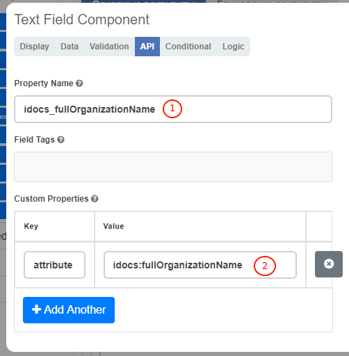

====================
**Общая информация**
====================

* Новые формы ECOS реализованы на базе движка `formiojs <https://github.com/formio/formio.js>`_.
* Функция редактора форм доступна только в ECOS **Enterprise**.
* Формы описываются в ``json`` формате.
* Формы используются для редактирования записей из **Records Service** (см. ECOS Records). На бэкэнде редактирование записи может восприниматься как создание новой (например если не указан **ID** редактируемой записи).

Существуют две системные формы, которые изменять **не желательно**:

       #. Форма для создания и редактирования других форм. Ключ: ``ECOS_FORM``;
       #. Форма по-умолчанию. Она используется как отправная точка если мы создаем новую форму. Ключ: ``DEFAULT``.

**Атрибут - это собиртельный термин, который относится и к свойству и ассоциации и к дочерней ассоциации и к системным свойствам;**

Связь с типом ECOS
------------------

В типе ECOS предусмотрено поле formRef, которое определяет связь типа с формой. В большинстве случаев этого поля достаточно, но если
для одного типа требуется несколько форм (например, для отображения на дашборде), то в конгфигурации формы предусмотрено поле typeRef.

Связь без типа ECOS
-------------------

В ситуации когда запись не может быть привязана к определенному типу ECOS можно воспользоваться привязкой по ключам. 
Запись должна отдавать атрибут ``_formKey`` и по полученным ключам идет поиск формы до первого совпадения.

Если записи принадлежат одному типу или тип отсутствует, но для некоторых записей должна использоваться определенная форма,
можно реализовать атрибут ``_formRef``. Если этот атрибут вернул ссылку на форму, то она имеет наибольший приоритет.

Связь с атрибутом записи
-------------------------

Для простых полей мы можем выставить **Property Name** (1) в соответствии со свойством записи, но если нужно связать с атрибутом, в котором есть спец символы (например ":"), то следует добавить в **Custom Properties** свойство (2) с ключом **attribute** и значением - именем атрибута.

Пользовательский модуль
-----------------------
В json описании формы можно добавить поле **customModule**, в котором записать путь до ``javascript`` модуля, который будет создан вместе с формой. В этом модуле можно разместить сложную логику, которую в последствии вызывать из скриптов формы. Для примера см. **ecos-eform-repo/src/main/resources/alfresco/module/ecos-eform-repo/ecos-forms\ecos-form.json**

Если в **customModule** будет метод ``init``, то он будет вызван с текущей формой в аргументах.

