.. _forms_main:

General Information
===================

.. contents::
   :depth: 3

**Form** - a graphical representation of an object as a set of interface elements for manipulating the object's data. Interface elements reference attributes defined in the :ref:`data type<data_types_main>`.

* Forms are implemented based on the `formio.js <https://github.com/formio/formio.js>`_ engine.
* Forms are described in json format.
* Forms are used for editing records from **Records Service** see :ref:`Citeck Records<Records_API>`. On the backend, editing a record can be perceived as creating a new one (for example, if the **ID** of the record being edited is not specified).

Interface navigation description
-----------------------------------------

A journal **"Forms" (Workspace "Admin Section" - UI Configuration)** has been created to view existing forms and edit them:

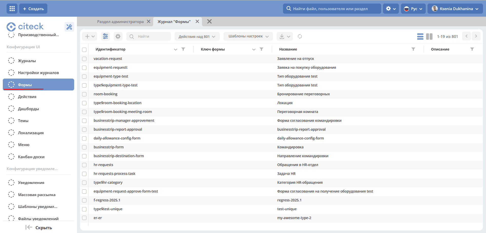

By default, system forms are not displayed in the journal.

To display **ONLY** system forms, go to the table settings, set **System type - Yes**:

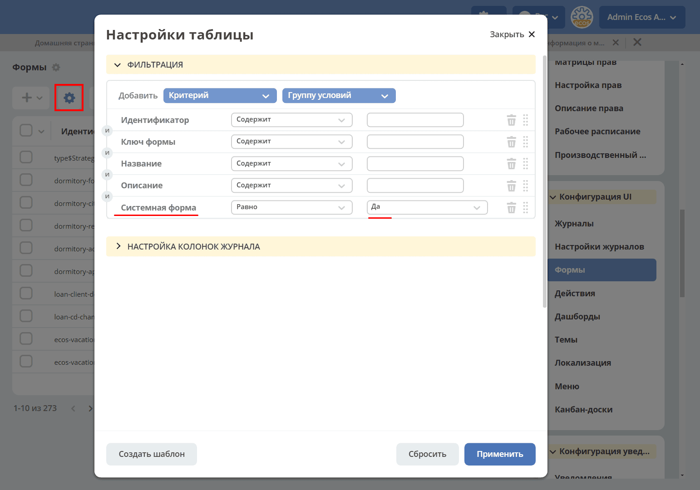

Ways to obtain a form instance
--------------------------------

A form can be created or an already created one can be uploaded to the system.

Creation
~~~~~~~~~

To create a form, click **+ - Create form**:

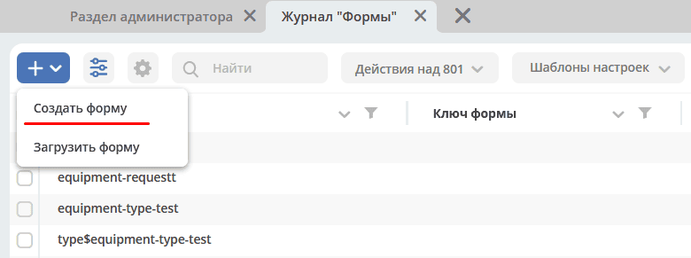

The creation form will open:

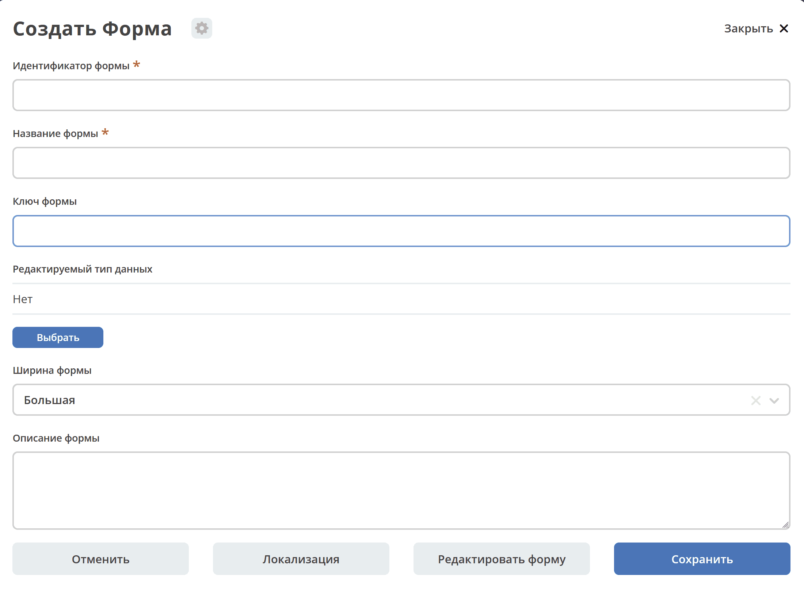

See below for details.

Upload
~~~~~~~~~

To upload a created journal, click **+ - Form**:

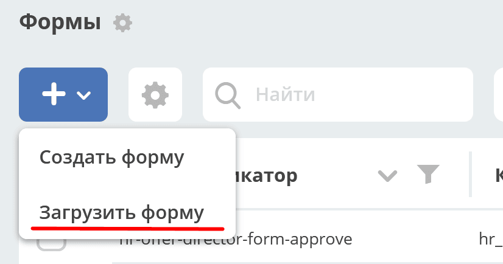

.json format file

Form description example
--------------------------

.. code-block::

  {
  "id": "vacation-request",
  "formKey": "",
  "title": {
    "ru": "Заявление на отпуск"
  },
  "description": {},
  "customModule": "",
  "typeRef": "",
  "width": "m",
  "system": false,
  "i18n": {},
  "definition": {
    "components": [
      {
        "type": "datetime",
        "input": true,
        "enableTime": false,
        "key": "from",
        "label": {
          "ru": "Начинается с"
        },
        "suffix": true,
        "format": "yyyy-MM-dd"
      },
      {
        "type": "datetime",
        "input": true,
        "enableTime": false,
        "key": "to",
        "label": {
          "ru": "Заканчивается"
        },
        "suffix": true,
        "format": "yyyy-MM-dd"
      },
      {
        "label": {
          "ru": "Инициатор"
        },
        "key": "initiator",
        "allowedAuthorityType": "USER",
        "currentUserByDefault": true,
        "refreshOn": [],
        "optionalWhenDisabled": false,
        "type": "selectOrgstruct",
        "input": true,
        "defaultValue": ""
      },
      {
        "type": "columns",
        "key": "buttons-columns",
        "columns": [
          {
            "md": 3,
            "type": "column",
            "input": false,
            "index": 0,
            "components": [],
            "key": "column"
          },
          {
            "md": 3,
            "type": "column",
            "input": false,
            "index": 1,
            "key": "column",
            "components": []
          },
          {
            "md": 3,
            "type": "column",
            "input": false,
            "index": 2,
            "components": [
              {
                "type": "button",
                "key": "cancel",
                "label": {
                  "ru": "Отменить",
                  "en": "Cancel"
                },
                "action": "event",
                "event": "cancel",
                "block": true,
                "input": true
              }
            ],
            "key": "column"
          },
          {
            "md": 3,
            "type": "column",
            "input": false,
            "index": 3,
            "components": [
              {
                "type": "button",
                "theme": "primary",
                "key": "submit",
                "label": {
                  "ru": "Сохранить",
                  "en": "Save"
                },
                "block": true,
                "input": true
              }
            ],
            "key": "column"
          }
        ],
        "input": false
      }
    ],
    "formId": "vacation-request"
  },
  "attributes": {}
 }

Available actions with a record
---------------------------------

In the journal, the administrator has a standard set of actions available for each record:

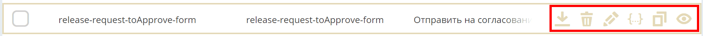

- download as a json file;
- delete;
- open for editing;
- edit json file;
- copy;
- open the card in a neighboring tab. The card is a :ref:`dashboard<dashboard>`:

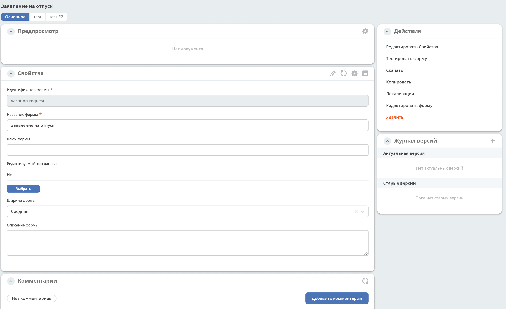

Creating a new form
---------------------

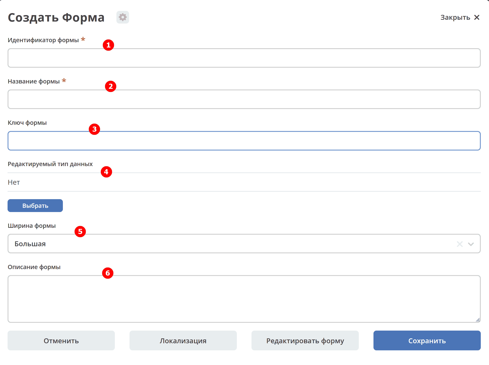

.. list-table::
      :widths: 10 30 30 30
      :header-rows: 1
      :align: center
      :class: tight-table

      * - No.
        - Name
        - Description
        - Example
      * - 1
        - **Form Identifier***
        - unique form identifier (required)
        - test-form (kebab-case)
      * - 2
        - **Form Name**
        - form name (required)
        - Test form
      * - 3
        - **Form Key**
        - form key. Used to link between the form and an entity that is difficult to bind to data types or link directly. Usually these are old tasks (flowable/activiti).
        - test-form
      * - 4
        - **Editable Data Type**
        - select a :ref:`data type<data_types_main>` created earlier from the list
        - selected from the list of suggested options
      * - 5
        - **Form Width**
        - select form width option
        - selected from the list of suggested options
      * - 6
        - **Form Description**
        - fields for entering form description
        - Form created for...

Click the **«Edit form»** button. The :ref:`form builder<form_builder>` will open

Connection with data type
--------------------------

The data type has a ``formRef`` field that defines the connection between the type and the form. In most cases, this field is sufficient, but if multiple forms are required for one type (for example, for display on a dashboard), then the form configuration has a ``typeRef`` field.

Connection without data type
------------------------------

If a record cannot be bound to a specific data type, key binding can be used.
The record should return a ``_formKey`` attribute and a form search is performed based on the received keys until the first match.

If records belong to one type or the type is absent, but a specific form should be used for some records, a ``_formRef`` attribute can be implemented. If this attribute returns a reference to a form, it has the highest priority.

Connection with record attribute
----------------------------------

For simple fields, we can set the **Property Name** in the **Basic** tab according to the record property:

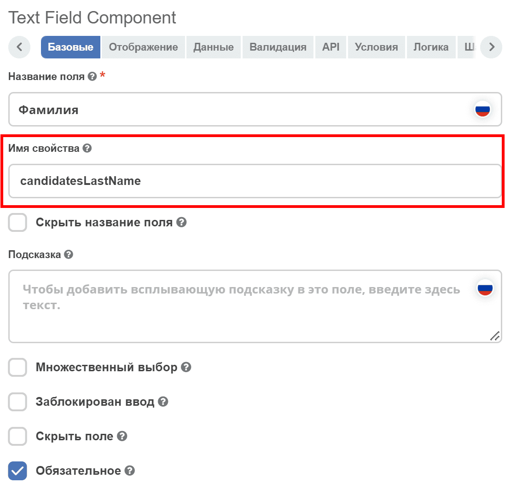

but if you need to link to an attribute that contains special characters (for example, ":"), then in the **API** tab, you should add a property (2) to **Custom Properties** with the key **attribute** and the value - the attribute name.

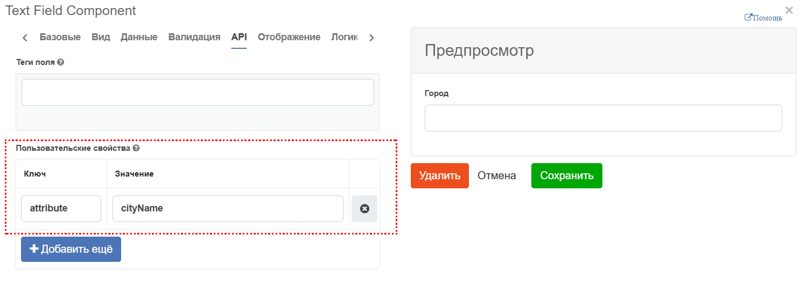

The ability to configure field names in one place - in the data type - has also been added, without duplicating this information in the form and in the journal.

**Field Label** is loaded from the type. If the **Field Label** is set equal to the attribute or if the attribute is not set, a check is performed for equality between **Property Name** and **Field Label**.

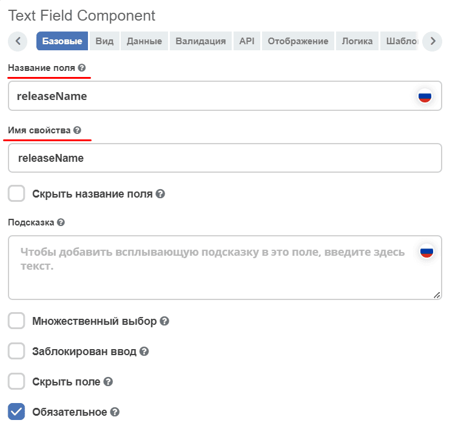

Using multiple forms for one type
-----------------------------------

1. Create new forms, bind them to the required type:

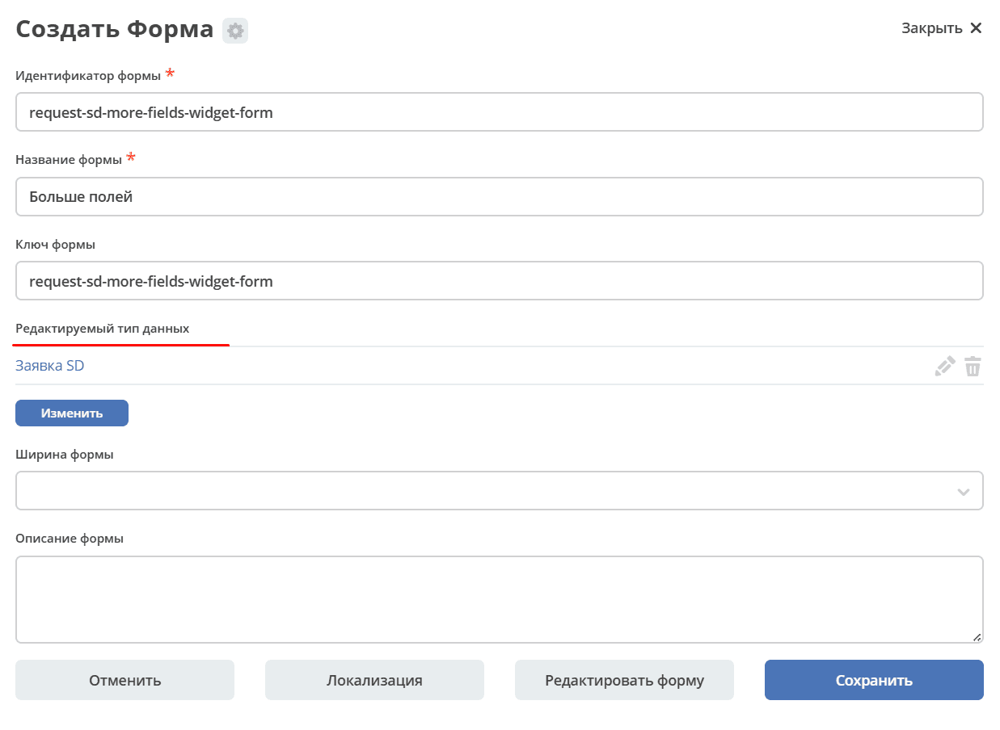

2. :ref:`Add<dashboard_settings>` property widgets.

3. In the widget settings via the gear icon, assign it the required form:

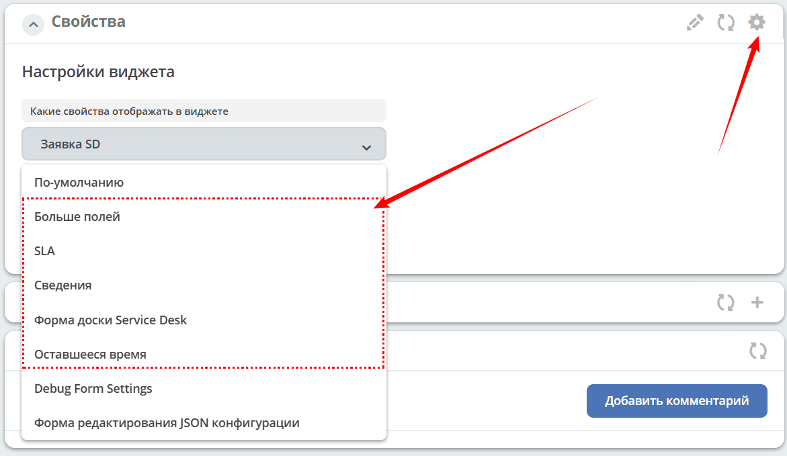
