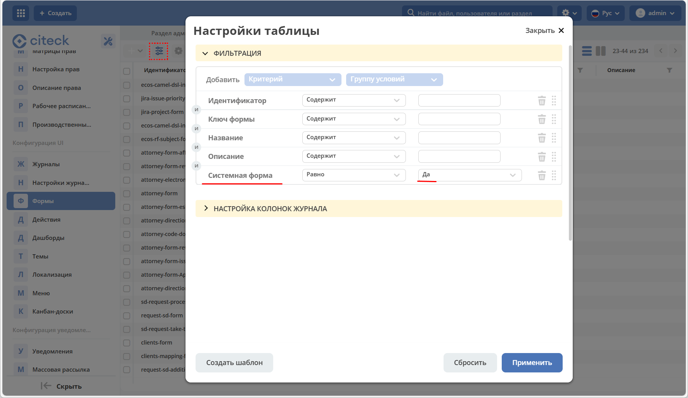
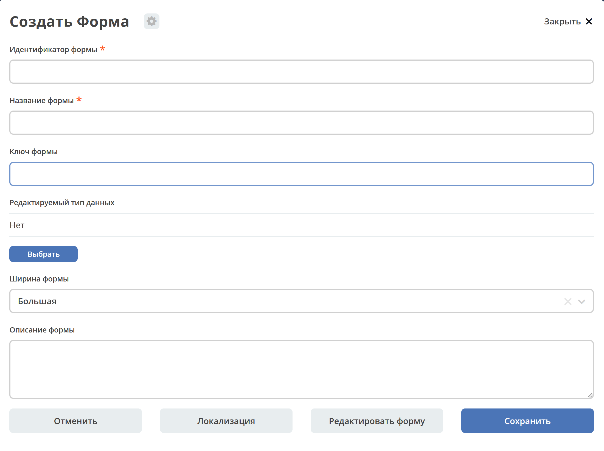
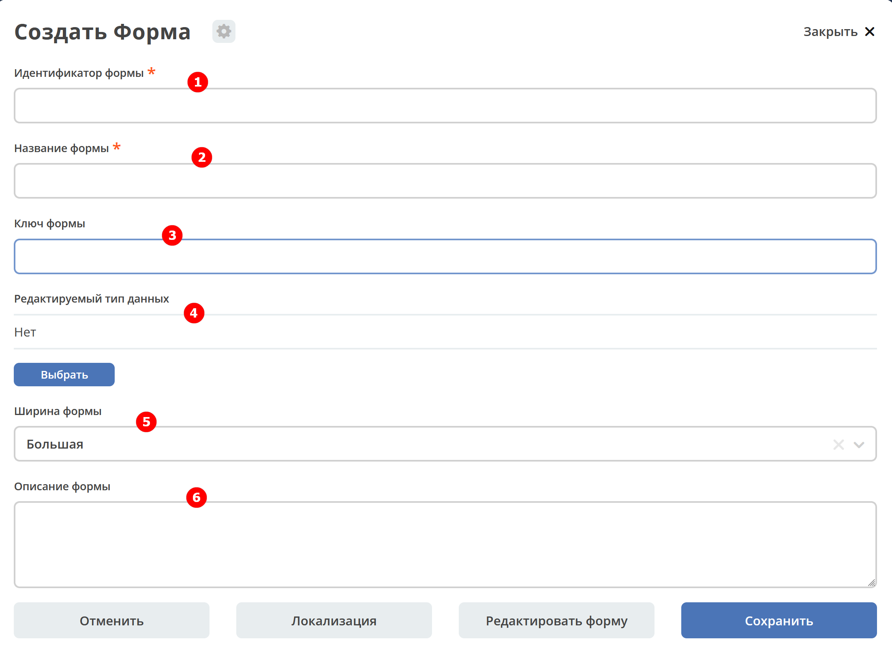
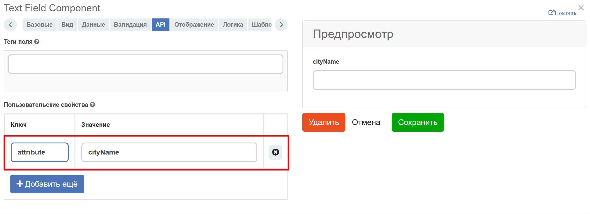
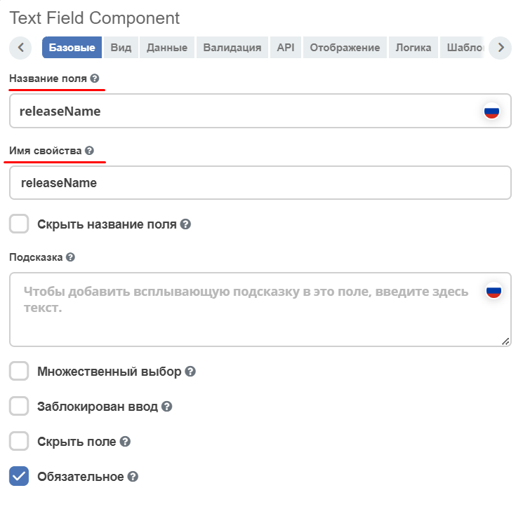

Общая информация
=================

**Форма** - графическое представление объекта в виде набора элементов интерфейса для манипуляции данными объекта. Элементы интерфейса ссылаются на атрибуты, заданные в :ref:`типе данных<data_types_main>`.

* Формы реализованы на базе движка `formio.js <https://github.com/formio/formio.js>`_.
* Функция :ref:`редактора форм<form_builder>` доступна только в Citeck **Enterprise**.
* Формы описываются в json-формате.
* Формы используются для редактирования записей из **Records Service** см. :ref:`Citeck Records<Records_API>`. На бэкэнде редактирование записи может восприниматься как создание новой (например если не указан **ID** редактируемой записи).

Описание перехода к разделу через интерфейс
--------------------------------------------

Для просмотра существующих форм и их редактирования создан журнал **Формы** (**Раздел администратора - Конфигурация UI - Формы**):

.. image:: _static/form_journal.png
       :width: 600
       :align: center

По умолчанию в журнале не отображаются системные формы.

Для отображения **ТОЛЬКО** системных форм перейдите в настройки таблицы, выставите **Системный тип - Да**:

Варианты получения экземпляра формы
------------------------------------

Форму можно создать или загрузить уже созданный в систему.

Создание
~~~~~~~~~

Для создания формы необходимо нажать **+ - Создать форму**:

.. image:: _static/form_new.png
       :width: 300
       :align: center

Откроется форма создания:

Пордробно см. ниже.

Загрузка
~~~~~~~~~

Для загрузки созданного журнала необходимо нажать **+ - Форма**:

Файл формата .json

Пример описания формы
----------------------

.. code-block::

  {
  "id": "vacation-request",
  "formKey": "",
  "title": {
    "ru": "Заявление на отпуск"
  },
  "description": {},
  "customModule": "",
  "typeRef": "",
  "width": "m",
  "system": false,
  "i18n": {},
  "definition": {
    "components": [
      {
        "type": "datetime",
        "input": true,
        "enableTime": false,
        "key": "from",
        "label": {
          "ru": "Начинается с"
        },
        "suffix": true,
        "format": "yyyy-MM-dd"
      },
      {
        "type": "datetime",
        "input": true,
        "enableTime": false,
        "key": "to",
        "label": {
          "ru": "Заканчивается"
        },
        "suffix": true,
        "format": "yyyy-MM-dd"
      },
      {
        "label": {
          "ru": "Инициатор"
        },
        "key": "initiator",
        "allowedAuthorityType": "USER",
        "currentUserByDefault": true,
        "refreshOn": [],
        "optionalWhenDisabled": false,
        "type": "selectOrgstruct",
        "input": true,
        "defaultValue": ""
      },
      {
        "type": "columns",
        "key": "buttons-columns",
        "columns": [
          {
            "md": 3,
            "type": "column",
            "input": false,
            "index": 0,
            "components": [],
            "key": "column"
          },
          {
            "md": 3,
            "type": "column",
            "input": false,
            "index": 1,
            "key": "column",
            "components": []
          },
          {
            "md": 3,
            "type": "column",
            "input": false,
            "index": 2,
            "components": [
              {
                "type": "button",
                "key": "cancel",
                "label": {
                  "ru": "Отменить",
                  "en": "Cancel"
                },
                "action": "event",
                "event": "cancel",
                "block": true,
                "input": true
              }
            ],
            "key": "column"
          },
          {
            "md": 3,
            "type": "column",
            "input": false,
            "index": 3,
            "components": [
              {
                "type": "button",
                "theme": "primary",
                "key": "submit",
                "label": {
                  "ru": "Сохранить",
                  "en": "Save"
                },
                "block": true,
                "input": true
              }
            ],
            "key": "column"
          }
        ],
        "input": false
      }
    ],
    "formId": "vacation-request"
  },
  "attributes": {}
 } 

Доступные действия с записью
-----------------------------

В журнале администратору с каждой записью доступен стандартный набор действий:

.. image:: _static/form_actions.png
       :width: 500
       :align: center

- скачать в виде json-файла;
- удалить;
- открыть на редактирование;
- редактировать json-файл;
- копировать;
- открыть карточку в соседней вкладке. Карточка представляет собой :ref:`дашборд<dashboard>`:

.. image:: _static/form_dashboard.png
       :width: 600
       :align: center

Создание новой формы
---------------------

.. list-table::
      :widths: 10 30 30 30
      :header-rows: 1
      :align: center
      :class: tight-table 

      * - п/п
        - Наименование
        - Описание
        - Пример заполнения
      * - 1
        - **Идентификатор формы*** 
        - уникальный идентификатор формы (обязательное)
        - test-form (kebab-case)
      * - 2
        - **Название формы**
        - имя формы (обязательное)
        - Test form
      * - 3
        - **Ключ формы** 
        - ключ формы. Используется для связи между формой и сущностью, которую трудно привязать к типам данных или напрямую связать. Обычно это старые задачи (flowable/activiti).
        - test-form
      * - 4
        - **Редактируемый тип данных**
        - из списка выбрать :ref:`тип данных<data_types_main>`, созданный ранее
        - выбирается из списка предлагаемых
      * - 5
        - **Ширина формы** 
        - выбор варианта ширины формы
        - выбирается из списка предлагаемых
      * - 6
        - **Описание формы**
        - поля для ввода описания формы
        - Форма создана для...

Нажать кнопку **«Редактировать форму»**. Откроется :ref:`конструктор форм<form_builder>` 

Связь с типом данных
----------------------

В типе данных предусмотрено поле ``formRef``, которое определяет связь типа с формой. В большинстве случаев этого поля достаточно, но если для одного типа требуется несколько форм (например, для отображения на дашборде), то в конгфигурации формы предусмотрено поле ``typeRef``.

Связь без типа данных
----------------------

Если запись не может быть привязана к определенному типу данных, можно воспользоваться привязкой по ключам. 
Запись должна отдавать атрибут ``_formKey`` и по полученным ключам идет поиск формы до первого совпадения.

Если записи принадлежат одному типу или тип отсутствует, но для некоторых записей должна использоваться определенная форма,
можно реализовать атрибут ``_formRef``. Если этот атрибут вернул ссылку на форму, то она имеет наибольший приоритет.

Связь с атрибутом записи
-------------------------

Для простых полей мы можем во вкладке **Базовые** выставить **Имя свойства**  в соответствии со свойством записи:

.. image:: _static/form_local_1.png
       :width: 600
       :align: center

но если нужно связать с атрибутом, в котором есть спец символы (например ":"), то во вкладке **API** следует добавить в **Пользовательские свойства** свойство (2) с ключом **attribute** и значением - именем атрибута.

Так же добавлена возможность настраивать имя полей в одном месте - в типе данных, и не дублировать данную информацию в форме и в журнале.

**Название поля (Label)** загружается из типа. Если **Название поля (Label)** выставлен равный атрибуту или если атрибут не задан, то идет проверка на равенство  **Имя свойства (Property Name)** и **Название поля (Label)**.

