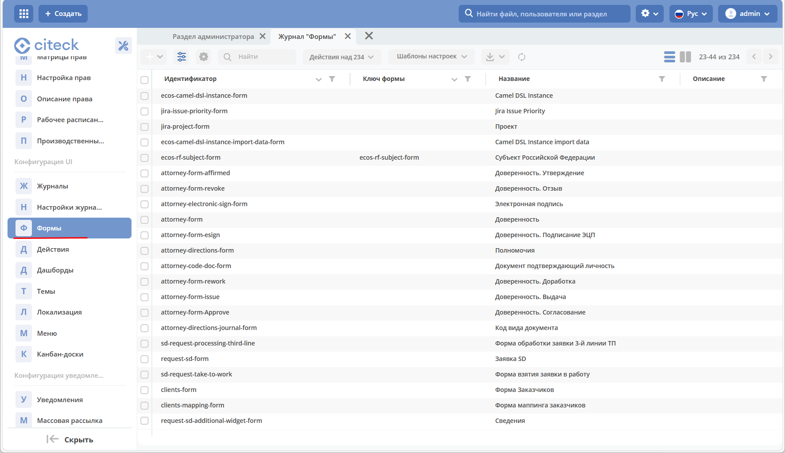
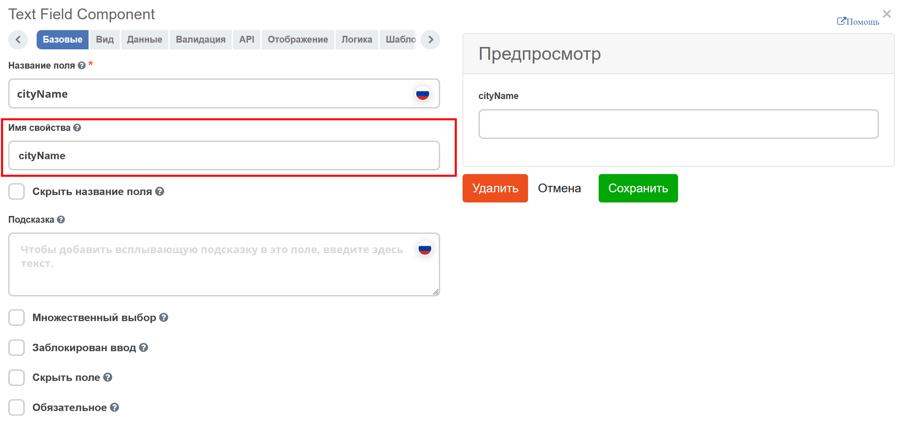

Общая информация
================

**Форма** - графическое представление объекта в виде набора элементов интерфейса для манипуляции данными объекта. Элементы интерфейса ссылаются на атрибуты, заданные в `типе данных <https://citeck-ecos.readthedocs.io/ru/latest/settings_kb/%D0%A2%D0%B8%D0%BF%D1%8B_%D0%B4%D0%B0%D0%BD%D0%BD%D1%8B%D1%85.html>`_.

* Формы ECOS реализованы на базе движка `formio.js <https://github.com/formio/formio.js>`_.
* Функция `редактора форм <https://citeck-ecos.readthedocs.io/ru/latest/settings_kb/interface/forms/form_builder.html>`_ доступна только в ECOS **Enterprise**.
* Формы описываются в json-формате.
* Формы используются для редактирования записей из **Records Service** (см. `ECOS Records <https://citeck-ecos.readthedocs.io/ru/latest/general/ECOS_Records.html>`_). На бэкэнде редактирование записи может восприниматься как создание новой (например если не указан **ID** редактируемой записи).

Существуют две системные формы, которые изменять **не желательно**:

       #. Форма для создания и редактирования других форм. Ключ: ``ECOS_FORM``;
       #. Форма по-умолчанию. Она используется как отправная точка, если мы создаем новую форму. Ключ: ``DEFAULT``.

**Атрибут** - это собиртельный термин, который относится и к свойству и ассоциации и к дочерней ассоциации, и к системным свойствам.

Журнал "Формы"
----------------

Работа с формами осуществляется через журнал **(Инструменты - Конфигурация UI - Формы)**

При клике на запись журнала отображаются значки действий:

       
|

.. list-table:: 
      :widths: 20 50
      :align: center

      * - |
 
            .. image:: _static/action_1.png
                :width: 30

        - Скачать
      * - |
 
            .. image:: _static/action_2.png
                :width: 30

        - Удалить
      * - |
 
            .. image:: _static/action_3.png
                :width: 30

        - Редактировать форму:
      * - |
 
            .. image:: _static/action_4.png
                :width: 30

        - | Редактировать json:

            .. image:: _static/action_json.png
                :width: 400
      * - |
 
            .. image:: _static/action_5.png
                :width: 30

        - Копировать

Для создания формы необходимо нажать **+**

Откроется форма создания формы:

.. image:: _static/form_form_new.png
       :width: 600
       :align: center

- **Идентификатор формы** - уникальный идентификатор формы
- **Название формы** - имя формы
- **Ключ формы** - ключ формы (такой же как и Идентификатор формы)
- **Редактируемый тип данных** - из списка выбрать тип данных, созданный ранее 

Нажать кнопку **«Редактировать форму»**. Откроется `конструктор форм <https://citeck-ecos.readthedocs.io/ru/latest/settings_kb/interface/forms/form_builder.html>`_ 

Связь с типом ECOS
------------------

В типе ECOS предусмотрено поле **formRef**, которое определяет связь типа с формой. В большинстве случаев этого поля достаточно, но если для одного типа требуется несколько форм (например, для отображения на дашборде), то в конгфигурации формы предусмотрено поле **typeRef**.

Связь без типа ECOS
-------------------

Если запись не может быть привязана к определенному типу ECOS, можно воспользоваться привязкой по ключам. 
Запись должна отдавать атрибут ``_formKey`` и по полученным ключам идет поиск формы до первого совпадения.

Если записи принадлежат одному типу или тип отсутствует, но для некоторых записей должна использоваться определенная форма,
можно реализовать атрибут ``_formRef``. Если этот атрибут вернул ссылку на форму, то она имеет наибольший приоритет.

Связь с атрибутом записи
-------------------------

Для простых полей мы можем во вкладке **Базовые** выставить **Имя свойства**  в соответствии со свойством записи:

но если нужно связать с атрибутом, в котором есть спец символы (например ":"), то во вкладке **API** следует добавить в **Пользовательские свойства** свойство (2) с ключом **attribute** и значением - именем атрибута.

.. image:: _static/form_local_2.png
       :width: 400
       :align: center

Пользовательский модуль
-----------------------
В json описании формы можно добавить поле **customModule**, в котором записать путь до ``javascript`` модуля, который будет создан вместе с формой. В этом модуле можно разместить сложную логику, которую в последствии вызывать из скриптов формы. Для примера см. **ecos-eform-repo/src/main/resources/alfresco/module/ecos-eform-repo/ecos-forms\ecos-form.json**

Если в **customModule** будет метод ``init``, то он будет вызван с текущей формой в аргументах.

