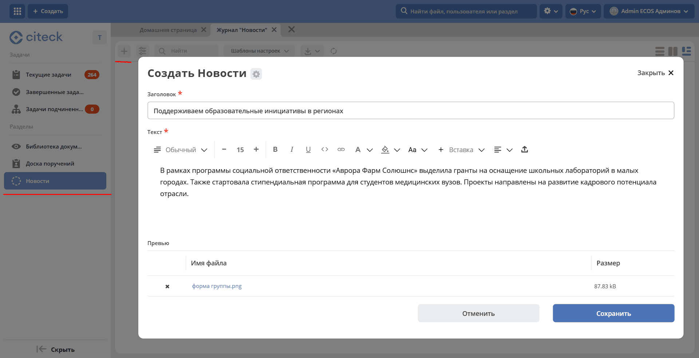

.. _news:

Новости
==============

.. contents::
   :depth: 3

**Журнал «Новости»** предназначен для публикации анонсов и новостей компании. Они отображаются сотрудникам непосредственно в рабочих пространствах через виджет :ref:`Новости <widget_news>`.

Журнал основан на типе данных :ref:`Публикация <publication>`. Чтобы новости отображались в виджете, добавьте журнал **Новости** в меню нужного рабочего пространства, а затем создайте публикации.

Добавление в меню рабочего пространства
------------------------------------------

1. Выберите специальный элемент **Список**:

   .. image:: _static/news/news_01.png
      :width: 500
      :align: center

2. Выберите журнал **Новости**:

   .. image:: _static/news/news_02.png
      :width: 500
      :align: center

3. Примените изменения:

   .. image:: _static/news/news_03.png
      :width: 500
      :align: center

Добавление публикаций
-----------------------

В журнале добавьте новости:

