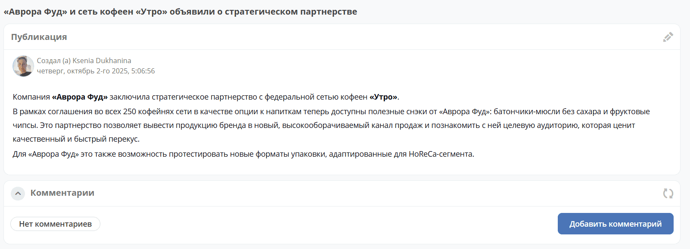
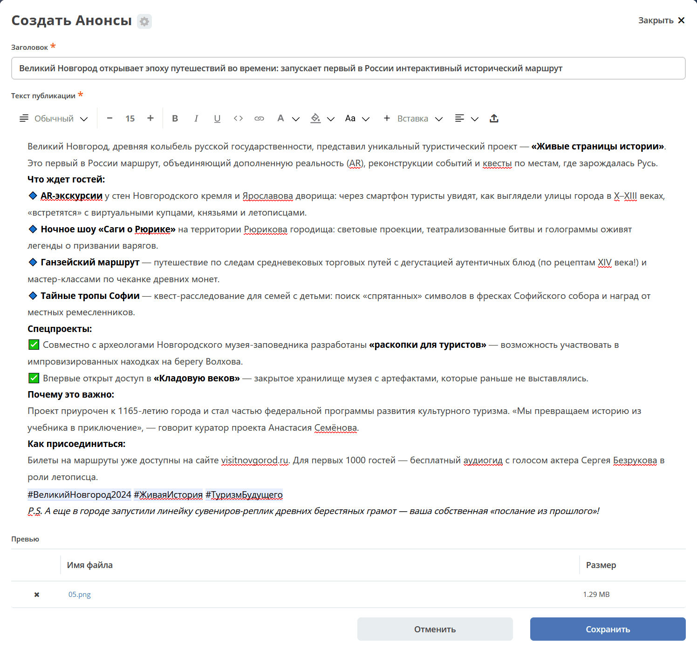
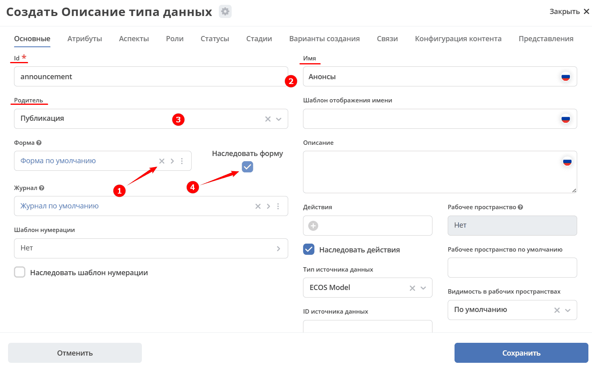

.. _publication:

Публикация
===========

.. contents::
   :depth: 3

**Публикация** — встроенный тип данных для создания новостей, анонсов и редакционных материалов, отображаемых в рабочих пространствах. На его основе строится журнал :ref:`Новости <news>`: статьи из него автоматически появляются в виджете :ref:`Новости <widget_news>`.

Тип предоставляет готовую форму с полями заголовка, текста и изображения-превью. Записи журнала отображаются в двух режимах:

.. grid:: 2
   :gutter: 2

   .. grid-item::

      Список:

      .. image:: _static/publication/publication_03.png
         :width: 500
         :align: left

   .. grid-item::

      Плитка:

      .. image:: _static/publication/publication_03_1.png
         :width: 500
         :align: left

По клику на превью или заголовок можно перейти к карточке. Карточка состоит из виджетов :ref:`Публикация <widget_publication>`, :ref:`Комментарии <widget_comments>`:

При создании публикации заполните форму:

- **Заголовок**;
- **Текст публикации** — доступен удобный :ref:`редактор контента <wysiwyg_editor>`;
- изображение для превью.

.. _publication_creation:

Создание типа «Публикация»
----------------------------

Создайте новый :ref:`тип данных <data_types_main>`:

1. Удалите **Форму по умолчанию** **(1)**.
2. На вкладке **«Основное»** укажите **id** и **Имя** **(2)**.
3. В качестве родителя выберите **Публикация** **(3)**.
4. Установите флажок **Наследовать форму** **(4)**.

В созданный тип будут автоматически добавлены действия и форма.

5. Чтобы добавить публикацию в меню, выберите специальный элемент **Список**:

   .. image:: _static/publication/publication_02.png
      :width: 600
      :align: center
