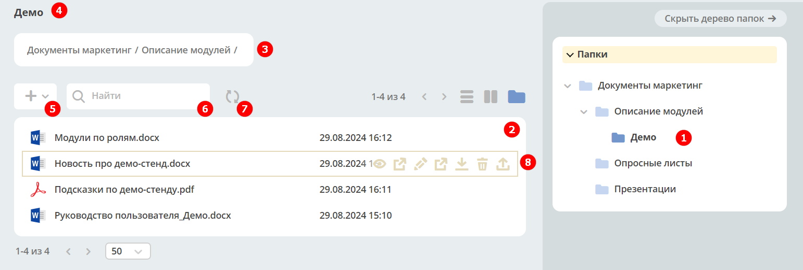

Библиотека документов (Document Library)
==========================================

.. _document_library:

.. contents::
    :depth: 3

**Document Library (Библиотека документов)** - иерархический интерфейс для работы с папками и документами.

 .. image:: _static/doclib/DocLib_1.png
       :width: 700
       :align: center

В данном режиме можно просмотреть дерево иерархии папок и документов, произвести действия над документами и папками по аналогии действиям в проводнике Windows. 

Файл открывается в фоновой вкладке по одинарному клику. Папка открывается по двойному в текущей вкладке.

Проводник отображается по умолчанию, скрывается по нажатию на **«Скрыть дерево папок»** в правом меню.

.. list-table::
      :widths: 20 20
      :align: center

      * - |

            .. image:: _static/doclib/DocLib_2.png
                  :width: 600
                  :align: center

        - |

            .. image:: _static/doclib/DocLib_2_1.png
                  :width: 600
                  :align: center

1.	Выбранная папка подсвечивается среди других папок **(1)**.
2.	При клике на иконку или название папки она раскрывается **(1)**, и в левой части отражаются файлы, находящиеся в папке **(2)**.
3.	Для отображения документов и папок используются иконки, соответствующие формату файлов по аналогии с проводником Windows:

	-	Microsoft Word (doc, docx);
	-	Microsoft Excel (xls, xlsx);
	-	Microsoft Powerpoint (ppt, pptx);
	-	Adobe Acrobat (pdf);
	-	Файлы изображений (jpg, bmp, png, gif, tif);
	-	OpenOffice/ LibreOffice (odf);
	-	Файл сообщения из электронной почты (.msg).

4.	Над журналом размещено название текущей раскрытой папки **(4)**, чуть ниже - полный путь к открытой папке **(3)**.
5.	Загрузка файлов, создание папок осуществляется по кнопке **(5)**. Файлы добавляться по одному.
6.	Поиск документов внутри выбранной папки **(6)**. Результат поиска отображается в виде списка.
7.  Для обновления данных используйте **(7)**
8.	При наведении курсора на файл или папку отображаются действия **(8)**. См. Действия с элементом.

Действия с элементом
----------------------

.. list-table:: 
      :widths: 5 10 
      :align: center

      * - 
           			.. image:: _static/doclib/ic_1.png
						:width: 25
						:align: center

        - Перейти к просмотру карточки в новой вкладке.

      * - 
           			.. image:: _static/doclib/ic_3.png
						:width: 25
						:align: center

        - Открыть в фоновой в вкладке

      * - 
           			.. image:: _static/doclib/ic_2.png
						:width: 25
						:align: center

        - Переименовать файл или папку:

           			.. image:: _static/doclib/DocLib_5.png
						:width: 300
						:align: center

		  | Можно изменить название файла, или сам вложенный файл.

      * - 
           			.. image:: _static/doclib/ic_3.png
						:width: 25
						:align: center

        - :ref:`Редактировать документ в OnlyOffice<edit_only_office>`. Доступно только для файлов форматов MS Office и  OpenDocument.
      * - 
           			.. image:: _static/doclib/ic_4.png
						:width: 25
						:align: center

        - Скачать файл.

      * - 
           			.. image:: _static/doclib/ic_5.png
						:width: 25
						:align: center

        - Удалить файл или папку:
 
           			.. image:: _static/doclib/DocLib_4.png
						:width: 300
						:align: center

      * - 
           			.. image:: _static/doclib/ic_6.png
						:width: 25
						:align: center

        - | Загрузить новую версию:

           			.. image:: _static/doclib/DocLib_11.png
						:width: 300
						:align: center

          | :ref:`Подробно о версиях<widget_versions_journal>`

Создание папки / Загрузка файла
~~~~~~~~~~~~~~~~~~~~~~~~~~~~~~~~~~~~

Создание папки или загрузка файла осуществляется по кнопке **+**:

 .. image:: _static/doclib/DocLib_6.png
       :width: 600
       :align: center

При загрузке файла необходимо ввести его название, которое будет отображаться, и выбрать или перетащить файл для прикрепления:

 .. image:: _static/doclib/DocLib_8.png
       :width: 600
       :align: center

При создании папки укажите ее название:

 .. image:: _static/doclib/DocLib_7.png
       :width: 600
       :align: center

Карточка файла
----------------

Карточка состоит из виджетов:

 .. image:: _static/doclib/DocLib_9.png
       :width: 600
       :align: center

Для файла доступны следующие действия:

	- Редактировать свойства;
	- Редактировать документ (только для файлов форматов MS Office и  OpenDocument)
	- Скачать;
	- Удалить;
	- Загрузить новую версию.

 .. image:: _static/doclib/DocLib_12.png
       :width: 600
       :align: center

Подробно о :ref:`виджетах<widgets>`.

Создание библиотеки документов 
---------------------------------

.. _new_document_library:

Создайте новый :ref:`тип данных<data_types_main>`. На вкладке **«Основное»** укажите **id**, **Имя**, в качестве родителя выберите **Файл библиотеки документов**. В созданный тип будут автоматически добавлены действия. 
 
 .. image:: _static/doclib/DocLib_10.png
       :width: 600
       :align: center

На стандартной форме doclib-file настроен ряд параметров для корректной загрузки файлов. Если будет использоваться :ref:`кастомная форма<auto_form_change>`, то нужно учитывать настройки этой формы, в частности обязательности контента и задание конфигурации максимального размера файла на форме.

Компонент **File component**:

 .. image:: _static/doclib/DocLib_13.png
       :width: 600
       :align: center

.. list-table::
      :widths: 20 20
      :align: center

      * - |

            .. image:: _static/doclib/DocLib_13_2.png
                  :width: 600
                  :align: center

        - |

            .. image:: _static/doclib/DocLib_13_1.png
                  :width: 600
                  :align: center

Так же для создания библиотеки документов можно использовать аспект **doclib**. **[TBD]**

API
----

**to be updated**

Для примеров взят тип **emodel/type@TEST_TYPE**

1. Корень для библиотеки документов всегда доступен по составному id: **alfresco/doclib@TEST_TYPE$** (от id типа отбрасывается префикс **emodel/type@**, добавляется префикс **alresco/doclib@** и постфикс **$**)

2. Получение дочерних элементов::
  
	Records.get('alfresco/doclib@TEST_TYPE$').load('children[]{id:?id,displayName:?disp,nodeType,hasChildrenDirs:hasChildrenDirs?bool,typeRef:typeRef?id}');

Все получаемые id нужно проверять на наличие префикса **alfresco/doclib@**. Если возвращается просто **doclib@…**, то нужно добавить **alfresco/** чтобы получилось **alfresco/doclib@**

3. Узнать поддерживает ли тип режим doclib::

	Records.get('emodel/type@TEST_TYPE').load('resolvedDocLib.enabled?bool')

4. Получить список типов файлов, которые могут быть в данной библиотеке::

	Records.get('emodel/type@TEST_TYPE').load('resolvedDocLib.fileTypeRefs[]?id')

5. Получить тип директории в библиотеке документов::

	Records.get('emodel/type@TEST_TYPE').load('resolvedDocLib.dirTypeRef?id')

6. Создать новый файл или папку в библиотеке::

	var record = Citeck.Records.get('alfresco/doclib@TEST_TYPE$');
	record.att('_parent', 'alfresco/doclib@TEST_TYPE$workspace://SpacesStore/16fffdd9-c37a-4d4f-8e40-9e698c8f194f'); // для корня библиотеки следует использовать alfresco/doclib@TEST_TYPE$
	record.att('cm:title', 'Папка #1000');
	record.att('_type', 'emodel/type@file'); //здесь должен быть один из типов пункта 4 или пункта 5 (по этому типу определяется, что именно нужно создать - папку или файл)
	record.save();

7. Получить дочерние элементы по типу::

	Records.query({
	    sourceId: 'alfresco/doclib',
	    query: {
	        parentRef: 'alfresco/doclib@TEST_TYPE$',
	        nodeType: 'DIR'
	    },
	    language: 'children'
	});

8. Поиск дочерних элементов с фильтрацией (для поиска через полосу поиска над таблицей флаг recursive должен быть true)::

	 Records.query({
	    sourceId: 'alfresco/doclib',
	    query: {
	        parentRef: "alfresco/doclib@TEST_TYPE$",
	        recursive: false,
	        filter: {
	            t: 'contains',
	            att: 'ALL',
	            val: '111'
	        }
	    },
	    language: 'children'
	  })

9. Получение пути для документа (можно объединять с другими атрибутами)::

	Records.get('alfresco/doclib@nsd-attorney$workspace://SpacesStore/fab07cb3-cf5a-4c07-a17a-4e3f56e208d2').load('path[]{disp:?disp,id:?id}')
