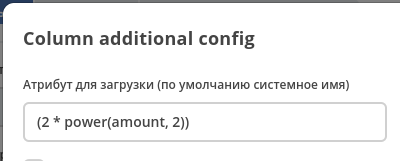

.. _expression_attributes:

Выражения в качестве атрибутов
==============================

.. note::
  
  Выражения должны поддерживаться источником данных. Фронтенд передает настроенные атрибуты 
  в источник данных "как есть" и ожидает, что сервер понимает как с ними работать.

При настройке колонки журнала можно перейти в расширенные настройки и в поле "Атрибут" указать сложное выражение, 
которое в дальнейшем можно будет использовать для группировки, сортировки, поиска и отображения.

Выражение должно быть записано в круглых скобках. Исключение - если выражение состоит из одной функции, то скобки не требуются.

Подробнее о синтаксисе и списке доступных функций можно посмотреть в :ref:`ecos-data<ecos_data_functions>`
