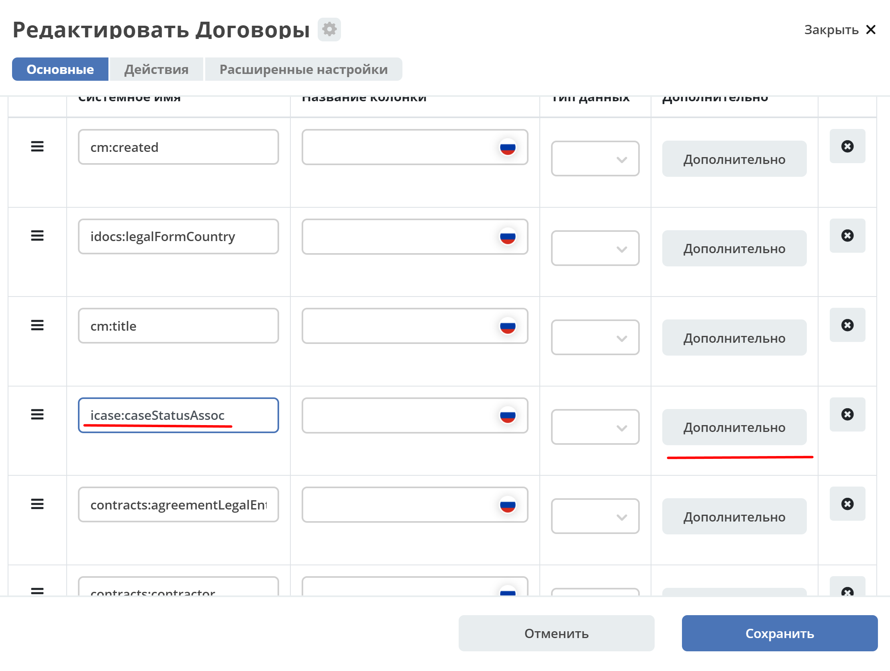
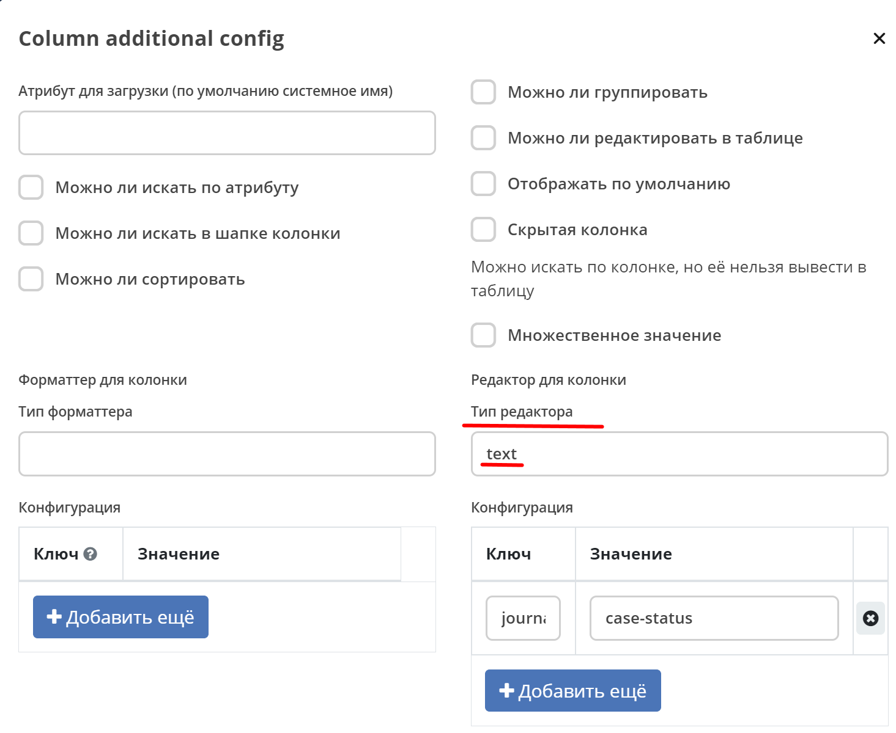
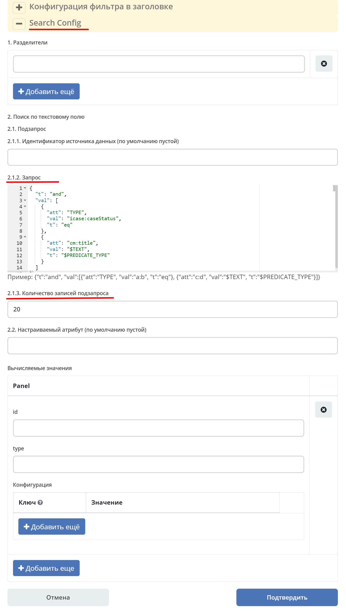
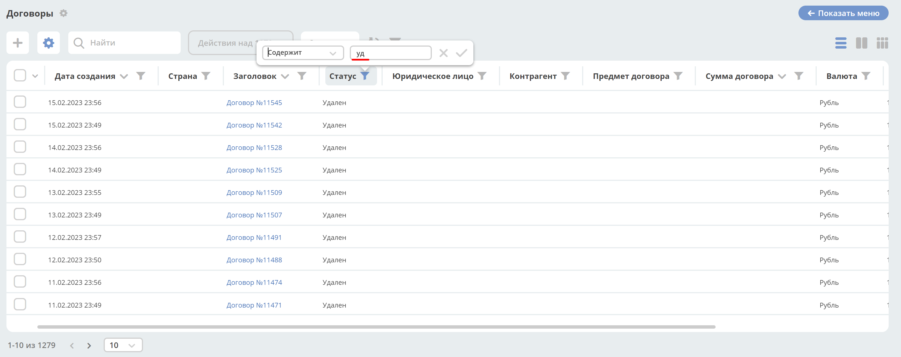

Фильтр по тексту в колонке 'assoc'. Настройки innerQuery
=========================================================

1.	Расширены настройки – добавлена возможность использовать **RecordsQuery**. Например, на вычисляемых полях, что позволяет формировать произвольный запрос к разным источникам данных.
2.	Для решения вопроса - когда пользователь выбирает произвольные предикаты (Contains, Equals, Starts with, …) при настройке фильтра добавлен еще один тэг в запрос - **$PREDICATE_TYPE** - для его замены на клиенте.
3.	Добавлен атрибут - **innerQueryAttribute**, для возможности настройки отображения:

.. code-block::

    searchConfig: {
    delimiters: [],
    searchByText: {
        {
        "innerQuery": {
            "sourceId": "",
            "page": {
            "maxItems": 25
            },
            "query": {
            "t": "and",
            "val": [
                {
                "att": "TYPE",
                "val": "idocs:currency",
                "t": "eq"
                },
                {
                "att": "idocs:currencyCode",
                "val": "$TEXT",
                "t": "$PREDICATE_TYPE"
                }
            ]
            }
        },
        "innerQueryAttribute": ""
        }
    }
    }

Рассмотрим пример. Настроим поиск только по колонке **"Статус"**.

1. Перейти в дополнительные настройки колонки:

2. Тип редактора указать **text**:

3. В разделе **Search Config** в **запросе** введите:

.. tip::

    Запрос нужно задавать как можно точнее, с указанием типа запрашиваемой ноды.

.. code-block::

    {
    "t": "and",
    "val": [
        {
        "att": "TYPE",
        "val": "icase:caseStatus",
        "t": "eq"
        },
        {
        "att": "cm:title",
        "val": "$TEXT",
        "t": "$PREDICATE_TYPE"
        }
    ]
    }

4. Укажите необходимое **Количество записей подзапроса**:

**Количество записей подзапроса** -  сколько максимально записей на данный запрос вернет сервер. Далее эти ноды будут использоваться как фильтр для формирования основного запроса - для отображения нужных записей в самом журнале.

Но в ответе также будет приходить число, сколько сервер всего нашел записей, и если это число больше указанного количества записей подзапроса, то на клиенте будет показываться сообщение о необходимости задать более точный фильтр.

5. Сохраните

Поиск осуществляется только по колонке "Статус": 

