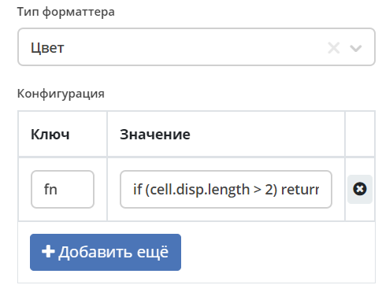
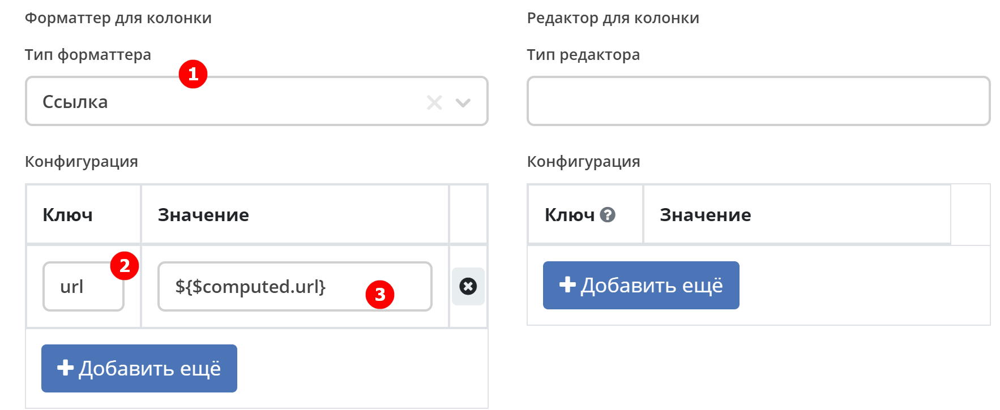
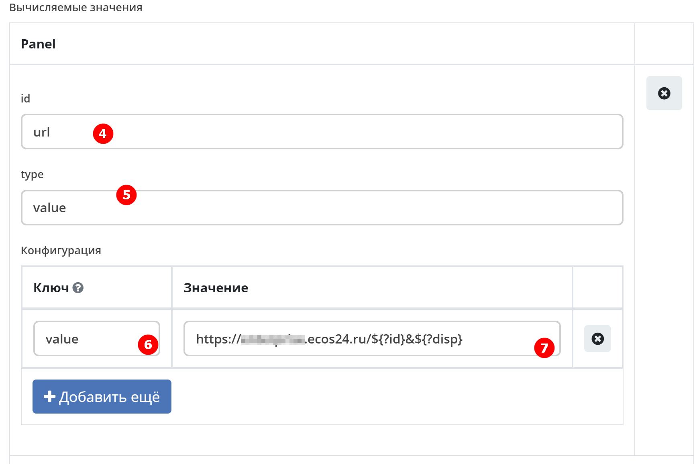
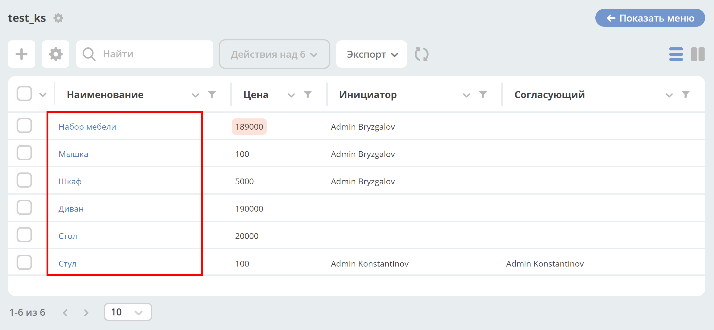
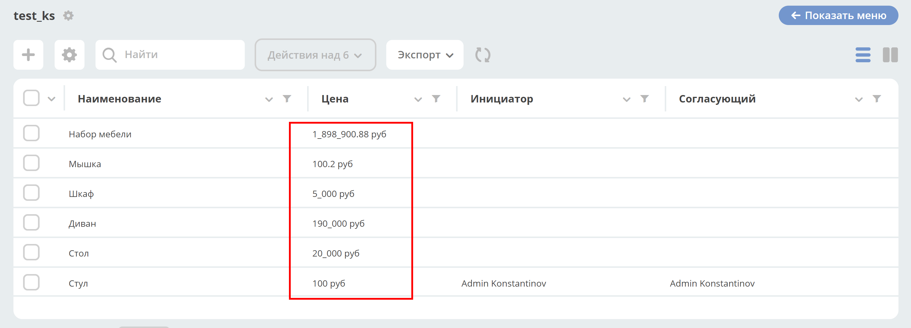

.. _formatters:

Форматтеры
===========

.. contents:: Содержание
   :depth: 3

.. note::

  В форматтерах могут использоваться :ref:`вычисляемые атрибуты<computed_attributes>`

Настройки
---------

Перейти в раздел администрирования > :guilabel:`Журналы` > найти необходимый журнал > действие :guilabel:`Редактировать`. Перейти в :guilabel:`Дополнительно`

.. list-table::
      :widths: 20 20
      :align: center

      * - |

            .. image:: _static/formatter/formatter_1.png
                  :width: 500
                  :align: center

        - |

            .. image:: _static/formatter/formatter_2.png
                  :width: 500
                  :align: center

Выберите форматтер из списка заполните ключ-значение:

.. list-table::
      :widths: 20 20
      :align: center

      * - |

            .. image:: _static/formatter/formatter_3.png
                  :width: 300
                  :align: center

        - |

            .. image:: _static/formatter/formatter_4.png
                  :width: 300
                  :align: center

Типы
---------

AssocFormatter / Ассоциация
~~~~~~~~~~~~~~~~~~~~~~~~~~~~~

Тип: ``assoc``

Конфигурация:

.. list-table:: 
      :widths: 5 40
      :header-rows: 1

      * - Ключ
        - Значение
      * - **sourceId**
        - Идентификатор ассоциации
      * - openInBackground
        - Открыть в новой ecos вкладке
      * - openNewBrowserTab
        - Открыть в новой вкладке браузера

ActionFormatter / Действие
~~~~~~~~~~~~~~~~~~~~~~~~~~~~~~

Тип : ``action``

Конфигурация:

.. list-table:: 
      :widths: 5 40
      :header-rows: 1

      * - Ключ
        - Значение
      * - **type**
        - <тип действия>
      * - actionId
        - <id типа действия>

Предполагается в строке журнала наличие **id** или **recordRef** - ref записи, необходимый для выполнения действия

BooleanFormatter / Логическое выражение
~~~~~~~~~~~~~~~~~~~~~~~~~~~~~~~~~~~~~~~~~~

Тип: ``bool``

Конфигурация:

Простой форматтер, который отдает «Да» или «Нет» в ячейке

.. _ColoredFormatter:

ColoredFormatter / Цвет
~~~~~~~~~~~~~~~~~~~~~~~~~~~~~~

Тип: ``colored``

Конфигурация:

.. list-table:: 
      :widths: 5 40
      :header-rows: 1

      * - Ключ
        - Значение
      * - color
        - Цвет в формате HEX
      * - defaultColor
        - Цвет по умолчанию в формате HEX
      * - textHidden
        - Флаг, который отвечает за перенос строк в ячейке

Добавлена возможность  настройки условия отображения значения в определенном цвете в зависимости от значения данных в атрибуте.

Вернуть необходимо строку с цветом для css (WebColor или HEX):

.. code-block::

  if (cell.disp.length > 2) return "red"
  
  или

  if (cell.disp.length > 2) return "#FF0000" 

DateFormatter / Дата
~~~~~~~~~~~~~~~~~~~~~~

Тип: ``date``

Конфигурация:

.. list-table:: 
      :widths: 5 40
      :header-rows: 1

      * - Ключ
        - Значение
      * - format
        - Временной формат (по умолчанию 'DD.MM.YYYY')

DateTimeFormatter / Дата и время
~~~~~~~~~~~~~~~~~~~~~~~~~~~~~~~~~~

Тип: ``datetime``

Конфигурация:

.. list-table:: 
      :widths: 5 40
      :header-rows: 1

      * - Ключ
        - Значение
      * - format
        - Временной формат (по умолчанию 'DD.MM.YYYY HH:mm')
      * - relative
        - Флаг, который будет осчитывать время которое прошло

DefaultFormatter / По умолчанию
~~~~~~~~~~~~~~~~~~~~~~~~~~~~~~~~~

Тип: ``default``

Конфигурация:

Всегда отдает строковое значение, которое получили из значения атрибута. Если ячейка имеет булево значение, то отдает "Да" или "Нет"

.. _DurationFormatter:

DurationFormatter / Продолжительность
~~~~~~~~~~~~~~~~~~~~~~~~~~~~~~~~~~~~~~

Тип: ``duration``  

Конфигурация:

.. list-table:: 
      :widths: 5 40
      :header-rows: 1

      * - Ключ
        - Описание
      * - **showSeconds**
        - | При применении в журнале отображается запись в формате  1d 2h 30m 2s
          | Возможные значение - true/false 
          | По умолчанию секунды отображаются - showSeconds = true
      * - **maxAsHours**
        - | При применении в журнале продолжительность будет трансформироваться в часы, то есть 2d 3h 30m = 51h 30m
          | Возможные значение - true/false 

Пример:

.. code-block::

  formatter:
    type: duration
    config:
      maxAsHours: true  

FileNameFormatter / Имя файла
~~~~~~~~~~~~~~~~~~~~~~~~~~~~~~~

Тип: ``filename``

Конфигурация:

Всегда отдает ссылку на документ вида:

.. code-block::

  <a href="${URL.DASHBOARD}?recordRef=${row.id}" target="_blank" rel="noopener noreferrer">
    <icon />
    { НАЗВАНИЕ ЯЧЕЙКИ}
  </a>

HtmlFormatter / HTML
~~~~~~~~~~~~~~~~~~~~~~

Тип: ``html``

Конфигурация:

.. list-table:: 
      :widths: 5 40
      :header-rows: 1

      * - Ключ
        - Значение
      * - html
        - Строка с html кодом

LinkFormatter / Ссылка
~~~~~~~~~~~~~~~~~~~~~~~~~~~~~~

Тип: ``link``

Добавлена возможность строить ссылки по шаблону с использованием переменных (атрибутов записи/полей журнала). Link форматтер используется для ячеек журнала с использованием полей (колонок) в качестве переменных.

Шаблон адреса ссылки задается в параметрах форматтера для столбца в конфигурации журнала (Форматтер для колонки).

Пример шаблона ссылки:

``urlTemplate: "https://example.com/path?var1=${columnId1}&var2=${columnId2}"``

где ``columnId1`` и ``columnId2`` - колонки журнала.

В качестве наименования ссылки используется значение ячейки. Если значения нет, то наименование = url.

Ссылка не отображается, если ячейка журнала редактируемая (если в ячейку вводятся данные).

**Например:**

Выбрать форматтер **Ссылка (1)** и указать: 

- **ключ (2)** – ``url``, 
- **значение (3)** - ``${$computed.url}``

 
Указать:

- **id (4)** – ``url``, 
- **type (5)** – ``value``. 

В конфигурации указать: 

- **ключ (6)** – ``value``, 
- **значение (7)** - ``https://enterprise-alfresco.ecos24.ru/${?id}&${?disp}``

В журнале выглядит следующим образом:

По клику на наименование будет открываться ссылка.

NumberFormatter / Число
~~~~~~~~~~~~~~~~~~~~~~~~~

Тип: ``Number``

Конфигурация:

.. list-table:: 
      :widths: 5 40
      :header-rows: 1

      * - Ключ
        - Описание
      * - **mask**
        - маска, где ``{value}`` — само число
      * - **locales**
        - | какую локаль для форматирования использовать. 
          | От нее зависит как будут разделяться тысячи и дробные числа. (Точкой, запятой или пробелом) По умолчанию текущая локаль.
      * - **maximumFractionDigits**
        - сколько чисел после запятой
      * - **decimalSeparator**
        - как отделяются дробные числа. По умолчанию зависит от локали
      * - **thousandSeparator**
        - как разделяются тысячи. По умолчанию зависит от локали.

Пример:

.. code-block::

  mask: {value} руб.
  locales: ru
  maximumFractionDigits: 16
  decimalSeparator: .
  thousandSeparator: ,

Например:

.. list-table:: 
      :widths: 5 40
      :header-rows: 1

      * - Ключ
        - Описание
      * - **mask**
        - {value} руб
      * - **maximumFractionDigits**
        - 2
      * - **decimalSeparator**
        - .
      * - **thousandSeparator**
        - _

ScriptFormatter / Скрипт
~~~~~~~~~~~~~~~~~~~~~~~~~~

Тип: ``script``

Конфигурация:

.. list-table:: 
      :widths: 5 40
      :header-rows: 1

      * - Ключ
        - Значение
      * - **fn**
        - | формат ``function``
          | в функцию передаются параметры fn(p1, p2, p3, p4, p5, p6, p7)
          | **p1** - Records
          | **p2** - _ lodash
          | **p3** - t
          | **p4** - vars - переменные из конфигурации
          | **p5** - cell - ячейка
          | **p6** - row - строка
          | **p7** - index -строка
          |
          | формат ``string (eval)``
          | в конфигурацию передается тело функции
      * - **vars**
        - | формат ``Object``
          | Дополнительные переменные, функции и т.п., что может пригодиться при исполнении функции. 
          | Пробрасывается в **p4** (объект со вспомогательными функциями и переменными)

Пример использования:

.. code-block::

    {
	  type: 'script',
	  config: {
		fn: function(cell, rec, col, data, rowIndex, utils) {
		  return data ? data.replace(":", "_") : null;
		}
	  }
	}

Если есть необходимость вызвать другой форматтер, например **LinkFormatter**:

.. code-block::

    {
	  type: 'script',
	  config: {
		fn: function(cell, rec, col, data, rowIndex, utils) {
		  const type = data ? data.replace(":", "_") : null;
		  
		  return {
			row: data,
			cell: utils.lodash.get(window, ['Citeck.messages.global', `property.samwf_caseType.${type}.title`], cell),
			type: 'link'
		  };
		}
	  }
	}

 ! В форматер передается функция **t** - для локализации значений, которая не работает на формах, т.к. у нее свой словарь; внутри компонента формы следует использовать функцию формы ``instance.i18next.t``

WorkflowPriorityFormatter / Приоритет рабочего процесса
~~~~~~~~~~~~~~~~~~~~~~~~~~~~~~~~~~~~~~~~~~~~~~~~~~~~~~~~~~~~~~~~~

Тип: ``workflowPriority``  

Конфигурация:

.. list-table:: 
      :widths: 5 40
      :header-rows: 1

      * - Ключ
        - Значение
      * - 
        - 
      * - 
        -

