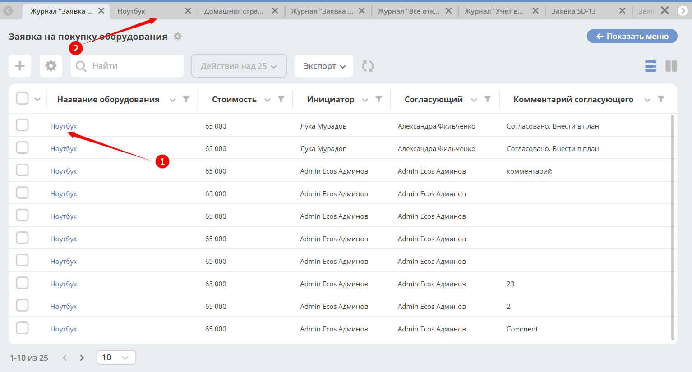
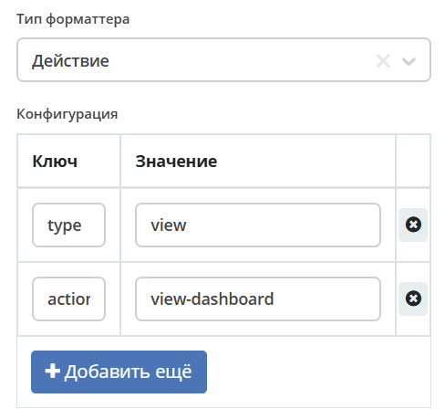

.. _formatters:

Форматтеры
===========

.. contents:: Содержание
   :depth: 3

.. note::

  В форматтерах могут использоваться :ref:`вычисляемые атрибуты<computed_attributes>`

Настройки
---------

Перейти в раздел администрирования > :guilabel:`Журналы` > найти необходимый журнал > действие :guilabel:`Редактировать`. Перейти в :guilabel:`Дополнительно`

.. list-table::
      :widths: 20 20
      :align: center

      * - |

            .. image:: _static/formatter/formatter_1.png
                  :width: 500
                  :align: center

        - |

            .. image:: _static/formatter/formatter_2.png
                  :width: 500
                  :align: center

Выберите форматтер из списка заполните ключ-значение:

.. list-table::
      :widths: 20 20
      :align: center

      * - |

            .. image:: _static/formatter/formatter_3.png
                  :width: 300
                  :align: center

        - |

            .. image:: _static/formatter/formatter_4.png
                  :width: 300
                  :align: center

Типы
---------

AssocFormatter / Ассоциация
~~~~~~~~~~~~~~~~~~~~~~~~~~~~~

Тип: ``assoc``

Конфигурация:

.. list-table:: 
      :widths: 5 40
      :header-rows: 1

      * - Ключ
        - Значение
      * - **sourceId**
        - Идентификатор ассоциации
      * - openInBackground
        - Открыть в новой ecos вкладке
      * - openNewBrowserTab
        - Открыть в новой вкладке браузера

ActionFormatter / Действие
~~~~~~~~~~~~~~~~~~~~~~~~~~~~~~

Тип : ``action``

Конфигурация:

.. list-table:: 
      :widths: 5 40
      :header-rows: 1

      * - Ключ
        - Значение
      * - **type**
        - <тип действия>
      * - actionId
        - <id типа действия>

Предполагается в строке журнала наличие **id** или **recordRef** - ref записи, необходимый для выполнения действия

**Пример:**

По клику на информацию в поле **(1)** в соседней вкладке Citeck открывать дашборд с данными документа **(2)**:

Настройка форматтера:

где:

- type -  ``view``
- actionId - ``view-dashboard``

BooleanFormatter / Логическое выражение
~~~~~~~~~~~~~~~~~~~~~~~~~~~~~~~~~~~~~~~~~~

Тип: ``bool``

Конфигурация:

Простой форматтер, который отдает «Да» или «Нет» в ячейке

.. _ColoredFormatter:

ColoredFormatter / Цвет
~~~~~~~~~~~~~~~~~~~~~~~~~~~~~~

Тип: ``colored``

Универсальный форматтер для отображения значений с цветовой индикацией.

Функции
""""""""

  - Поддержка как предопределенных цветов (через классы CSS), так и пользовательских цветов HEX
  - Использование идентификатора для сопоставления цветов и локализованного значения для отображения
  - Возможность отображения цветного индикатора в качестве указателя или фона
  - Если в ``showPointer`` установлено значение **false**, цвет фона отображается в виде закругленного овала.
  - Поддержка новых и старых форматов журналов

Параметры конфигурации
""""""""""""""""""""""""

.. list-table::
      :widths: 5 5 5 10
      :align: center

      * - Параметр
        - Тип
        - По умолчанию
        - Описание
      * - **color**
        - Object
        - {}
        - Сопоставление значений объектов с цветами.
      * - **showPointer**
        - Boolean
        - false
        - Показывать ли цветной указатель. Если **false**, показывает закругленный овальный фон.
      * - **defaultColor**
        - String
        - ``'#FFFFFF'``
        - Цвет по умолчанию для значений, не найденных в **color**. Может быть HEX или именованным цветом.
      * - **fn**
        - String/Function
        -  
        - Скрипт или функция для определения цвета текста.

Предопределенные цвета
***********************

Форматтер поддерживает следующие предопределенные цвета:

  - green;
  - yellow;
  - pink;
  - red.

Для пользовательских цветов используйте формат HEX (например, «#FF0000»).

Настройка условия отображения значения в определенном цвете в зависимости от значения данных в атрибуте
""""""""""""""""""""""""""""""""""""""""""""""""""""""""""""""""""""""""""""""""""""""""""""""""""""""""""

.. image:: _static/formatter/color_formatter_1.png
       :width: 300
       :align: center

Вернуть необходимо строку с цветом для css (WebColor или HEX):

.. code-block::

  if (cell.disp.length > 2) return "red"
  
  или

  if (cell.disp.length > 2) return "#FF0000" 

Использование
""""""""""""""""

**Базовое использование с предопределенными цветами**

.. code-block:: yaml

  - id: priority
    name:
      ru: Приоритет
      en: Priority
    type: TEXT
    editor:
      type: select
    formatter:
      type: colored
      config:
        color:
          low: green
          medium: yellow
          high: pink
          urgent: red

**Использование с цветами HEX**

.. code-block:: yaml

  - id: priority
    name:
      ru: Приоритет
      en: Priority
    type: TEXT
    editor:
      type: select
    formatter:
      type: colored
      config:
        color:
          low: '#00FF00'
          medium: '#FFFF00'
          high: '#FF69B4'
          urgent: '#FF0000'

**Использование с указателем на дисплее**

.. code-block:: yaml

  - id: priority
    name:
      ru: Приоритет
      en: Priority
    type: TEXT
    editor:
      type: select
    formatter:
      type: colored
      config:
        color:
          low: green
          medium: yellow
          high: pink
          urgent: red
        showPointer: true

**Использование с цветом по умолчанию**

.. code-block:: yaml

  - id: priority
    name:
      ru: Приоритет
      en: Priority
    type: TEXT
    editor:
      type: select
    formatter:
      type: colored
      config:
        color:
          low: green
        defaultColor: '#CCCCCC'

**Использование с именованным цветом по умолчанию**

.. code-block:: yaml

  - id: priority
    name:
      ru: Приоритет
      en: Priority
    type: TEXT
    editor:
      type: select
    formatter:
      type: colored
      config:
        color:
          low: green
        defaultColor: 'red'

**Форматирование цвета на основе скрипта**

.. code-block:: yaml

  - id: priority
    name:
      ru: Приоритет
      en: Priority
    type: TEXT
    editor:
      type: select
    formatter:
      type: colored
      config:
        fn: 'if (cell.value > 2) return "#e2e2e2"'
        defaultColor: '#FFFFFF'

DateFormatter / Дата
~~~~~~~~~~~~~~~~~~~~~~

Тип: ``date``

Конфигурация:

.. list-table:: 
      :widths: 5 40
      :header-rows: 1

      * - Ключ
        - Значение
      * - format
        - Временной формат (по умолчанию 'DD.MM.YYYY')

DateTimeFormatter / Дата и время
~~~~~~~~~~~~~~~~~~~~~~~~~~~~~~~~~~

Тип: ``datetime``

Конфигурация:

.. list-table:: 
      :widths: 5 40
      :header-rows: 1

      * - Ключ
        - Значение
      * - format
        - Временной формат (по умолчанию 'DD.MM.YYYY HH:mm')
      * - relative
        - Флаг, который будет осчитывать время которое прошло

DefaultFormatter / По умолчанию
~~~~~~~~~~~~~~~~~~~~~~~~~~~~~~~~~

Тип: ``default``

Конфигурация:

Всегда отдает строковое значение, которое получили из значения атрибута. Если ячейка имеет булево значение, то отдает "Да" или "Нет"

.. _DurationFormatter:

DurationFormatter / Продолжительность
~~~~~~~~~~~~~~~~~~~~~~~~~~~~~~~~~~~~~~

Тип: ``duration``  

Конфигурация:

.. list-table:: 
      :widths: 5 40
      :header-rows: 1

      * - Ключ
        - Описание
      * - **showSeconds**
        - | При применении в журнале отображается запись в формате  1d 2h 30m 2s
          | Возможные значение - true/false 
          | По умолчанию секунды отображаются - showSeconds = true
      * - **maxAsHours**
        - | При применении в журнале продолжительность будет трансформироваться в часы, то есть 2d 3h 30m = 51h 30m
          | Возможные значение - true/false 

Пример:

.. code-block::

  formatter:
    type: duration
    config:
      maxAsHours: true  

FileNameFormatter / Имя файла
~~~~~~~~~~~~~~~~~~~~~~~~~~~~~~~

Тип: ``filename``

Конфигурация:

Всегда отдает ссылку на документ вида:

.. code-block::

  <a href="${URL.DASHBOARD}?recordRef=${row.id}" target="_blank" rel="noopener noreferrer">
    <icon />
    { НАЗВАНИЕ ЯЧЕЙКИ}
  </a>

HtmlFormatter / HTML
~~~~~~~~~~~~~~~~~~~~~~

Тип: ``html``

Конфигурация:

.. list-table:: 
      :widths: 5 40
      :header-rows: 1

      * - Ключ
        - Значение
      * - html
        - Строка с html кодом

.. _LinkFormatter:

LinkFormatter / Ссылка
~~~~~~~~~~~~~~~~~~~~~~~~~~~~~~

Тип: ``link``

Link форматтер используется для ячеек журнала с использованием полей (колонок) в качестве переменных.

Варианты конфигурации открытия ссылки по форматтеру
""""""""""""""""""""""""""""""""""""""""""""""""""""""

Список вариантов ::

  updateUrl {boolean}
  openNewTab {boolean}
  openNewBrowserTab {boolean}
  reopenBrowserTab {boolean}
  closeActiveTab {boolean}
  openInBackground {boolean}
  pushHistory {boolean}
  replaceHistory {boolean} - default true, if updateUrl is true
  rerenderPage {boolean} - needed to replace link in the router and start rerendering page

Ссылка по шаблону с использованием переменных
"""""""""""""""""""""""""""""""""""""""""""""
Добавлена возможность строить ссылки по шаблону с использованием переменных (атрибутов записи/полей журнала). Шаблон адреса ссылки задается в параметрах форматтера для столбца в конфигурации журнала (**Форматтер для колонки**).

Пример шаблона ссылки: ::

  urlTemplate: "https://example.com/path?var1=${columnId1}&var2=${columnId2}"

где ``columnId1`` и ``columnId2`` - колонки журнала.

В качестве наименования ссылки используется значение ячейки. Если значения нет, то наименование = ``url``.

Ссылка не отображается, если ячейка журнала редактируемая (если в ячейку вводятся данные).

**Например:**

Выбрать форматтер **Ссылка (1)** и указать: 

- **ключ (2)** – ``url``, 
- **значение (3)** - ``${$computed.url}``

.. image:: _static/formatter/link_formatter_1.png
       :width: 500
       :align: center
 
Указать:

- **id (4)** – ``url``, 
- **type (5)** – ``value``. 

В конфигурации указать: 

- **ключ (6)** – ``value``, 
- **значение (7)** - ``https://host/${?id}&${?disp}``

.. image:: _static/formatter/link_formatter_2.png
       :width: 500
       :align: center

В журнале выглядит следующим образом:

.. image:: _static/formatter/link_formatter_3.png
       :width: 500
       :align: center

По клику на наименование будет открываться ссылка.

.. _NumberFormatter:

NumberFormatter / Число
~~~~~~~~~~~~~~~~~~~~~~~~~

Тип: ``number``

Конфигурация:

.. list-table:: 
      :widths: 5 40
      :header-rows: 1

      * - Ключ
        - Описание
      * - **mask**
        - маска, где ``{value}`` — само число
      * - **locales**
        - | какую локаль для форматирования использовать. 
          | От нее зависит как будут разделяться тысячи и дробные числа. (Точкой, запятой или пробелом) По умолчанию текущая локаль.
      * - **maximumFractionDigits**
        - сколько чисел после запятой
      * - **decimalSeparator**
        - как отделяются дробные числа. По умолчанию зависит от локали
      * - **thousandSeparator**
        - как разделяются тысячи. По умолчанию зависит от локали.

Пример:

.. code-block::

  mask: {value} руб.
  locales: ru
  maximumFractionDigits: 16
  decimalSeparator: .
  thousandSeparator: ,

Например:

.. list-table:: 
      :widths: 5 40
      :header-rows: 1

      * - Ключ
        - Описание
      * - **mask**
        - {value} руб
      * - **maximumFractionDigits**
        - 2
      * - **decimalSeparator**
        - .
      * - **thousandSeparator**
        - _

.. image:: _static/formatter/number_formatter_1.png
       :width: 700
       :align: center

ScriptFormatter / Скрипт
~~~~~~~~~~~~~~~~~~~~~~~~~~

Тип: ``script``

Конфигурация:

.. list-table:: 
      :widths: 5 40
      :header-rows: 1

      * - Ключ
        - Значение
      * - **fn**
        - | Тип: ``String``
          | Тело функции. В любом месте скрипта можно использовать ``return``.
          | В теле функции доступны следующие параметры:
          | **_** — библиотека Lodash (https://lodash.com/docs/)
          | **t** — вспомогательная функция локализации. Принимает ключ и возвращает локализованное значение, либо сам ключ, если перевод отсутствует.
          | **vars** — переменные из конфигурации.
          | **cell** — значение текущей ячейки.
          | **row** — вся строка.
          | **index** — индекс значения в ячейке (для множественных значений).
          |
          | Функция может возвращать значения разных типов:
          | Булево - заменяется на локализованное значение по ключу ``boolean.yes`` для ``true`` и ``boolean.no`` для ``false``; 
          | Число или Строка - результат отображается в ячейке;
          | Объект - воспринимается как конфигурация для следующего форматтера в формате ``{"type":"...", "config": {...}}``
          |          Если в объекте есть ``cell``, то значение оттуда используется как значение ячейки для следующего форматтера. 
          |          Если в объекте нет ``cell``, то используется оригинальное значение ячейки.
      * - **vars**
        - | Тип: ``Object``
          | Дополнительные переменные, которые могут понадобиться при выполнении скрипта.
          | Внутри скрипта к ним можно обращаться через ``vars.yourVariable``, где ``yourVariable`` — это имя ключа в объекте ``vars``.
          | Это полезно, например, когда нужно динамически подгрузить дополнительные данные через функционал форматтеров,
          | заменяющий все вхождения вида ``${...}`` на соответствующие значения атрибутов.
          | Например, если указать ``vars: { currency: "${currencyAssoc.code!'unknown'}" }``, то в скрипте через ``vars.currency``
          | можно получить код валюты из ассоциации ``currencyAssoc``.

Пример использования:

.. code-block:: yaml
  
  formatter:
    type: script
    config:
      vars:
        processingStatus: ${processingStatus}
      fn: return Citeck.messages.global[vars.processingStatus];

Если есть необходимость вызвать другой форматтер, например **HtmlFormatter**:

.. code-block:: yaml

  formatter:
    type: script
    config:
      fn: |
        const cellNum = _.parseInt(cell) || 0;
        let link = "";
        if (cellNum > 100000) {
          link = "https://duckduckgo.com/";
        } else if (cellNum > 1000) {
          link = "https://www.yahoo.com/"; 
        } else {
          link = "https://www.google.com/";
        }
        return {
          "type": "html",
          "config": {
            "html": "<a href='" + link + "' target='_blank'>" + link + "</a>"
          }
        };

WorkflowPriorityFormatter / Приоритет рабочего процесса
~~~~~~~~~~~~~~~~~~~~~~~~~~~~~~~~~~~~~~~~~~~~~~~~~~~~~~~~~~~~~~~~~

Тип: ``workflowPriority``  

Конфигурация:

.. list-table:: 
      :widths: 5 40
      :header-rows: 1

      * - Ключ
        - Значение
      * - 
        - 
      * - 
        -

