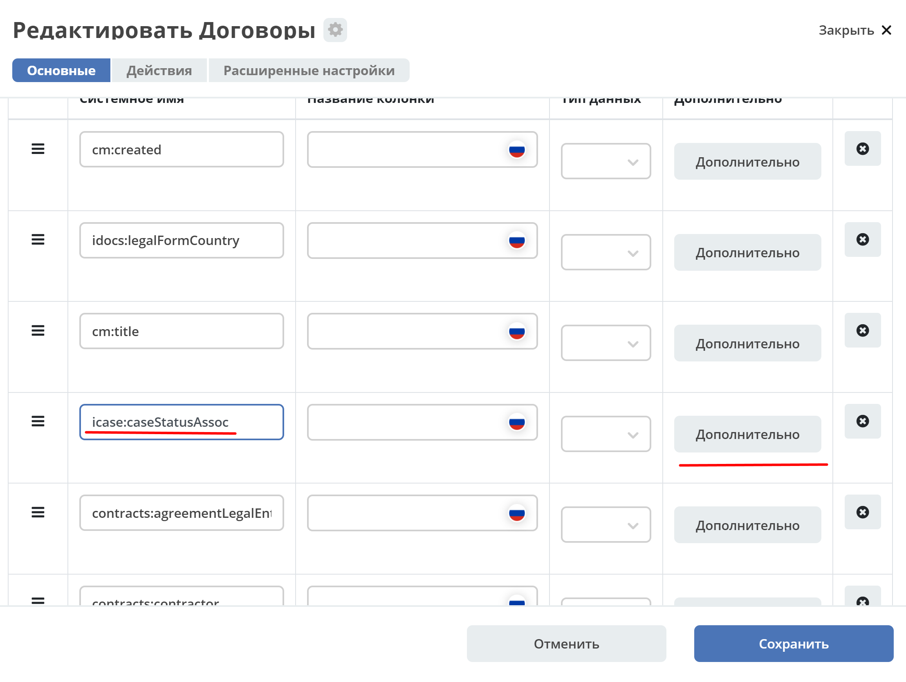

Настройки журнала с примерами
===============================

Выражения в качестве атрибутов
--------------------------------

.. _expression_attributes:

.. note::
  
  Выражения должны поддерживаться источником данных. Фронтенд передает настроенные атрибуты 
  в источник данных "как есть" и ожидает, что сервер понимает как с ними работать.

При настройке колонки журнала можно перейти в расширенные настройки и в поле **"Атрибут"** указать сложное выражение, 
которое в дальнейшем можно будет использовать для группировки, сортировки, поиска и отображения.

.. image:: _static/journal_settings/expression_attribute.png
      :width: 300
      :align: center

Выражение должно быть записано в круглых скобках. Исключение - если выражение состоит из одной функции, то скобки не требуются.

Подробнее о синтаксисе и списке доступных функций можно посмотреть в :ref:`ecos-data<ecos_data_functions>`

Параметр "2.3 Атрибут для поиска"
----------------------------------

.. _searchAttribute:

В конфигурацию столбца журнала добавлен параметр **2.3 Атрибут для поиска** - атрибут, который нужно получить у записей из подзапроса. По умолчанию из подзапроса берутся идентификаторы найденных сущностей, но можно взять у этих сущностей какой-то атрибут при надобности. 

В любом журнале со включенными фильтрами выбрать столбец с текстовым поиском, задать фильтр. 

При применении фильтра UI строит и отправляет запрос с url: ``http://localhost/gateway/api/records/query?k=q_alfresco%2F``  

В теле запроса, query предикат который мы задали фильтром по столбцу:

.. code-block::

    "query": {
    ...
                {
                "att": "someAttName",
                "t": "eq",
                "val": "1000"
                }
    ...
    }

При построении этого query,в предикате значение ``att`` меняется на значение параметра ``searchAttribute`` из конфигурации столбца журнала.

Такой поиск планируется использовать для вычисляемых атрибутов. Отображать в журнале они будут то, что сконфигурировано в ``computed att``, а поиск должен выполняться по заданному в конфигурации столбца атрибуту.

Фильтр по тексту в колонке 'assoc'. Настройки innerQuery
=========================================================

1.	Расширены настройки – добавлена возможность использовать **RecordsQuery**. Например, на вычисляемых полях, что позволяет формировать произвольный запрос к разным источникам данных.
2.	Для решения вопроса - когда пользователь выбирает произвольные предикаты (Contains, Equals, Starts with, …) при настройке фильтра добавлен еще один тег в запрос - **$PREDICATE_TYPE** - для его замены на клиенте.
3.	Добавлен атрибут - **innerQueryAttribute**, для возможности настройки отображения:

.. code-block::

    searchConfig: {
    delimiters: [],
    searchByText: {
        {
        "innerQuery": {
            "sourceId": "",
            "page": {
            "maxItems": 25
            },
            "query": {
            "t": "and",
            "val": [
                {
                "att": "TYPE",
                "val": "idocs:currency",
                "t": "eq"
                },
                {
                "att": "idocs:currencyCode",
                "val": "$TEXT",
                "t": "$PREDICATE_TYPE"
                }
            ]
            }
        },
        "innerQueryAttribute": ""
        }
    }
    }

Рассмотрим пример. Настроим поиск только по колонке **"Статус"**.

1. Перейти в дополнительные настройки колонки:

1. Тип редактора указать **text**:

.. image:: _static/journal_settings/02.png
       :width: 500
       :align: center

1. В разделе **Search Config** в **запросе** введите:

.. tip::

    Запрос нужно задавать как можно точнее, с указанием типа запрашиваемой ноды.

.. code-block::

    {
    "t": "and",
    "val": [
        {
        "att": "TYPE",
        "val": "icase:caseStatus",
        "t": "eq"
        },
        {
        "att": "cm:title",
        "val": "$TEXT",
        "t": "$PREDICATE_TYPE"
        }
    ]
    }

4. Укажите необходимое **Количество записей подзапроса**:

**Количество записей подзапроса** -  сколько максимально записей на данный запрос вернет сервер. Далее эти ноды будут использоваться как фильтр для формирования основного запроса - для отображения нужных записей в самом журнале.

Но в ответе также будет приходить число, сколько сервер всего нашел записей, и если это число больше указанного количества записей подзапроса, то на клиенте будет показываться сообщение о необходимости задать более точный фильтр.

.. image:: _static/journal_settings/03.png
       :width: 500
       :align: center

Сохраните.

Поиск осуществляется только по колонке **"Статус"**: 

.. image:: _static/journal_settings/04.png
       :width: 700
       :align: center

Настройки фильтрации колонки
-----------------------------

В журнале для колонок появилась настройка **headerFilterEditor**. 

В настройках типа данных можно изменить фильтр с Select Journal на текстовое поле:

Фильтр **Select Journal**:

  .. image:: _static/journal_settings/j_user_29.png
       :width: 700
       :align: center

Для изменения неоходимо в журнале рядом с названием нажать:

  .. image:: _static/journal_settings/j_user_25.png
       :width: 700
       :align: center

У необходимой колонки нажать **"Дополнительно"** : 

  .. image:: _static/journal_settings/j_user_26.png
       :width: 600
       :align: center

Указать настройки, как  ниже:

  .. image:: _static/journal_settings/j_user_27.png
       :width: 400
       :align: center

Фильтр **Select Journal** изменен на текстовый:

  .. image:: _static/journal_settings/j_user_28.png
       :width: 700
       :align: center

Настройки отображения суммы для колонки
-----------------------------------------

.. _column_sum:

Добавлена поддержка группировки по всем записям в журнале с использованием :ref:`предиката<ecos-predicate_main>`:

.. code-block::

  await Records.query({sourceId: 'emodel/ecos-contract', query: {}, language: 'predicate', groupBy: ['*']}, 'sum(amount)');

.. code-block::

  await Records.queryOne({sourceId: 'emodel/ecos-contract', query: {}, language: 'predicate', groupBy: ['*']}, 'sum(amount)?num');

Включение или выключение отображения суммы для каждой колонки производится отдельно по каждому атрибуту. Тип атрибута должен быть **Number**.

  .. image:: _static/journal_settings/j_user_32.png
       :width: 600
       :align: center

|

  .. image:: _static/journal_settings/j_user_33.png
       :width: 500
       :align: center

Общая сумма учитывает только форматтеры :ref:`NumberFormatter<NumberFormatter>` и :ref:`DurationFormatter<DurationFormatter>` 

В нижней части столбца будет отображаться общая сумма значений столбца:

  .. image:: _static/journal_settings/j_user_31.png
       :width: 700
       :align: center

