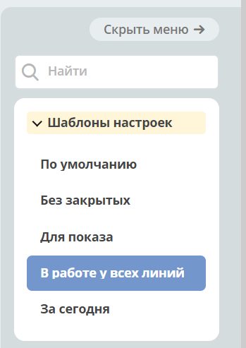
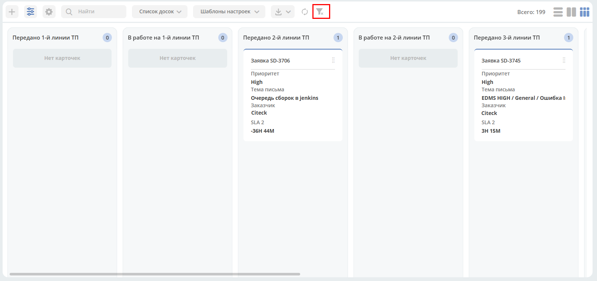
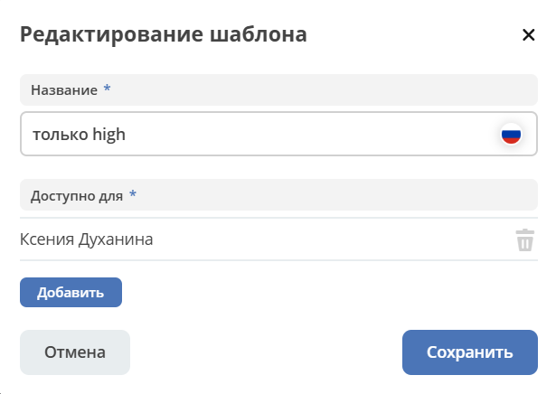
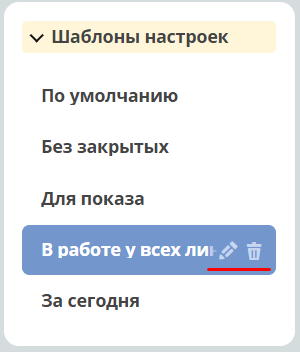
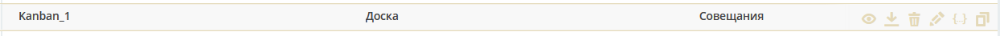

Канбан-доска
============

.. _kanban_board:

.. contents::
    :depth: 3

**Канбан-доска** - представление данных системы выбранного типа данных, является дополнительным представлением журнала.

В колонках доски отображаются статусы выбранного типа, а на самой доске - созданные экземпляры этого типа на основе примененного фильтра.

.. image:: _static/kanban/KB1.png
       :width: 700
       :align: center

У журнала может быть несколько сконфигурированных канбан-досок – для их просмотра необходимо нажать **Список досок**.

Фильтры, примененные в журнале, применяются и на канбан-доске, и наоборот. По нажатию на **Показать меню**: 

открываются сохраненные шаблоны настроек, доступные для данного журнала. 

При открытии доски по умолчанию отображается тот шаблон, который выбран для журнала по умолчанию.

Карточки можно переносить из одной колонки в другую. 

Если перенос в соответствии с бизнес-процессом не возможен, указывается ошибка. Например:

.. image:: _static/kanban/KB11.png
       :width: 300
       :align: center

Настройка колонок канбан доски
------------------------------

Настроить фильтрацию элементов, порядок и отображение колонок можно, нажав:

.. image:: _static/kanban/KB13.png
       :width: 400
       :align: center

Предоставлен весь список статусов типа данных, к которому относится текущий журнал. Чекбоксами можно отметить те статусы, которые необходимо отражать на канбан-доске.

.. image:: _static/kanban/KB14.png
       :width: 500
       :align: center

Нажмите **Применить**, на канбан-доске будут показаны выбранные в настройках статусы и элементы в этих статусах:

По нажатию на:

примененный фильтр сбрасывается.

Выбранные настройки можно сохранить в шаблон, нажав **Создать шаблон**:

укажите название, для кого он доступен (пользователи, группы), сохраните.

Применение шаблона
--------------------

Сохраненные шаблоны доступны в меню:

Шаблон можно отредактировать или удалить:

Конфигурация канбан-доски
--------------------------

Журнал с конфигурациями расположен в **разделе администратора - > Конфигурация UI - > Канбан доски**

.. image:: _static/kanban/KB2.png
       :width: 700
       :align: center

Действия
~~~~~~~~~
Возможные действия с доской:

- Просмотреть свойства
- Скачать
- Удалить
- Редактировать свойства
- Редактор json
- Копировать

Форма создания
~~~~~~~~~~~~~~

**+ → Создать конфигурацию канбан-доски**

 .. image:: _static/kanban/KB4.png
       :width: 600
       :align: center

.. list-table:: 
      :widths: 5 40 5
      :header-rows: 1
      :class: tight-table  

      * - Поле
        - Описание
        - Номер 
      * - **Идентификатор доски**
        - | Уникальный идентификатор доски. Например, test_board (snake case)
          | Если идентификатор не заполнять, то он будет сгенерирован автоматически. Например, c8393bfa-5291-464d-88b7-7ae822516e02
        - 
      * - **Имя канбан-доски**
        - | Отображаемое имя доски. Отображается в списке канбан-досок, и как title страницы. Укажите вручную. 
          | Может быть пустым.
        - 2
      * - **Возможно ли перемещать сущности между статусами**
        - | Использование drag’n’drop при перемещении между статусами. 
          | **Внимание!** Перемещение не означает изменение бизнес-процесса.
        - 7
      * - **Скрыть заголовок**
        - | Возможность убирать заголовок канбан карточки
        - 5
      * - **Тип данных**
        - | Тип сущности, который необходимо отражать на доске. Выбор осуществляется из списка всех уже созданных типов. 
          | Может быть выбрано только 1 значение. 
          | В соответствии с типом в колонках можно выбирать связанные с ним статусы.
        - 5
      * - **Журнал**
        - | Журнал для типа данных. 
          | Для какого журнала создается представление канбан-доска. 
          | Выбор осуществляется из списка всех уже созданных журналов. Может быть выбрано только 1 значение.
        - 1
      * - **Форма**
        - | Форма карточки для отображения сущности. 
          | Выбор осуществляется из списка всех уже созданных типов. Может быть выбрано только 1 значение. 
          | Если форму не выбирать, то на канбан-доске будет отображение сущности по умолчанию со следующими данными: 
          | Автор; Дата создания.
        - 4
      * - **Действия**
        - | UI действия над сущностью на доске. Выбор осуществляется из списка всех уже созданных действий. 
          | Может быть выбрано несколько значений.
        - 6
      * - **Колонки**
        - Конфигурация колонок
        - 3

Соответствие полей конфигурации и UI:

 .. image:: _static/kanban/KB5.png
       :width: 700
       :align: center

Настройка колонок
~~~~~~~~~~~~~~~~~~~~~~~~~

В колонке **«Статус»** выберите статус из выпадающего списка. Статусы в выпадающем списке указаны в соответствии с выбранным **типом данных**.

 .. image:: _static/kanban/KB6.png
       :width: 600
       :align: center

В колонке **«Имя** укажите название, которое будет отображаться на канбан-доске. По умолчанию выбранный статус автоматически указывается и в колонке **«Имя»**, можно изменить на необходимое.

 .. image:: _static/kanban/KB7.png
       :width: 600
       :align: center

Для каждой колонки можно скрыть элементы старше, чем указанная продолжительность:

 .. image:: _static/kanban/KB20.png
       :width: 600
       :align: center

Продолжительность указывается в днях:

 .. image:: _static/kanban/KB21.png
       :width: 600
       :align: center

На доске для колонок с включенной настройкой будут скрываться элементы с датой перехода в статус больше, чем указанная продолжительность.

Заполненная конфигурация
-------------------------

 .. image:: _static/kanban/KB8.png
       :width: 600
       :align: center

Связь канбан-доски и типа данных
----------------------------------

Созданная канбан доска может быть задана и в типе данных:

 .. image:: _static/kanban/KB10.png
       :width: 600
       :align: center

