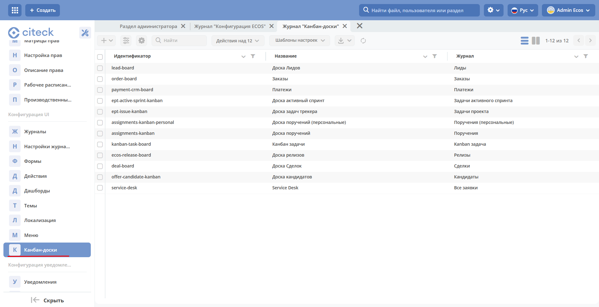

.. _kanban_board:

Канбан-доска
============

**Канбан-доска** - это представление данных системы выбранного типа данных.

В колонках доски отображаются статусы выбранного типа, а на самой доске - созданные экземпляры этого типа на основе примененного фильтра.

Канбан-доска является дополнительным представлением журнала.

.. image:: _static/kanban/KB1.png
       :width: 600
       :align: center

У журнала может быть несколько сконфигурированных канбан-досок – для их просмотра необходимо нажать **Список досок**.

Фильтры, примененные в журнале, применяются и на канбан-доске, и наоборот. По нажатию на **Список шаблонов** доступны шаблоны этого журнала. При открытии доски по умолчанию отображается тот шаблон, который выбран для журнала по умолчанию.

Конфигурация
------------------

Журнал с конфигурациями расположен в **разделе администратора - > Конфигурация UI - > Канбан доски**

Действия
~~~~~~~~~
Возможные действия с доской:

.. image:: _static/kanban//KB9.png
       :width: 300
       :align: center
       :alt: Доска действия

.. list-table:: 
      :widths: 5 10
      :align: center
      :class: tight-table  

      * - |
 
            .. image:: _static/kanban/KB9_1.png
                :width: 30

        - Просмотреть свойства
      * - |
 
            .. image:: _static/kanban/KB9_2.png
                :width: 30

        - Скачать
      * - |
 
            .. image:: _static/kanban/KB9_3.png
                :width: 30

        - Удалить
      * - |
 
            .. image:: _static/kanban/KB9_4.png
                :width: 30

        - Редактировать свойства доски. Открывается форма аналогичная созданию.
      * - |
 
            .. image:: _static/kanban/KB9_5.png
                :width: 30

        - | Редактор json. Отрывается редактор, в котором можно вносить изменения:

            .. image:: _static/kanban/KB3.png
                :width: 400
      * - |
 
            .. image:: _static/kanban/KB9_6.png
                :width: 30

        - Копировать

Форма создания
~~~~~~~~~~~~~~

**+ → Создать конфигурацию канбан-доски**

 .. image:: _static/kanban/KB4.png
       :width: 600
       :align: center

.. list-table:: 
      :widths: 5 40 5
      :header-rows: 1
      :class: tight-table  

      * - Поле
        - Описание
        - Номер 
      * - **Идентификатор доски**
        - | Уникальный идентификатор доски. Например, test_board (snake case)
          | Если идентификатор не заполнять, то он будет сгенерирован автоматически. Например, c8393bfa-5291-464d-88b7-7ae822516e02
        - 
      * - **Имя канбан-доски**
        - | Отображаемое имя доски. Отображается в списке канбан-досок, и как title страницы. Укажите вручную. 
          | Может быть пустым.
        - 2
      * - **Возможно ли перемещать сущности между статусами**
        - | Использование drag’n’drop при перемещении между статусами. 
          | **Внимание!** Перемещение не означает изменение бизнес-процесса.
        - 7
      * - **Тип данных**
        - | Тип сущности, который необходимо отражать на доске. Выбор осуществляется из списка всех уже созданных типов. 
          | Может быть выбрано только 1 значение. 
          | В соответствии с типом в колонках можно выбирать связанные с ним статусы.
        - 5
      * - **Журнал**
        - | Журнал для типа данных. 
          | Для какого журнала создается представление канбан-доска. 
          | Выбор осуществляется из списка всех уже созданных журналов. Может быть выбрано только 1 значение.
        - 1
      * - **Форма**
        - | Форма карточки для отображения сущности. 
          | Выбор осуществляется из списка всех уже созданных типов. Может быть выбрано только 1 значение. 
          | Если форму не выбирать, то на канбан-доске будет отображение сущности по умолчанию со следующими данными: 
          | Автор; Дата создания.
        - 4
      * - **Действия**
        - | UI действия над сущностью на доске. Выбор осуществляется из списка всех уже созданных действий. 
          | Может быть выбрано несколько значений.
        - 6
      * - **Колонки**
        - Конфигурация колонок
        - 3

Соответствие полей конфигурации и UI:

 .. image:: _static/kanban/KB5.png
       :width: 600
       :align: center

Конфигурация колонок
~~~~~~~~~~~~~~~~~~~~~~~~~

В колонке **«Статус»** выберите статус из выпадающего списка. Статусы в выпадающем списке указаны в соответствии с выбранным **типом данных**.

 .. image:: _static/kanban/KB6.png
       :width: 600
       :align: center

В колонке **«Имя** укажите название, которое будет отображаться на канбан-доске. По умолчанию выбранный статус автоматически указывается и в колонке **«Имя»**, можно изменить на необходимое.

 .. image:: _static/kanban/KB7.png
       :width: 600
       :align: center

Заполненная конфигурация
-------------------------

 .. image:: _static/kanban/KB8.png
       :width: 600
       :align: center

Связь канбан-доски и типа данных
----------------------------------

Созданная канбан доска может быть задана и в типе данных:

 .. image:: _static/kanban/KB10.png
       :width: 600
       :align: center

