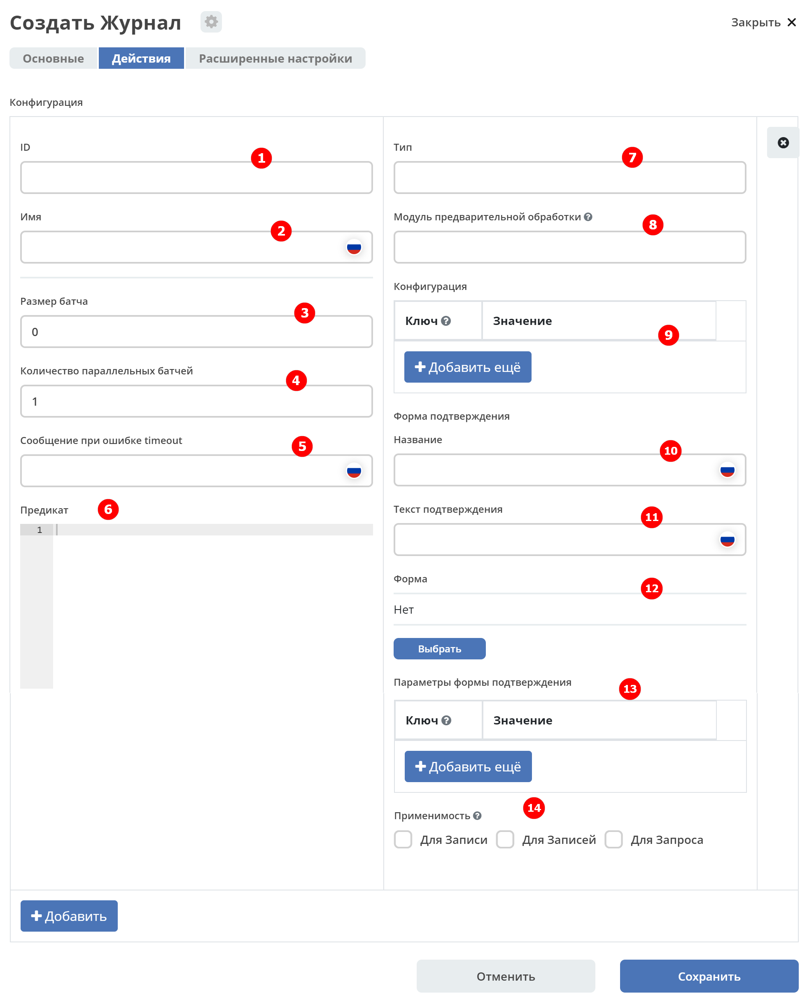
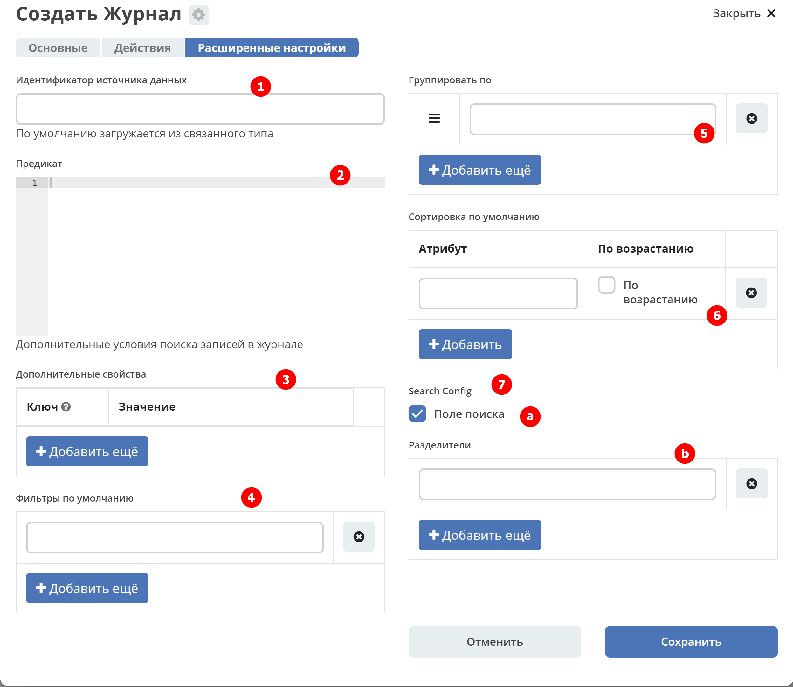

Создание журнала
==================

Журнал расположен в **разделе администратора - > Конфигурация UI**:

 .. image:: _static/new/new_1.png
       :width: 800
       :align: center
 
Для создания журнала нажмите **+** и выберите **«Создать журнал»**:
 
 .. image:: _static/new/new_2.png
       :width: 200
       :align: center
 
Вкладка «Основные»
-------------------

 .. image:: _static/new/new_3.png
       :width: 600
       :align: center

.. list-table:: 

      * - **Идентификатор журнала** 
        - Уникальный идентификатор журнала
      * - **Название журнала**
        - Имя журнала, которое будет отображаться
      * - **Разрешить редактирование значений в ячейках** 
        - Возможность инлайн редактирования – редактирование данных непосредственно в ячейке.
      * - **Добавить действия из типа**
        - | Добавляет действия, которые были добавлены в типе данных.
          | Возможны три значения:
          | **empty (null)** - если **actions** и **actionsDef** пустые, то добавляем действия из типа         
          | **true** - всегда добавляем действия из типа        
          | **false** - никогда не добавляем из типа
      * - **Действия** 
        - Выбрать из списка действия, которые будут доступны для объектов журнала (инлайн действия в строке)
      * - **Тип данных**
        - | Выбрать из списка тип данных, созданный ранее.
          | Можно не выбирать - достаточно связи:
          | тип -> журнал       
          | тип -> форма      
          | Обратная связь нужна только в случаях, когда для одного типа есть много форм или много журналов.

Ниже расположена таблица для ввода информации о столбцах:

.. list-table:: 

      * - **Системное имя** 
        - Id атрибута модели
      * - **Название колонки** 
        - Имя колонки
      * - **Тип данных** 
        - Тип данных колонки
      * - **Дополнительно** 
        - Дополнительные настройки колонки. См. подробно ниже
  
Колонки можно перемещать, удалять.

Дополнительные настройки колонки
~~~~~~~~~~~~~~~~~~~~~~~~~~~~~~~~~~~~

 .. image:: _static/new/new_4.png
       :width: 400
       :align: center

.. list-table:: 

      * - **Атрибут для загрузки (по умолчанию системное имя)** 
        - [описание в работе]
      * - **Можно ли искать по атрибуту** 
        - Разрешить поиск по атрибуту [описание в работе]
      * - **Можно ли искать в шапке колонки** 
        - Разрешить поиск в шапке колонки
      * - **Можно ли сортировать** 
        - Разрешить сортировку по колонке
      * - **Можно ли группировать** 
        - Разрешить группировку по колонке
      * - **Можно ли редактировать в таблице** 
        - | Инлайн редактирование по клику на значение. 
          | В зависимости от типа данных доступен различный вариант редактирования.
      * - **Отображать по умолчанию** 
        - Разрешить колонку отображать по умолчанию
      * - **Скрытая колонка** 
        - Можно искать по колонке, но её нельзя вывести в таблицу
      * - **Множественное значение**
        - | Сколько значений может быть в ячейке: 
          | -	false - 0-1
          | -	true - сколько угодно     
      * - **Форматтер для колонки** 
        - | Указать форматтер (:ref:`см. Форматтеры<formatters>`) 
          | И далее в конфигурации ключ и значение при необходимости 
      * - **Редактор для колонки** 
        - | Указать редактор (:ref:`см. Редакторы<editors>`) 
          | И далее в конфигурации ключ и значение при необходимости 
      * - **Тип редактора** 
        - Указать редактор (:ref:`см. Редакторы<editors>`)
      * - **Delimiters** 
        - Возможность установки и настройки разделителя для массива значений
      * - **Panel** 
        - [описание в работе]

Вкладка «Действия»
-------------------

 .. image:: _static/new/new_5.png
       :width: 600
       :align: center

.. list-table:: 

      * - **ID** 
        - Уникальный идентификатор
      * - **Имя** 
        - Наименование действия
      * - **Тип** 
        - | Указать тип действия 
          | (:ref:`Действия<ui_actions>`) 
      * - **Модуль предварительной обработчик** 
        - Указать ссылку на модуль, содержащий JS-код
      * - **Конфигурация** 
        - | Указать ключ и значение при необходимости.
          | Например, выражение, которое в коде подставляет динамическое значение
          | [описание в работе]
      * - **Применимость** 
        - Выбрать соответствующий вариант применимости
      * - **Размер батча** 
        - Размер запроса 
      * - **Количество параллельных батчей** 
        - Указать сколько запросов запускается одновременно
      * - **Сообщение при ошибке timeout** 
        - Ввести текст сообщения об ошибке

Вкладка «Расширенные настройки»
---------------------------------

.. list-table:: 

      * - **Идентификатор источника данных** 
        - [описание в работе]
      * - **Предикат** 
        - | [описание в работе]
          | (:ref:`Язык предикатов <ecos-predicate_main>`)
      * - **Дополнительные свойства** 
        - [описание в работе]
      * - **Группировать по** 
        - [описание в работе]
      * - **Сортировать по** 
        - [описание в работе]
      * - **Search config** 
        - [описание в работе]

Далее в ранее созданном типе ECOS в параметре **«Journal»** выбрать созданный журнал.

