Представление данных в виде списка, плиток
==============================================

.. _tiles:

Представление данных **в виде списка** подразумевает отображение информации в виде строк, каждая из которых соответствует отдельному элементу и содержит изображение, заголовок и дополнительную информацию:

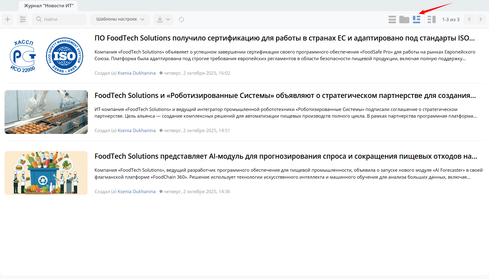

Формат **плиток** представляет собой визуальный способ организации данных: каждый элемент отображается в отдельном блоке с изображением, заголовком и краткой информацией. 

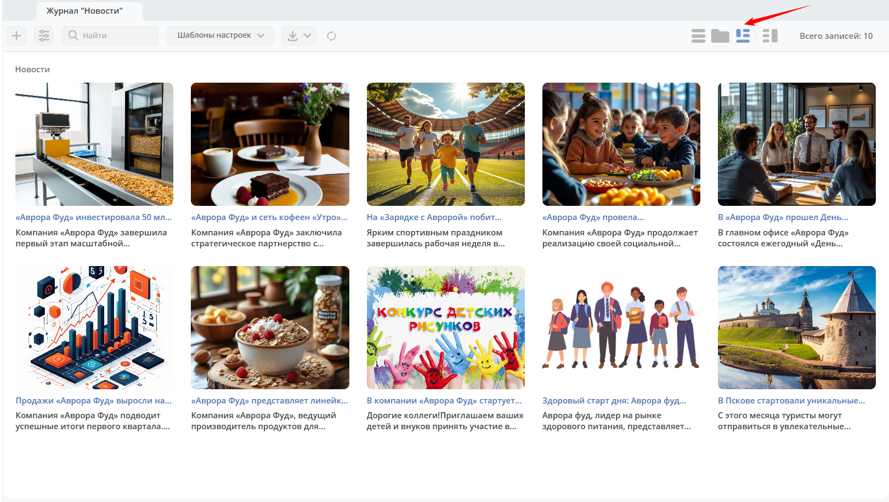

В представлении доступен режим :ref:`предпросмотра<preview>`:

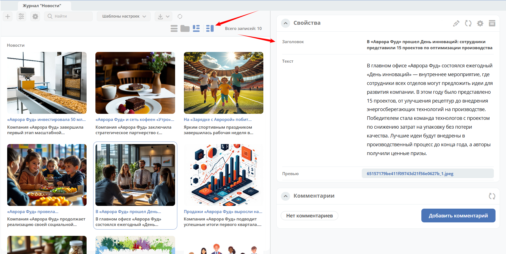

Дерево категорий
~~~~~~~~~~~~~~~~~~

Администратор в режим предпросмотра **(1)** может помимо стандартных виджетов **(2)** добавить виджет **Меню** **(3)**:

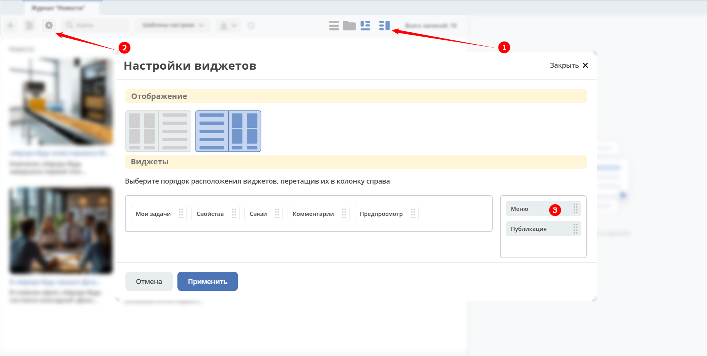

**Виджет Меню** представляет собой дерево категорий. Для создания первой категории необходимо нажать **Добавить**:

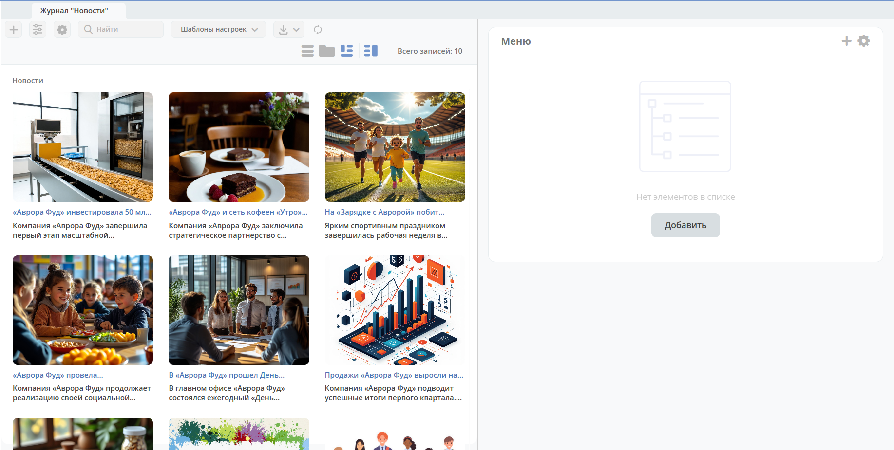

И далее для добавления категории 1-го уровня нажмите большой **+** **(1)**. Для добавления подкатегории нажмите маленький **+** **(2)**:

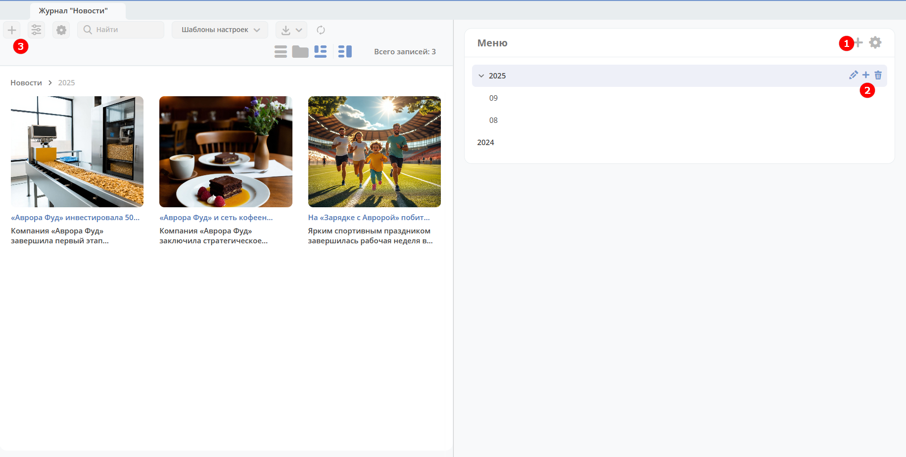

Введите название:

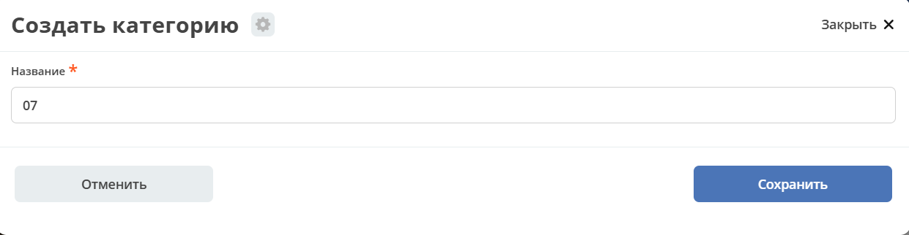

Для создания карточки в категории нажмите **+** **(3)**:

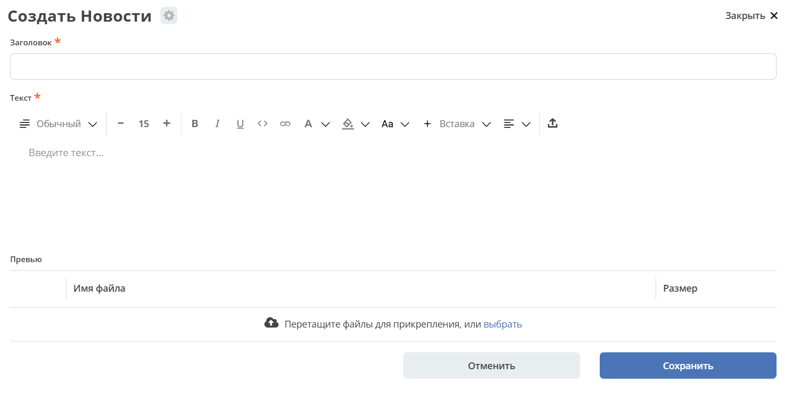

Созданная карточка будет доступна как в категории, так и в главном разделе.

Для удобства навигации в представлении есть хлебные крошки **(1)**:

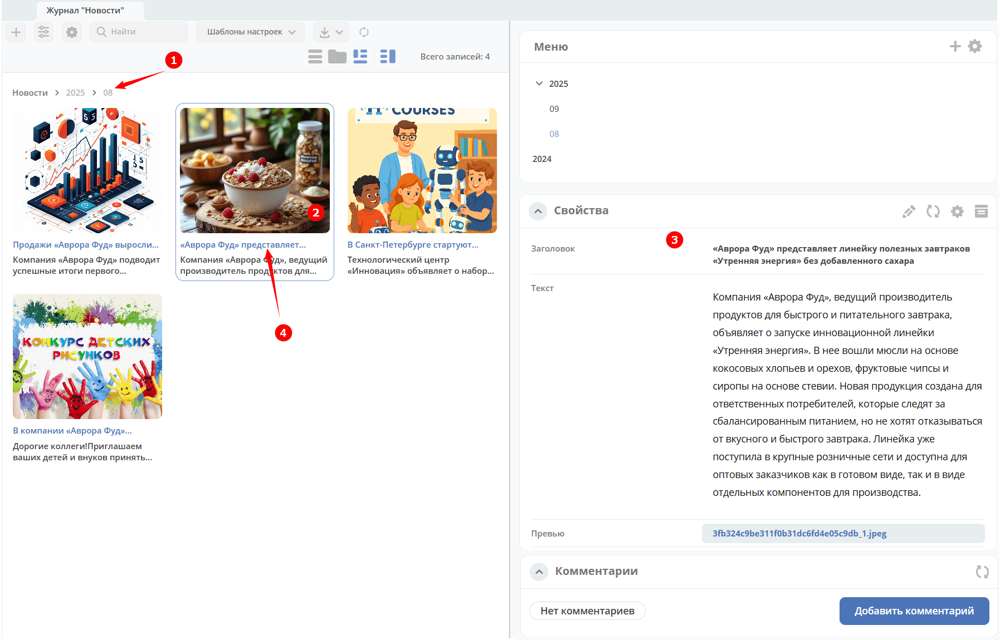

По клику на плитку **(2)** откроется ее предпросмотр **(3)**. При клике на заголовок плитки **(4)** карточка откроется в отдельной вкладке:

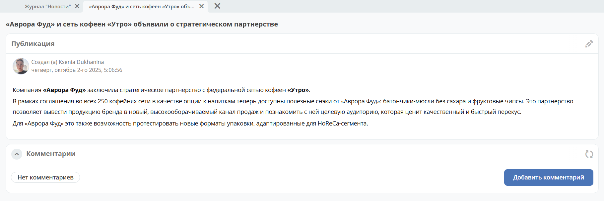

Главный раздел (в данном случае Новости) будет иметь все записи, а иерархия выступает, как фильтр:

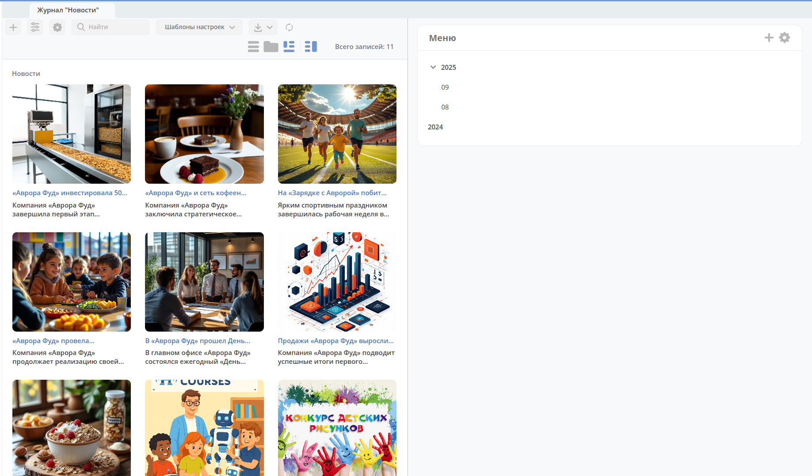

Для перемещения плитки в другой раздел выберите плитку и перетащите ее в необходимый раздел:

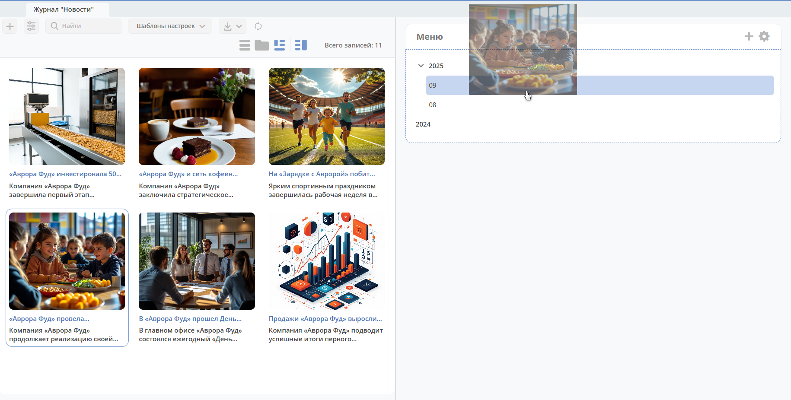

Или выберите плитку **(1)** и выберите раздел **(2)**:

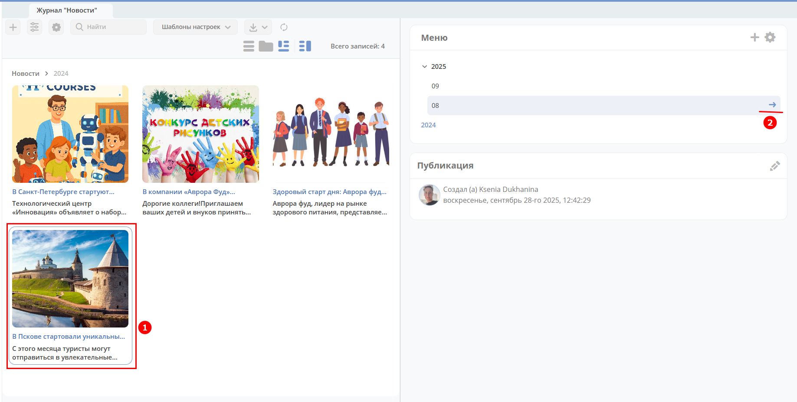

О настройке представления для типа данных см. :ref:`подробно<datatypes_views>`

