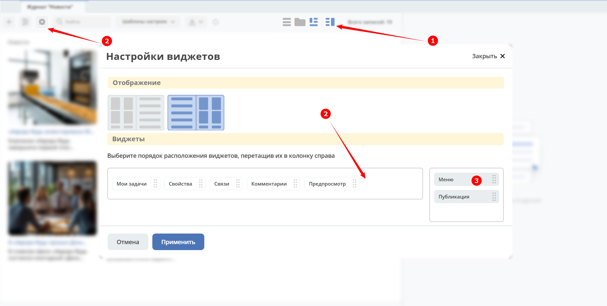

Представление данных в виде плиток
====================================

.. _tiles:

Режим в виде плиток можно использовать для представления новостей, перечисления товаров, оборудования. Каждая плитка содержит название и описание. 

В представлении доступен режим :ref:`предпросмотра<preview>`:

Администратор в режиме предпросмотра **(1)** может добавить **(2)** виджет меню **(3)**:

Виджет представляет собой иерархию. Для создания первого раздела необходимо нажать **Добавить**:

.. image:: _static/tiles/tiles_menu_1.png
       :width: 700
       :align: center

И далее для добавления раздела 1-го уровня нажмите большой **+** **(1)**. Для добавления подраздела  нажмите маленький **+** **(2)**:

введите название:

Для создания элемента в разделе нажмите **+** **(3)**:

Для перемещения плитки в другой раздел - выберите плитку **(1)** и выберите раздел **(2)**:

.. image:: _static/tiles/change.png
       :width: 700
       :align: center

О настройке представления для типа данных см. :ref:`подробно<datatypes_views>`

