.. _document_library:

Библиотека документов (Document Library)
==========================================

.. contents::
    :depth: 3

**Document Library (Библиотека документов)** — раздел для хранения и организации файлов в виде дерева папок, похожий на проводник Windows. Здесь вы можете загружать документы, создавать папки, а также перемещать и удалять файлы.

Библиотека подключается к меню через специальный элемент **DocLib** и требует создания типа данных на основе **Файл библиотеки документов**. См. раздел :ref:`Создание библиотеки документов <new_document_library>`.

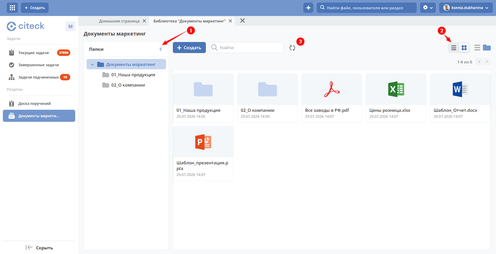

Дерево папок показано по умолчанию. Чтобы свернуть его, нажмите **(1)**:

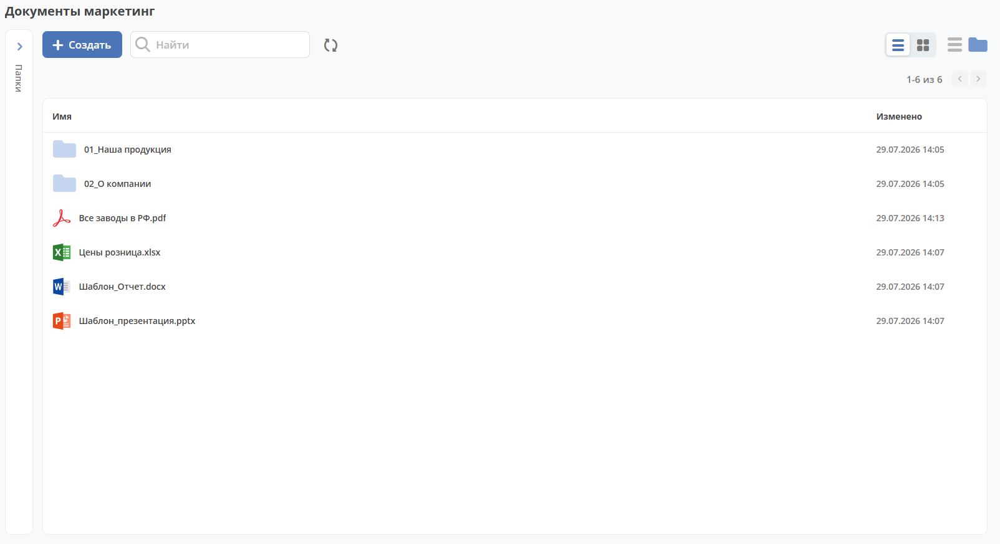

По умолчанию файлы представлены в виде плиток. Для представления файлов в виде списка нажмите **(2)**:

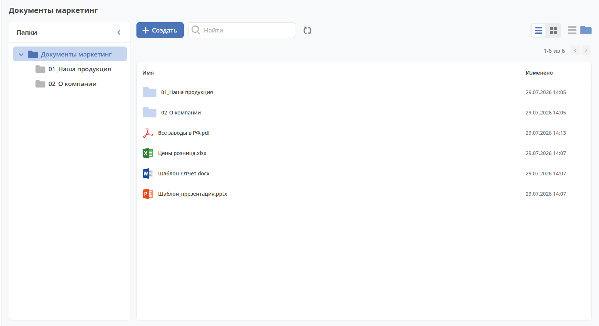

Для обновления данных нажмите **(3)**.

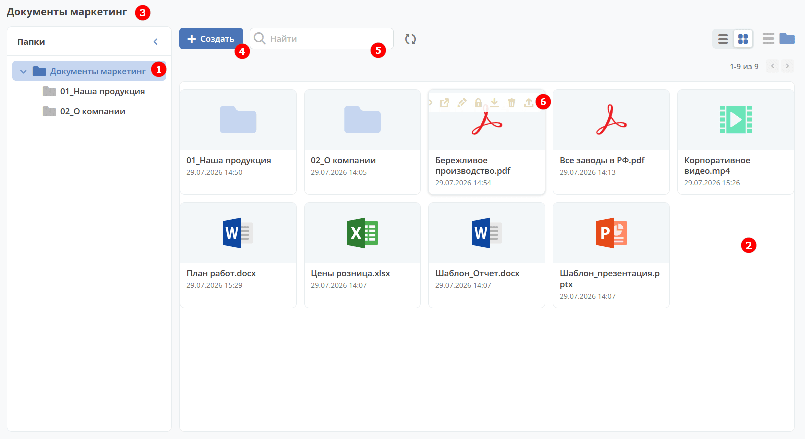

1. Папка, которую вы выбрали, подсвечивается среди остальных **(1)**.
2. Для отображения документов и папок используются иконки, соответствующие формату файлов по аналогии с проводником Windows **(2)**:

   - Microsoft Word (doc, docx);
   - Microsoft Excel (xls, xlsx);
   - Microsoft Powerpoint (ppt, pptx);
   - Adobe Acrobat (pdf);
   - Файлы изображений (jpg, bmp, png, gif, tif);
   - OpenOffice / LibreOffice (odf);
   - Файл сообщения из электронной почты (.msg).

3. Над журналом вы увидите название текущей раскрытой папки **(3)**.
4. Нажмите **(4)**, чтобы создать документ, загрузить файл или создать папку, либо перетащите файл в область библиотеки. См. ниже раздел «Создание папки / Загрузка файла».
5. Используйте поиск **(5)**, чтобы найти документ внутри папки — результаты появятся списком.
6. Наведите курсор на файл или папку, чтобы увидеть доступные действия **(6)**. См. ниже раздел «Действия с элементом».
7. По клику на документ открывается его карточка. См. ниже раздел «Карточка файла».

Действия с элементом
----------------------

.. list-table::
   :widths: 5 10
   :align: center

   * - .. image:: _static/doclib/ic_1.png
          :width: 25
          :align: center
     - Перейти к просмотру карточки в новой вкладке.

   * - .. image:: _static/doclib/ic_3.png
          :width: 25
          :align: center
     - Открыть в фоновой вкладке.

   * - .. image:: _static/doclib/ic_2.png
          :width: 25
          :align: center
     - Переименовать файл или папку:

       .. image:: _static/doclib/DocLib_5.png
          :width: 400
          :align: center

       Можно изменить название файла или сам вложенный файл.

   * - .. image:: _static/doclib/ic_7.png
          :width: 25
          :align: center
     - Заблокировать файл или папку. После блокировки файл или папка не будут доступны для редактирования другими пользователями.

   * - .. image:: _static/doclib/ic_3.png
          :width: 25
          :align: center
     - :ref:`Редактировать документ в OnlyOffice <edit_only_office>`. Доступно только для файлов форматов MS Office и OpenDocument.

   * - .. image:: _static/doclib/ic_4.png
          :width: 25
          :align: center
     - Скачать файл.

   * - .. image:: _static/doclib/ic_5.png
          :width: 25
          :align: center
     - Удалить файл или папку:

       .. image:: _static/doclib/DocLib_4.png
          :width: 400
          :align: center

   * - .. image:: _static/doclib/ic_6.png
          :width: 25
          :align: center
     - Загрузить новую версию:

       .. image:: _static/doclib/DocLib_11.png
          :width: 300
          :align: center

       :ref:`Подробно о версиях <widget_versions_journal>`

Создание папки / Загрузка файла
~~~~~~~~~~~~~~~~~~~~~~~~~~~~~~~~~~

**1. Drag-and-drop**

Перетащите нужные файлы или папки в область загрузки:

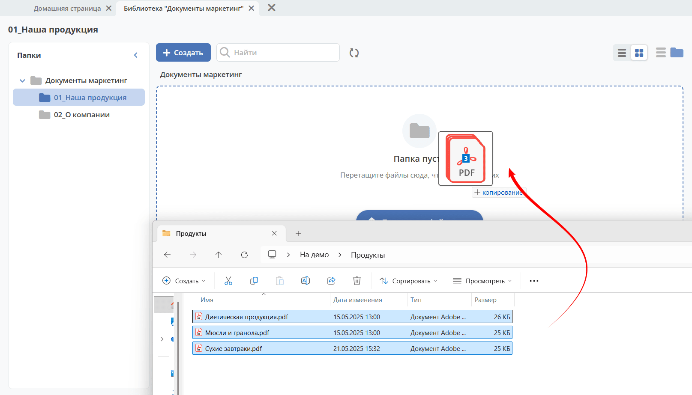

Прогресс загрузки вы увидите в правом нижнем углу:

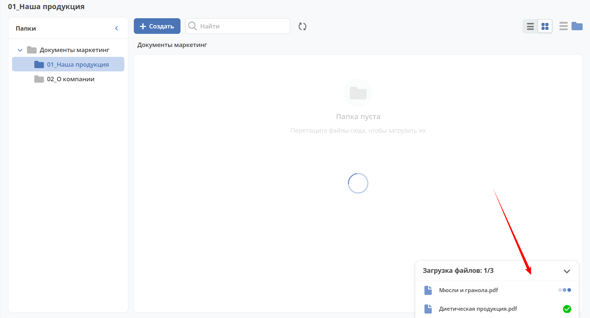

Если название файла или папки уже занято, вы увидите предупреждение:

.. list-table::
   :widths: 20 20
   :align: center

   * - |

         .. image:: _static/doclib/validation_name_01.png
            :width: 300
            :align: center

     - |

         .. image:: _static/doclib/validation_name_02.png
            :width: 300
            :align: center

Вы также можете загрузить целую папку вместе с файлами внутри неё.

**2. С использованием кнопки:**

По кнопке **+ Создать** доступно добавление файлов и папок, а также создание новых документов:

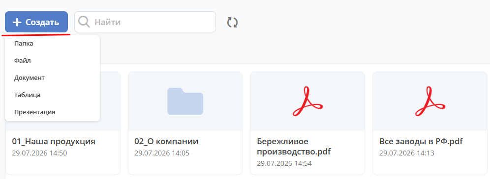

Выберите тип файла **OnlyOffice (Документ, Таблица, Презентация)** и укажите название:

В OnlyOffice создаётся новый файл для совместной работы — над документом могут работать несколько пользователей одновременно:

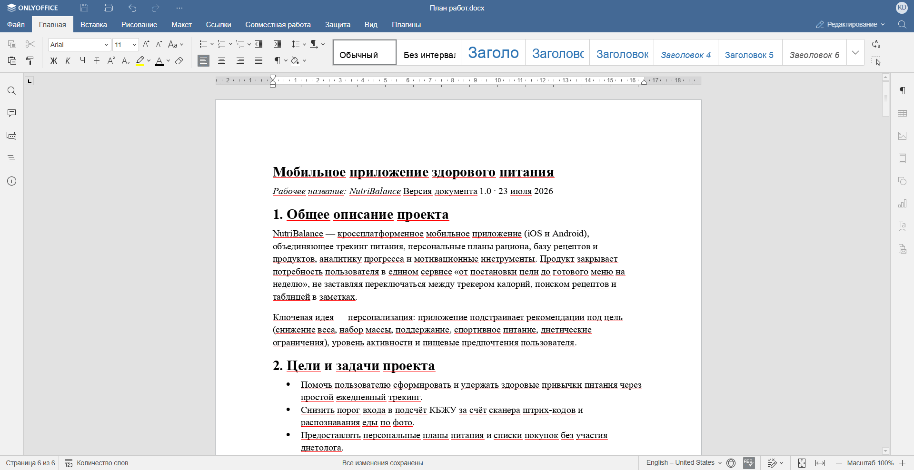

При загрузке файла введите название, которое будет отображаться в библиотеке, и выберите или перетащите сам файл:

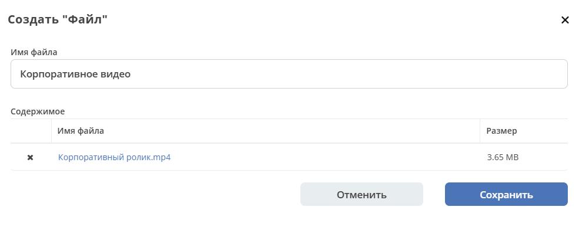

Чтобы создать папку, укажите её название:

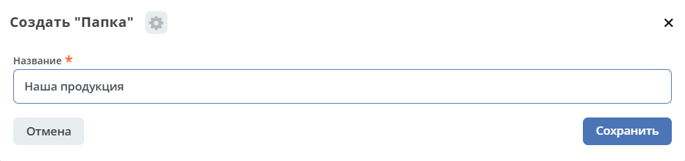

Перемещение файлов и папок
~~~~~~~~~~~~~~~~~~~~~~~~~~~~~~~~~~

Выберите файлы или папки, используя мышь и кнопки shift или ctrl, затем выберите папку назначения:

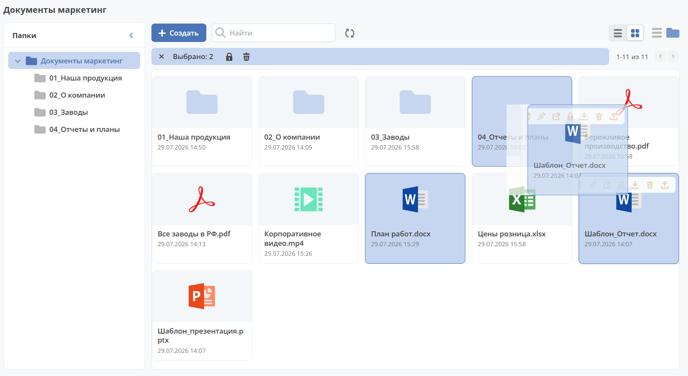

Групповые действия с файлами и папками
~~~~~~~~~~~~~~~~~~~~~~~~~~~~~~~~~~~~~~~

Так же, как и при перемещении, выберите файлы или папки с помощью мыши и кнопок shift или ctrl. Для выполнения действий с выбранными элементами используйте кнопки **(1)**:

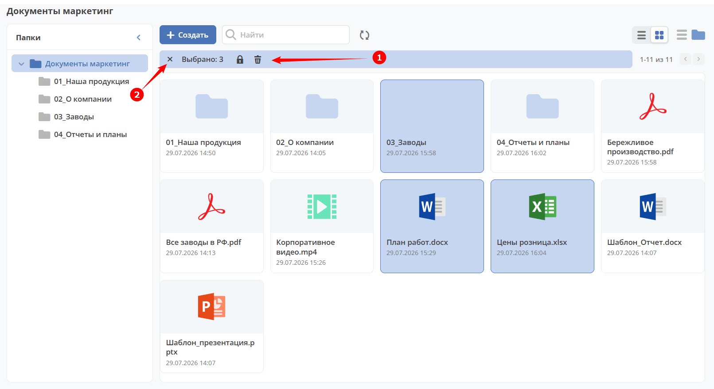

Чтобы снять выделение, нажмите **(2)**.

Карточка файла
----------------

Карточка состоит из виджетов:

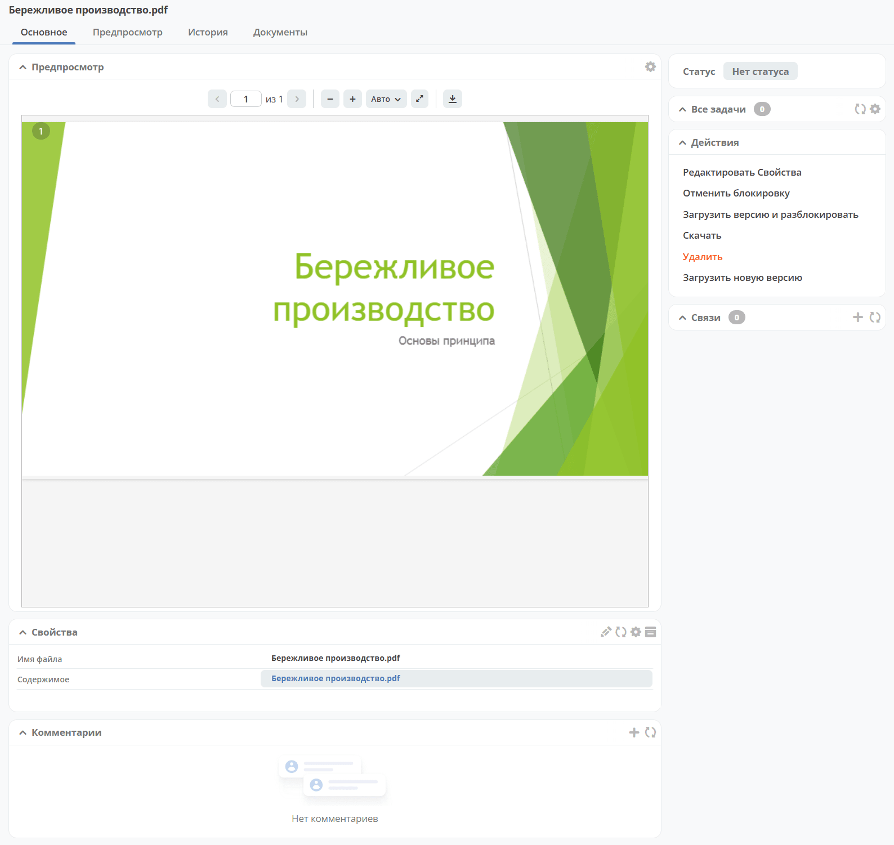

Подробно о :ref:`виджетах <widgets>`.

Создание библиотеки документов
---------------------------------

.. _new_document_library:

1. Создайте новый :ref:`тип данных <data_types_main>`.
2. Удалите **Форму по умолчанию** **(1)**.
3. На вкладке **«Основное»** укажите **id** и **Имя** **(2)**.
4. В качестве родителя выберите **«Файл библиотеки документов»** **(3)**.
5. Установите чекбокс **«Наследовать форму»** **(4)**.

В созданный тип автоматически добавятся действия и форма.

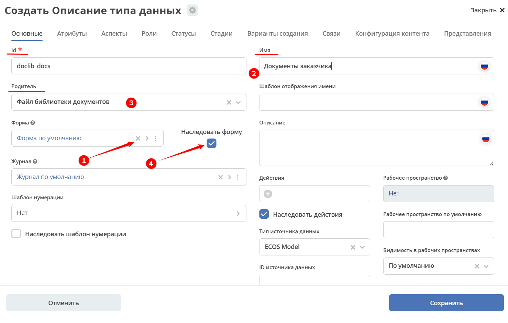

.. dropdown:: Кастомная форма библиотеки документов. Компонент File component
   :color: secondary

   На стандартной форме doclib-file эти параметры уже настроены для корректной загрузки файлов. Если вы используете :ref:`кастомную форму <auto_form_change>`, перенесите в неё те же настройки — обязательность поля с контентом и максимальный размер файла.

   .. image:: _static/doclib/DocLib_13.png
      :width: 600
      :align: center

   .. list-table::
      :widths: 20 20
      :align: center

      * - |

            .. image:: _static/doclib/DocLib_13_2.png
               :width: 600
               :align: center

        - |

            .. image:: _static/doclib/DocLib_13_1.png
               :width: 600
               :align: center

6. Для добавления библиотеки документов в меню выбирайте специальный элемент **DocLib**:

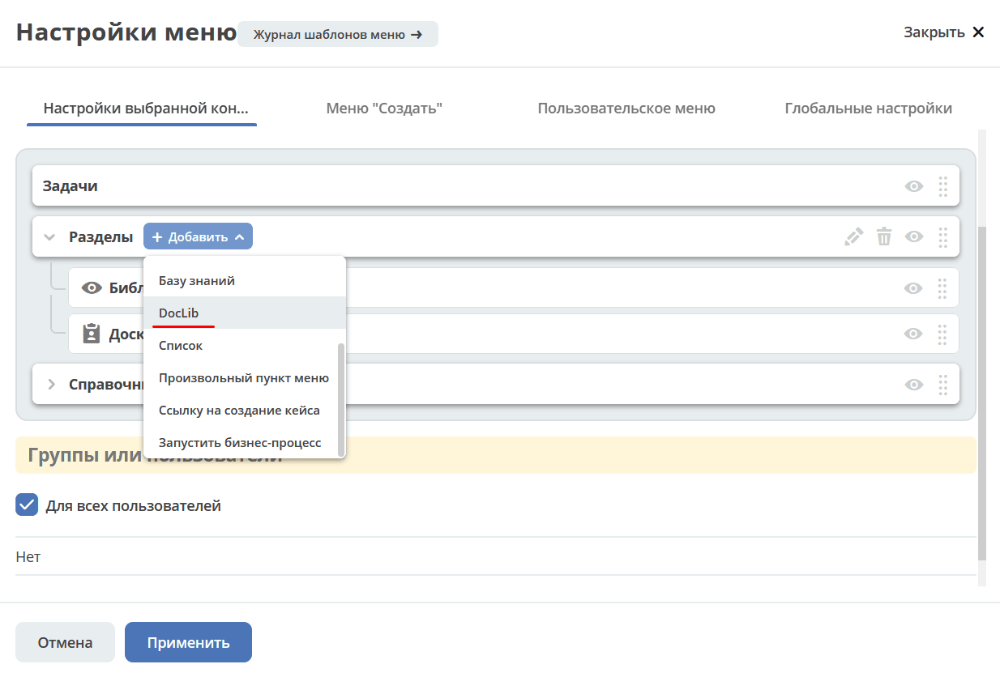

