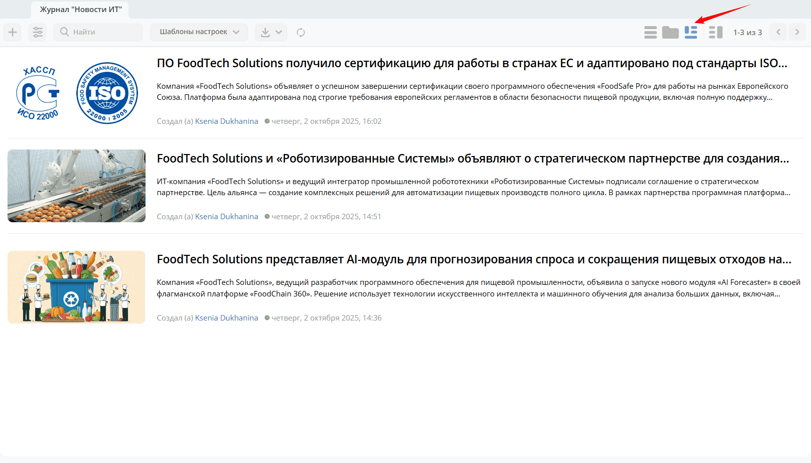
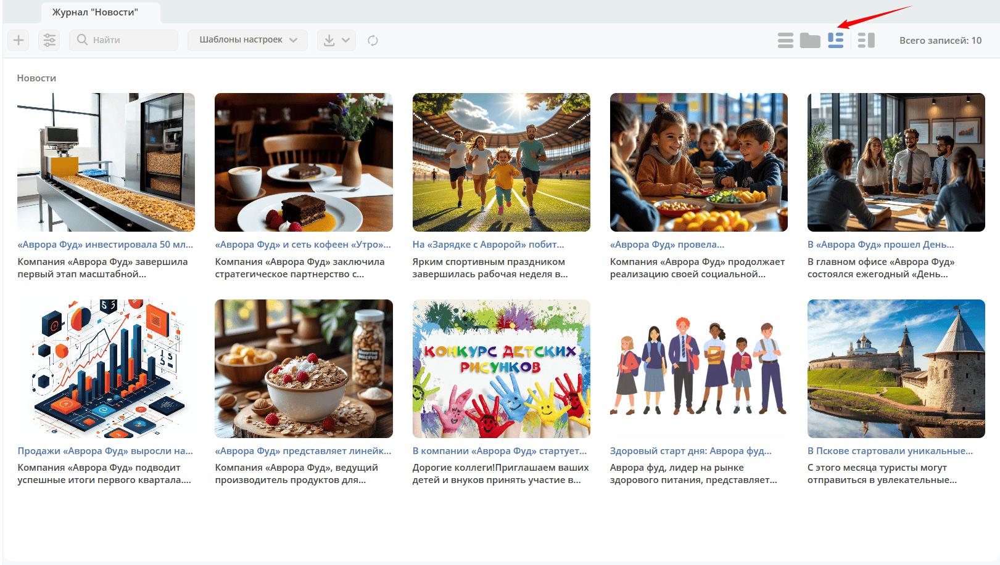
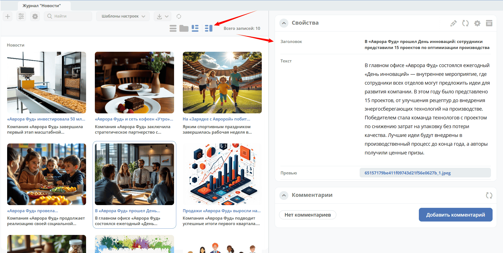
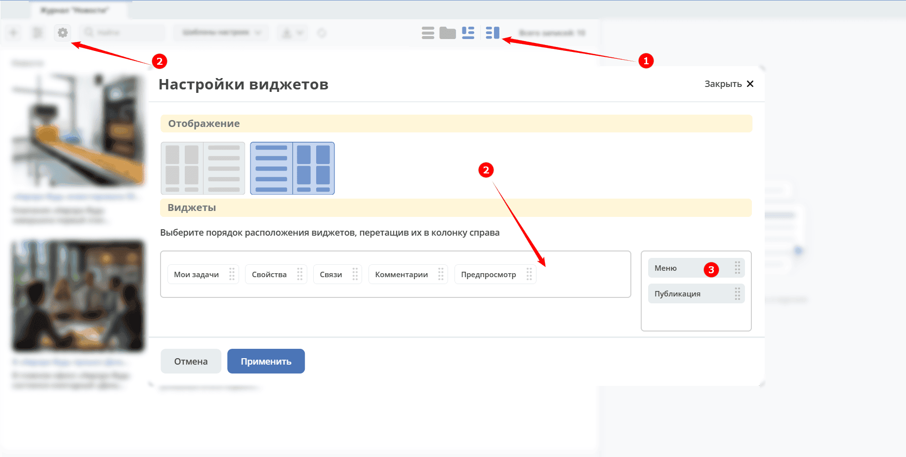
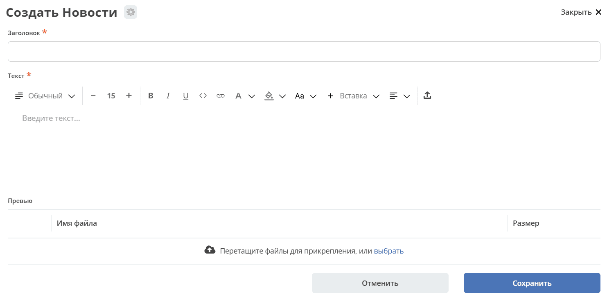
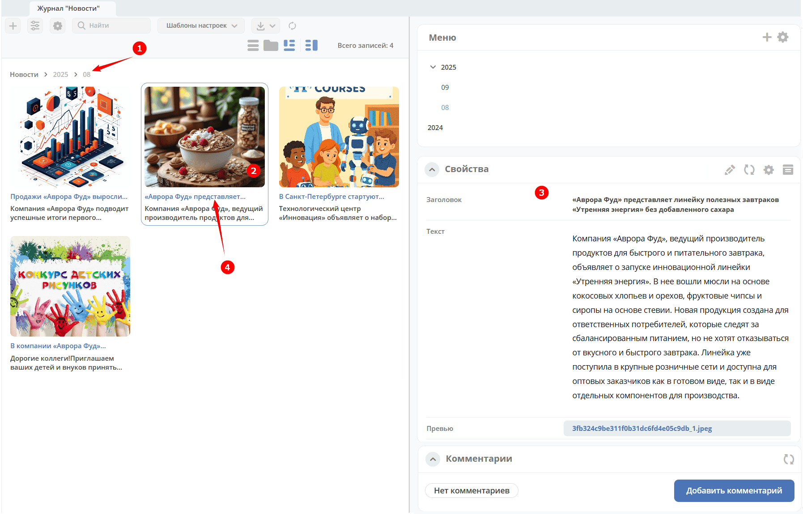
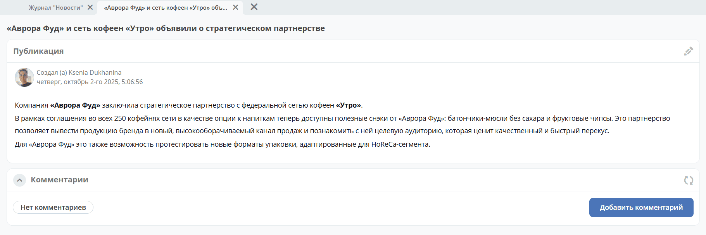
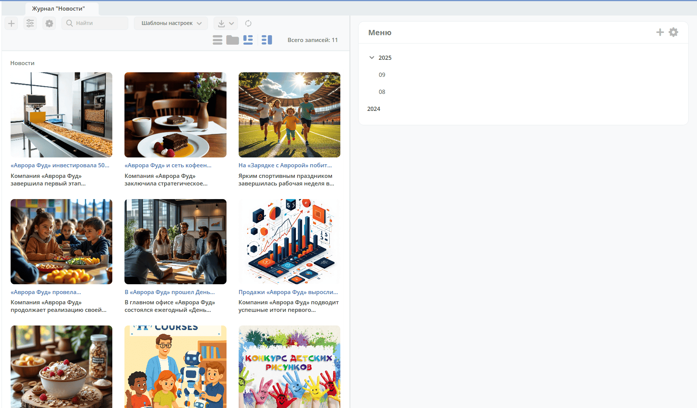

.. _tiles:

Представление данных в виде списка, плиток
==============================================================================

.. contents::
   :depth: 3

**Представление в виде списка и плиток** — альтернативные режимы отображения записей журнала, ориентированные на типы данных с визуальной составляющей: публикации, новости, статьи, каталоги изображений.

- **Список** — строчное отображение, где каждая запись занимает отдельную строку с изображением, заголовком и дополнительными полями.
- **Плитки** — блочное отображение, где каждая запись представлена карточкой с изображением-превью, заголовком и краткой информацией.

Оба режима поддерживают :ref:`предпросмотр <preview>` карточки. О настройке представлений для типа данных см. :ref:`подробно <datatypes_views>`.

Режим **список**:

Режим **плитки**:

В представлении доступен режим :ref:`предпросмотра <preview>`:

.. _tiles_categories:

Дерево категорий
--------------------------------

Виджет **Меню** позволяет организовать записи журнала в иерархическое дерево категорий. Это удобно для навигации по большим коллекциям — главный раздел содержит все записи, а категории выступают как фильтры.

Добавление виджета «Меню»
~~~~~~~~~~~~~~~~~~~~~~~~~~~~~~~~~~

Администратор в режиме предпросмотра **(1)** может помимо стандартных виджетов **(2)** добавить виджет **Меню** **(3)**:

Создание категорий
~~~~~~~~~~~~~~~~~~~~~~~~~~~~~~~~~~

**Виджет Меню** представляет собой дерево категорий.

1. Нажмите **Добавить**, чтобы создать первую категорию:

   .. image:: _static/tiles/tiles_menu_1.png
      :width: 700
      :align: center

2. Для добавления категории 1-го уровня нажмите большой **+** **(1)**. Для добавления подкатегории нажмите маленький **+** **(2)**:

   .. image:: _static/tiles/tiles_menu_2.png
      :width: 700
      :align: center

3. Введите название:

   .. image:: _static/tiles/new.png
      :width: 500
      :align: center

Создание карточки в категории
~~~~~~~~~~~~~~~~~~~~~~~~~~~~~~~~~~

Для создания карточки в категории нажмите **+** **(3)**:

Созданная карточка будет доступна как в категории, так и в главном разделе.

Навигация
~~~~~~~~~~~~~~~~~~~~~~~~~~~~~~~~~~

Для удобства навигации в представлении есть хлебные крошки **(1)**:

- По клику на плитку **(2)** откроется её предпросмотр **(3)**.
- При клике на заголовок плитки **(4)** карточка откроется в отдельной вкладке.

Главный раздел и иерархия
~~~~~~~~~~~~~~~~~~~~~~~~~~~~~~~~~~

.. note::

   Главный раздел (в данном случае «Новости») содержит все записи, а иерархия категорий выступает как фильтр.

Перемещение карточки в другой раздел
~~~~~~~~~~~~~~~~~~~~~~~~~~~~~~~~~~~~~~~~

.. tab-set::

   .. tab-item:: Перетаскивание

      Выберите плитку и перетащите её в необходимый раздел:

      .. image:: _static/tiles/change_dd.png
         :width: 700
         :align: center

   .. tab-item:: Через выбор раздела

      Выберите плитку **(1)** и укажите раздел **(2)**:

      .. image:: _static/tiles/change.png
         :width: 700
         :align: center
