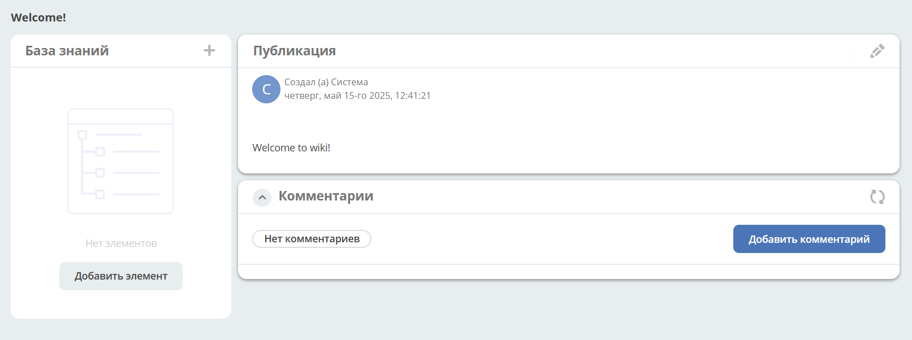

База знаний
==============

.. _wiki_base:

.. note:: 

    В меню персонального рабочего пространства нельзя добавить базу знаний.

Перейдите в журнал **"База знаний"**:

.. image:: _static/wiki/wiki_1.png
       :width: 700
       :align: center

Для добавления статьи или раздела 1-го уровня нажмите большой **+** **(1)**, с использованием :ref:`редактора<wysiwyg_editor>` создайте контент, сохраните. Для добавления публикации или подраздела  нажмите маленький **+** **(2)**. Количество создаваемых публикаций в каждом уровне не ограничено.

.. image:: _static/wiki/wiki_2.png
       :width: 600
       :align: center

Добавленная статья в структуре:

.. image:: _static/wiki/wiki_3.png
       :width: 600
       :align: center

Создание типа База знаний
---------------------------

**TBD**

Созданная пустая база знаний:

