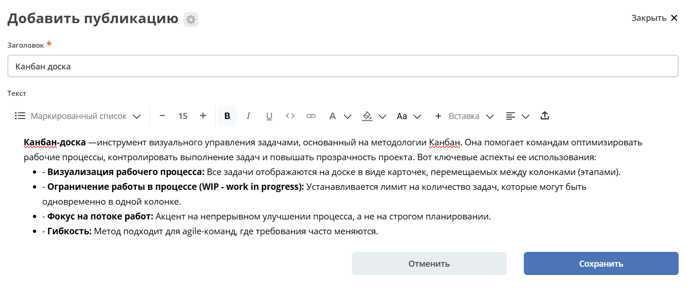
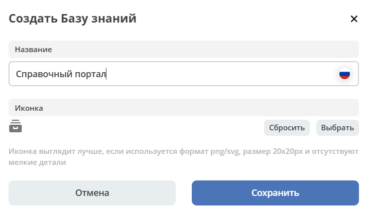

База знаний
==============

.. _wiki_base:

.. note:: 

    В меню персонального рабочего пространства нельзя добавить базу знаний.

    Создание, редактирование, удаление публикаций доступно **администратору** и пользователю с ролью **"Менеджер"** рабочего пространства, в котором виджет размещен.

Перейдите в журнал **"База знаний"**:

.. image:: _static/wiki/wiki_1.png
       :width: 700
       :align: center

База знаний состоит из 3 виджетов:

- **а:** :ref:`Иерархия<widget_knowledge_base>`,
- **b:** :ref:`Публикация<widget_publication>`, 
- **c:** :ref:`Комментарии<widget_comments>`

Для добавления статьи или раздела 1-го уровня нажмите большой **+** **(1)**, с использованием :ref:`редактора<wysiwyg_editor>` создайте контент, сохраните. Для добавления публикации или подраздела  нажмите маленький **+** **(2)**. Количество создаваемых публикаций в каждом уровне не ограничено.

Созданная публикация становится активной и сразу отображается в правой части страницы.

Добавленная статья в структуре:

.. image:: _static/wiki/wiki_3.png
       :width: 700
       :align: center

Добавление базы знаний
---------------------------

Для добавления базы знаний в меню выбирайте специальный элемент **База знаний**:

Укажите название и выберите иконку:

Создается пустая база знаний:

.. image:: _static/wiki/wiki_new_2.png
       :width: 600
       :align: center