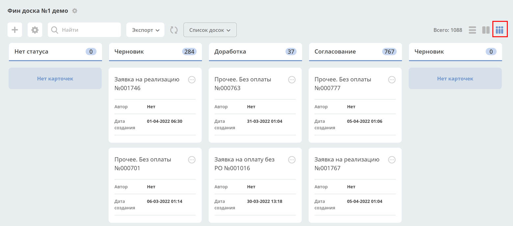

================
**Канбан-доска**
================

**Канбан-доска** - это представление данных системы выбранного типа данных.
В колонках доски отображаются статусы выбранного типа, а на самой доске - созданные экземпляры
этого типа на основе примененного фильтра.

Канбан-доска является дополнительным представлением журнала.

У журнала может быть несколько сконфигурированных канбан-досок – для их просмотра необходимо нажать **Список досок**.

Фильтры, примененные в журнале, применяются и на канбан-доске, и наоборот.

Конфигурация
------------------

Журнал с конфигурациями: 
**Инструменты → Конфигурация UI → Канбан доски**

.. image:: _static/kanban/KB2.png
       :width: 600
       :align: center
       :alt: Журнал Канбан доски

Действия
~~~~~~~~~~~~~~~~~~
Возможные действия с доской:

* скачать yaml

* удалить доску

* редактировать свойства доски. Открывается форма аналогичная созданию.

* редактор json. Отрывается редактор, в котором можно вносить изменения:

  .. image:: _static/kanban/KB3.png
       :width: 600
       :align: center
       :alt: Журнал Канбан доски

* копировать. 

Форма создания
~~~~~~~~~~~~~~~~~~

**+ → Создать конфигурацию канбан-доски**

 .. image:: _static/kanban/KB4.png
       :width: 600
       :align: center
       :alt: Форма создания

.. list-table:: Поля формы
      :widths: 5 40 5
      :header-rows: 1

      * - Поле
        - Описание
        - Номер
      * - **Идентификатор доски**
        - Генерируется автоматически. 
        - 
      * - **Имя канбан-доски**
        - | Отображаемое имя доски. Отображается в списке канбан-досок, и как title страницы. Укажите вручную. 
          | Может быть пустым.
        - 2
      * - **Возможно ли перемещать сущности между статусами**
        - | Использование drag’n’drop при перемещении между статусами. 
          | **Внимание!** Перемещение не означает изменение бизнес-процесса.
        - 7
      * - **Тип**
        - | Тип сущности, который необходимо отражать на доске. Выбор осуществляется из списка всех уже созданных типов. 
          | Может быть выбрано только 1 значение. 
          | В соответствии с типом в колонках можно выбирать связанные с ним статусы.
        - 5
      * - **Журнал**
        - | Журнал для типа данных. 
          | Для какого журнала создается представление канбан-доска. 
          | Выбор осуществляется из списка всех уже созданных журналов. Может быть выбрано только 1 значение.
        - 1
      * - **Форма**
        - | Форма карточки для отображения сущности. 
          | Выбор осуществляется из списка всех уже созданных типов. Может быть выбрано только 1 значение. 
          | Если форму не выбирать, то на канбан-доске будет отображение сущности по умолчанию со следующими данными: 
          | Автор; Дата создания.
        - 4
      * - **Действия**
        - | UI действия над сущностью на доске. Выбор осуществляется из списка всех уже созданных действий. 
          | Может быть выбрано несколько значений.
        - 6
      * - **Колонки**
        - Конфигурация колонок
        - 3

Соответствие полей конфигурации и UI:

 .. image:: _static/kanban/KB5.png
       :width: 600
       :align: center
       :alt: Поля UI

Конфигурация колонок
~~~~~~~~~~~~~~~~~~~~~~~~~

Выберите статус. Статусы в выпадающем списке указаны в соответствии с выбранным **типом сущности**.
Выбранный статус будет автоматически указан в колонке **«Системное имя»**.

 .. image:: _static/kanban/KB6.png
       :width: 600
       :align: center
       :alt: Колонки

В **«Название колонки»** укажите название, которое будет отображаться на канбан-доске.

 .. image:: _static/kanban/KB7.png
       :width: 600
       :align: center
       :alt: Колонки заполненные

Заполненная конфигурация
-------------------------

 .. image:: _static/kanban/KB8.png
       :width: 600
       :align: center
       :alt: Заполненная конфигурация