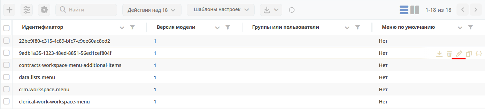

.. _menu:

Меню
=====

.. contents:: Содержание
   :depth: 7

Зависимости настроек
--------------------

.. important::

 На отображение влияют настройки:
 
 * **Интерфейс основного меню (Журнал Конфигурация)** - глобальная настройка, для всего приложения и всех пользователей.
 * **Приоритеты групп (Настройки меню > Глобальная настройка)** - глобальная настройка для всех конфигураций и пользователей.
 * **Группы или пользователи (Настройки меню > Текущая конфигурация)** - принадлежность одной конфигурации меню.
 * **Доступность раздела (Настройки меню > Настройки конфигурации > Элементы меню > Раздел)** - принадлежность одного раздела пользователям.
 * **Рабочие пространства** с релиза 2025.1.2

Выбор меню для пользователя
~~~~~~~~~~~~~~~~~~~~~~~~~~~~~~

Ищем среди всех конфигураций меню кроме дефолтных:

 1. Ищем **персональную конфигурацию** для пользователя (в authorities указан конкретный пользователь). Если нашлось несколько вариантов, то возвращаем любую.
 2. Берем **группы пользователя**, сортируем их в соответствии с конфигурацией **menu-group-priority** и ищем первую подходящую конфигурацию. Если для одной группы нашлось несколько, то берем любую.

Если п.1 и п.2 не дали результата, то возвращаем **default-menu-v1**.

После введения рабочих пространств (workspace) логика обновилась (:ref:`релиз 2025.1.2<citeck_releases>`):

 - Если **workspace default** или **отсутствует** (рабочие области выключены), то логика старая (см. выше) -  ищем только конфигурации без workspace.
 - Если **workspace есть** и **не default**, то ищем среди всех конфигураций меню кроме дефолтных:

   1. Ищем **персональную конфигурацию** для пользователя в текущем workspace (в authorities указан конкретный пользователь). Если нашлось несколько вариантов, то возвращаем любую.
   2. Берем **группы пользователя,** сортируем их в соответствии с конфигурацией **menu-group-priority** и ищем первую подходящую конфигурацию в текущем workspace. Если для одной группы нашлось несколько, то берем любую.

   Если п.1 и п.2 не дали результата:

   3. Если **workspace пользовательский**, то возвращаем **default-personal-ws-menu**.
   4. Если **workspace не пользовательский**, то возвращаем **default-ws-menu**.

Настройка меню
~~~~~~~~~~~~~~~

Основной подход к кастомизации меню под проект/ модуль - создание нового меню. Конфигурации по умолчанию имеют наименьший приоритет и не применяются, если есть другие подходящие варианты 

Журнал Конфигурация
~~~~~~~~~~~~~~~~~~~~

В журнале для настройки **Интерфейса основного меню** (main-menu-type) устанавливается какой **вариант** (версия) меню будет использоваться в системе.

.. image:: _static/menu/menu1.png
       :width: 800
       :align: center

где **left-v1** - первая версия конфигурации левого меню (поддерживается просмотр и редактирование).

Журнал Меню
~~~~~~~~~~~~~

В журнале перечислены все конфигурации разных версий.

.. image:: _static/menu/menu2.png
       :width: 800
       :align: center

Версия конфигурации меню
~~~~~~~~~~~~~~~~~~~~~~~~~

В конфигурации меню есть поле **Версия модели**, которое определяет версию модели. Актуальный список версий:

 - **0** - устаревший xml формат конфигурации
 - **1** - актуальный json формат конфигурации 

Дефолтные конфигурации меню
~~~~~~~~~~~~~~~~~~~~~~~~~~~~~

1. **default-tasks** содержит все пункты из раздела "Задачи" в дефолтном меню, включая сам раздел.
2. **default-data-lists** содержит все пункты из раздела "Справочники" в дефолтном меню включая сам раздел.
3. **default-personal-ws-menu** содержит задачи (default-tasks) через пункт INCLUDE_MENU и раздел "Разделы", куда добавлена ссылка на doclib с типом workspace-file и ссылка на канбан доску kanban-task.
4. **default-ws-menu** содержит задачи (default-tasks) через пункт INCLUDE_MENU и раздел "Разделы", куда добавлена ссылка на doclib с типом workspace-file и ссылка на канбан доску kanban-task.

Доступность действий в журнале
~~~~~~~~~~~~~~~~~~~~~~~~~~~~~~~~~

 - **default** - конфигурации меню по умолчанию
 - **user** - конфигурация для Группы или пользователей

.. table::
       
       +----------------------------+---------+------+
       | **Действия**               | default | user |
       +============================+=========+======+
       | **Редактировать**          | ``-``   | ``+``|
       +----------------------------+---------+------+
       | **Удалить**                | ``-``   | ``+``|
       +----------------------------+---------+------+
       | **Копировать**             | ``+``   | ``+``|
       +----------------------------+---------+------+
       | **Редактировать JSON**     | ``+``   | ``+``|
       +----------------------------+---------+------+
       | **Скачать**                | ``+``   | ``+``|
       +----------------------------+---------+------+

Настройка меню
--------------

Способы открытия
~~~~~~~~~~~~~~~~

- Через шапку сайта иконка "Шестеренка" > :guilabel:`Настроить меню`.

.. image:: _static/menu/Menu_configuration.png
       :width: 400
       :align: center

|

.. note:: 
       При использовании данного способа в окно настроек загружается конфигурация меню используемая на данный момент в интерфейсе. То есть в основном для настройки административного меню. 

- Через журнал **Конфигурация UI** - **Меню** действие *Редактировать*

Окно настроек
~~~~~~~~~~~~~~

Настройки содержат четыре вкладки:

#. **Настройки выбранной конфигурации** - описывает состояние отображаемого меню (элементы меню, версия, принадлежность и т.д.).
#. **Меню "Создать"** - для редактирования пунктов меню, доступных по нажатию на кнопку :guilabel:`Создать`
#. **Пользовательское меню** - для редактирования пунктов меню, доступных по нажатию на имя пользователя в правом верхнем углу.
#. **Глобальные настройки** - те настройки, что влияют на всю систему и всех пользователей (приоритеты).

Обзор режима редактирования
~~~~~~~~~~~~~~~~~~~~~~~~~~~~

.. tabs::

   .. tab:: Вкладка "Настройки выбранной конфигурации"   

       .. image:: _static/menu/Menu_edit_mode_1.png
              :width: 600
              :align: center

   .. tab:: Вкладка "Меню "Создать"   	

       .. image:: _static/menu/Menu_edit_mode_2.png
              :width: 600
              :align: center

   .. tab:: Вкладка "Пользовательское меню"  	

       .. image:: _static/menu/Menu_edit_mode_3.png
              :width: 600
              :align: center

   .. tab:: Вкладка "Глобальные настройки" 	

       .. image:: _static/menu/Menu_edit_mode_4.png
              :width: 600
              :align: center

Редактирование
~~~~~~~~~~~~~~~

.. important::

       Настройки на вкладке "Настройки выбранной конфигурации (Меню Левое)"" и "Меню Создать" хранятся вместе. То есть на меню Создать влияют те же правила что и на Левое меню.
       
       **А** - создаются автоматически системой

Вкладка "Настройки выбранной конфигурации" 
"""""""""""""""""""""""""""""""""""""""""""
 
Элементы меню
**************

Возможные типы пунктов и их доступность на каждом уровне:

.. table::

	+------------------------------+---------+---------+---------+--------+
	| Тип/Уровень                  |  1      | 2       | 3       | 4      |
	|                              |         |         |         |        |
	+==============================+=========+=========+=========+========+
	| **Раздел**                   |  ``+``  |   ``+`` |   ``А`` |        |
	+------------------------------+---------+---------+---------+--------+
	| **Разделяющий заголовок**    |         |   ``+`` |         |        |
	+------------------------------+---------+---------+---------+--------+
	| **Журнал**                   |         |   ``+`` |   ``+`` |  ``А`` |
	+------------------------------+---------+---------+---------+--------+
	| **Канбан-доска**             |         |   ``+`` |   ``+`` |        |
	+------------------------------+---------+---------+---------+--------+
	| **Дашборд**                  |         |   ``+`` |   ``+`` |        |
	+------------------------------+---------+---------+---------+--------+
	| **DocLib**                   |         |   ``+`` |   ``+`` |        |
	+------------------------------+---------+---------+---------+--------+
	| **Произвольный пункт меню**  |         |   ``+`` |   ``+`` |        |
	+------------------------------+---------+---------+---------+--------+
	| **Ссылка на создание кейса** |         |   ``+`` |   ``+`` |  ``А`` |
	+------------------------------+---------+---------+---------+--------+
	| **Запустить бизнес-процесс** |         |   ``+`` |   ``+`` |  ``А`` |
	+------------------------------+---------+---------+---------+--------+

Если добавлен пункт **Ссылка на создание кейса** и в результате есть возможность создавать несколькими способами в левом отобразится раздел с вариантами создания.

.. image:: _static/menu/Menu_auto_point.png
       :width: 300
       :align: center

Доступность дополнительных характеристик:

.. list-table:: 
      :widths: 10 10 10 10
      :header-rows: 1
      :class: tight-table  

      * - Тип/Уровень
        - 1
        - 2
        - 3
      * - **Раздел**
        - Без названия 
        - Иконка
        - Счетчик
      * - **Разделяющий заголовок**
        -  
        - 
        - 
      * - **Журнал** 
        -  
        - Счетчик, Иконка
        - Счетчик
      * - **Канбан-доску** 
        -  
        - Иконка 
        - Счетчик
      * - **Дашборд** 
        -  
        - Иконка 
        - Счетчик
      * - **DocLib** 
        -  
        - Иконка 
        - Счетчик
      * - **Произвольный пункт меню** 
        -  
        - Иконка 
        - 
      * - **Ссылка на создание кейса** 
        -  
        - Иконка 
        - 
      * - **Запустить бизнес-процесс** 
        -  
        - Иконка 
        - 

Подробнее о некоторых типах:

.. _menu_element_types:

.. tabs::

   .. tab:: Раздел  
   
       .. image:: _static/menu/Section.png
              :width: 400
              :align: center

       **Скрывать название** - доступно только на головном уровне. В меню подпункты отображаются вне группы, но вместе. 

       **Доступно для** - возможность ограничить доступ к разделу пользователям, которым доступны остальные пункты меню. 

   .. tab:: Разделяющий заголовок  	

       .. image:: _static/menu/Chapter_divide.png
              :width: 400
              :align: center

   .. tab:: Журнал

       Добавление пунктов осуществляется выбором элементов из журнала. Редактирование не доступно, только удаление. Необходимые сведения поступают из конфигурации элемента.
       Можно добавлять сразу несколько выбранных значений.

       .. image:: _static/menu/type_data.png
              :width: 600
              :align: center

   .. tab:: Канбан доска

       Добавление пунктов осуществляется выбором элементов из журнала :ref:`канбан досок<kanban_board>`:

       .. image:: _static/menu/kanban.png
              :width: 600
              :align: center

       Обратите внимание, что к выбору доступны те канбан-доски, в настройках которой указан журнал.

   .. tab:: Дашборд

       Добавление нового пустого :ref:`дашборда<dashboard>`. Укажите его имя и сохраните.

       .. image:: _static/menu/dashboard.png
              :width: 400
              :align: center

       Далее перейдите из меню в созданный дашборд и нажмите **«Настроить»**. 

       .. image:: _static/menu/dashboard_1.png
              :width: 600
              :align: center

       Как настроить см. :ref:`настройки дашборда<dashboard_settings>`. Для добавления к дашборду доступны следующие виджеты:

       - Журнал;
       - Веб-страница;
       - Дни рождения;
       - Графическая статистика.

   .. tab:: DocLib

       Добавление пунктов осуществляется выбором элементов из журнала, в котором представлены созданные :ref:`библиотеки документов<document_library>`: 

       .. image:: _static/menu/doclib.png
              :width: 600
              :align: center

   .. tab:: Произвольный пункт меню
  
       **Ссылка** - В зависимости от значения на выходе формируется соответствующий путь перехода. Под описанием поле выводится результат формируемой ссылки.

       .. note::

              Подробнее про `Абсолютные и относительные ссылки <https://htmlacademy.ru/blog/boost/frontend/links>`_.

       **Абсолютный URL** - если указан полный путь. Ссылка будет открываться в новой вкладке браузера.

       .. image:: _static/menu/Menu_url_absolut.png
              :width: 400
              :align: center

       **Относительный URL. Варианты формирования:**

       - Если значение начинается с “ / ” , то итоговая ссылка формируется как **хост** + **значение**.
       
       .. image:: _static/menu/Menu_url_relative.png
              :width: 400
              :align: center

       - Если значение **не** начинается  с “ / ”, то итоговая ссылка формируется как **текущая ссылка в адресной строке** + **значение**.

       .. warning::  
              
              Может привести к не ожидаемому результату.

       .. image:: _static/menu/Menu_url_relative2.png
              :width: 400
              :align: center

   .. tab:: Ссылка на создание кейса

       **Ссылка на создание кейса** в настройке выбирается тип данных, но в самом меню используются сами варианты создания записей этого типа данных. Варианты создания настраиваются в самом типе данных на вкладке **Варианты создания**.

       .. image:: _static/menu/menu_case.png
              :width: 400
              :align: center

   .. tab:: Запустить бизнес-процесс

       .. image:: _static/menu/menu_process.png
              :width: 400
              :align: center

       **Запустить бизнес-процесс** в настройке выбирается процесс BPMN. В самом меню используется форма запуска бизнес-процесса, определенная при его настройках.

Секция "Группы и пользователи"
*******************************

Выбор групп и пользователей, которым будет назначено редактируемое меню:

* **Пользователь** имеет наивысший приоритет. Так же стоит учесть зависимости других настроек. 
* Если на пользователя/группу назначено несколько конфигураций, это может привести к неопределенному результату и появится не то меню, что ожидалось.
* Установленные группы попадают в *приоритет групп*, по умолчанию в конец списка. 

Вкладка "Меню "Создать"
"""""""""""""""""""""""

**Возможные типы пунктов и их доступность на каждом уровне:**

.. table::

	+-------------------------------------+---------+---------+---------+--------+
	| Тип/Уровень                         |  1      | 2       | 3       | 4      |
	|                                     |         |         |         |        |
	+=====================================+=========+=========+=========+========+
	| **Раздел**                          |  ``+``  |   ``+`` |   ``А`` |        |
	+-------------------------------------+---------+---------+---------+--------+
	| **Варианты создания из раздела**    |  ``+``  |   ``+`` |   ``+`` |  ``А`` |
	+-------------------------------------+---------+---------+---------+--------+
	| **Произвольный пункт меню**         |  ``+``  |   ``+`` |   ``+`` |        |
	+-------------------------------------+---------+---------+---------+--------+
	| **Ссылка на создание кейса**        |  ``+``  |   ``+`` |   ``+`` |  ``А`` |
	+-------------------------------------+---------+---------+---------+--------+
	| **Запустить бизнес-процесс**        |  ``+``  |   ``+`` |   ``+`` |  ``А`` |
	+-------------------------------------+---------+---------+---------+--------+

**Доступность дополнительных характеристик:**

Не доступны только Счетчик и Иконка

**Подробнее о некоторых типах:**

Повторяющиеся типы из первой вкладки аналогичны.

**Варианты создания из раздела**

Выборка составляется на основе конфигурации Левого меню, содержит все пункты с типом **Раздел**. Представлены плоским списком, включая дочерние. 

.. image:: _static/menu/Variants_from_chapter.png
       :width: 400
       :align: center

После создания пункта в настройках отображается только имя раздела. 

В самом **"Меню Создать"** после применения настроек, пункт превращается в пункты - варианты создания (аналогичные типу **Ссылка на создание кейса**).
             
.. note::
       
       Т.е. данный тип заменяет ручное добавление пунктов с типом Ссылка на создание кейса, если необходимы все варианты из раздела.

Вкладка "Пользовательское меню"
""""""""""""""""""""""""""""""""

**Возможные типы пунктов:**

Для настройки доступны следующие пункты:

**Подробнее о некоторых типах:**

Тип **"Произвольный пункт меню"** аналогичен первой вкладке. 

Вкладка "Глобальные настройки"
""""""""""""""""""""""""""""""
.. note:: 
       
       Данные настройки относятся ко всей системе. 

Секция "Приоритеты групп"
**************************

* Список групп соответствует значениям групп, указанных во всех конфигурациях меню.
* Приоритет группы обратно пропорционален уровню иерархии группы в Оргструктуре или уровню функциональной иерархии. Чем специфичнее и уже группа пользователей, тем выше у нее приоритет.
* Группы администраторов, как правило, размещаются на первом месте. 
* Пользователь имеет наивысший приоритет (пользователи не отображаются в приоритетах).

**Как это работает**

В конфигурации меню указываются группы или пользователи для которых настраивается меню. Приоритет групп - настройка глобальная, исходя из ее настройки и указанных участников, возвращается соответствующее для пользователя меню.

.. image:: _static/menu/menu_groups_1.png
       :width: 600
       :align: center

**АП** - авторизованный пользователь

1. **АП** - tam42 и он указан в одной из конфигураций. Указание пользователя - наивысший приоритет => возвращается конфигурация №10. Пользователь не должен указываться в нескольких.

2. **АП** состоит в группе администраторов (и не указан на прямую в конфигурации). Настраиваем конфигурацию с указанием этой группы. В настройке приоритетов эта группа на первом месте. Результат - слева отображается меню №3

3. **АП** - главный клерк, состоит в  2х группах: клерки и главные клерки. Есть две конфигурации №2 и №6. В приоритетах главные клерки на 2 месте, другие на 3. Результат -  слева отображается меню №6. Для Не главных клерков №2.

4. Если для **АП** нет ни одного подходящего меню - загружается базовое (default)

Редактор иконок
---------------
.. image:: _static/menu/menu_icons.png
       :width: 300
       :align: center

На выбор пользователю предоставлен набор системных иконок. 
Если в наборе нет подходящей, есть возможность загрузить собственную, которая появится в блоке *Пользовательские*. Наилучший вариант формата иконки  - **svg**.

Иконка по умолчанию: 

.. image:: _static/menu/menu_icons_2.png
       :width: 300
       :align: center

Результат настроек
------------------

.. list-table:: 
      :widths: 5 40 40

      * - | **Меню Левое**
       

        - |  

            .. image:: _static/menu/Tab_1.png
                 :width: 400   

        - | 

             .. image:: _static/menu/Tab_1_1.png
                  :width: 250   

      * - | **Меню Создать**
       

        - |  

            .. image:: _static/menu/Tab_2.png
                 :width: 400   

        - | 

             .. image:: _static/menu/Tab_2_1.png
                  :width: 250  			  

      * - | **Пользовательское меню**
       

        - |  

            .. image:: _static/menu/Tab_3.png
                 :width: 400   

        - | 

             .. image:: _static/menu/Tab_3_1.png
                  :width: 250  	

Смежные настройки
-----------------

Логотип > :ref:`Темы интерфейса<interface_themes>`

Действия> :ref:`Типы действий<ui_actions>`

Решение возможных проблем
---------------------------

Несколько подсвеченных элементов меню
~~~~~~~~~~~~~~~~~~~~~~~~~~~~~~~~~~~~~~~

В меню должен быть подсвечен только активный (выбранный) журнал.

Но может быть ситуация, что при выборе одного элемента подсвечиваются несколько элементов меню сразу:

Такое происходит, если при конфигурации меню использовалось копирование ui-элементов без изменения их **id**. 

Логика у UI следующая - подсвечивается синим открытый в данный момент элемент. И если id задублированы, то все элементы с данным id будут подсвечены.

Поэтому необходимо следить за уникальностью id элементов, и если элементы копируются, то для получения уникальных id использовать онлайн генераторы:

