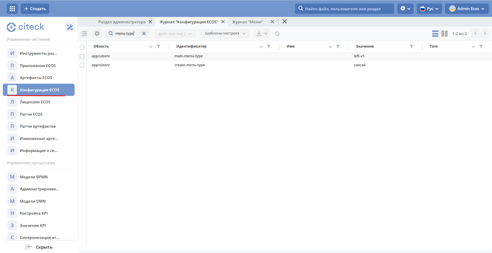
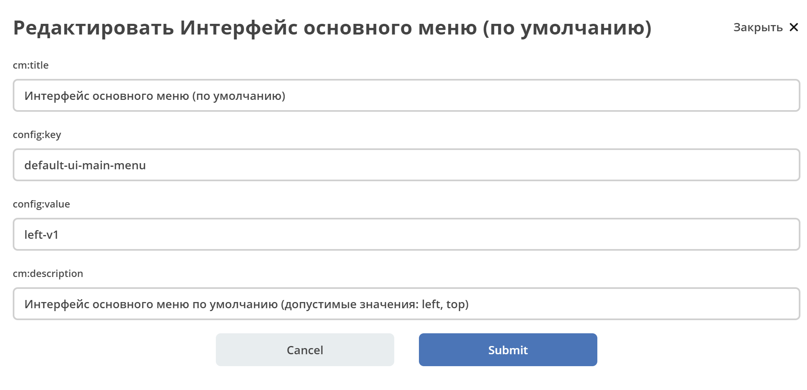
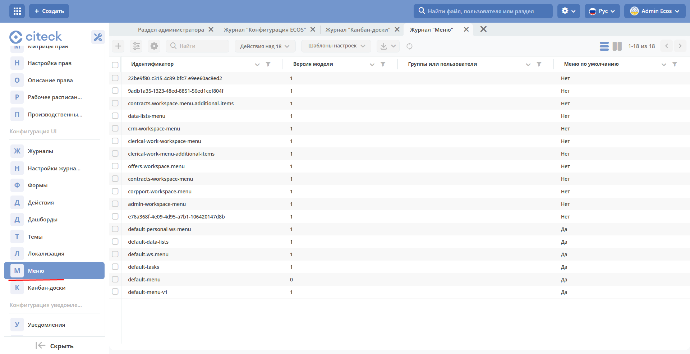
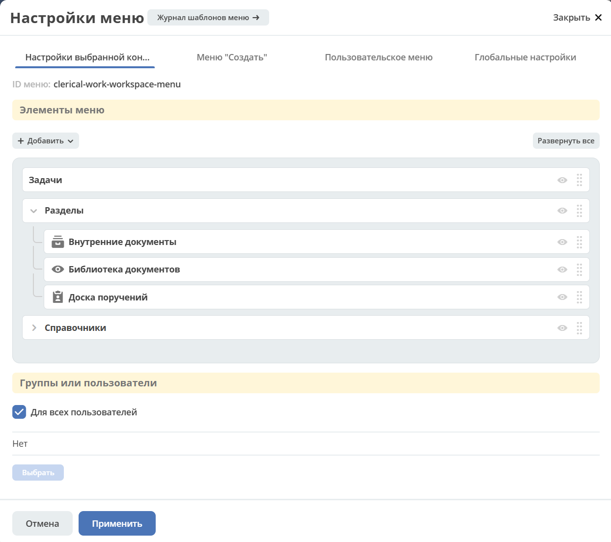
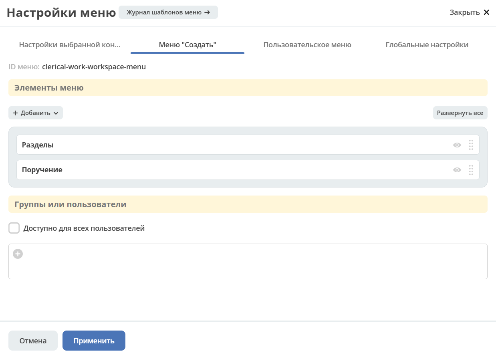
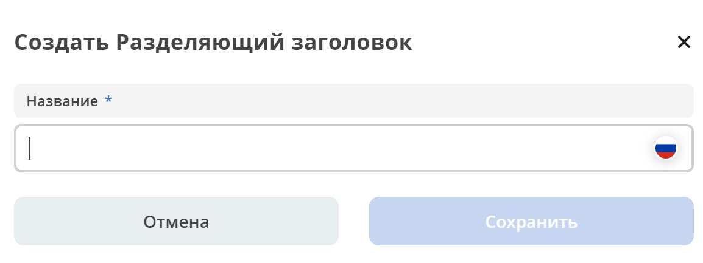
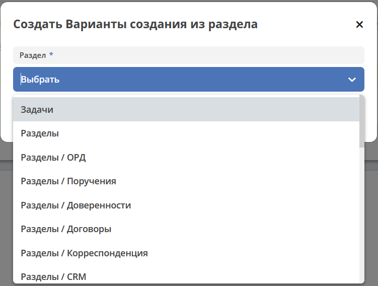

.. _menu:

Меню
=====

.. contents:: Содержание
   :depth: 5

Зависимости настроек
--------------------

.. important::

 На отображение влияют настройки:
 
 * **Интерфейс основного меню (Журнал Конфигурация)** - глобальная настройка, для всего приложения и всех пользователей.
 * **Приоритеты групп (Настройки меню > Глобальная настройка)** - глобальная настройка для всех конфигураций и пользователей.
 * **Группы или пользователи (Настройки меню > Текущая конфигурация)** - принадлежность одной конфигурации меню.
 * **Доступность раздела (Настройки меню > Настройки конфигурации > Элементы меню > Раздел)** - принадлежность одного раздела пользователям.

Настройка меню под проект
~~~~~~~~~~~~~~~~~~~~~~~~~

Основной подход к кастомизации меню под проект - это создание нового меню. Дефолтные конфигурации имеют наименьший приоритет и не применяются если есть другие подходящие варианты 

Журнал Конфигурация
~~~~~~~~~~~~~~~~~~~~

В журнале для настройки **Интерфейс основного меню** (default-ui-main-menu) устанавливается какой **вариант** (версия) меню будет использоваться в системе.

где **left-v1** - первая версия конфигурации левого меню (поддерживается просмотр и редактирование).

Журнал Меню
~~~~~~~~~~~~~

В журнале перечислены все конфигурации разных версий.

Версия конфигурации меню
~~~~~~~~~~~~~~~~~~~~~~~~~

В конфигурации меню есть поле **version**, которое определяет версию модели. Актуальный список версий:

 - 0 - устаревший xml формат конфигурации
 - 1 - актуальный json формат конфигурации 

Доступность действий в журнале
~~~~~~~~~~~~~~~~~~~~~~~~~~~~~~~~~

.. table::
       
       +----------------------------+---------+------+
       | **Действия**               | default | user |
       +============================+=========+======+
       | **Редактировать**          | ``-``   | ``+``|
       +----------------------------+---------+------+
       | **Удалить**                | ``-``   | ``+``|
       +----------------------------+---------+------+
       | **Копировать**             | ``+``   | ``+``|
       +----------------------------+---------+------+
       | **Просмотреть**            | ``+``   | ``+``|
       +----------------------------+---------+------+
       | **Скачать**                | ``+``   | ``+``|
       +----------------------------+---------+------+

Настройка меню
--------------

Способы открытия
~~~~~~~~~~~~~~~~

- Через шапку сайта иконка "Шестеренка" > :guilabel:`Настроить меню`.

.. image:: _static/menu/Menu_configuration.png
       :width: 300
       :align: center

|

.. note:: 
       При использовании данного способа в окно настроек загружается конфигурация меню используемая на данный момент в интерфейсе. То есть в основном для настройки административного меню. 

- Через журнал **Конфигурация UI** - **Меню** действие *Редактировать конфигурацию*

.. image:: _static/menu/Menu_configuration_2.png
       :width: 600
       :align: center

Окно настроек
~~~~~~~~~~~~~~

Настройки содержат четыре вкладки:

#. **Настройки выбранной конфигурации** - описывает состояние отображаемого меню (элементы меню, версия, принадлежность и т.д.).
#. **Меню "Создать"** - для редактирования пунктов меню, доступных по нажатию на кнопку :guilabel:`Создать`
#. **Пользовательское меню** - для редактирования пунктов меню, доступных по нажатию на имя пользователя в правом верхнем углу.
#. **Глобальные настройки** - то, что влияет на всю систему и всех пользователей (приоритеты).

Обзор режима редактирования
~~~~~~~~~~~~~~~~~~~~~~~~~~~~

**Вкладка "Настройки выбранной конфигурации":**

**Вкладка "Меню "Создать":**

**Вкладка "Пользовательское меню":**

**Вкладка "Пользовательское меню":**

Обзор режима просмотра
~~~~~~~~~~~~~~~~~~~~~~~
Действие доступно через журнал :guilabel:`Меню`. 

То же самое окно что при редактирования, но без элементов изменяющих представление. Например, вкладка **"Настройки выбранной конфигурации"**:

.. image:: _static/menu/Menu_view_mode1.png
       :width: 600
       :align: center

Редактирование
~~~~~~~~~~~~~~~

.. important::

       Настройки на вкладке "Настройки выбранной конфигурации (Меню Левое)"" и "Меню Создать" хранятся вместе. То есть на меню Создать влияют те же правила что и на Левое меню.
       
       **А** - создаются автоматически системой

Вкладка "Настройки выбранной конфигурации" (Меню Левое)
"""""""""""""""""""""""""""""""""""""""""""""""""""""""""
 
Секция "Элементы меню"
************************

**Возможные типы пунктов и их доступность на каждом уровне:**

.. table::

	+------------------------------+---------+---------+---------+--------+
	| Тип/Уровень                  |  1      | 2       | 3       | 4      |
	|                              |         |         |         |        |
	+==============================+=========+=========+=========+========+
	| **Раздел**                   |  ``+``  |   ``+`` |   ``А`` |        |
	+------------------------------+---------+---------+---------+--------+
	| **Разделяющий заголовок**    |         |   ``+`` |         |        |
	+------------------------------+---------+---------+---------+--------+
	| **Журнал**                   |         |   ``+`` |   ``+`` |  ``А`` |
	+------------------------------+---------+---------+---------+--------+
	| **Произвольный пункт меню**  |         |   ``+`` |   ``+`` |        |
	+------------------------------+---------+---------+---------+--------+
	| **Ссылка на создание кейса** |         |   ``+`` |   ``+`` |  ``А`` |
	+------------------------------+---------+---------+---------+--------+
	| **Запустить бизнес-процесс** |         |   ``+`` |   ``+`` |  ``А`` |
	+------------------------------+---------+---------+---------+--------+

Если добавлен пункт *Ссылка* на создание кейса и в результате есть возможность создавать несколькими способами в левом отобразится раздел с вариантами создания.

**Доступность дополнительных характеристик:**

.. table::

       	+------------------------------+----------------+------------------+---------+
	| Тип                          |  1             | 2                | 3       |
	|                              |                |                  |         |
	+==============================+================+==================+=========+
	| **Раздел**                   |  Без названия  | Иконка           |         |
	+------------------------------+----------------+------------------+---------+
	| **Разделяющий заголовок**    |                |                  |         |
	+------------------------------+----------------+------------------+---------+
	| **Журнал**                   |                | Счетчик, Иконка  | Счетчик |
	+------------------------------+----------------+------------------+---------+
	| **Произвольный пункт меню**  |                | Иконка           |         |
	+------------------------------+----------------+------------------+---------+
	| **Ссылка на создание кейса** |                | Иконка           |         |
	+------------------------------+----------------+------------------+---------+
	| **Запустить бизнес-процесс** |                | Иконка           |         |
	+------------------------------+----------------+------------------+---------+

       
**Подробнее о некоторых типах:**

**Раздел**

Скрыть название - доступно только на головном уровне. В меню подпункты отображаются вне группы, но вместе. 

Доступно для - возможность ограничить доступ к разделу пользователям, которым доступны остальные пункты меню. 

.. image:: _static/menu/Section.png
       :width: 400
       :align: center

**Разделяющий заголовок**

**Журнал**, **Ссылка на создание кейса**, **Запустить бизнес-процесс**

Добавление пунктов осуществляется выбором элементов из журнала. Редактирование не доступно, только удаление. Необходимые сведения поступают из конфигурации элемента.
Можно добавлять сразу несколько выбранных значений.

*Ссылка на создание кейса*, *Запустить бизнес-процесс* - в настройке выбирается журнал, но в самом меню используются сами варианты создания записей в этом журнале. Варианты создания настраиваются в журнале *Журналы* > Редактировать нужный журнал > вкладка на форме *Create Variants* 

.. warning:: 
       
       Для *Ссылка на создание кейса* если:

       - выбран журнал **Файл уведомления**, в меню отобразится пункт **Загрузить шаблон уведомления**;

       - выбран журнал **Форма**, в меню отобразится раздел Форма с пунктами **Создать форму** и **Загрузить форму**
            
                        .. image:: _static/menu/form.png
                            :width: 400
                            :align: center 

**Произвольный пункт меню**
  
*Ссылка* - В зависимости от значения на выходе формируется соответствующий путь перехода. Под описанием поле выводится результат формируемой ссылки.

.. note::

        Подробнее про `Абсолютные и относительные ссылки <https://htmlacademy.ru/blog/boost/frontend/links>`_.

**Абсолютный URL** - если указан полный путь. Ссылка будет открываться в новой вкладке браузера.

.. image:: _static/menu/Menu_url_absolut.png
       :width: 400
       :align: center

**Относительный URL. Варианты формирования:**

- Если значение начинается с “ / ” , то итоговая ссылка формируется как **хост** + **значение**.
  
.. image:: _static/menu/Menu_url_relative.png
       :width: 400
       :align: center

- Если значение **не** начинается  с “ / ”, то итоговая ссылка формируется как **текущая ссылка в адресной строке** + **значение**.

.. warning::  
       
       Может привести к не ожидаемому результату.

.. image:: _static/menu/Menu_url_relative2.png
       :width: 400
       :align: center

Секция "Группы и пользователи"
*******************************

Выбор групп и пользователей, которым будет назначено редактируемое меню:

* **Пользователь** имеет наивысший приоритет. Так же стоит учесть зависимости других настроек. 
* Если на пользователя/группу назначено несколько конфигураций, это может привести к неопределенному результату и появится не то меню, что ожидалось.
* Установленные группы попадают в *приоритет групп*, по умолчанию в конец списка. 

Вкладка "Меню "Создать"
"""""""""""""""""""""""

**Возможные типы пунктов и их доступность на каждом уровне:**

.. table::

	+-------------------------------------+---------+---------+---------+--------+
	| Тип/Уровень                         |  1      | 2       | 3       | 4      |
	|                                     |         |         |         |        |
	+=====================================+=========+=========+=========+========+
	| **Раздел**                          |  ``+``  |   ``+`` |   ``А`` |        |
	+-------------------------------------+---------+---------+---------+--------+
	| **Варианты создания из раздела**    |  ``+``  |   ``+`` |   ``+`` |  ``А`` |
	+-------------------------------------+---------+---------+---------+--------+
	| **Произвольный пункт меню**         |  ``+``  |   ``+`` |   ``+`` |        |
	+-------------------------------------+---------+---------+---------+--------+
	| **Ссылка на создание кейса**        |  ``+``  |   ``+`` |   ``+`` |  ``А`` |
	+-------------------------------------+---------+---------+---------+--------+
	| **Запустить бизнес-процесс**        |  ``+``  |   ``+`` |   ``+`` |  ``А`` |
	+-------------------------------------+---------+---------+---------+--------+

**Доступность дополнительных характеристик:**

Не доступны только Счетчик и Иконка

**Подробнее о некоторых типах:**

Повторяющиеся типы из первой вкладки аналогичны.

**Варианты создания из раздела**

Выборка составляется на основе конфигурации Левого меню, содержит все пункты с типом **Раздел**. Представлены плоским списком, включая дочерние. 

После создания пункта в настройках отображается только имя раздела. 

.. image:: _static/menu/Variants_from_chapter_1.png
       :width: 400
       :align: center

В самом **"Меню Создать"** после применения настроек, пункт превращается в пункты - варианты создания (аналогичные типу **Ссылка на создание кейса**):

             
.. note::
       
       Т.е. данный тип заменяет ручное добавление пунктов с типом Ссылка на создание кейса, если необходимы все варианты из раздела.

Вкладка "Пользовательское меню"
""""""""""""""""""""""""""""""""

Если меню не настроено:

.. image:: _static/menu/user_menu.png
       :width: 600
       :align: center

**Возможные типы пунктов:**

Для настройки доступны следующие пункты:

* Профиль пользователя
* Сменить статус
* Изменить пароль
* Обратная связь
* Сообщить о проблеме
* Выйти
* Произвольный пункт меню

**Подробнее о некоторых типах:**

Тип **"Произвольный пункт меню"** аналогичен первой вкладке. 

Вкладка "Глобальные настройки"
""""""""""""""""""""""""""""""
.. note:: 
       
       Данные настройки относятся ко всей системе. 

Секция "Приоритеты групп"
**************************

* Список групп соответствует значениям групп, указанных во всех конфигурациях меню.
* Приоритет группы обратно пропорционален уровню иерархии группы в Оргструктуре или уровню функциональной иерархии. Чем специфичнее и уже группа пользователей, тем выше у нее приоритет.
* Группы администраторов, как правило, размещаются на первом месте. 
* Пользователь имеет наивысший приоритет (пользователи не отображаются в приоритетах).

**Как это работает**

В конфигурации меню указываются группы или пользователи для которых настраивается меню. Приоритет групп - настройка глобальная, исходя из ее настройки и указанных участников, возвращается соответствующее для пользователя меню.

.. image:: _static/menu/menu_groups_1.png
       :width: 600
       :align: center

**АП** - авторизованный пользователь

1. **АП** - tam42 и он указан в одной из конфигураций. Указание пользователя - наивысший приоритет => возвращается конфигурация №10. Пользователь не должен указываться в нескольких.

2. **АП** состоит в группе администраторов (и не указан на прямую в конфигурации). Настраиваем конфигурацию с указанием этой группы. В настройке приоритетов эта группа на первом месте. Результат - слева отображается меню №3

3. **АП** - главный клерк, состоит в  2х группах: клерки и главные клерки. Есть две конфигурации №2 и №6. В приоритетах главные клерки на 2 месте, другие на 3. Результат -  слева отображается меню №6. Для Не главных клерков №2.

4. Если для **АП** нет ни одного подходящего меню - загружается базовое (default)

Редактор иконок
---------------

На выбор пользователю предоставлен набор системных иконок. 
Если в наборе нет подходящей, есть возможность загрузить собственную, которая появится в блоке *Пользовательские*. Наилучший вариант формата иконки  - **svg**.

Иконка по умолчанию: 

.. image:: _static/menu/menu_icons_2.png
       :width: 300
       :align: center

Результат настроек
------------------

.. list-table:: 
      :widths: 5 40 40

      * - | **Меню Левое**
       

        - |  

            .. image:: _static/menu/Tab_1.png
                 :width: 400   

        - | 

             .. image:: _static/menu/Tab_1_1.png
                  :width: 200   

      * - | **Меню Создать**
       

        - |  

            .. image:: _static/menu/Tab_2.png
                 :width: 400   

        - | 

             .. image:: _static/menu/Tab_2_1.png
                  :width: 200  			  

      * - | **Пользовательское меню**
       

        - |  

            .. image:: _static/menu/Tab_3.png
                 :width: 400   

        - | 

             .. image:: _static/menu/Tab_3_1.png
                  :width: 200  	

Смежные настройки
-----------------

Логотип > :ref:`Темы интерфейса<intrface_themes>`

Действия> :ref:`Типы действий<ui_actions>`