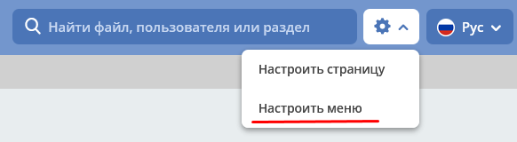
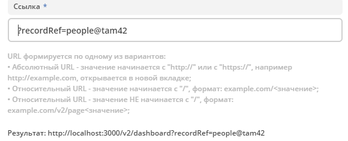

==================
**Настройка меню**
==================

Зависимости настроек
--------------------

.. important::

 На отображение влияют настройки:
 
 * Интерфейс основного меню (Журнал Конфигурация) - глобальная настройка, для всего приложения и всех пользователей.
 * Приоритеты групп (Настройки меню > Глобальная настройка) - глобальная настройка для всех конфигураций и пользователей.
 * Группы или пользователи (Настройки меню > Текущая конфигурация) - принадлежность одной конфигурации меню.
 * Доступность раздела (Настройки меню > Настройки конфигурации > Элементы меню > Раздел) - принадлежность одного раздела пользователям.

 

**Журнал Конфигурация**

В журнале для настройки **Интерфейс основного меню** (default-ui-main-menu) устанавливается какой **вариант** (версия) меню будет использоваться в системе.

.. image:: _static/menu/Menu_1.png
       :width: 800
       :align: center
       :alt: Меню

Значения:

* **left** - нулевая версия конфигурации левого меню (не поддерживается просмотр и настройка через интерфейс).
* **left-v1** - первая версия конфигурации левого меню (поддерживается просмотр и редактирование).

- Журнал Меню - все конфигурации меню

.. image:: _static/menu/Menu_2.png
       :width: 800
       :align: center
       :alt: Меню2

В журнале перечислены все конфигурации разных версий.

**Доступность действий в журнале**

.. image:: _static/menu/Menu_3.png
       :width: 600
       :align: center
       :alt: Меню3

.. note:: Для Интерфейс основного меню = left и Версия модели = 0 см. `Menu service <https://citeck.atlassian.net/wiki/spaces/knowledgebase/pages/714211365/Menu+service>`_.

Настройка меню
--------------

.. warning:: Интерфейсная настройка меню доступна только Администратору и значения настройки **left-v1**.

Способы открытия
~~~~~~~~~~~~~~~~

- Через шапку сайта иконка "Шестеренка" > :guilabel:`Настроить меню`.

.. note:: При использовании данного способа в окно настроек загружается конфигурация меню используемая на данный момент в интерфейсе. То есть в основном для настройки административного меню. 

- Через журнал **Меню**, инлайн действие *Редактировать конфигурацию*.

.. image:: _static/menu/Menu_configuration_2.png
       :width: 600
       :align: center
       :alt: Редактировать конфигурацию

Окно настроек
~~~~~~~~~~~~~~

Настройки содержат две вкладки:

#. **Настройки выбранной конфигурации** - описывает состояние отображаемого меню (элементы меню, версия, принадлежность и т.д.).
#. **Глобальные настройки** - то, что влияет на всю систему и всех пользователей (приоритеты).

Режим редактирования
""""""""""""""""""""
.. image:: _static/menu/Menu_redactor_mode.png
       :width: 600
       :align: center
       :alt: Режим редактирования

Режим просмотра
"""""""""""""""
Инлайн действие доступно через журнал :guilabel:`Меню`. 

То же самое окно что при редактирования, но без элементов изменяющих представление.

.. image:: _static/menu/Menu_view_mode1.png
       :width: 600
       :align: center
       :alt: Настройки конфигурации

.. image:: _static/menu/Menu_view_mode2.png
       :width: 600
       :align: center
       :alt: Глобальные настройки

Настройки выбранной конфигурации
~~~~~~~~~~~~~~~~~~~~~~~~~~~~~~~~
 
Элементы меню
""""""""""""""""""""""

Возможные типы пунктов и их доступность на каждом уровне 

.. image:: _static/menu/menu_elements.jpg
       :width: 600
       :align: center
       :alt: Типы пунктов

Если добавлен пункт *Ссылка* на создание кейса и в результате есть возможность создавать несколькими способами в левом отобразится раздел с вариантами создания.

.. image:: _static/menu/Menu_auto_point.png
       :width: 200
       :align: center
       :alt: Варианты создания типа данных

..table:: Доступность дополнительных характеристик:

 ========================    ============ ==============  =======
          Тип                      1            2            3   
 ========================    ============ ==============  =======
 Раздел                      Без названия      Иконка            
 Разделяющий заголовок                                           
 Журнал                                   Счетчик\Иконка  Счетчик
 Ссылка на создание кейса                     Иконка             
 Произвольный пункт меню                      Иконка             
 ========================    ============ ==============  =======

**Подробнее о некоторых типах:**

**Журнал** и **Ссылка на создание кейса**

Добавление пунктов осуществляется выбором элементов из журнала. Редактирование не доступно, только удаление. Необходимые сведения поступают из конфигурации элемента.
Можно добавлять сразу несколько выбранных значений.

*Ссылка на создание кейса* - в настройке выбирается журнал, но в самом меню используются сами варианты создания записей в этом журнале. Варианты создания настраиваются в журнале *Журналы* > Редактировать нужный журнал > вкладка на форме *Create Variants* 

.. warning:: - выбран журнал Файл уведомления, в меню отобразится пункт Загрузить шаблон уведомления;

               - выбран журнал Форма, в меню отобразится раздел Форма с пунктами Создать форму и Загрузить форму

**Произвольный пункт меню**
  
*Ссылка* - В зависимости от значения на выходе формируется соответствующий путь перехода. Под описанием поле выводится результат формируемой ссылки.

:info:  Подробнее про `Абсолютные и относительные ссылки <https://htmlacademy.ru/blog/boost/frontend/links>`_.

  **Абсолютный URL** - если указан полный путь. Ссылка будет открываться в новой вкладке браузера.

.. image:: _static/menu/Menu_url_absolut.png
       :width: 600
       :align: center
       :alt: Абсолютный URL

**Относительный URL. Варианты формирования:**

- Если значение начинается с “ / ” , то итоговая ссылка формируется как **хост** + **значение**.
  

- Если значение **не** начинается  с “ / ”, то итоговая ссылка формируется как **текущая ссылка в адресной строке** + **значение**.

.. warning::  Может привести к не ожидаемому результату.

Группы и пользователи
"""""""""""""""""""""

Выбор групп и пользователей, которым будет назначено редактируемое меню:

* **Пользователь** имеет наивысший приоритет. Так же стоит учесть зависимости других настроек. 
* Если на пользователя/группу назначено несколько конфигураций, это может привести к неопределенному результату и появится не то меню, что ожидалось.
* Установленные группы попадают в *приоритет групп*, по умолчанию в конец списка. 

Глобальные настройки
~~~~~~~~~~~~~~~~~~~~
.. note:: Данные настройки относятся ко всей системе. 

Приоритеты групп
""""""""""""""""
* Список групп соответствует значениям групп, указанных во всех конфигурациях меню.
* Приоритет группы обратно пропорционален уровню иерархии группы в Оргструктуре или уровню функциональной иерархии. Чем специфичнее и уже группа пользователей, тем выше у нее приоритет.
* Группы администраторов, как правило, размещаются на первом месте. 
* Пользователь имеет наивысший приоритет (пользователи не отображаются в приоритетах).

**Как это работает**

В конфигурации меню указываются группы или пользователи для которых настраивается меню. Приоритет групп - настройка глобальная, исходя из ее настройки и указанных участников, возвращается соответствующее для пользователя меню.

* АП - авторизованный пользователь,
* АП - tam42 и он указан в одной из конфигураций. Указание пользователя - наивысший приоритет => возвращается конфигурация №10. Пользователь не должен указываться в нескольких.
* АП состоит в группе администраторов (и не указан на прямую в конфигурации). Настраиваем конфигурацию с указанием этой группы. В настройке приоритетов эта группа на первом месте. Результат - слева отображается меню №3.
* АП - главный клерк, состоит в  2х группах: клерки и главные клерки. Есть две конфигурации №2 и №6. В приоритетах главные клерки на 2 месте, другие на 3. Результат -  слева отображается меню №6. Для Не главных клерков №2. если для АП нет ни одного подходящего меню - загружается базовое (default)

Редактор иконок
---------------
.. image:: _static/menu/menu_icons.png
       :width: 400
       :align: center
       :alt: Редактор иконок

На выбор пользователю предоставлен набор системных иконок. Если в наборе нет подходящей, есть возможность загрузить собственную, которая появится в блоке *Пользовательские*. Наилучший вариант формата иконки  - **svg**.

Иконка по умолчанию: 

Результат настроек
------------------

.. image:: _static/menu/menu_settings_result.png
       :width: 400
       :align: center
       :alt: Результат настроек

.. image:: _static/menu/menu_settings_result_2.png
       :width: 200
       :align: center
       :alt: Результат настроек 

Смежные настройки
-----------------
Логотип > `Темы интефрейса <https://citeck.atlassian.net/wiki/spaces/knowledgebase/pages/1808302150>`_.  

Действия для журнала Меню > `Типы действий <https://citeck.atlassian.net/wiki/spaces/knowledgebase/pages/1082392659>`_. 