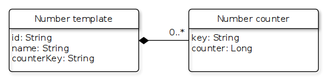
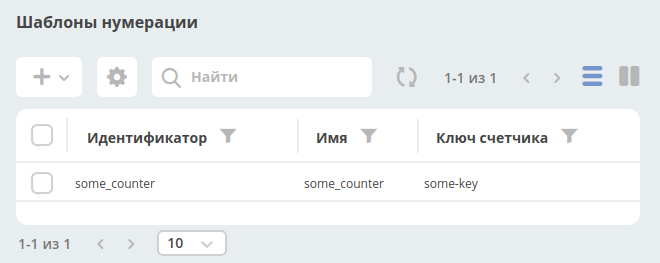
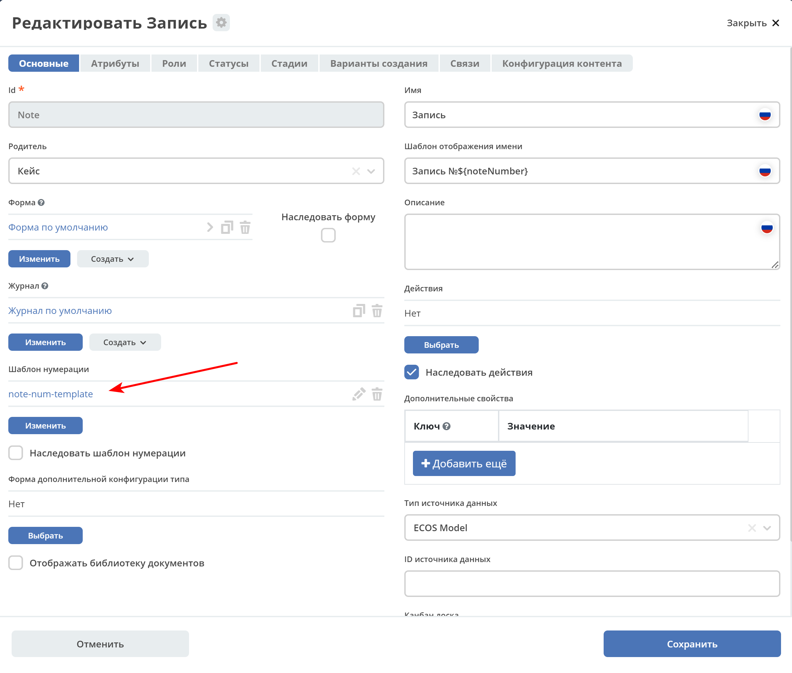

.. _number_template:

Шаблоны нумерации
==================

Template
---------------
С релиза 3.20.0 появилась поддержка шаблонов нумерации, которые можно полностью настроить через интерфейс.

Шаблоны и счетчики для них хранятся в **ecos-model**.

Файлы шаблонов создаются\ сохраняются в формате: **graphml**

Number template
~~~~~~~~~~~~~~~~
Сущность, которая определяет шаблон счетчика на основе текущей даты или полей в сущности, которую мы хотим пронумеровать.

Поля:

* **id** - идентификатор сущности
* **name** - произвольное имя. Справочная информация
* **counterKey** - шаблон ключа счетчика. Может быть как константой (будет создан только 1 счетчик для шаблона), так и с вставками в формате ``${атрибут_из_нумеруемой_сущности}``. В будущем будет возможность так же использовать текущую дату для шаблона (например, для старта нумерации с 0 каждый год или месяц или день).

Number counter
~~~~~~~~~~~~~~
Сущность, в которой ведется счет

Поля:

* **key** - ключ счетчика. Константное значение, которое получилось после вычисления counterKey в шаблоне нумерации
* **counter** - значение счетчика

Алгоритм работы
----------------------------------------

В приложении, которое использует шаблоны нумерации настраивается синхронизация с загрузкой всех шаблонов из **ecos-model** с целью получения списка атрибутов, которые нужны шаблону.

При создании новой сущности мы берем её тип, из типа получаем шаблон нумерации и если он задан, то достаем список необходимых для шаблона атрибутов. Далее отправляем команду с необходимыми атрибутами в **ecos-model** для получения следующего значения счетчика. Получив значение счетчика сохраняем его в одном из полей (в alfresco значение счетчика всегда сохраняется в **ecos:docNum**).

Для получения значения счетчика следует всегда использовать системный атрибут **_docNum** (каждый источник ответственен за возвращение актуального значения нумерации по этому атрибуту).

Настройка шаблона в интерфейсе
--------------------------------------------------------------

a) Открываем системные журналы и переходим в журнал **“шаблоны нумерации”**

b) Нажимаем **+** и выбираем **“Создать новый шаблон”**

.. image:: _static/number_template/Number_template_3.png
       :width: 600
       :align: center
       :alt: Шаблон нумерации

c) Вводим **Id**, **name** и **counterKey** и жмем **Submit**

Новый шаблон создан. Теперь его можно указывать в любом типе кейса:

Пример шаблона в формате **graphml**
------------------------------------
::

 <?xml version="1.0" encoding="UTF-8" standalone="no"?>
 <graphml xmlns="http://graphml.graphdrawing.org/xmlns" xmlns:java="http://www.yworks.com/xml/yfiles-common/1.0/java" xmlns:sys="http://www.yworks.com/xml/yfiles-common/markup/primitives/2.0" xmlns:x="http://www.yworks.com/xml/yfiles-common/markup/2.0" xmlns:xsi="http://www.w3.org/2001/XMLSchema-instance" xmlns:y="http://www.yworks.com/xml/graphml" xmlns:yed="http://www.yworks.com/xml/yed/3" xsi:schemaLocation="http://graphml.graphdrawing.org/xmlns http://www.yworks.com/xml/schema/graphml/1.1/ygraphml.xsd">
  <!--Created by yEd 3.20-->
  <key attr.name="Description" attr.type="string" for="graph" id="d0"/>
  <key for="port" id="d1" yfiles.type="portgraphics"/>
  <key for="port" id="d2" yfiles.type="portgeometry"/>
  <key for="port" id="d3" yfiles.type="portuserdata"/>
  <key attr.name="url" attr.type="string" for="node" id="d4"/>
  <key attr.name="description" attr.type="string" for="node" id="d5"/>
  <key for="node" id="d6" yfiles.type="nodegraphics"/>
  <key for="graphml" id="d7" yfiles.type="resources"/>
  <key attr.name="url" attr.type="string" for="edge" id="d8"/>
  <key attr.name="description" attr.type="string" for="edge" id="d9"/>
  <key for="edge" id="d10" yfiles.type="edgegraphics"/>
  <graph edgedefault="directed" id="G">
    <data key="d0"/>
    <node id="n0">
      <data key="d5"/>
      <data key="d6">
        <y:GenericNode configuration="com.yworks.entityRelationship.big_entity">
          <y:Geometry height="85.0" width="176.0" x="185.0" y="213.0"/>
          <y:Fill hasColor="false" transparent="false"/>
          <y:BorderStyle color="#000000" type="line" width="1.0"/>
          <y:NodeLabel alignment="center" autoSizePolicy="content" backgroundColor="#FFFFFF" configuration="com.yworks.entityRelationship.label.name" fontFamily="Dialog" fontSize="12" fontStyle="plain" hasLineColor="false" height="17.96875" horizontalTextPosition="center" iconTextGap="4" modelName="internal" modelPosition="t" textColor="#000000" verticalTextPosition="bottom" visible="true" width="110.189453125" x="32.9052734375" xml:space="preserve" y="4.0">Number template</y:NodeLabel>
          <y:NodeLabel alignment="left" autoSizePolicy="content" configuration="com.yworks.entityRelationship.label.attributes" fontFamily="Dialog" fontSize="12" fontStyle="plain" hasBackgroundColor="false" hasLineColor="false" height="45.90625" horizontalTextPosition="center" iconTextGap="4" modelName="custom" textColor="#000000" verticalTextPosition="top" visible="true" width="116.1953125" x="2.0" xml:space="preserve" y="29.96875">id: String
 name: String
 ounterKey: String<y:LabelModel><y:ErdAttributesNodeLabelModel/></y:LabelModel><y:ModelParameter><y:ErdAttributesNodeLabelModelParameter/></y:ModelParameter></y:NodeLabel>
          <y:StyleProperties>
            <y:Property class="java.lang.Boolean" name="y.view.ShadowNodePainter.SHADOW_PAINTING" value="true"/>
          </y:StyleProperties>
        </y:GenericNode>
      </data>
    </node>
    <node id="n1">
      <data key="d5"/>
      <data key="d6">
        <y:GenericNode configuration="com.yworks.entityRelationship.big_entity">
          <y:Geometry height="85.0" width="176.0" x="429.0" y="213.0"/>
          <y:Fill hasColor="false" transparent="false"/>
          <y:BorderStyle color="#000000" type="line" width="1.0"/>
          <y:NodeLabel alignment="center" autoSizePolicy="content" backgroundColor="#FFFFFF" configuration="com.yworks.entityRelationship.label.name" fontFamily="Dialog" fontSize="12" fontStyle="plain" hasLineColor="false" height="17.96875" horizontalTextPosition="center" iconTextGap="4" modelName="internal" modelPosition="t" textColor="#000000" verticalTextPosition="bottom" visible="true" width="102.19140625" x="36.904296875" xml:space="preserve" y="4.0">Number counter</y:NodeLabel>
          <y:NodeLabel alignment="left" autoSizePolicy="content" configuration="com.yworks.entityRelationship.label.attributes" fontFamily="Dialog" fontSize="12" fontStyle="plain" hasBackgroundColor="false" hasLineColor="false" height="31.9375" horizontalTextPosition="center" iconTextGap="4" modelName="custom" textColor="#000000" verticalTextPosition="top" visible="true" width="87.279296875" x="2.0" xml:space="preserve" y="29.96875">key: String
 counter: Long<y:LabelModel><y:ErdAttributesNodeLabelModel/></y:LabelModel><y:ModelParameter><y:ErdAttributesNodeLabelModelParameter/></y:ModelParameter></y:NodeLabel>
          <y:StyleProperties>
            <y:Property class="java.lang.Boolean" name="y.view.ShadowNodePainter.SHADOW_PAINTING" value="true"/>
          </y:StyleProperties>
        </y:GenericNode>
      </data>
    </node>
    <edge id="e0" source="n0" target="n1">
      <data key="d9"/>
      <data key="d10">
        <y:PolyLineEdge>
          <y:Path sx="0.0" sy="0.0" tx="0.0" ty="0.0"/>
          <y:LineStyle color="#000000" type="line" width="1.0"/>
          <y:Arrows source="diamond" target="none"/>
          <y:EdgeLabel alignment="center" configuration="AutoFlippingLabel" distance="2.0" fontFamily="Dialog" fontSize="12" fontStyle="plain" hasBackgroundColor="false" hasLineColor="false" height="17.96875" horizontalTextPosition="center" iconTextGap="4" modelName="custom" preferredPlacement="anywhere" ratio="0.5" textColor="#000000" verticalTextPosition="bottom" visible="true" width="25.263671875" x="39.76130087184998" xml:space="preserve" y="-20.04391578719992">0..*<y:LabelModel><y:SmartEdgeLabelModel autoRotationEnabled="false" defaultAngle="0.0" defaultDistance="10.0"/></y:LabelModel><y:ModelParameter><y:SmartEdgeLabelModelParameter angle="6.283185307179586" distance="11.059540787199923" distanceToCenter="true" position="left" ratio="2.0401094655999827" segment="-1"/></y:ModelParameter><y:PreferredPlacementDescriptor angle="0.0" angleOffsetOnRightSide="0" angleReference="absolute" angleRotationOnRightSide="co" distance="-1.0" frozen="true" placement="anywhere" side="anywhere" sideReference="relative_to_edge_flow"/></y:EdgeLabel>
          <y:BendStyle smoothed="false"/>
        </y:PolyLineEdge>
      </data>
    </edge>
  </graph>
  <data key="d7">
    <y:Resources/>
  </data>
 </graphml>