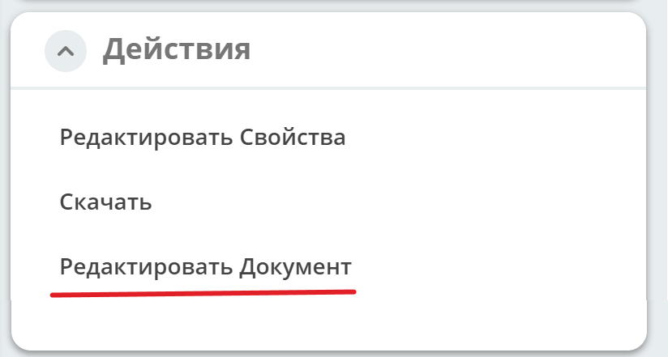
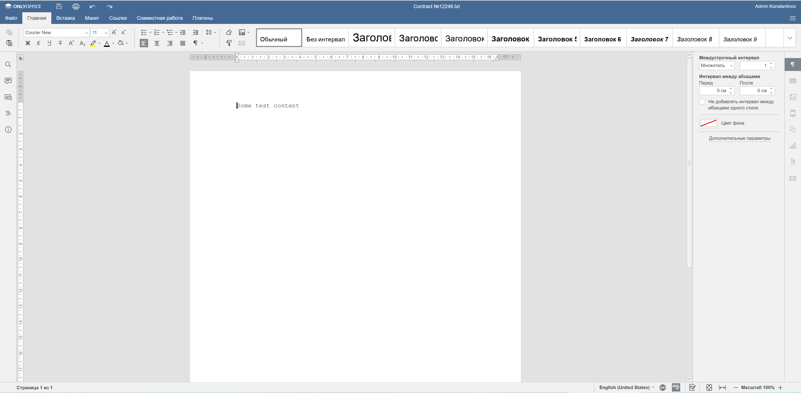
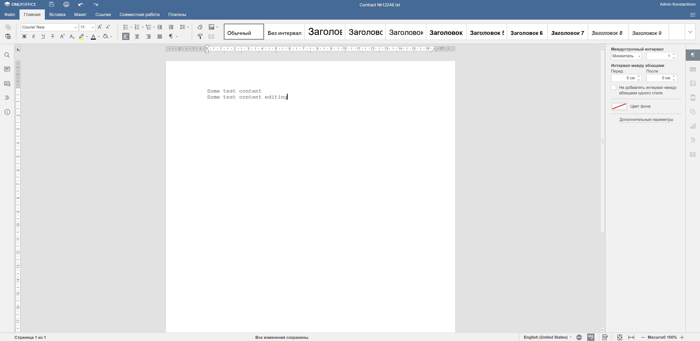
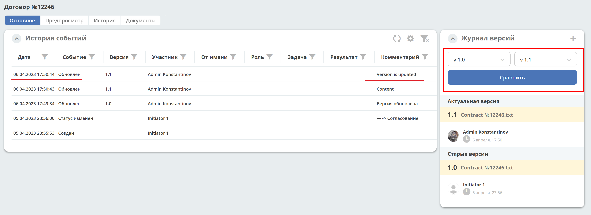
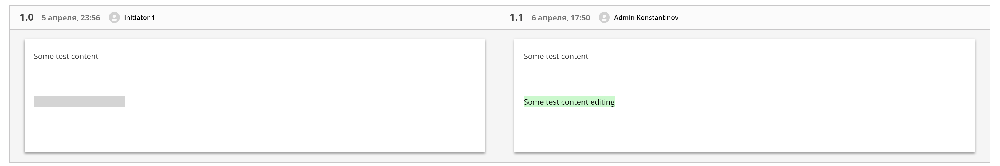

Редактирование документа в Onlyoffice
=====================================

Для редактирования файлов документов в Onlyoffice используйте действие **«Редактировать документ»**:

В отдельной вкладке браузера в Onlyoffice откроется документ:

Внесите в документ изменения:

Система сохраняет внесенные изменения автоматически в новую версию документа. Изменения версий фиксируются в **Журнале версий**.

Версии документов можно сравнить. Выберите версии и нажмите **Сравнить**. Различия будут подсвечены:

