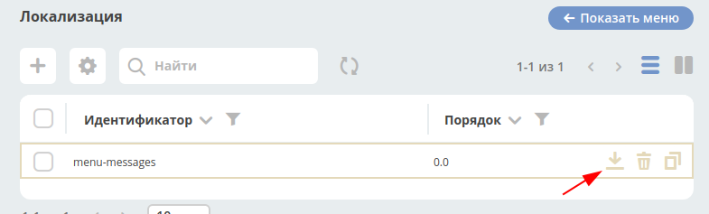
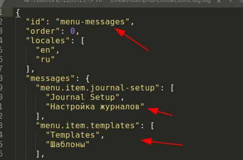

UI Локализация
===============

Для раширения или замены существующей UI локализации предусмотрена поддержка артефактов с типом ui/i18n

Итоговая локализация формируется из следующих словарей в порядке от менее к более приоритетному:

1. Статический (в проекте ecos-ui src/i18n);
2. Динамический (серверный);
3. Для форм существует свой словарь, настраиваемый непосредственно в конфигурации формы.

**Примеры**

Конфигурация артефакта ui/i18n::

  {
    // Идентификатор артефакта. По данному идентификатору система понимает когда загружается новый артефакта и когда происходит обновление старого.
    "id": "menu-messages",

    // Локализации, которые описаны в данном файле.
    "locales": ["en", "ru"],

    // Порядок, в котором будет прочитан файл по отношению к другим файлам локализации.
    // Чем выше это число, тем приоритетнее локализация в нем. Если по одному ключу будет
    // несколько локализаций, то в итоге “выиграет” та, у артефакта которой order больше.
    "order": 0,

    // Локализация по ключам записанная в виде массива, где индекс в массиве определяет локаль сообщения (согласно полю locales).
    // т.е. если у нас locales = ``[ "ru", "en" ]``, то если в messages мы видим ``[ “Русский“, “English“ ]``,
    // то это значит, что сообщение ``Русский`` относится к локали ``ru``, а ``English`` к локали ``en``
    "messages": {
        "menu.header.tasks": [
            "Tasks",
            "Задачи"
        ],
        "menu.header.sites": [
            "Sites",
            "Разделы"
        ]
    }
  }

Если необходимо чтобы локализация отображалась на формах, то необходимо указывать ключ локализации через префикс “ecos.forms.”

Замена локализации без перезагрузки сервера (“на лету”)
~~~~~~~~~~~~~~~~~~~~~~~~~~~~~~~~~~~~~~~~~~~~~~~~~~~~~~~

1. Открываем Инструменты -> UI Конфигурация → Локализация
2. Скачиваем один из существующих артефактов в журнале

3. Меняем локализацию в полученном файле и желательно меняем ID у артефакта

4. Загружаем полученный файл обратно в систему через “+” в шапке журнала

При создании новых артефактов следует учитывать порядок (order) локализации если ключи пересекаются.
Локализация с большим значением order приоритетнее и она перезатрет то что находится в менее
приоритетных артефактах если ключи будут одинаковы. Значения order могут быть дробными.
