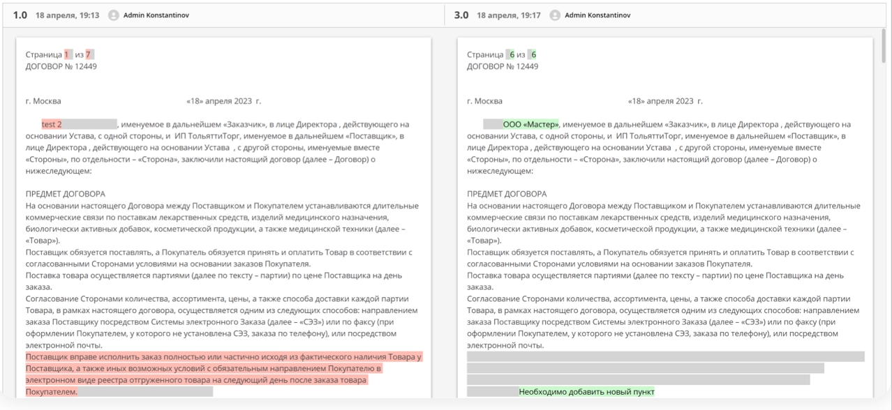

.. _widgets:

Виджеты
========

.. contents::
	:depth: 4

Для некоторых виджетов доступна настройка. Настройка отмечена следующей иконкой:

 .. image:: _static/widgets/widget_1.png
       :width: 600
       :align: center

.. note::

  При включенном конфиге **restrict-access-to-edit-dashboard-widgets** (true) настройка виджетов запрещена пользователю.

Настройка прав на редактирование
--------------------------------

В системе для пользователй можно разграничить права на настройку дашборда (**restrict-access-to-edit-dashboard**) и настройку виджетов (**restrict-access-to-edit-dashboard-widgets**). 

То есть у пользователя могут быть права на настройку дашборда, но запрещена настройа виджетов. 

Конфиги хранятся в разделе **Управление системой – Конфигурация ECOS**:

 .. image:: _static/widgets/dashboards_widgets_settings.png
       :width: 700
       :align: center

Включение настройки:

 .. image:: _static/widgets/dashboards_widgets_settings_1.png
       :width: 400
       :align: center

.. _widget_journal:

Виджет «Журнал»
----------------

Ключ ``journal``

Виджет для настройки отображения журнала.

.. list-table:: 
      :widths: 5 40
      :class: tight-table

      * - | **Настройка**
       

        - |  

            .. image:: _static/widgets/journal_1.png
                 :width: 500   
                 :align: center

          | 

             .. image:: _static/widgets/journal_2.png
                  :width: 500  
                  :align: center 

      * - | **Настроенный вид**
       

        - |  

            .. image:: _static/widgets/journal_3.png
                 :width: 500
                 :align: center   

.. _widget_web_page:

Виджет «Веб страница»
----------------------

Ключ ``web-page``

Виджет отображает любую web-страницу, заданную в его настройках.

.. list-table:: 
      :widths: 5 40
      :class: tight-table

      * - | **Настройка**
       

        - |  

            .. image:: _static/widgets/web_1.png
                 :width: 500
                 :align: center   

      * - | **Настроенный вид**
       

        - |  

            .. image:: _static/widgets/web_2.png
                 :width: 500 
                 :align: center   

.. _widget_doc_preview:

Виджет «Предпросмотр»
-----------------------

Ключ ``doc-preview``

Виджет предпросмотра служит для отображения основного документа и всех связанных из атрибута «Содержимое». Позволяет осуществлять скачивание не только основного, а текущего открытого документа.

Оригиналы документов могут быть других расширений, но виджет показывает только картинки или сгенерированные pdf на базе основного.

С включённой настройкой в виджете показываются все связанные документы.
 
 .. image:: _static/widgets/Preview_2.png
       :width: 400
       :align: center 

Первым отображается основной контент **cm:content**, затем дочерние элементы с типом **idocs:doc**. 

Если основной отсутствует, то отобразится следующий документ.

Переход между документами осуществляется через дропдаун или скролл. Количество документов указано в дропдауне:

 .. image:: _static/widgets/Preview_1.png
       :width: 800
       :align: center 

Содержимое виджета обновляется при изменениях основного и связанных документов.

.. _widget_comments:

Виджет «Комментарии»
----------------------

Ключ ``comments``

Виджет для отображения комментариев к документу.

.. list-table:: 
      :widths: 10 40
      :class: tight-table  

      * - **Введенные комментарии**      
        - |  
            
            .. image:: _static/widgets/comment_1.png
                  :width: 600   
                  :align: center

      * - **Форма ввода комментария:**    
        - |  Для ввода текста используется визуальный редактор, в котором помимо форматирования текста доступно добавление таблицы **(1)**, кода **(2)**, ссылки **(3)**, файла **(4)**:
            
            .. image:: _static/widgets/comment_2.png
                  :width: 600   
                  :align: center  

Транcлирование комментариев при выполнении задачи
~~~~~~~~~~~~~~~~~~~~~~~~~~~~~~~~~~~~~~~~~~~~~~~~~~~~~

Для включения транслированная комментария при выполнении задачи в виджет комментариев необходимо к типу данных добавить аспект ``task-comments-broadcastable``. 

.. important::

       Инпут комментария на форме задачи должен быть добавлен с ``id comment``.

Комментарий, добавленный из задачи помечается тегом с названием задачи.

 .. image:: _static/widgets/comment_3.png
       :width: 600
       :align: center 

Если необходимо выключить добавление комментария из задачи для конкретного рекорда, можно у рекорда выставить свойство ``task-comments-broadcastable:broadcastComments`` в ``false``.

.. _widget_properties:

Виджет «Свойства»
-------------------

Ключ ``properties``

Виджет для отображения атрибутов карточки формы и их значений. Предоставляет возможность inline редактирования значений атрибутов или редактирование в режиме "формы" (с учетом статуса кейса, наличия прав у просматривающего кейс пользователя). 

Список для выбора - формы из журнала форм.

.. list-table:: 
      :widths: 15 50
      :class: tight-table

      * - | **Настройка**
          | Список для выбора - формы из журнала форм.

        - |  

            .. image:: _static/widgets/Properties_1.png
                 :width: 400
                 :align: center    

          | 

             .. image:: _static/widgets/Properties_2.png
                  :width: 400
                  :align: center    

      * - | **Настроенный вид**    

        - |  Для типа дашборда :ref:`Case-details<dashboard_types>` реализовано 2 режима (см. настройки ниже)
          
          | - просмотр с возможностью inline редактирования значений атрибутов:       

            .. image:: _static/widgets/Properties_3.png
                 :width: 500 
                 :align: center   

          | - редактирование в режиме "формы":

             .. image:: _static/widgets/Properties_4.png
                 :width: 500 
                 :align: center             

          |  Для типа дашборда :ref:`Site-dashboard<dashboard_types>`

            .. image:: _static/widgets/Properties_5.png
                 :width: 500   
                 :align: center 

          | При выборе свойства **Электронная подпись** отображаются данные о сертификате ЭЦП и времени подписания:

            .. image:: _static/widgets/Properties_6.png
                 :width: 300   
                 :align: center 

Для виджета так же доступен переход в конструктор формы для дополнительной настройки полей. См. подробную статью :ref:`Формы<forms>`

.. list-table:: 
      :widths: 5 10
      :align: center 
      :class: tight-table

      *  - |  

            .. image:: _static/widgets/form_builder_icon.png
                 :width: 200  
                 :align: center  

         - | 

             .. image:: _static/widgets/form_builder_form.png
                  :width: 500   
                  :align: center 

Настройка режима редактирования виджета для типа дашборда Case-details
~~~~~~~~~~~~~~~~~~~~~~~~~~~~~~~~~~~~~~~~~~~~~~~~~~~~~~~~~~~~~~~~~~~~~~~~

Для типа дашборда Case-details доступна настройка режима просмотра с возможностью inline редактирования значений атрибутов или редактирования в режиме "формы". 
По умолчанию выставлен режим просмотра.

Для изменения режима необходимо в карточке **нажать шестеренку- > «Настроить страницу»**:

 .. image:: _static/widgets/case_edit_1.png
       :width: 300
       :align: center 

В настройке карточки перейти в раздел **"Виджеты"**, и у **виджета "Свойства"** нажать:

 .. image:: _static/widgets/case_edit_2.png
       :width: 600
       :align: center 

В настройках выбрать **"Режим редактирования"** и нажать **"Применить"**:

 .. image:: _static/widgets/case_edit_3.png
       :width: 400
       :align: center 

В настройке карточки нажать **"Применить"**.

Особенности режима редактирования
~~~~~~~~~~~~~~~~~~~~~~~~~~~~~~~~~~~~~~

В виджете при открытии страницы дашборда доступны свойства документа в режиме редактирования, аналогично открытию документа в модальном окне редактирования:

 .. image:: _static/widgets/case_edit_4.png
       :width: 600
       :align: center 

Если пользователь вносит изменения, то в шапке виджета становятся доступны кнопки **"Отмена"** и **"Сохранить"**. 

Если изменений нет - кнопки в шапке виджета отсутствуют.

Если поля при редактировании не проходят валидацию -  кнопка **"Сохранить"** становится не доступна для нажатия:

 .. image:: _static/widgets/case_edit_5.png
       :width: 600
       :align: center 

.. _widget_current_tasks:

Виджет «Мои задачи»
--------------------

Ключ ``current-tasks``

Виджет для отображения задач по данному кейсу у просматривающего его пользователя и варианты их завершения.

 .. image:: _static/widgets/task.png
       :width: 600
       :align: center 

.. _widget_tasks:

Виджет «Все задачи»
--------------------

Ключ ``tasks``

Виджет для отображения задач по данному кейсу и их исполнителей.

.. list-table:: 
      :widths: 5 40
      :class: tight-table

      * - | **Настройка**
       

        - |  

            .. image:: _static/widgets/all_tasks_1.png
                 :width: 300   
                 :align: center 

      * - | **Настроенный вид**
       

        - |  

            .. image:: _static/widgets/all_tasks_2.png
                 :width: 300 
                 :align: center   

При нажатии на:

 .. image:: _static/widgets/all_tasks_3.png
       :width: 300
       :align: center 

отображается схема выбранного бизнес-процесса с выделенной текущей задачей: 

 .. image:: _static/widgets/all_tasks_4.png
       :width: 600
       :align: center 

.. note:: 

       Действие доступно только администратору.       

.. _widget_doc-status:

Виджет «Статус»
----------------
Ключ ``doc-status``

Виджет отображает текущий статус кейса (определяется системой автоматически, не доступен для редактирования пользователем).

 .. image:: _static/widgets/status.png
       :width: 400
       :align: center 

.. _widget_events-history:

Виджет «История событий»
-------------------------

Ключ ``events-history``

Виджет служит для отображения событий таких, как создание, обновление, смена статуса кейса с фиксацией даты и времени их происшествия, участников и комментариев.

Виджет представлен в виде таблицы.

 .. image:: _static/widgets/History_1.png
       :width: 600
       :align: center 

Для каждого столбца можно настроить фильтрацию и поиск событий:

 .. image:: _static/widgets/History_2.png
       :width: 300
       :align: center 

Если в типе данных поля заданы как мультиязычные, то показываются мультиязычные значения:

 .. image:: _static/widgets/History_4.png
       :width: 600
       :align: center 

Для **bpmn-процесса**:

 .. image:: _static/widgets/History_3.png
       :width: 600
       :align: center 

В виджет добавлены события по сущности процесса:

       - Создание процесса;
       - Обновление версии процесса. Так же с указанием исходной версии;
       - Публикация версии процесса в движок.

Используя аспект :ref:`Конфигурация истории<history-config_aspect>` можно настроить атрибуты типа данных, информация об изменении которых не будет записываться в историю и отображаться в виджете, соответственно.

.. _widget_versions_journal:

Виджет «Журнал версий»
-----------------------

Ключ ``versions-journal``

Виджет содержит актуальную и предшествующие версии документа. 

Служит для загрузки новой версии документа, а также для сравнения файлов.

 .. image:: _static/widgets/version_1.png
       :width: 300
       :align: center 

Версии документов можно сравнить - выбрать версии и нажать **Сравнить**. Различия будут подсвечены:

.. _widget_versions_journal_bpmn:

Для **bpmn-процесса**:

 .. image:: _static/widgets/version_3.png
       :width: 300
       :align: center 

В виджете реализован функционал "тегов". Для версии процесса, которая была опубликована, будет показываться тег **"Опубликовано"**, для процесса, сохраненного как черновик - **"Черновик"** **(1)**.

Добавлена кнопка редактирования **(2)**, при нажатии на которую, открывается bpmn-редактор процесса конкретной версии.

При нажатии на кнопку скачать **(3)** происходит скачивание конкретной версии процесса.

При сохранении процесса в редакторе, если есть различия, происходит сохранение инкремента версии.

Cравнение версий процесса - выберите версии и нажмите **"Сравнить"** **(4)**:

 .. image:: _static/widgets/version_4.png
       :width: 800
       :align: center 

Для загрузки новой версии нажмите **(5)**:

 .. image:: _static/widgets/version_5.png
       :width: 300
       :align: center 

Выберите файл, укажите вид изменений и комментарий при необходимости, нажмите **"Добавить"**.

Добавленная версия станет актуальной.

.. _widget_doc_associations:

Виджет «Связи документа»
--------------------------

Ключ ``doc-associations``

Виджет используется для установки связей данного кейса с другими

.. image:: _static/widgets/doc-associations.png
       :width: 300
       :align: center 

и отображения установленных связей.

 .. image:: _static/widgets/doc-associations_1.png
       :width: 600
       :align: center 

Настройки
~~~~~~~~~~

Настройки производятся на вкладке :ref:`Связи<datatypes_associations>` типа данных. Связь может быть настроена с любой ассоциацией.

.. _widget_record_actions:

Виджет «Действия»
------------------

Ключ ``record-actions``

Виджет содержит перечень доступных действий с кейсом на данном статусе.

Настройки подтягиваются из :ref:`типа данных<data_types_main>`. См. подробную статью :ref:`Действия<ui_actions>`

 .. image:: _static/widgets/actions.png
       :width: 200
       :align: center 

.. _widget_barcode:

Виджет «Штрих-код»
-------------------

Ключ ``barcode``

Виджет отображает отображает сгенерированный штрих-код документа, основанный на числовом поле документа. 

По умолчанию используется поле ``idocs:barcode``.

Если нужно другое поле, то следует зарегистрировать это поле по типу ECOS в бине ``core.barcode-attribute.type-to-property.mappingRegistry``
Пример:

.. code-block::

    <bean id="records.contracts.barcode-attribute.type-to-property.mapping"
        class="ru.citeck.ecos.spring.registry.MappingRegistrar">
        <constructor-arg ref="core.barcode-attribute.type-to-property.mappingRegistry"/>
        <property name="mapping">
            <map>
                <entry key="contracts-cat-doctype-contract" value="contracts:barcode"/>
            </map>
        </property>
    </bean>

.. list-table:: 
      :widths: 5 40
      :class: tight-table

      * - | **Настройка**
       

        - |  

            .. image:: _static/widgets/barcode_1.png
                 :width: 200  
                 :align: center  

          | Условие отображения кнопки:
          | Если отсутствует условие, то кнопка отображается. Иначе для отображения, API по заданному условию должно возвращать **true**.
          | В текущей версии сохраняется как json строка.
          | Написание условия в соответствии статье :ref:`Язык предикатов <ecos-predicate_main>`

      * - | **Настроенный вид**
       

        - |  Для типа дашборда Case-details 

            .. image:: _static/widgets/barcode_2.png
                 :width: 200   
                 :align: center 

.. _widget_documents:

Виджет «Документы»
-------------------

Ключ ``documents``

Виджет служит для загрузки сопутствующих документов/ синхронизации пользователей и групп.

.. list-table:: 
      :widths: 5 40
      :class: tight-table

      * - | **Настройка**

        - |  Если корневой уровень (на скриншоте Базовый тип) один, то он раскрывается по умолчанию:
           
           |  **Документы**

              .. image:: _static/widgets/documents_01.png
                  :width: 600  
                  :align: center  

           | **Синхронизация пользователей**

              .. image:: _static/widgets/documents_02.png
                    :width: 600  
                    :align: center  

          | Доступно отображение только выбранных типов по соответстующему чекбоксу:

             .. image:: _static/widgets/documents_03.png
                  :width: 600    
                  :align: center          
          
          | При выборе типа чекбоксом и наведении мышки на строку:

             .. image:: _static/widgets/documents_04.png
                  :width: 600  
                  :align: center  

          | становится доступна настройка выбранного типа документа:

             .. image:: _static/widgets/documents_05.png
                  :width: 400  
                  :align: center  
          
          | При поиске типа раскрываются все вложенности и подсвечиваются совпадения:
          
             .. image:: _static/widgets/documents_06.png
                  :width: 600 
                  :align: center   

      * - | **Настроенный вид**
       
        - |  **Документы:**

            .. image:: _static/widgets/documents_07.png
                 :width: 600 
                 :align: center   

          |  В списке типов документов может встречаться одинаковое название, поэтому при наведении на тултип дополнительно отображается порядок вложенности:

            .. image:: _static/widgets/documents_08.png
                 :width: 400
                 :align: center    

          |  По кнопке **Скачать все документы** скачивается zip-архив со всеми загруженными файлами.

          | Для всех типов доступен фильтр **Все статусы**, в котором представлены системные статусы для документа: 

            .. image:: _static/widgets/documents_10.png
                 :width: 600   
                 :align: center 

          | 
          |  **Синхронизация пользователей:**

            .. image:: _static/widgets/documents_09.png
                 :width: 600   
                 :align: center 

.. _widget_doc_constructor:

Виджет «Doc.One»
-----------------

Ключ ``doc-constructor``

Виджет для использования конструктора документов Doc.one.

**Doc.one** - программа по составлению документов, с помощью которой можно преобразовать любые типовые документы, в умные шаблоны Doc.one.

.. list-table:: 
      :widths: 5 40
      :class: tight-table

      * - | **Настройка**
       

        - |  

            .. image:: _static/widgets/doc_one_1.png
                 :width: 300  
                 :align: center  

      * - | **Настроенный вид**
       

        - |  

            .. image:: _static/widgets/doc_one_2.png
                 :width: 600  
                 :align: center  

.. _widget_report:

Виджет «Статистика по задачам»
------------------------------

Ключ ``report``

Виджет отображает статистику по задачам.

 .. image:: _static/widgets/statistics.png
       :width: 500
       :align: center 

.. _widget_birthdays:

Виджет «День рождения»
-----------------------

Ключ ``birthdays``

Виджет отображает ближайшие дни рождения .

 .. image:: _static/widgets/bday.png
       :width: 500
       :align: center 

.. _widget_user_profile:

Виджет «Профиль»
----------------

Ключ ``user-profile``

Виджет профиля пользователя

 .. image:: _static/widgets/profile.png
       :width: 300
       :align: center 

.. _widget_process_statistics:

Виджет «Статистика процесса»
-----------------------------

.. note::

    Доступно только в enterprise версии.

    Просмотр данных виджета доступен пользователям с правом **«Просмотр отчетности»**.

Ключ ``process-statistics``

Виджет визуализирует статистику по бизнес-процессу с отображением тепловой карты (heatmap). 

**Тепловая карта (heat map)** — инструмент, который визуализирует данные при помощи разных цветов. Данные отображаются в виде цветных пятен. 

Возможные режимы представления
~~~~~~~~~~~~~~~~~~~~~~~~~~~~~~~~~~~~

У виджета возможны 3 представления:

.. _widget_process_statistics_KPI:

- **Режим KPI:**

            .. image:: _static/widgets/Process_statistics_KPI.png
                 :width: 600  
                 :align: center 

 Отображается бизнес-процесс, целевые значения KPI **(1)**, отклонения значения KPI от целевого значения **(2)**:

См. :ref:`подробно о KPI<bpmn_kpi>`

.. _widget_process_statistics_simple:

- **Упрощенный режим:**

            .. image:: _static/widgets/Process_statistics_simple.png
                 :width: 600  
                 :align: center 

 Отображается только бизнес-процесс.

.. _widget_process_statistics_extended:

- **Расширенный режим:**

            .. image:: _static/widgets/Process_statistics_extended.png
                 :width: 600  
                 :align: center 

 При максимальных настройках по умолчанию в расширенном режиме доступны:

    * **Процесс (1)**
    * **Тепловая карта (2)**  - Более активным элементам соответствуют тёплые тона, чем меньше показатели — тем холоднее цвет.
    * **Счетчики (3)** - Для каждого шага процесса отображает количество инстансов процесса, находящихся на данном шаге. Отображение счетчиков можно включить/выключить, отображение самого бизнес-процесса останется.
    
      - **А** – активные инстансы.
      - **В** – завершенные инстансы.

    * **Целевое значение KPI**, **отклонение значения KPI** от целевого в % **(4)**.
    * **% экземпляров**, ушедших по каждой ветке после шлюза **(5)**. Расчет % ведется от общего числа экземпляров, прошедших шлюз.
    * **Панель тепловой карты (6)** – настройка прозрачности, отображение минимального и максимального значений активных и завершенных инстансов.
    * **Журнал (7)** -  В журнале для каждого столбца можно настроить фильтрацию и поиск событий. Визуализация будет перерисована в соответствии с выбранными фильтрами.

            .. image:: _static/widgets/Process_statistics_03.png
                 :width: 600  
                 :align: center 

Масштабирование и перемещение
~~~~~~~~~~~~~~~~~~~~~~~~~~~~~

Для **масштабирования** используйте сочетание **ctrl и скролл мыши**. 

Для **перемещения** по heatmap влево- вправо - сочетание **shift и скролл мыши**.

Настройки виджета
~~~~~~~~~~~~~~~~~~

Настройка виджета доступна только пользователям из группы **Администраторы ECOS**.

Для режимов **KPI** и **Упрощенный** дополнительных настроек нет:

            .. image:: _static/widgets/Process_statistics_04.png
                 :width: 600  
                 :align: center 

|

            .. image:: _static/widgets/Process_statistics_05.png
                 :width: 600  
                 :align: center 

Для **Расширенного** режима выбираются отображаемые по умолчанию элементы виджета:

            .. image:: _static/widgets/Process_statistics_06.png
                 :width: 600  
                 :align: center 

.. _widget_stages:

Виджет «Стадии»
----------------

Ключ ``stages``

Виджет визуализирует прохождение :ref:`ECOS стадий<stages>` документа:

 .. image:: _static/widgets/stages_1.png
       :width: 500
       :align: center 

.. list-table:: 
      :widths: 5 40
      :class: tight-table

      * - | **Настройка**
       

        - |  

            .. image:: _static/widgets/stages_2.png
                 :width: 300  
                 :align: center  

          | Если снять чекбокс, то будет показана только текущая стадия:

      * - | **Настроенный вид**
       

        - |  

            .. image:: _static/widgets/stages_3.png
                 :width: 500  
                 :align: center  

.. _widget_kanban:

Виджет «Канбан»
----------------

Ключ ``kanban-board``

Виджет добавляет в карточку :ref:`канбан доску<kanban_board>` с настраиваемым журналом, связанным атрибутам и шаблонами для удобства пользователя и быстрым взаимодействием со статусами через карточку.

Виджет доступен только для следующего :ref:`представления дашборда<dashboard_view>`:

 .. image:: _static/widgets/kanban_1.png
       :width: 600
       :align: center 

.. list-table:: 
      :widths: 5 40
      :class: tight-table

      * - | **Настройка**    
        - |  

            .. image:: _static/widgets/kanban_2.png
                 :width: 500  
                 :align: center 

          | **Заголовок** виджета.
          | Выбор **журнала** по типу.
          | По чекбоксу **"Отображать только связанные записи"** можно выбрать связанные атрибуты, которые будут использоваться для фильтрации записей на канбан доске. Виджет будет отображать только те записи, которые имеют выбранные связанные атрибуты или на них есть ссылки.
          
            .. image:: _static/widgets/kanban_4.png
                 :width: 300  
                 :align: center           
          
          | Выбор сохраненных **шаблонов журнала** и созданных **канбан досок**.

            .. image:: _static/widgets/kanban_5.png
                 :width: 500  
                 :align: center  

      * - | **Настроенный вид**     
        - |  Виджет используется в модуле **"Офферы"**. В карточке заявки, по которой уже идет подбор кандидата, доступна вкладка **Канбан-доска**, на которой отображены кандидаты по данной заявке в различных статусах:

            .. image:: _static/widgets/kanban_3.png
                 :width: 600  
                 :align: center 

.. _widget_graphic_statistics:

Виджет «Графическая статистика»
---------------------------------

.. note::

    Доступно только в enterprise версии.

Ключ ``charts``

Виджет позволяет пользователям наглядно представлять и анализировать данные, повышая эффективность принятия решений и улучшая понимание текущего состояния бизнес-процессов.

 .. image:: _static/widgets/chart_1.png
       :width: 600
       :align: center 

При разработке использована библиотека `Chart.js <https://www.chartjs.org/docs/latest/>`_ 

Виджет поддерживает различные типы графиков: линейные, столбчатые, круговые.

Пользователи могут выбирать источник данных для графика, включая определенные атрибуты, колонки, связанные с кейсами и справочниками платформы ECOS.

Графики конфигурируемые - пользователи могут настраивать оси, масштабирование и т.д. 

 .. image:: _static/widgets/chart_2.png
       :width: 500
       :align: center 

По нажатию на пункт легенды данные пункта легенды убираются из представления графика:

 .. image:: _static/widgets/chart_3.png
       :width: 500
       :align: center 

Общая конфигурация
~~~~~~~~~~~~~~~~~~~~~~

Для всех типов графиков:

 .. image:: _static/widgets/chart_4.png
       :width: 500
       :align: center 

.. list-table:: 
      :widths: 10 40
      :class: tight-table

      * - **Название виджета**
        - Укажите наименование представления.
      * - **Тип графика**
        - |  Выберите тип из списка:
          |  - Столбчатый 
          |  - Круговой
          |  - Линейный
      * - **Настройки журнала**
        - 
      * - **Журнал**
        - |  Выберите журнал, по данным которого необходимо построить график. 
          |  В выбранном журнале должны быть заранее настроены колонки для группировки. Действие доступно для администратора.

          | Для разрешения группировки перейдите в журнале к необходимому столбцу, нажмите **Дополнительно**:

              .. image:: _static/widgets/chart_sett_01.png
                     :width: 500
                     :align: center 

          | Выставите чекбокс **Можно ли группировать**:

              .. image:: _static/widgets/chart_sett_02.png
                     :width: 500
                     :align: center 

      * - **Шаблон журнала**
        - Выберите шаблон журнала.
      * - **Атрибуты группировки**
        - | Группировка -  операция объединения данных в группы таким образом, чтобы у элементов в каждой группе был общий атрибут.
          | Нажмите "Добавить" и выберите из списка атрибуты, по которым производить группировку данных.
          | В списке представлены атрибуты, у которых в настройках разрешена группировка.
      * - **Атрибут агрегации**
        - Выберите атрибут из представленых в списке, по которому возвращать сводные данные. 

Столбчатый 
"""""""""""
 .. image:: _static/widgets/chart_8.png
       :width: 500
       :align: center 

**Столбчатый график** — диаграмма, представленная прямоугольными зонами (столбцами), высоты или длины которых пропорциональны величинам, которые они отображают. 

 .. image:: _static/widgets/chart_5.png
       :width: 500
       :align: center 

.. list-table:: 
      :widths: 10 40
      :name: Настройки столбчатого графика
      :class: tight-table

      * - **Минимальное вертикальное значение**
        - Минимальное значение, отображаемое на вертикальной шкале
      * - **Максимальное вертикальное значение**
        - Максимальное значение, отображаемое на вертикальной шкале
      * - **Соотношение сторон x/y**
        - Дробное. Масштабирования оси - отношение единицы X к единице Y. По умолчанию 2.

Примеры различных соотношений сторон:

**2:**

 .. image:: _static/widgets/chart_6.png
       :width: 500
       :align: center 

**4:**

 .. image:: _static/widgets/chart_7.png
       :width: 500
       :align: center 

Линейный
"""""""""""

 .. image:: _static/widgets/chart_10.png
       :width: 500
       :align: center 

**Линейный график** позволяет размещать данные в виде точек на линии. Используется для того, чтобы отразить изменение показателей с течением времени, или же для сравнения двух наборов данных. 

 .. image:: _static/widgets/chart_9.png
       :width: 500
       :align: center 

.. list-table:: 
      :widths: 10 40
      :name: Настройки линейного графика
      :class: tight-table

      * - **Минимальное вертикальное значение**
        - Минимальное значение, отображаемое на вертикальной шкале
      * - **Максимальное вертикальное значение**
        - Максимальное значение, отображаемое на вертикальной шкале
      * - **Соотношение сторон x/y**
        - Дробное. Масштабирования оси - отношение единицы X к единице Y. По умолчанию 2.
      * - **Растяжение**
        - Уровень плавности линии графика. По умолчанию 0.

Круговой
"""""""""""

 .. image:: _static/widgets/chart_12.png
       :width: 300
       :align: center 

**Круговой график** представляет данные в виде круга, разделенного на сектора. Каждый сектор — категория данных, которая составляет долю от общей суммы.

 .. image:: _static/widgets/chart_11.png
       :width: 600
       :align: center 

.. list-table:: 
      :widths: 10 40
      :name: Настройки кругового графика
      :class: tight-table

      * - **Радиус середины**
        - Радиус центрального круга, в процентах от радиуса основного. По умолчанию 50 %.
