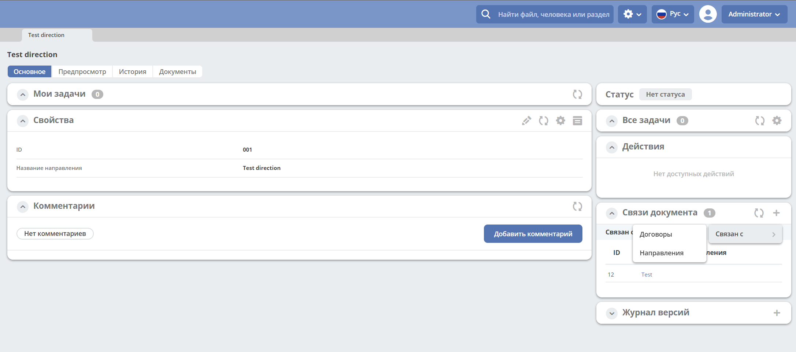

.. _widgets:

Виджеты
========

.. contents::
		:depth: 4

Для некоторых виджетов доступна настройка. Настройка отмечена следующей иконкой:

 .. image:: _static/widgets/widget_1.png
       :width: 600
       :align: center

.. _widget_journal:

Виджет «Журнал»
----------------

Ключ ``journal``

Виджет для настройки отображения журнала.

.. list-table:: 
      :widths: 5 40
      :class: tight-table

      * - | **Настройка**
       

        - |  

            .. image:: _static/widgets/widget_2.png
                 :width: 400   
                 :align: center

          | 

             .. image:: _static/widgets/widget_3.png
                  :width: 400  
                  :align: center 

      * - | **Настроенный вид**
       

        - |  

            .. image:: _static/widgets/widget_4.png
                 :width: 400
                 :align: center   

.. _widget_web_page:

Виджет «Веб страница»
----------------------

Ключ ``web-page``

Виджет отображает любую web-страницу, заданную в его настройках.

.. list-table:: 
      :widths: 5 40
      :class: tight-table

      * - | **Настройка**
       

        - |  

            .. image:: _static/widgets/widget_5.png
                 :width: 400
                 :align: center   

      * - | **Настроенный вид**
       

        - |  

            .. image:: _static/widgets/widget_6.png
                 :width: 400 
                 :align: center   

.. _widget_doc_preview:

Виджет «Предпросмотр»
-----------------------

Ключ ``doc-preview``

Виджет предпросмотра служит для отображения основного документа и всех связанных из атрибута «Содержимое». Позволяет осуществлять скачивание не только основного, а текущего открытого документа.

Оригиналы документов могут быть других расширений, но виджет показывает только картинки или сгенерированные pdf на базе основного.

С включённой настройкой в виджете показываются все связанные документы.
 
 .. image:: _static/widgets/Preview_2.png
       :width: 400
       :align: center 

Первым отображается основной контент **cm:content**, затем дочерние элементы с типом **idocs:doc**. 

Если основной отсутствует, то отобразится следующий документ.

Переход между документами осуществляется через дропдаун или скролл. Количество документов указано в дропдауне:

 .. image:: _static/widgets/Preview_1.png
       :width: 800
       :align: center 

Содержимое виджета обновляется при изменениях основного и связанных документов.

.. _widget_comments:

Виджет «Комментарии»
----------------------

Ключ ``comments``

Виджет для отображения комментариев к документу.

 .. image:: _static/widgets/widget_8.png
       :width: 600
       :align: center 

.. _widget_properties:

Виджет «Свойства»
-------------------

Ключ ``properties``

Виджет для отображения атрибутов карточки формы и их значений. Предоставляет возможность inline редактирования значений атрибутов или редактирование в режиме "формы" (с учетом статуса кейса, наличия прав у просматривающего кейс пользователя). 

Список для выбора - формы из журнала форм.

.. list-table:: 
      :widths: 15 50
      :class: tight-table

      * - | **Настройка**
          | Список для выбора - формы из журнала форм.

        - |  

            .. image:: _static/widgets/widget_9.png
                 :width: 400
                 :align: center    

          | 

             .. image:: _static/widgets/widget_10.png
                  :width: 400
                  :align: center    

      * - | **Настроенный вид**    

        - |  Для типа дашборда :ref:`Case-details<dashboard_types>` реализовано 2 режима (см. настройки ниже)
          
          | - просмотр с возможностью inline редактирования значений атрибутов:       

            .. image:: _static/widgets/widget_11.png
                 :width: 400 
                 :align: center   

          | - редактирование в режиме "формы":

             .. image:: _static/widgets/widget_11_1.png
                 :width: 400 
                 :align: center             

          |  Для типа дашборда :ref:`Site-dashboard<dashboard_types>`

            .. image:: _static/widgets/widget_12.png
                 :width: 400   
                 :align: center 

Для виджета так же доступен переход в конструктор формы для дополнительной настройки полей. См. подробную статью :ref:`Формы<forms>`

.. list-table:: 
      :widths: 5 10
      :align: center 
      :class: tight-table

      *  - |  

            .. image:: _static/widgets/form_builder_icon.png
                 :width: 200  
                 :align: center  

         - | 

             .. image:: _static/widgets/form_builder_form.png
                  :width: 400   
                  :align: center 

Настройка режима редактирования виджета для типа дашборда Case-details
~~~~~~~~~~~~~~~~~~~~~~~~~~~~~~~~~~~~~~~~~~~~~~~~~~~~~~~~~~~~~~~~~~~~~~~~

Для типа дашборда Case-details доступна настройка режима просмотра с возможностью inline редактирования значений атрибутов или редактирования в режиме "формы". 
По умолчанию выставлен режим просмотра.

Для изменения режима необходимо в карточке **нажать шестеренку- > «Настроить страницу»**:

 .. image:: _static/widgets/case_edit_1.png
       :width: 300
       :align: center 

В настройке карточки перейти в раздел **"Виджеты"**, и у **виджета "Свойства"** нажать:

 .. image:: _static/widgets/case_edit_2.png
       :width: 600
       :align: center 

В настройках выбрать **"Режим редактирования"** и нажать **"Применить"**:

 .. image:: _static/widgets/case_edit_3.png
       :width: 400
       :align: center 

В настройке карточки нажать **"Применить"**.

Особенности режима редактирования
~~~~~~~~~~~~~~~~~~~~~~~~~~~~~~~~~~~~~~

В виджете при открытии страницы дашборда доступны свойства документа в режиме редактирования, аналогично открытию документа в модальном окне редактирования:

 .. image:: _static/widgets/case_edit_4.png
       :width: 600
       :align: center 

Если пользователь вносит изменения, то в шапке виджета становятся доступны кнопки **"Отмена"** и **"Сохранить"**. 

Если изменений нет - кнопки в шапке виджета отсутствуют.

Если поля при редактировании не проходят валидацию -  кнопка **"Сохранить"** становится не доступна для нажатия:

 .. image:: _static/widgets/case_edit_5.png
       :width: 600
       :align: center 

.. _widget_current_tasks:

Виджет «Мои задачи»
--------------------

Ключ ``current-tasks``

Виджет для отображения задач по данному кейсу у просматривающего его пользователя и варианты их завершения.

 .. image:: _static/widgets/widget_13.png
       :width: 600
       :align: center 

.. _widget_tasks:

Виджет «Все задачи»
--------------------

Ключ ``tasks``

Виджет для отображения задач по данному кейсу и их исполнителей.

.. list-table:: 
      :widths: 5 40
      :class: tight-table

      * - | **Настройка**
       

        - |  

            .. image:: _static/widgets/widget_14.png
                 :width: 400   
                 :align: center 

      * - | **Настроенный вид**
       

        - |  

            .. image:: _static/widgets/widget_15.png
                 :width: 400 
                 :align: center   

.. _widget_doc-status:

Виджет «Статус»
----------------
Ключ ``doc-status``

Виджет отображает текущий статус кейса (определяется системой автоматически, не доступен для редактирования пользователем).

 .. image:: _static/widgets/widget_16.png
       :width: 400
       :align: center 

.. _widget_events-history:

Виджет «История событий»
-------------------------

Ключ ``events-history``

Виджет служит для отображения событий таких, как создание, обновление, смена статуса кейса с фиксацией даты и времени их происшествия, участников и комментариев.

Виджет представлен в виде таблицы.

 .. image:: _static/widgets/History_1.png
       :width: 600
       :align: center 

Для каждого столбца можно настроить фильтрацию и поиск событий:

 .. image:: _static/widgets/History_2.png
       :width: 300
       :align: center 

Для bpmn-процесса:

 .. image:: _static/widgets/History_3.png
       :width: 600
       :align: center 

В виджет добавлены события по сущности процесса:

- Создании процесса
- Обновлении версии. Так же с указанием исходной версии.
- Публикации версии в движок

.. _widget_versions_journal:

Виджет «Журнал версий»
-----------------------

Ключ ``versions-journal``

Виджет содержит актуальную и предшествующие версии документа. 

Служит для загрузки новой версии документа, а также для сравнения файлов.

 .. image:: _static/widgets/widget_18.png
       :width: 600
       :align: center 

Для bpmn-процесса:

 .. image:: _static/widgets/widget_39.png
       :width: 400
       :align: center 

В виджете реализован функционал "тегов". Для версии процесса, которая была опубликована, будет показываться тег "Опубликовано" **(1)**.

Добавлена кнопка редактирования **(2)**, при нажатии на которую, открывается bpmn-редактор процесса конкретной версии.

При нажатии на кнопку скачать **(3)**, происходит скачивание конкретной версии процесса.

При сохранении процесса в редакторе, если есть различий, происходит инкремент версии.

Добавлено сравнение версий процесса - выберите версии и нажмите **"Сравнить"**:

 .. image:: _static/widgets/widget_40.png
       :width: 400
       :align: center 

.. _widget_doc_associations:

Виджет «Связи документа»
--------------------------

Ключ ``doc-associations``

Виджет используется для установки связей данного кейса с другими

и отображения установленных связей.

 .. image:: _static/widgets/widget_19.png
       :width: 600
       :align: center 

Настройки
~~~~~~~~~~

Настройки производятся на вкладке :ref:`Связи<datatypes_associations>` типа данных. Связь может быть настроена с любой ассоциацией.

.. _widget_record_actions:

Виджет «Действия»
------------------

Ключ ``record-actions``

Виджет содержит перечень доступных действий с кейсом на данном статусе.

Настройки подтягиваются из :ref:`типа данных<data_types_main>`. См. подробную статью :ref:`Действия<ui_actions>`

 .. image:: _static/widgets/widget_20.png
       :width: 200
       :align: center 

.. _widget_barcode:

Виджет «Штрих-код»
-------------------

Ключ ``barcode``

Виджет отображает отображает сгенерированный штрих-код документа, основанный на числовом поле документа. 

По умолчанию используется поле ``idocs:barcode``.

Если нужно другое поле, то следует зарегистрировать это поле по типу ECOS в бине ``core.barcode-attribute.type-to-property.mappingRegistry``
Пример:

.. code-block::

    <bean id="records.contracts.barcode-attribute.type-to-property.mapping"
        class="ru.citeck.ecos.spring.registry.MappingRegistrar">
        <constructor-arg ref="core.barcode-attribute.type-to-property.mappingRegistry"/>
        <property name="mapping">
            <map>
                <entry key="contracts-cat-doctype-contract" value="contracts:barcode"/>
            </map>
        </property>
    </bean>

.. list-table:: 
      :widths: 5 40
      :class: tight-table

      * - | **Настройка**
       

        - |  

            .. image:: _static/widgets/widget_21.png
                 :width: 200  
                 :align: center  

          | Условие отображения кнопки:
          | Если отсутствует условие, то кнопка отображается. Иначе для отображения, API по заданному условию должно возвращать **true**.
          | В текущей версии сохраняется как json строка.
          | Написание условия в соответствии статье :ref:`Язык предикатов <ecos-predicate_main>`

      * - | **Настроенный вид**
       

        - |  Для типа дашборда Case-details 

            .. image:: _static/widgets/widget_22.png
                 :width: 200   
                 :align: center 

.. _widget_documents:

Виджет «Документы»
-------------------

Ключ ``documents``

Виджет служит для загрузки сопутствующих документов/ синхронизации пользователей и групп.

.. list-table:: 
      :widths: 5 40
      :class: tight-table

      * - | **Настройка**

        - |  Если корневой уровень (на скриншоте Базовый тип) один, то он раскрывается по умолчанию:
           
           |  **Документы**

              .. image:: _static/widgets/widget_23.png
                  :width: 400  
                  :align: center  

           | **Синхронизация пользователей**

              .. image:: _static/widgets/widget_24.png
                    :width: 400  
                    :align: center  

          | Доступно отображение только выбранных типов по соответстующему чекбоксу:

             .. image:: _static/widgets/widget_37.png
                  :width: 400    
                  :align: center          
          
          | При выборе типа чекбоксом и наведении мышки на строку:

             .. image:: _static/widgets/widget_34.png
                  :width: 400  
                  :align: center  

          | становится доступна настройка выбранного типа документа:

             .. image:: _static/widgets/widget_35.png
                  :width: 400  
                  :align: center  
          
          | При поиске типа раскрываются все вложенности и подсвечиваются совпадения:
          
             .. image:: _static/widgets/widget_38.png
                  :width: 400 
                  :align: center   

      * - | **Настроенный вид**
       
        - |  Документы

            .. image:: _static/widgets/widget_25.png
                 :width: 400 
                 :align: center   

          |  В списке типов документов может встречаться одинаковое название, поэтому при наведении на тултип дополнительно отображается порядок вложенности:

            .. image:: _static/widgets/widget_36.png
                 :width: 400
                 :align: center    

          |  Синхронизация пользователей

            .. image:: _static/widgets/widget_26.png
                 :width: 400   
                 :align: center 

.. _widget_doc_constructor:

Виджет «Doc.One»
-----------------

Ключ ``doc-constructor``

Виджет для использования конструктора документов Doc.one.

Doc.one - программа по составлению документов, с помощью которой можно преобразовать любые типовые документы, в умные шаблоны Doc.one.

.. list-table:: 
      :widths: 5 40
      :class: tight-table

      * - | **Настройка**
       

        - |  

            .. image:: _static/widgets/widget_27.png
                 :width: 300  
                 :align: center  

      * - | **Настроенный вид**
       

        - |  

            .. image:: _static/widgets/widget_28.png
                 :width: 600  
                 :align: center  

.. _widget_process_statistics:

Виджет «Статистика процесса»
-----------------------------

Ключ ``process-statistics``

Виджет визуализирует статистику по бизнес-процессу с отображением тепловой карты (heatmap).

**Heatmap** – способ визуализации статистических данных с помощью цветовой палитры.

В виджете реализованы два представления: 

* **Процесс** - модель бизнес-процесса с heatmap
  
            .. image:: _static/widgets/Process_statistics_1.png
                 :width: 600  
                 :align: center 

Heatmap для каждого шага процесса отображает количество инстансов, находящихся на данном шаге. 

 .. image:: _static/widgets/Process_statistics_5.png
       :width: 400
       :align: center 

Так же можно включить/выключить отображение счетчиков, тепловой карты активных и завершённых процессов, отображение самого бизнес-процесса останется.

Для **масштабирования** используйте сочетание **ctrl и скролл мыши**.
Для перемещения по heatmap **влево- вправо** - сочетание **shift и скролл мыши**.

* **Журнал**. 

            .. image:: _static/widgets/Process_statistics_2.png
                 :width: 600  
                 :align: center   

В журнале для каждого столбца можно настроить **фильтрацию и поиск событий**. Визуализация будет перерисована в соответствии с выбранными фильтрами.
 
 .. image:: _static/widgets/Process_statistics_4.png
       :width: 600
       :align: center 

В настройках виджета выбираются отображаемые по умолчанию элементы виджета, и включено/ выключено отображение цветовой панели тепловой карты:

 .. image:: _static/widgets/Process_statistics_3.png
       :width: 600
       :align: center 

.. _widget_stages:

Виджет «Стадии»
----------------

Ключ ``stages``

Виджет визуализирует прохождение стадий документа:

 .. image:: _static/widgets/stages_1.png
       :width: 400
       :align: center 

.. list-table:: 
      :widths: 5 40
      :class: tight-table

      * - | **Настройка**
       

        - |  

            .. image:: _static/widgets/stages_2.png
                 :width: 300  
                 :align: center  

          | Если снять чекбокс, то будет показана только текущая стадия:

      * - | **Настроенный вид**
       

        - |  

            .. image:: _static/widgets/stages_3.png
                 :width: 400  
                 :align: center  

.. _widget_report:

Виджет «Статистика по задачам»
------------------------------

Ключ ``report``

Виджет отображает статистику по задачам.

 .. image:: _static/widgets/widget_31.png
       :width: 500
       :align: center 

.. _widget_birthdays:

Виджет «День рождения»
-----------------------

Ключ ``birthdays``

Виджет отображает ближайшие дни рождения.

 .. image:: _static/widgets/widget_32.png
       :width: 500
       :align: center 

.. _widget_user_profile:

Виджет «Профиль»
----------------

Ключ ``user-profile``

Виджет профиля пользователя

 .. image:: _static/widgets/widget_33.png
       :width: 300
       :align: center 

