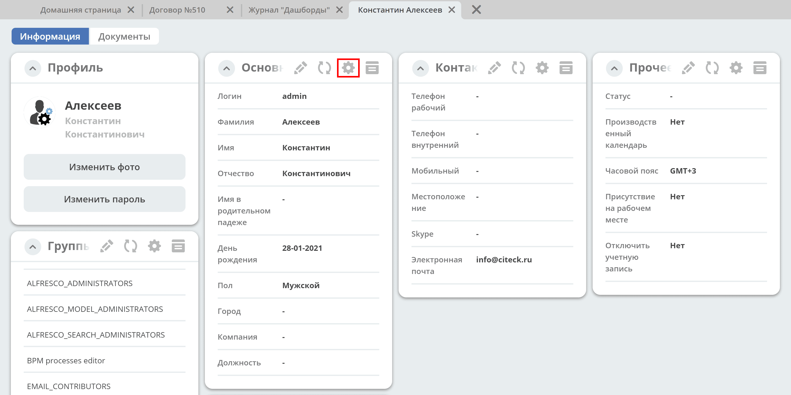
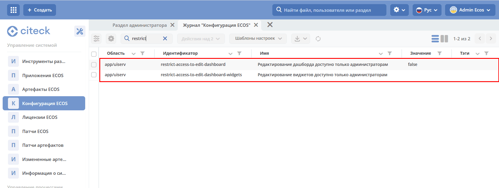

.. _widgets:

Виджеты
==========================

**Виджеты** — настраиваемые блоки информации, которые размещаются на :ref:`дашбордах <dashboard>` и отображают данные о документе, задачах, процессах, пользователях и другом контенте системы.

Виджеты добавляются и переносятся перетаскиванием при настройке дашборда. Набор доступных виджетов зависит от типа дашборда. Для части виджетов доступна индивидуальная настройка отображаемых данных.

.. _widget_settings:

Для некоторых виджетов доступна настройка. Настройка отмечена следующей иконкой:

.. note::

  При включенном конфиге **restrict-access-to-edit-dashboard-widgets** (true) настройка виджетов запрещена пользователю.

Настройка прав на редактирование
----------------------------------

В системе для пользователей можно разграничить права на настройку дашборда (**restrict-access-to-edit-dashboard**) и настройку виджетов (**restrict-access-to-edit-dashboard-widgets**).

То есть у пользователя могут быть права на настройку дашборда, но запрещена настройка виджетов.

Конфиги хранятся в разделе **Управление системой – Конфигурация ECOS** (``v2/journals?journalId=ecos-configs&viewMode=table&ws=admin$workspace``):

Включение настройки:

Доступные виджеты:

.. grid:: 1
   :gutter: 2

   .. grid-item-card:: Активности
      :link: widget_activities
      :link-type: ref

      Планирование и организация работы по кейсу: звонки, встречи, письма, поручения (только Enterprise).

   .. grid-item-card:: Все задачи
      :link: widget_tasks
      :link-type: ref

      Отображение задач по кейсу и их исполнителей.

   .. grid-item-card:: Графическая статистика
      :link: widget_graphic_statistics
      :link-type: ref

      Наглядное представление и анализ данных бизнес-процессов (только Enterprise).

   .. grid-item-card:: Дни рождения
      :link: widget_birthdays
      :link-type: ref

      Ближайшие дни рождения пользователей по данным из профиля.

   .. grid-item-card:: Действия
      :link: widget_record_actions
      :link-type: ref

      Доступные действия с кейсом на текущем статусе.

   .. grid-item-card:: Диаграмма Ганта
      :link: widget_gantt
      :link-type: ref

      Визуализация временной шкалы проекта с задачами разных типов.

   .. grid-item-card:: Документы
      :link: widget_documents
      :link-type: ref

      Загрузка сопутствующих документов, синхронизация пользователей и групп.

   .. grid-item-card:: Доступные пространства
      :link: widget_available_ws
      :link-type: ref

      Список доступных публичных пространств с переходом и присоединением.

   .. grid-item-card:: Журнал
      :link: widget_journal
      :link-type: ref

      Настройка отображения журнала.

   .. grid-item-card:: Журнал версий
      :link: widget_versions_journal
      :link-type: ref

      Актуальная и предыдущие версии документа, загрузка новой версии и сравнение файлов.

   .. grid-item-card:: История событий
      :link: widget_events-history
      :link-type: ref

      Таблица событий кейса (создание, обновление, смена статуса) с датой и участниками.

   .. grid-item-card:: Канбан
      :link: widget_kanban
      :link-type: ref

      Канбан-доска в карточке кейса с настраиваемым журналом и атрибутами.

   .. grid-item-card:: Комментарии
      :link: widget_comments
      :link-type: ref

      Отображение комментариев к документу.

   .. grid-item-card:: Меню
      :link: widget_knowledge_base
      :link-type: ref

      Иерархическая структура данных для навигации по базе знаний.

   .. grid-item-card:: Мои задачи
      :link: widget_current_tasks
      :link-type: ref

      Задачи по кейсу у текущего пользователя и варианты их завершения.

   .. grid-item-card:: Новости
      :link: widget_news
      :link-type: ref

      Анонсы последних новостей из журнала «Новости».

   .. grid-item-card:: Предпросмотр
      :link: widget_doc_preview
      :link-type: ref

      Отображение и скачивание основного документа и связанных файлов.

   .. grid-item-card:: Профиль
      :link: widget_user_profile
      :link-type: ref

      Профиль пользователя.

   .. grid-item-card:: Публикация
      :link: widget_publication
      :link-type: ref

      Отображение и редактирование контента: новости, публикации базы знаний.

   .. grid-item-card:: Связи документа
      :link: widget_doc_associations
      :link-type: ref

      Установка и отображение связей кейса с другими записями.

   .. grid-item-card:: Стадии
      :link: widget_stages
      :link-type: ref

      Визуализация прохождения стадий документа.

   .. grid-item-card:: Статистика по задачам
      :link: widget_report
      :link-type: ref

      Статистика по задачам.

   .. grid-item-card:: Статистика процесса
      :link: widget_process_statistics
      :link-type: ref

      Статистика по бизнес-процессам (только Enterprise, требует право «Просмотр отчетности»).

   .. grid-item-card:: Статус
      :link: widget_doc-status
      :link-type: ref

      Текущий статус кейса, определяемый системой автоматически.

   .. grid-item-card:: Свойства
      :link: widget_properties
      :link-type: ref

      Отображение и inline-редактирование атрибутов карточки.

   .. grid-item-card:: HTML
      :link: widget_html
      :link-type: ref

      Произвольный HTML-контент с En/Ru локализацией и WYSIWYG-редактором.

   .. grid-item-card:: Веб-страница
      :link: widget_web_page
      :link-type: ref

      Отображение произвольной веб-страницы по заданному адресу.

   .. grid-item-card:: Штрих-код
      :link: widget_barcode
      :link-type: ref

      Сгенерированный штрих-код документа на основе числового поля.

.. toctree::
   :maxdepth: 3
   :hidden:

   widgets/activities
   widgets/tasks
   widgets/graphic_statistics
   widgets/birthdays
   widgets/record_actions
   widgets/gantt
   widgets/documents
   widgets/available_ws
   widgets/journal
   widgets/versions_journal
   widgets/events_history
   widgets/kanban
   widgets/comments
   widgets/knowledge_base
   widgets/current_tasks
   widgets/news
   widgets/preview
   widgets/user_profile
   widgets/publication
   widgets/doc_associations
   widgets/stages
   widgets/report
   widgets/process_statistics
   widgets/doc_status
   widgets/properties
   widgets/html
   widgets/web_page
   widgets/barcode
