.. _widget_activities:

'Activities' Widget
===============================================

.. contents::
   :depth: 3

.. note::

    Available in the enterprise version only.

**'Activities' Widget** helps plan and organize work on a case. Tasks such as a phone call, meeting, letter, or assignment can be scheduled from the case card and viewed in the calendar. |br|
The widget is universal and can be added to any dashboard for any case and workspace. |br|

For example, in the CRM module, the widget can be used to track the stages of work on a deal and view all scheduled and completed tasks (activities). |br|
Scheduled activities are used to remind the manager about the need to make contact. Completed activities, as an important part of the deal history, can be used to calculate the manager's KPI. |br|
Created activities are displayed in the deal card to which they are assigned: |br|

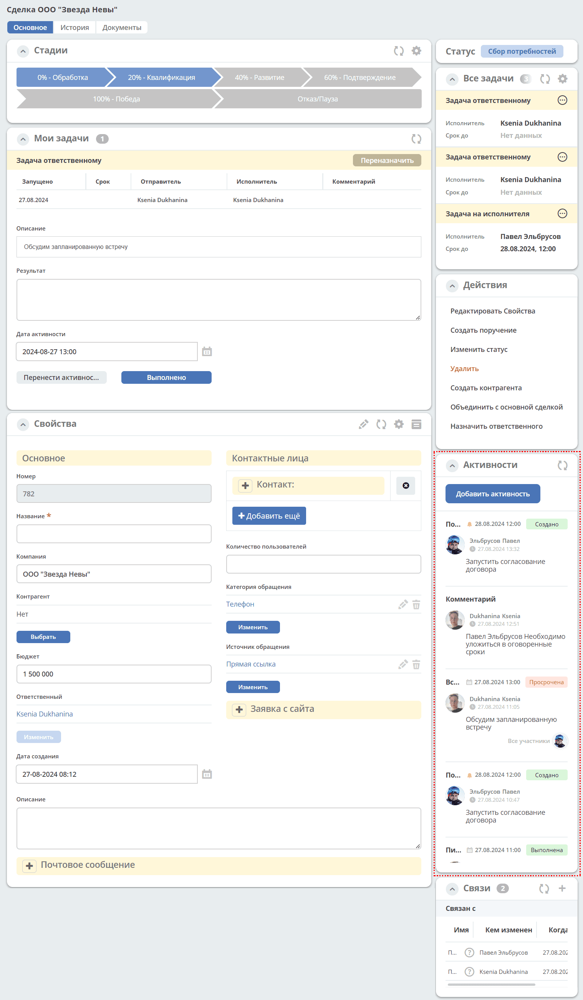

In addition, they can be viewed:

-	in the calendar (scheduled tasks only):

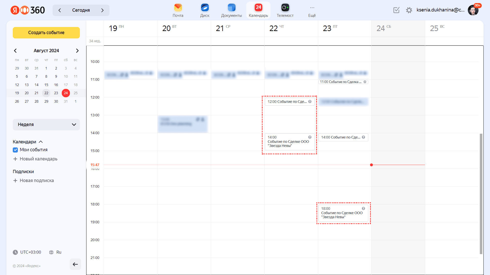

See details :ref:`Invitation Email <activity_ics>` below.

-	and in the Tasks → Current Tasks section:

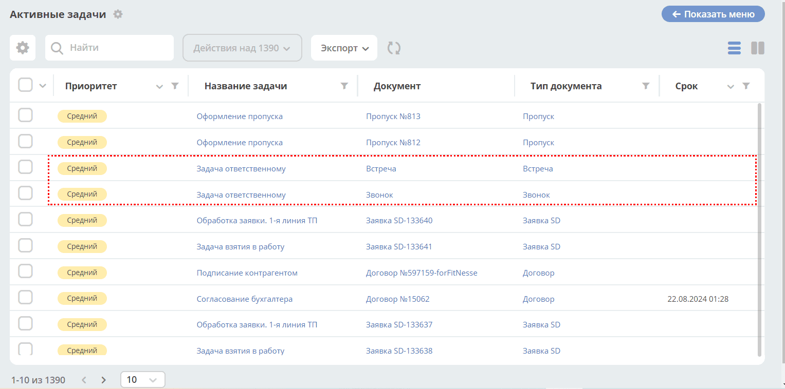

See details :ref:`Tasks <activity_task>` below.

Activities can be:

 - :ref:`Scheduled <planned_activity>`: call, meeting, letter;
 - :ref:`Unscheduled <unplanned_activity>`: assignment, comment.

How to Add
------------

Click **'Add Activity'**, then select the activity type from the list:

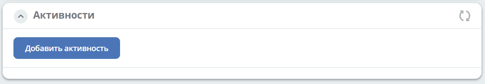

Enter the activity details. Depending on the type, the list of fields and available statuses may vary.

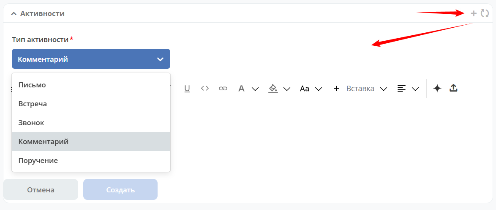

.. note::

 Adding a comment is always required for all activities.

Scheduled Activities
-----------------------

.. _planned_activity:

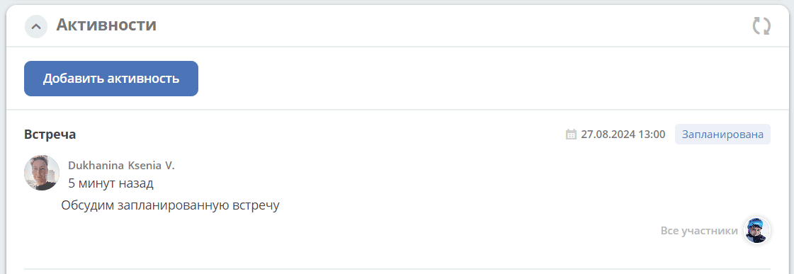

Scheduled activities:

       - Call;
       - Letter;
       - Meeting.

For scheduled activities, an invitation email containing an ICS file is sent to the email address specified in the profile of the responsible person and selected participants. See :ref:`Invitation Email <activity_ics>`.

A task is also assigned for such activities, in which the date and time of the activity can be rescheduled or marked as completed. See :ref:`Tasks <activity_task>`.

The status model for such activities is as follows:

.. list-table::
      :widths: 3 5
      :class: tight-table
      :align: center

      * - |

              .. image:: ../_static/widgets/activity/status_01.png
                     :width: 80
                     :align: center

        - |  Default status.
          |  A scheduled activity has been created, the date is in the future, and the task has not yet been created.
          |  In the assigned task, the responsible person selected the verdict **'Reschedule Activity'**.
          |  An activity in this status can be edited and deleted. See details on :ref:`actions <activity_actions>`.

      * - |

              .. image:: ../_static/widgets/activity/status_02.png
                     :width: 80
                     :align: center

        - |  The date and time of the activity has arrived.
          |  A task is assigned to the responsible person. Two actions are available in the task: complete and reschedule the activity. See details on :ref:`the task <activity_task>`.

      * - |

              .. image:: ../_static/widgets/activity/status_03.png
                     :width: 80
                     :align: center

        - |  In the assigned task, the responsible person selected the verdict **'Done'**.

.. note::

       When using the widget in workspaces, workspace members are automatically added to **Participants** in scheduled activities. Participants can be removed and added.

Types
~~~~~

Call
"""""""

The **responsible person** is specified by default:

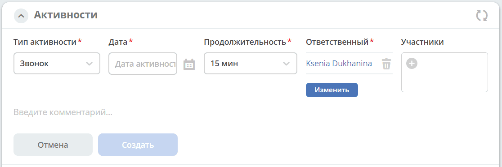

Select the **date** and **time** from the calendar, specify the **name**, **duration**, and **responsible person**, and add **participants** if needed. Enter a comment. Click **'Create'**.

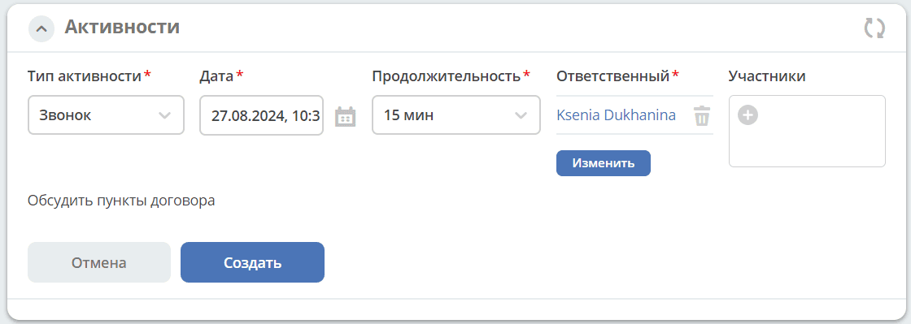

The created activity in the card:

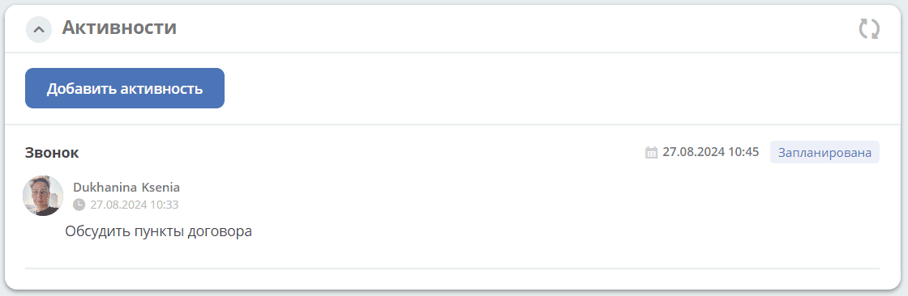

Letter
"""""""

The **responsible person** is specified by default:

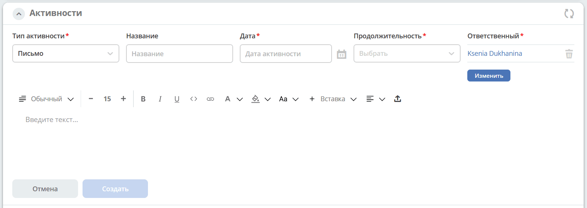

Select the **date** and **time** from the calendar, specify the **name** and **duration**, and change the **responsible person** if needed. Enter a comment and attach a file. Click **'Create'**.

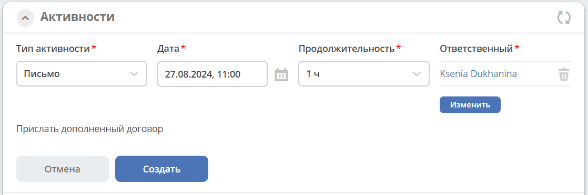

The created activity in the card:

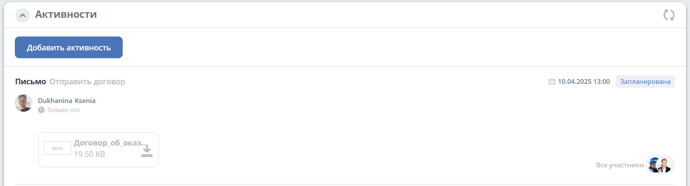

Meeting
""""""""

The **responsible person** is specified by default:

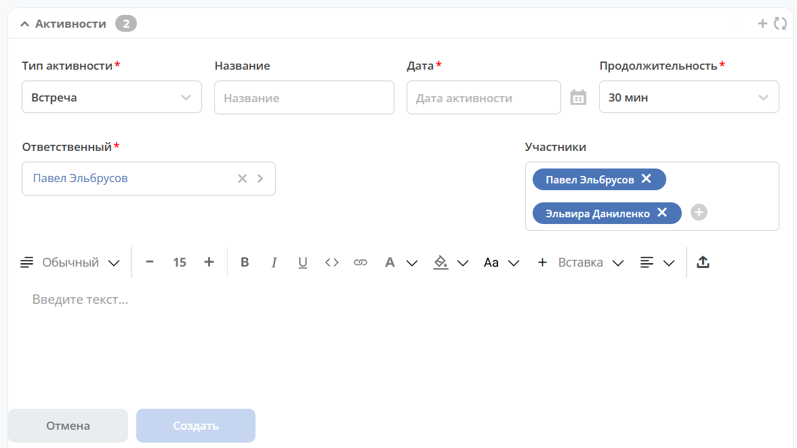

Select the **date** and **time** from the calendar, specify the **name**, **duration**, and **responsible person**, and add **participants** if needed. Enter a comment. Click **'Create'**.

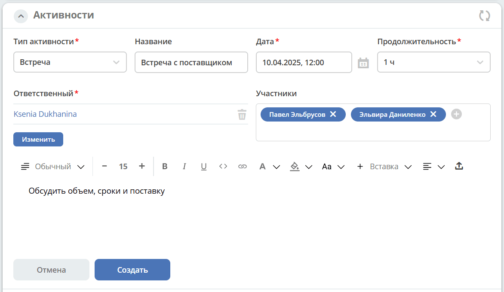

The created activity in the card:

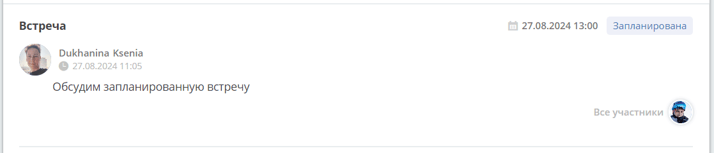

Invitation Email
~~~~~~~~~~~~~~~~~~~

.. _activity_ics:

For the **Call**, **Letter**, and **Meeting** types, an invitation email containing an **ICS file** is sent to the email address specified in the profile of the responsible person and selected participants.

The ICS file contains a list of scheduled events and meetings in a universal calendar format that can be used in various online and offline organizer applications, such as Microsoft Outlook, Google Calendar, and Apple iCal. The file has a simple text format that includes the event title, start and end time, and a brief description.

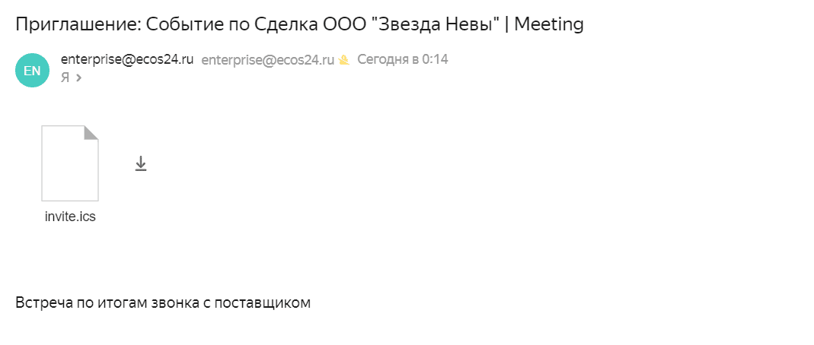

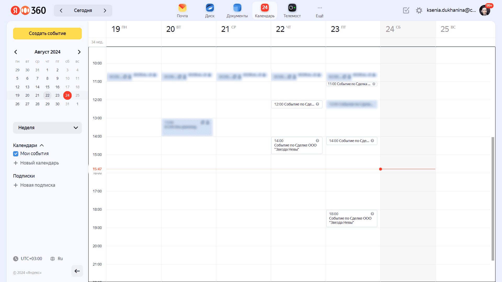

Task
~~~~~~~

.. _activity_task:

When the **date** and **time** of the activity arrive, the system assigns a task to the responsible person. The task will be available:

       - in the Journal under **Current Tasks**;

              .. image:: ../_static/widgets/activity/activity_18.png
                     :width: 800
                     :align: center

              |

              .. image:: ../_static/widgets/activity/activity_19.png
                     :width: 600
                     :align: center

       - in the deal card in the **'My Tasks'** widget:

              .. image:: ../_static/widgets/activity/activity_20.png
                     :width: 600
                     :align: center

The following task completion options are available:

       - **'Done'**;
       - **'Reschedule Activity'**

Completing an Activity
""""""""""""""""""""""

If the work on the activity is complete, fill in the **result** in the task and click **'Done'**. The activity status will change from **'Overdue'** to **'Completed'**.

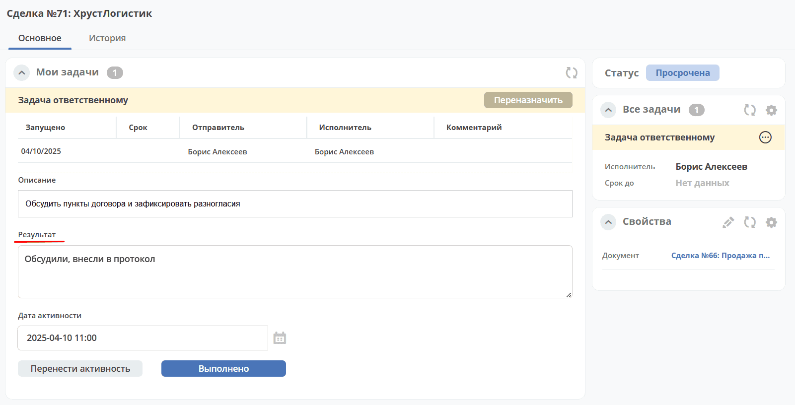

The result will be added to the corresponding activity:

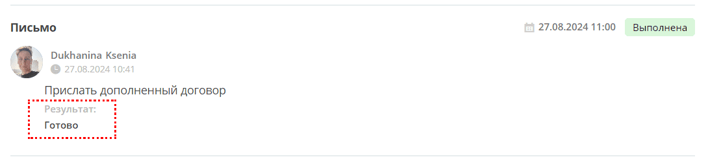

Rescheduling an Activity
"""""""""""""""""""""""""

If the work on the activity is not complete, select a new **date** and **time** for the activity in the calendar and click **'Reschedule Activity'**. The activity status will change from **'Overdue'** to **'Scheduled'**.

Unscheduled Activities
-------------------------

.. _unplanned_activity:

Unscheduled activities:

       - Comment;
       - Assignment.

The status model for such activities is as follows:

.. list-table::
      :widths: 3 5
      :class: tight-table
      :align: center

      * - |

              .. image:: ../_static/widgets/activity/status_04.png
                     :width: 80
                     :align: center

        - |  Assignment, Comment created.

Comment
~~~~~~~~~~~~

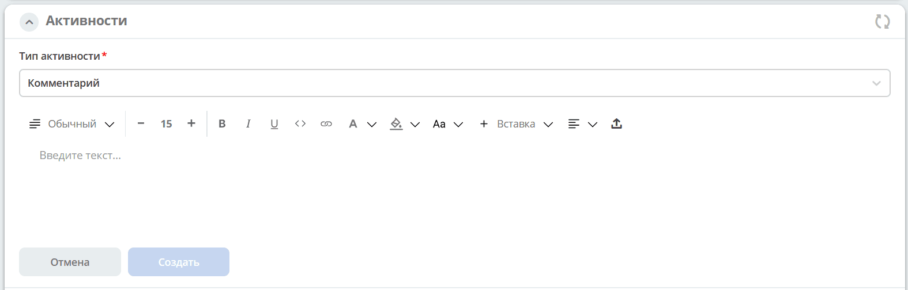

Enter a comment. Click **'Create'**.

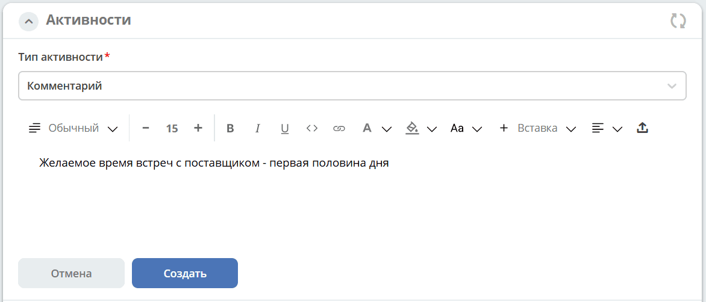

The created activity in the card:

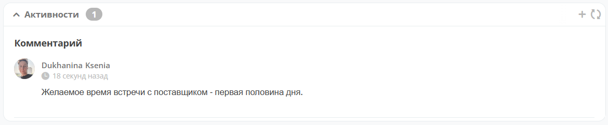

Comments from the :ref:`'Comments' <widget_comments>` widget are transferred to activities:

 - a regular comment;
 - if broadcasting of a comment from a task to the comments widget is configured, it appears in activities as a comment;
 - in :ref:`CRM <ecos-crm>`, comments on deal merges appear in activities.

Assignment
~~~~~~~~~~

The activity triggers the :ref:`assignment <ecos-assignments>` functionality. The **priority** is set to **medium** by default:

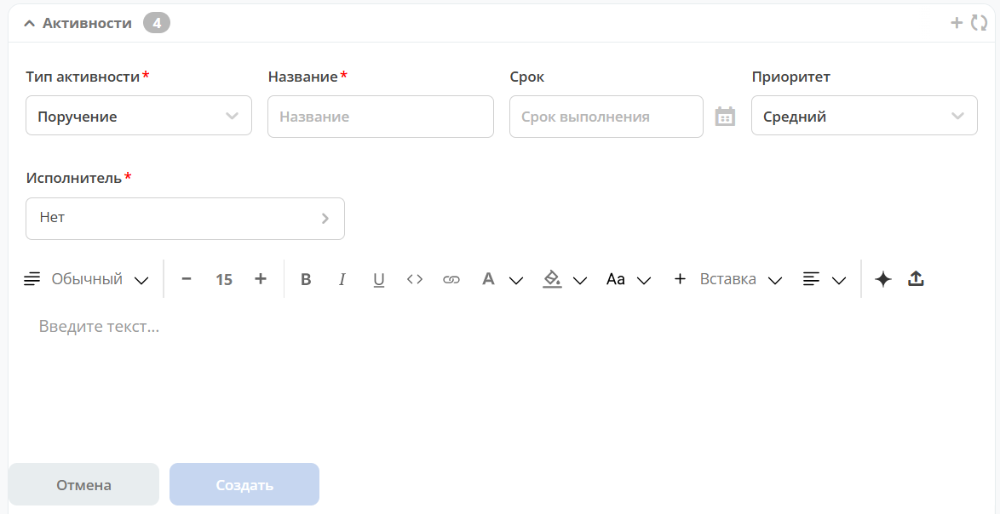

Specify the **name**, select the **deadline** and **assignee**, and change the **priority** if needed:

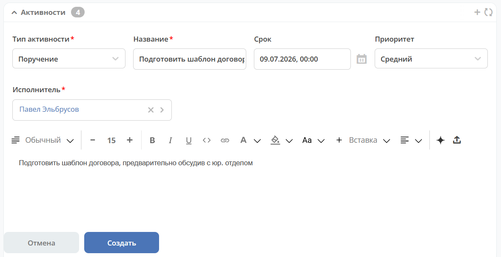

The created activity in the card:

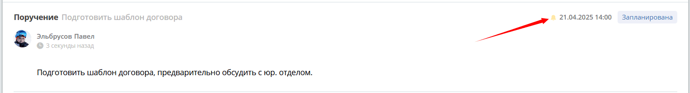

Priority is indicated by different colors:

 - green — low;
 - yellow — medium;
 - red — high.

Upon clicking:

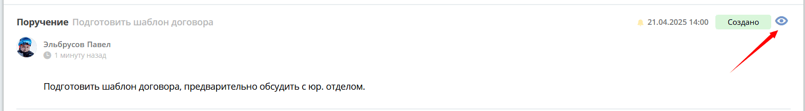

you can navigate to the assignment card to edit it:

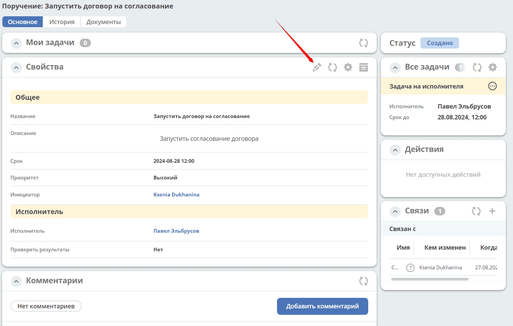

In the **'Relations'** widget, mutual links are added both in the **assignment** card and in the **deal** card:

.. list-table::
      :widths: 3 5
      :class: tight-table
      :align: center

      * - | In the assignment:
        -

              .. image:: ../_static/widgets/activity/activity_29.png
                     :width: 200
                     :align: center

      * - | In the deal:
        -

              .. image:: ../_static/widgets/activity/activity_30.png
                     :width: 200
                     :align: center

Actions with the Created Activity
---------------------------------

.. _activity_actions:

Actions are available to the author/initiator and the responsible person (if the author created the activity but assigned someone else as responsible).

Activities with the status **'Scheduled'** can be edited and deleted:

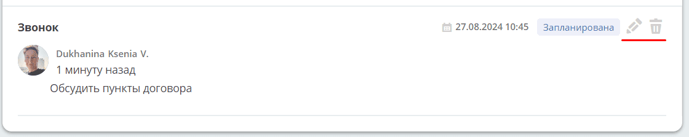

and the type **'Comment'**:

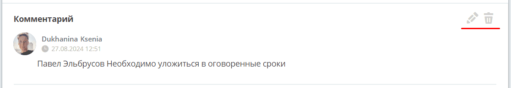

For the **'Assignment'** type, navigation to the assignment card is available:

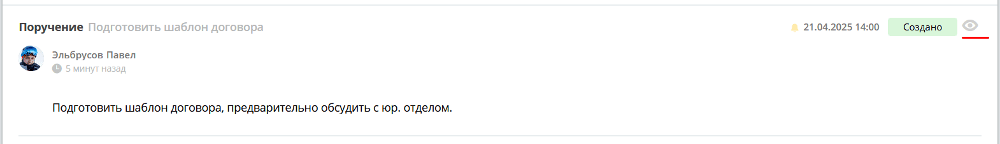

.. |br| raw:: html

      
