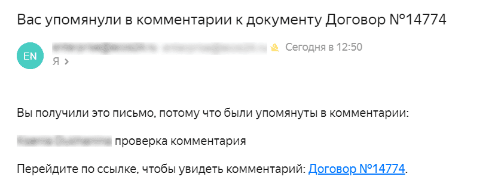
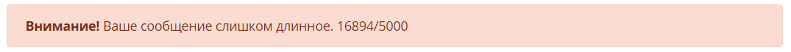
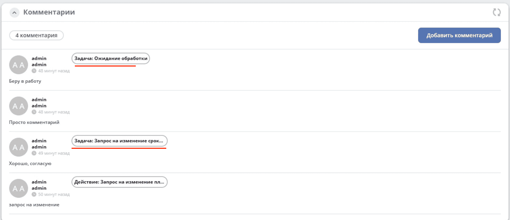

.. _widget_comments:

'Comments' Widget
===============================================

.. contents::
   :depth: 2

Key ``comments``

The widget displays comments on a document.

.. list-table::
      :widths: 10 40
      :class: tight-table

      * - **Entered comments**
        - |

            .. image:: ../_static/widgets/comment_1.png
                  :width: 600
                  :align: center

      * - **Comment input form:**
        - | Text is entered using the :ref:`visual editor <wysiwyg_editor>`, which supports formatting as well as inserting tables, code, links, and files.
          | To mention other users in a comment, use **@**.

            .. image:: ../_static/widgets/comment_2.png
                  :width: 600
                  :align: center

The mentioned user will receive an email of the following form:

The maximum number of characters in a comment is 5,000. Otherwise, an error will be shown:

See details on :ref:`separating users of different customers <UNIFIED_PRIVATE_GROUP>`.

Broadcasting Comments on Task Completion
-----------------------------------------

To enable broadcasting a comment entered during task completion to the comments widget, add the ``task-comments-broadcastable`` aspect to the data type.

.. important::

       The comment input on the task form must be added with the id ``comment``.

A comment added from a task is marked with a tag containing the task name.

If you need to disable comment broadcasting from a task for a specific record, set the ``task-comments-broadcastable:broadcastComments`` property to ``false`` on that record.
