.. _widget_gantt:

Виджет «Диаграмма Ганта»
===============================================

.. contents::
   :depth: 3

При разработке использована библиотека `Svar React Gantt <https://svar.dev/react/gantt/>`_

Диаграмма Ганта – инструмент визуализации временной шкалы проекта, включающий задачи различных типов. Диаграмма включает в себя следующие ключевые элементы управления:

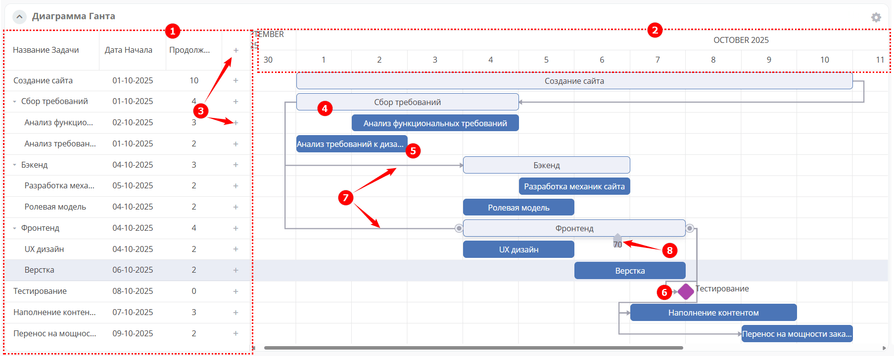

- **1** – масштаб представления
- **2** – шкала времени 
- **3** – список задач
- **4** – кнопки создания задачи

Диаграмма содержит следующие объекты:

- **5** – этап
- **6** – задача
- **7** – веха
- **8** – связи, показывающие зависимости между задачами
- **9** – прогресс выполнения задачи в %

Настройка
----------

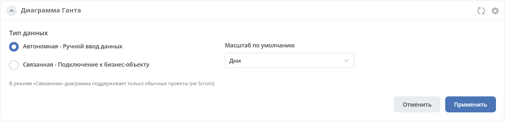

Настройки диаграммы Ганта включают:

- **Тип данных**: 

  - **Автономная** — :ref:`Ручной ввод данных<gantt-task-management>` для элементов диаграммы Ганта. 
  - **Связанная** — :ref:`Подключение к бизнес-объекту<gantt-add-to-project>`. На данный момент реализовано использование данных :ref:`простого проекта<ept_simple_project>`.

- **Масштаб по умолчанию** — масштаб, который будет отображаться при открытии диаграммы Ганта. Доступные варианты: часы, дни, недели, месяцы, годы.

Типы задач
-----------

По умолчанию в диаграмме Ганта есть три типа задач:

  - **Задача** – общая задача. Она имеет прямоугольную форму и обычно включается в этап.
  - **Этап** – группа задач, контрольных точек и других этапов.
  - **Веха** – ромбовидный маркер, обозначающий важную точку в рабочем процессе. У вех нет длительности или прогресса, поэтому можно указать только дату начала.

Цвет полосы указывает на тип задачи.

Поля для разных типов задач:

.. list-table::
      :widths: 10 10 10
      :align: center

      * - |

            .. image:: ../_static/widgets/gantt/task.png
                  :width: 400
                  :align: center

        - |

            .. image:: ../_static/widgets/gantt/summary_task.png
                  :width: 400
                  :align: center

        - |

            .. image:: ../_static/widgets/gantt/milestone.png
                  :width: 400
                  :align: center

.. _gantt-task-management:

Управление задачами и ручной ввод данных
--------------------------------------------

Диаграмма Ганта позволяет добавлять задачи, редактировать и удалять этапы, задачи и вехи, а также преобразовывать один тип задачи в другой.

Добавить задачу
~~~~~~~~~~~~~~~~

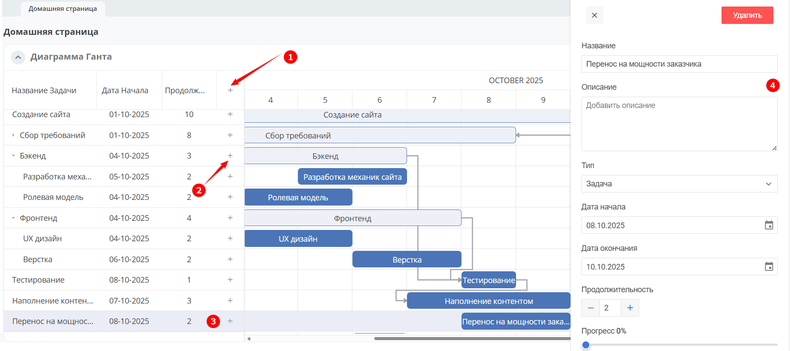

Для добавления задачи нажмите **(1)**, для подзадачи - **(2)**. Задача добавится в список.

Для заполнения данных кликните дважды на задачу **(3)**. В окне справа заполните поля о задаче **(4)**.

Редактировать, удалить
~~~~~~~~~~~~~~~~~~~~~~~

.. _widget_gantt_edit:

Дважды кликните нужную задачу **(1)** в списке задач или элемент диаграммы **(2)**. В окне справа отредактируйте информацию о задаче **(3)** или удалите по соответствующей кнопке **(4)**.

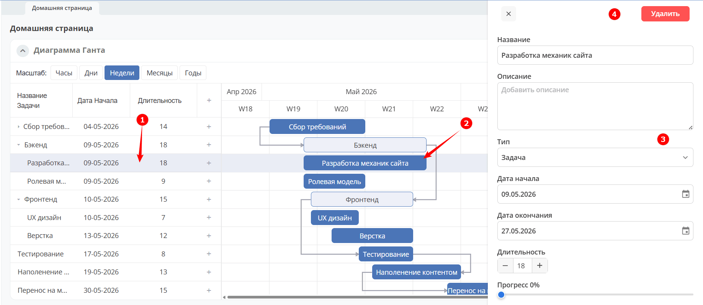

Преобразовать один тип в другой
~~~~~~~~~~~~~~~~~~~~~~~~~~~~~~~~

Дважды кликните нужную задачу **(1)** в списке задач или элемент диаграммы **(2)**. В окне справа в раскрывающемся списке выберите Тип:

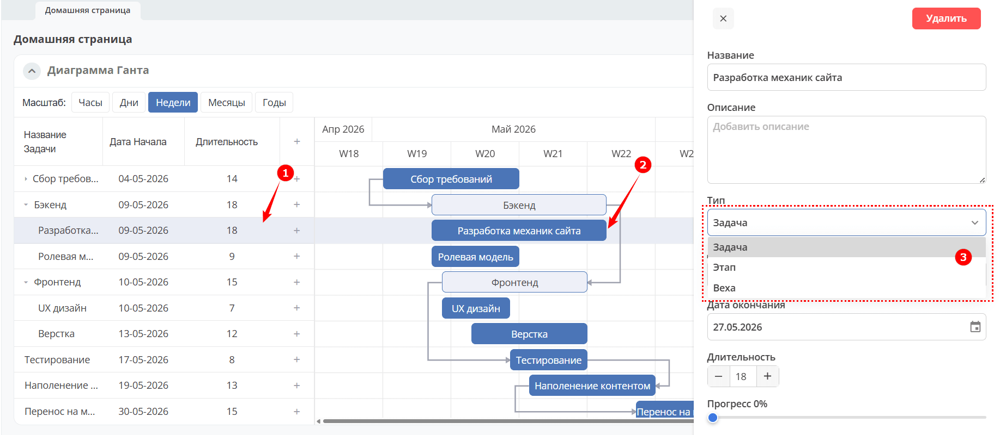

Изменить даты
~~~~~~~~~~~~~~

Для изменения даты начала задачи переместите ее за центральную часть по горизонтальной шкале.

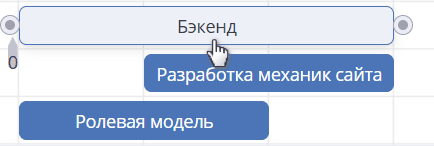

Для изменения даты начала или окончания задачи переместите ее крайнюю правую и крайнюю левую часть (область отмечена курсором изменения размера).

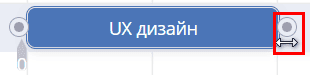

.. note::

 Длительность этапа изменить нельзя. Даты его начала и окончания нельзя изменить по отдельности. Перетаскивать этап можно только вместе с его дочерними задачами.

 То есть, если сдвинуть этап, все его дочерние задачи также будут перемещены. Если дочерняя задача переносится на начало до даты начала этапа, дата начала этапа изменяется. Если дочерняя задача переносится на завершение после даты окончания этапа, дата окончания этапа изменяется.

Вы также можете изменить даты при :ref:`редактировании задачи <widget_gantt_edit>`.

Прогресс выполнения
~~~~~~~~~~~~~~~~~~~~

Ход выполнения (прогресс) отображается в **%** для задач и этапов (не для вех). Его можно изменить, перетаскивая ползунок прогресса на задаче, этапе:

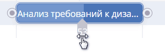

Вы также можете изменить ход выполнения в поле **«Прогресс»** :ref:`редактировании задачи <widget_gantt_edit>`.

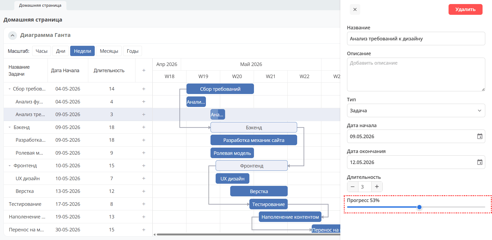

Перемещение и изменение порядка
~~~~~~~~~~~~~~~~~~~~~~~~~~~~~~~~

Для изменения порядка задач как вложенных, так и нет, в списке задач выберите задачу и перетащите ее в нужное место списка.

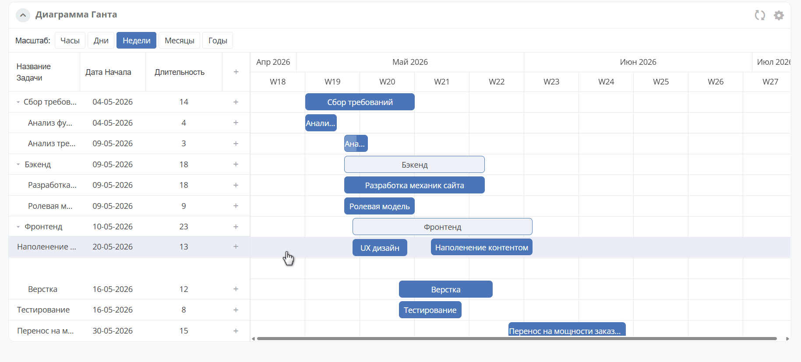

Добавление связи
~~~~~~~~~~~~~~~~~

Существует 4 типа связей между элементами диаграммы:

  - Окончание-начало
  - Начало-окончание
  - Начало-начало
  - Окончание-окончание

Для создания связи между элементами кликните круглый маркер на исходном элементе **(1)**, а затем кликните маркер на целевом элементе **(2)**.

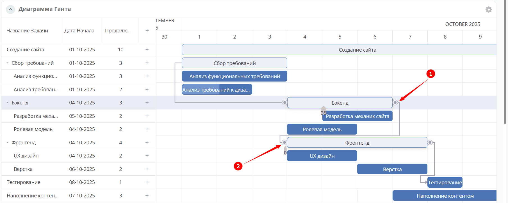

Вы также можете изменить уже установленные типы связи в полях **«Предшественники»** и/или **«Преемники»** при :ref:`редактировании задачи <widget_gantt_edit>`.
Чтобы удалить связь, нажмите кнопку **«Удалить»** рядом с типом связи.

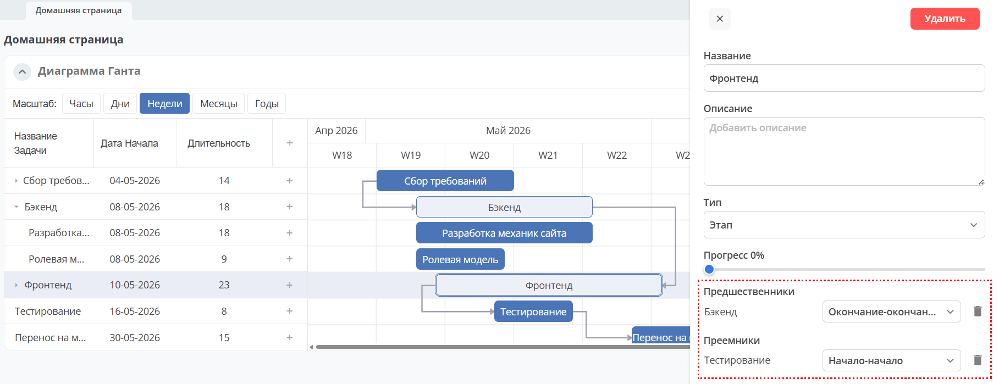

.. _gantt-add-to-project:

Добавление диаграммы Ганта в проект
--------------------------------------

В :ref:`простой проект<ept_simple_project>` может быть добавлена диаграмма Ганта.

Перейдите в рабочее пространство проекта, в настройках страницы добавьте виджет **Диаграмма Ганта**.

В настройках виджета выберите **Тип данных** - **Связанная - Подключение к бизнес-объекту**. 

В поле **Источник данных** выберите **Управление проектами**.

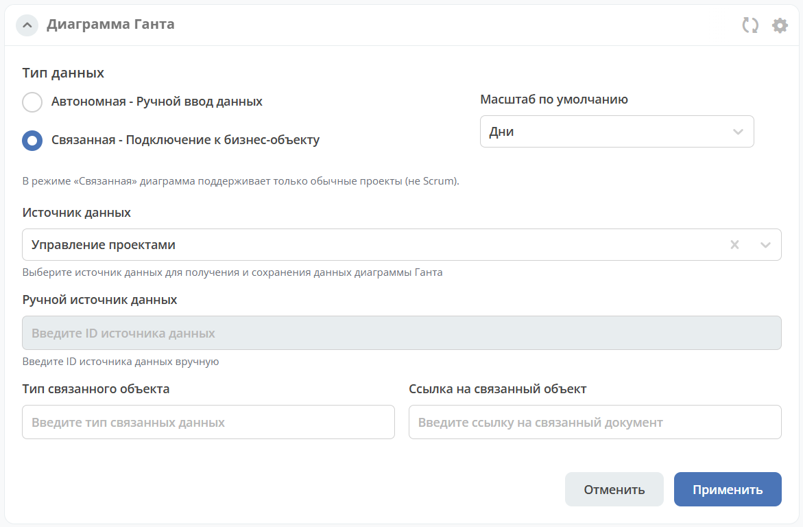

Задачи и этапы проекта будут отображаться на диаграмме Ганта.

