.. _widget_graphic_statistics:

Виджет «Графическая статистика»
===============================================

.. contents::
   :depth: 3

.. note::

    Доступно только в enterprise версии.

Ключ ``charts``

Виджет позволяет пользователям наглядно представлять и анализировать данные, повышая эффективность принятия решений и улучшая понимание текущего состояния бизнес-процессов.

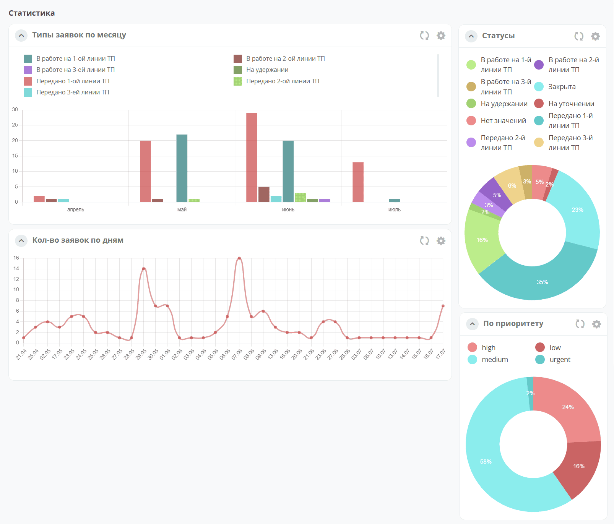

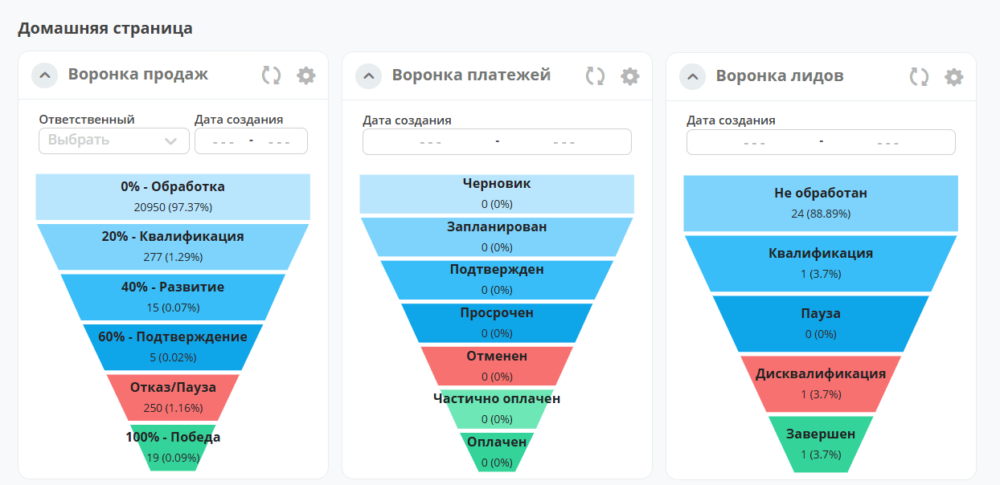

При разработке использована библиотека `Chart.js <https://www.chartjs.org/docs/latest/>`_

Виджет поддерживает различные типы графиков: линейные, столбчатые, круговые, воронки. Пользователи могут выбирать источник данных для графика, включая определенные атрибуты, колонки, связанные с кейсами и справочниками платформы Citeck.

Графики конфигурируемые - пользователи могут настраивать оси, масштабирование и т.д.

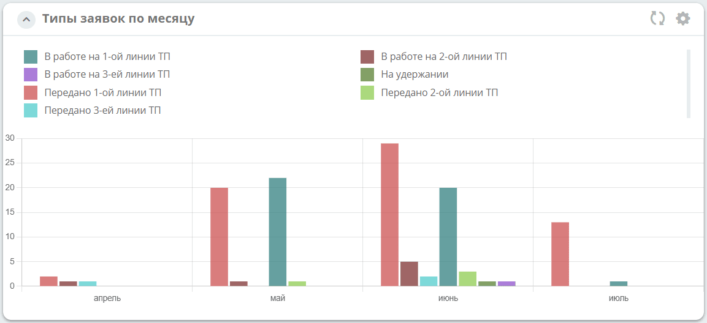

Для столбчатого, линейного, кругового тира по нажатию на пункт легенды данные пункта легенды убираются из представления графика:

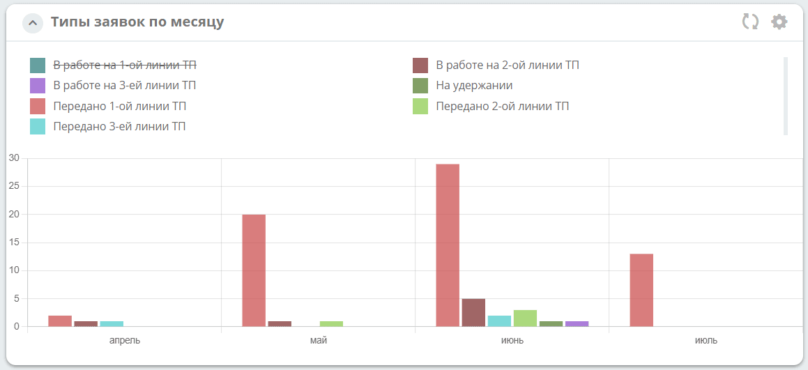

Общая конфигурация
------------------

Для всех типов графиков:

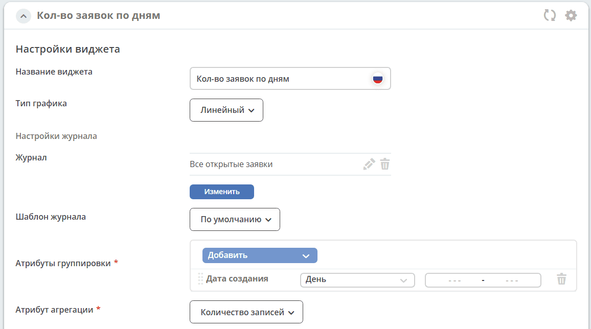

.. list-table::
      :widths: 10 40
      :class: tight-table

      * - **Название виджета**
        - Укажите наименование представления.
      * - **Тип графика**
        - |  Выберите тип из списка:
          |  - Столбчатый
          |  - Круговой
          |  - Линейный
          |  - Воронка
      * - **Настройки журнала**
        -
      * - **Журнал**
        - |  Выберите журнал, по данным которого необходимо построить график.
          |  В выбранном журнале должны быть заранее настроены колонки для группировки. Действие доступно для администратора.

          | Для разрешения группировки перейдите в журнале к необходимому столбцу, нажмите **Дополнительно**:

              .. image:: ../_static/widgets/chart_sett_01.png
                     :width: 500
                     :align: center

          | Выставите чекбокс **Можно ли группировать**:

              .. image:: ../_static/widgets/chart_sett_02.png
                     :width: 500
                     :align: center

      * - **Шаблон журнала**
        - Выберите шаблон журнала.
      * - **Атрибуты группировки**
        - | **Группировка** -  операция объединения данных в группы таким образом, чтобы у элементов в каждой группе был общий атрибут.
          | Нажмите **"Добавить"** и выберите из списка атрибуты, по которым производить группировку данных.
          | В списке представлены атрибуты, у которых в настройках разрешена группировка.
      * - **Атрибут агрегации**
        - Выберите атрибут из представленых в списке, по которому возвращать сводные данные.

Столбчатый
~~~~~~~~~~

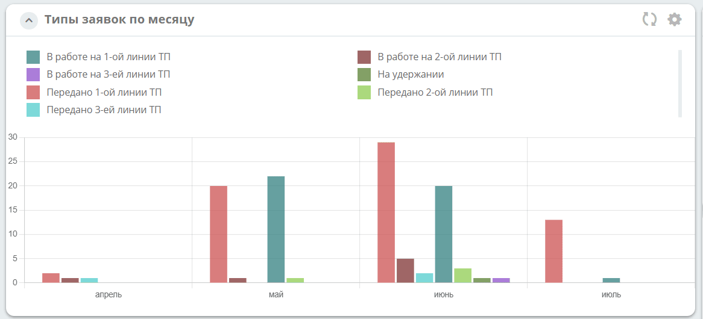

**Столбчатый график** — диаграмма, представленная прямоугольными зонами (столбцами), высоты или длины которых пропорциональны величинам, которые они отображают.

Настройка:

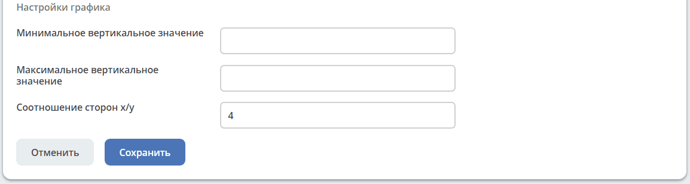

.. list-table::
      :widths: 10 40
      :name: Настройки столбчатого графика
      :class: tight-table

      * - **Минимальное вертикальное значение**
        - Минимальное значение, отображаемое на вертикальной шкале
      * - **Максимальное вертикальное значение**
        - Максимальное значение, отображаемое на вертикальной шкале
      * - **Соотношение сторон x/y**
        - Дробное. Масштабирования оси - отношение единицы X к единице Y. По умолчанию 2.

С помощью параметра **Соотношение сторон x/y** и подбора пропорций график можно выровнять по высоте. Примеры различных величин соотношений сторон:

.. list-table::
      :widths: 5 30
      :align: center

      * - **2:**
        - |

            .. image:: ../_static/widgets/chart_6.png
                  :width: 600
                  :align: center

      * - **4:**
        - |

            .. image:: ../_static/widgets/chart_7.png
                  :width: 600
                  :align: center

Линейный
~~~~~~~~

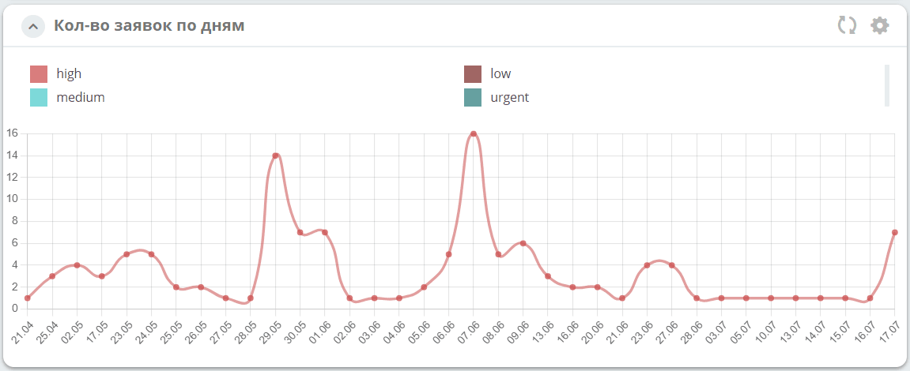

**Линейный график** позволяет размещать данные в виде точек на линии. Используется для того, чтобы отразить изменение показателей с течением времени, или же для сравнения двух наборов данных.

Настройка:

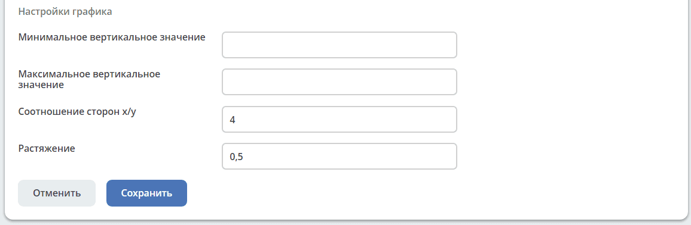

.. list-table::
      :widths: 10 40
      :name: Настройки линейного графика
      :class: tight-table

      * - **Минимальное вертикальное значение**
        - Минимальное значение, отображаемое на вертикальной шкале
      * - **Максимальное вертикальное значение**
        - Максимальное значение, отображаемое на вертикальной шкале
      * - **Соотношение сторон x/y**
        - Дробное. Масштабирования оси - отношение единицы X к единице Y. По умолчанию 2.
      * - **Растяжение**
        - Уровень плавности линии графика. По умолчанию 0.

Круговой
~~~~~~~~

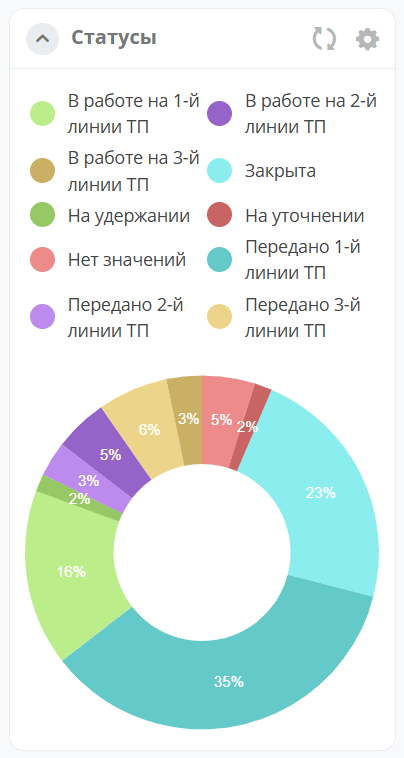

**Круговой график** представляет данные в виде круга, разделенного на сектора. Каждый сектор — категория данных, которая составляет долю от общей суммы.

Настройка:

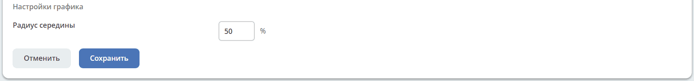

.. list-table::
      :widths: 10 40
      :name: Настройки кругового графика
      :class: tight-table
      :align: center

      * - **Радиус середины**
        - Радиус центрального круга, в процентах от радиуса основного. По умолчанию 50 %.

Воронка
~~~~~~~

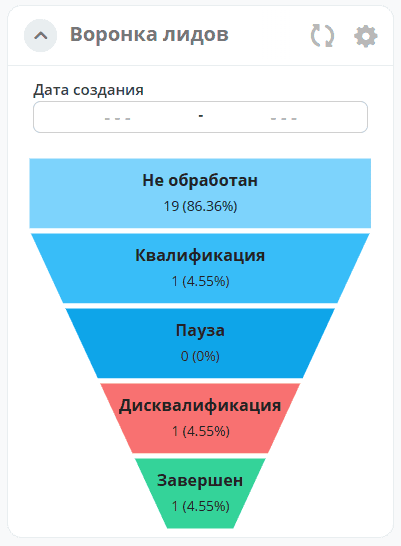

**Воронка** используется для визуализации последовательных этапов процесса, где количество элементов уменьшается на каждом шаге. На каждом уровне указывается количество элементов и процент от общего количества.

При клике на любой из уровней графика открывается журнал со списком элементов, относящихся к признаку группировки.

Настройка:

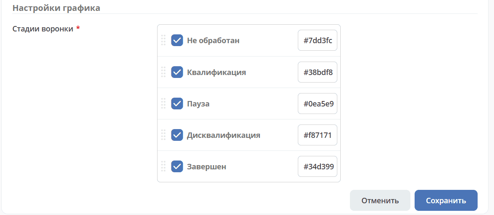

.. list-table::
      :widths: 10 40
      :name: Настройки воронки
      :class: tight-table
      :align: center

      * - **Стадии воронки**
        - Выбор стадий и цветов отображения на воронке.

Для воронки доступны:

.. grid:: 2
   :gutter: 2

   .. grid-item::

      Выбор ответственного с функцией поиска:

      .. image:: ../_static/widgets/chart_15.png
         :width: 280
         :align: center

   .. grid-item::

      Выбор периода дат:

      .. image:: ../_static/widgets/chart_16.png
         :width: 350
         :align: center

Что полезно знать при настройке
---------------------------------

**Агрегация — не только количество.** Атрибутом агрегации может быть сумма числового поля, а не только количество записей: например, сумма по колонке с суммой договора или с расходом.

**Период группировки по дате задаётся в самом виджете.** Для колонки с датой выбирается период — сутки, месяц и т. д. Отдельное поле «день» или «месяц» в типе данных для графика заводить не нужно.

**Ссылка на дашборд с графиками.** Дашборд открывается адресом ``/v2/dashboard?dashboardId=<идентификатор дашборда>``. Такую ссылку можно добавить в :ref:`меню <menu>` пунктом типа **Произвольный**, чтобы график открывался из любого раздела.

Настройка виджета в артефакте дашборда
----------------------------------------

Дашборд можно не только собрать в интерфейсе, но и поставить артефактом ``ui/dashboard``. В этом случае настройки виджета задаются в конфигурации вручную, а значения, которые в интерфейсе выбираются списком, приходится указывать точными идентификаторами.

Виджет описывается элементом с именем ``charts``; в ``props.config`` задаются:

.. list-table::
      :header-rows: 1
      :widths: 25 75
      :class: tight-table

      * - Свойство
        - Значение
      * - ``graphicTypeId``
        - Тип графика: ``vertical-bar`` (столбчатый), ``doughnut`` (круговой), ``line`` (линейный), ``funnel`` (воронка)
      * - ``journalId``
        - Ссылка на журнал, например ``uiserv/journal@deals-journal``
      * - ``typeRef``
        - Тип данных, записи которого показывает журнал
      * - ``groupByParams``
        - Список атрибутов группировки; у атрибута с датой указываются ``isDateColumn: true`` и период в ``dateParam``
      * - ``aggregationParam``
        - Выражение агрегации, например ``count(*)`` или сумма числового поля
      * - ``selectedPreset``
        - Шаблон журнала, по которому отбираются записи

.. important::

   Идентификатор типа графика должен в точности совпадать с одним из четырёх значений выше. При другом значении виджет отображается пустым — заголовок есть, графика нет, сообщения об ошибке тоже.

.. note::

   Собственный идентификатор дашборда задаётся именно в артефакте: при создании записи через API идентификатор назначает платформа, а попытка указать свой приводит к ошибке ``Dashboard with id … is not found``.
