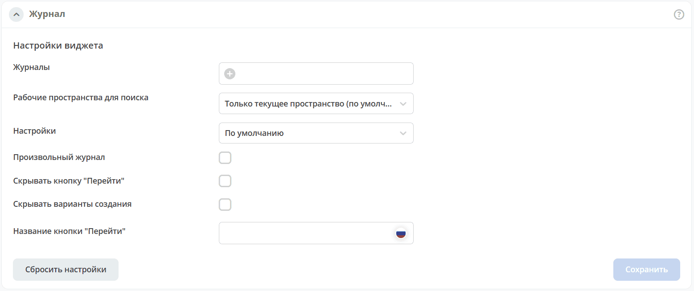
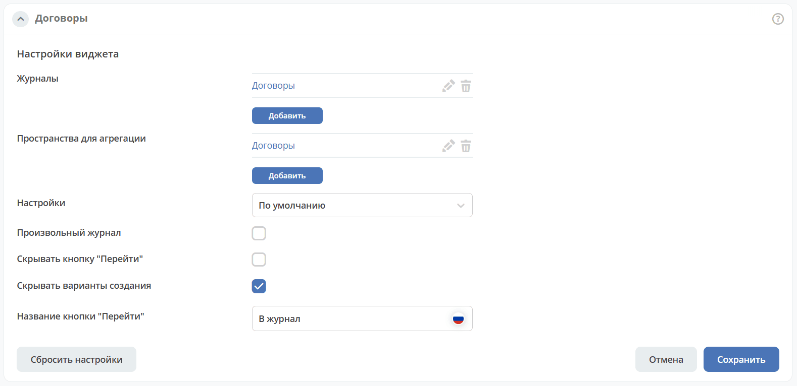
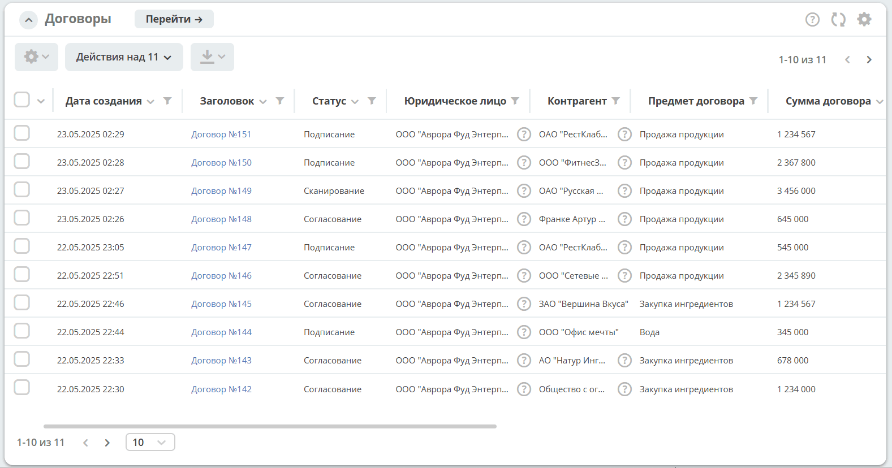

.. _widget_journal:

Виджет «Журнал»
===============================================

Ключ ``journal``

Виджет для настройки отображения журнала.

Настройка
---------

.. list-table::
   :widths: 20 60
   :class: tight-table
   :header-rows: 1

   * - Поле
     - Описание
   * - **Журналы**
     - Данные какого журнала отображать. Выбор журнала из списка.
   * - **Пространства для агрегации**
     - Выбор рабочих пространств для агрегации данных журнала. Если для агрегации не добавлено рабочее пространство, то агрегация производится по всем доступным рабочим пространствам c учетом прав.
   * - **Настройки**
     - Применяемый шаблон настроек журнала.
   * - **Произвольный журнал**
     - Возможность указать напрямую название журнала.
   * - **Скрывать кнопку "Перейти"**
     - Принудительное скрытие кнопки "Перейти".
   * - **Скрывать варианты создания**
     - Кнопка создания + будет скрыта.
   * - **Название кнопки "Перейти"**
     - Указать название кнопки.

Настроенный вид
----------------

