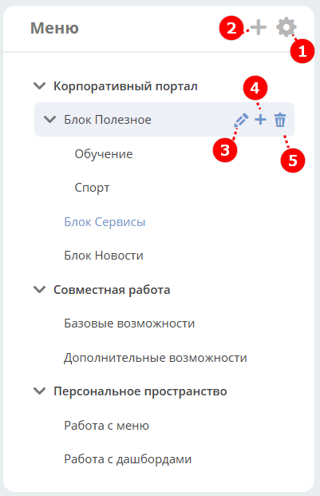
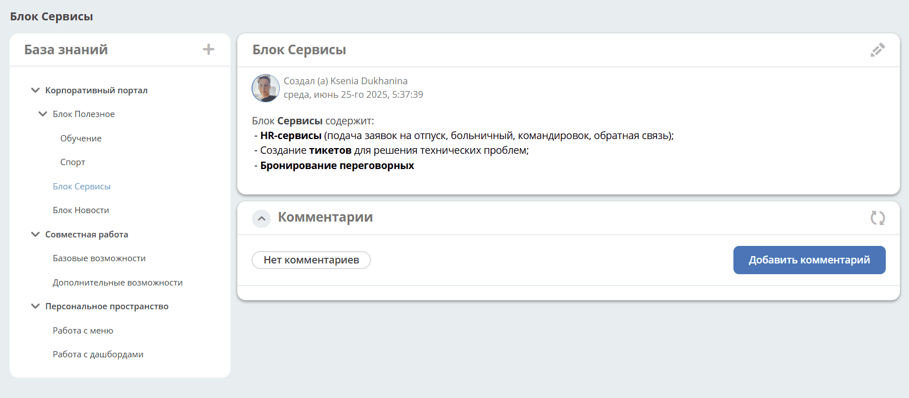
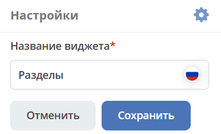
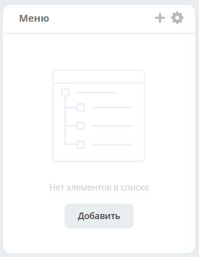

.. _widget_knowledge_base:

Виджет «Меню»
===============================================

Виджет отображает иерархическую структуру данных, что облегчает навигацию:

При выборе раздела справа открывается :ref:`публикация <widget_publication>` или карточки входящие в :ref:`категорию <tiles>`:

Управление разделами
---------------------

- Переименовать виджет (по умолчанию — **Меню**) — нажмите **(1)**.
- Добавить публикацию или раздел/категорию 1-го уровня — нажмите большой **+** **(2)**, с использованием :ref:`редактора <wysiwyg_editor>` создайте контент, сохраните:

  .. image:: ../_static/widgets/kb_03.png
         :width: 600
         :align: center

- Добавить публикацию или подраздел/категорию — нажмите маленький **+** **(4)**. Количество создаваемых публикаций/категорий в каждом уровне не ограничено.
- Редактировать — нажмите **(3)**.
- Удалить — нажмите **(5)**.

Пустой виджет выглядит следующим образом:

Для добавления публикации или раздела/ категории нажмите **+** или **"Добавить элемент"**.
