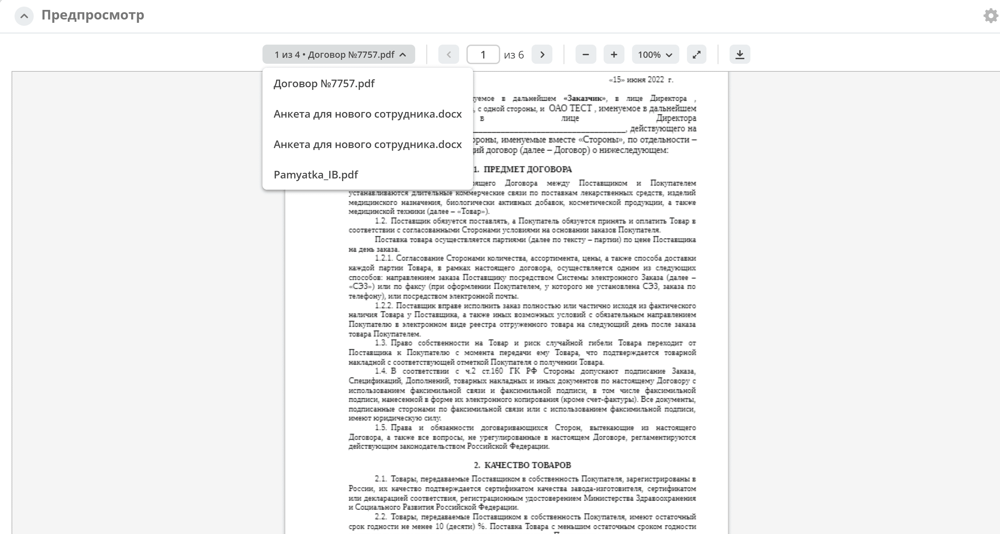
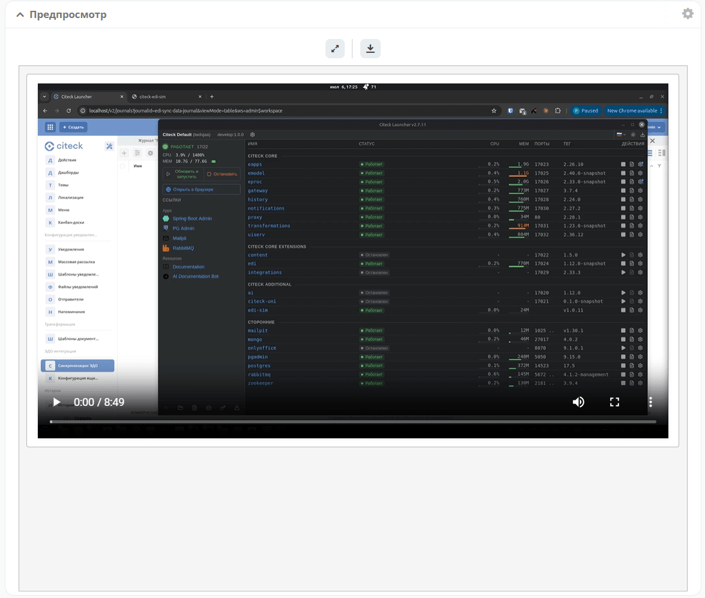

.. _widget_doc_preview:

Виджет «Предпросмотр»
===============================================

Ключ ``doc-preview``

Виджет предпросмотра служит для отображения основного документа и всех связанных из атрибута «Содержимое». Позволяет осуществлять скачивание не только основного, а текущего открытого документа.

Оригиналы документов могут быть других расширений, но виджет показывает только картинки или сгенерированные pdf на базе основного.

С включённой настройкой в виджете показываются все связанные документы.

Первым отображается основной контент *_content*, затем документы, которые загружены в виджет документов (ассоциация **docs:documents**).

Если основной отсутствует, то отобразится следующий документ.

Переход между документами осуществляется через дропдаун или скролл. Количество документов указано в дропдауне:

Содержимое виджета обновляется при изменениях основного и связанных документов.

Помимо документов, изображений и pdf, виджет умеет показывать текстовые, markdown-, видео- и аудиофайлы — такие вложения можно просматривать и прослушивать прямо в системе, не скачивая.

Список всех поддерживаемых расширений:

.. list-table::
   :header-rows: 1
   :class: tight-table

   * - Тип
     - Расширения
   * - Документ
     - ``doc``, ``docx``, ``xlsx``, ``pptx``
   * - PDF
     - ``pdf``
   * - Изображение
     - ``png``, ``jpg``, ``jpeg``, ``gif``, ``bmp``, ``webp``, ``svg``, ``ico``, ``tif``, ``tiff``
   * - Текст
     - ``txt``, ``log``, ``har``, ``csv``, ``xml``, ``html``, ``json``, ``yaml``, ``yml``
   * - Видео
     - ``mp4``, ``webm``, ``ogv``, ``mov``, ``m4v``, ``avi``, ``mkv``
   * - Аудио
     - ``mp3``, ``wav``, ``ogg``, ``oga``, ``m4a``, ``aac``, ``flac``, ``opus``
   * - Markdown
     - ``md``, ``markdown``

