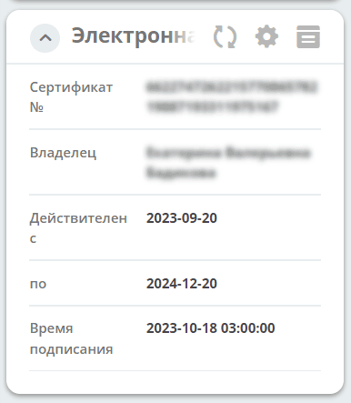
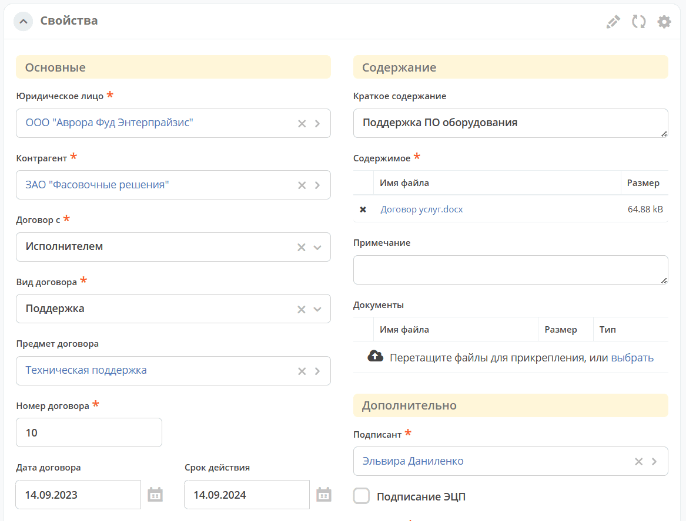
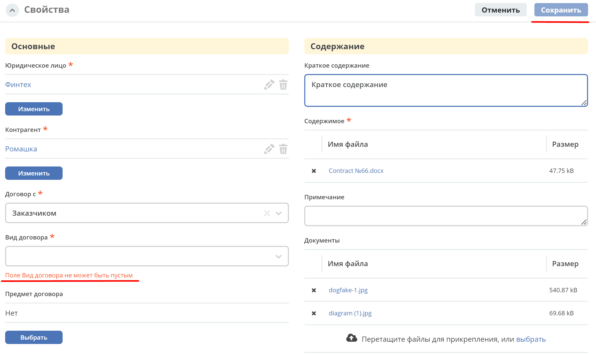

.. _widget_properties:

Виджет «Свойства»
===============================================

.. contents::
   :depth: 2

Ключ ``properties``

Виджет для отображения атрибутов карточки формы и их значений. Предоставляет возможность inline редактирования значений атрибутов или редактирование в режиме "формы" (с учетом статуса кейса, наличия прав у просматривающего кейс пользователя).

Настройка
---------

Список для выбора - формы из журнала форм.

.. grid:: 2
   :gutter: 2

   .. grid-item::

      .. image:: ../_static/widgets/Properties_1.png
         :width: 400
         :align: left

   .. grid-item::

      .. image:: ../_static/widgets/Properties_2.png
         :width: 500
         :align: left

Настроенный вид
----------------

Для типа дашборда :ref:`Case-details <dashboard_types>` реализовано 2 режима (см. настройки ниже):

.. tab-set::

   .. tab-item:: Просмотр с inline-редактированием

      .. image:: ../_static/widgets/Properties_3.png
         :width: 500
         :align: center

   .. tab-item:: Режим формы

      .. image:: ../_static/widgets/Properties_4.png
         :width: 500
         :align: center

При выборе свойства **Электронная подпись** отображаются данные о сертификате ЭЦП и времени подписания:

Для виджета так же доступен переход в конструктор формы для дополнительной настройки полей. См. подробную статью :ref:`Формы <forms>`

.. grid:: 2
   :gutter: 2

   .. grid-item::

      .. image:: ../_static/widgets/form_builder_icon.png
         :width: 200
         :align: center

   .. grid-item::

      .. image:: ../_static/widgets/form_builder_form.png
         :width: 500
         :align: center

Настройка режима редактирования виджета для типа дашборда Case-details
----------------------------------------------------------------------

Для типа дашборда Case-details доступна настройка режима просмотра с возможностью inline редактирования значений атрибутов или редактирования в режиме "формы".
По умолчанию выставлен режим просмотра.

.. dropdown:: Как изменить режим
   :color: secondary

   1. В карточке нажмите **шестеренку -> «Настроить страницу»**:

      .. image:: ../_static/widgets/case_edit_1.png
         :width: 400
         :align: center

   2. В настройке карточки перейдите в раздел **"Виджеты"**, у **виджета "Свойства"** нажмите:

      .. image:: ../_static/widgets/case_edit_2.png
         :width: 600
         :align: center

   3. В настройках выберите **"Режим редактирования"** и нажмите **"Применить"**:

      .. image:: ../_static/widgets/case_edit_3.png
         :width: 400
         :align: center

   4. В настройке карточки нажмите **"Применить"**.

Особенности режима редактирования
~~~~~~~~~~~~~~~~~~~~~~~~~~~~~~~~~~

В виджете при открытии страницы дашборда доступны свойства документа в режиме редактирования, аналогично открытию документа в модальном окне редактирования:

Если пользователь вносит изменения, то в шапке виджета становятся доступны кнопки **"Отмена"** и **"Сохранить"**.

Если изменений нет - кнопки в шапке виджета отсутствуют.

Если поля при редактировании не проходят валидацию -  кнопка **"Сохранить"** становится не доступна для нажатия:

