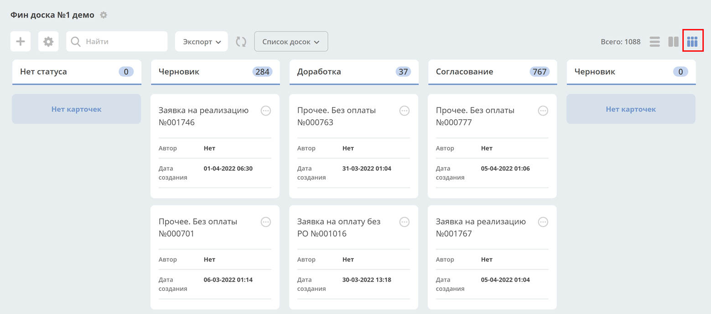
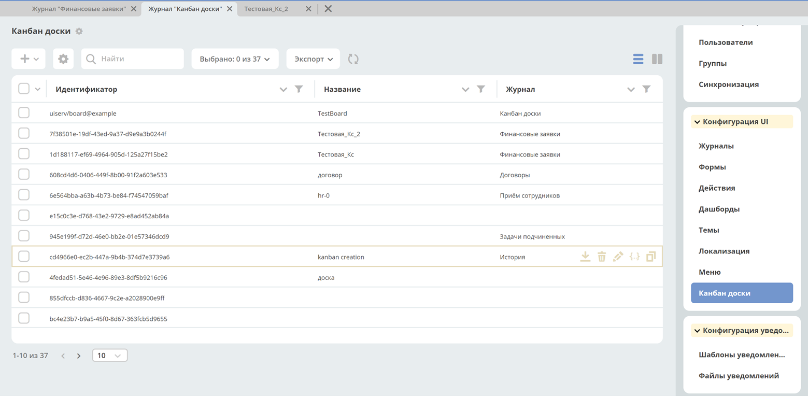

================
**Канбан-доска**
================

**Канбан-доска** - это представление данных системы выбранного типа данных.
В колонках доски отображаются статусы выбранного типа, а на самой доске - созданные экземпляры
этого типа на основе примененного фильтра.

Канбан-доска является дополнительным представлением журнала.

У журнала может быть несколько сконфигурированных канбан-досок – Список досок.
Фильтры, примененные в журнале, применяются и на канбан-доске, и наоборот.

Конфигурация
------------------

Журнал с конфигурациями: **Инструменты → Конфигурация UI → Канбан доски**

Действия
~~~~~~~~~~~~~~~~~~
Возможные действия с доской:
.. image:: _static/KB9.png
       :align: center
       :alt: Доска действия

 скачать yaml
 удалить доску
 редактировать свойства доски. 
 редактор json. 
 
 .. image:: _static/KB3.png
       :align: center
       :alt: Журнал Канбан доски

 копировать

Форма создания
~~~~~~~~~~~~~~~~~~

**+ → Создать конфигурацию канбан-доски**

 .. image:: _static/KB4.png
       :align: center
       :alt: Форма создания

.. list-table:: Поля формы
      :widths: 10 40 10
      :header-rows: 1

      * - Поле
        - Описание
        - Номер
      * - Идентификатор доски
        - Генерируется автоматически. 
        - 
      * - Имя канбан-доски
        - Отображаемое имя доски. Отображается в списке канбан-досок, и как title страницы. Укажите вручную. Если не указывать, то будет сгенерировано автоматически.
        - 2
      * - Возможно ли перемещать сущности между статусами
        - Использование drag’n’drop при перемещении между статусами. Внимание! Перемещение не означает изменение бизнес-процесса.
        - 7
      * - Тип
        - Тип сущности, который необходимо отражать на доске. Выбор из списка уже созданных типов. Может быть выбрано только 1 значение. В соответствии с типом в колонках можно выбирать связанные с ним статусы.
        - 5
      * - Журнал
        - Журнал для типа данных. Для какого журнала создается представление канбан-доска. Выбор из списка уже созданных журналов. Может быть выбрано только 1 значение.
        - 1
      * - Форма
        - Форма карточки для отображения сущности. Выбор из списка уже созданных типов. Может быть выбрано только 1 значение. Если форму не выбирать, то на канбан-доске будет отображение сущности по умолчанию со следующими данными: Автор; Дата создания.
        - 4
      * - Действия
        - UI действия над сущностью на доске. Выбор из списка уже созданных действий. Может быть выбрано несколько значений.
        - 6
      * - Колонки
        - Конфигурация колонок
        - 3

Соответствие полей конфигурации и UI:

 .. image:: _static/KB5.png
       :align: center
       :alt: Поля UI

Конфигурация колонок
~~~~~~~~~~~~~~~~~~

Выберите статус. Статусы в выпадающем списке указаны в соответствии с выбранным типом сущности.
Выбранный статус будет автоматически указан в колонке **«Системное имя»**.

 .. image:: _static/KB6.png
       :align: center
       :alt: Колонки

В **«Название колонки»** укажите название, которое будет отображаться на канбан-доске.

 .. image:: _static/KB7.png
       :align: center
       :alt: Колонки заполненные

Заполненная конфигурация
------------------

 .. image:: _static/KB8.png
       :align: center
       :alt: Заполненная конфигурация