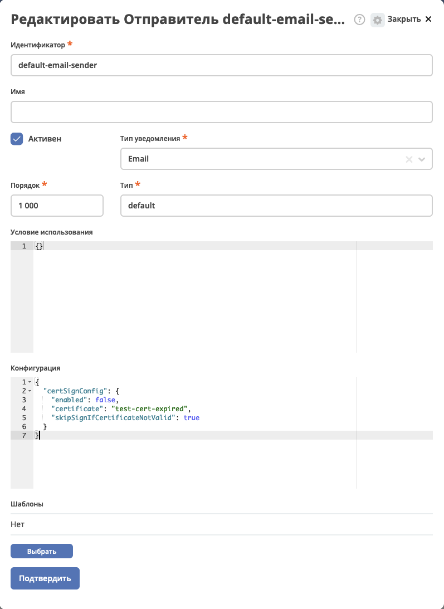

Отправки электронных писем, подтверждённых ЭЦП
==============================================

.. _mail_eds:

Хранение сертификатов
----------------------

В **Разделе Администратора → Модель → Секреты** добавлен новый тип **"Сертификаты"**, куда можно загрузить приватный ключ и сертификат:

Для информативности у загруженного сертификата добавлена информацию о статусе и сроках действия.

Включение подписания 
---------------------

.. note::

    Подписание доступно только с enterprise лицензией и включенной фичей email-certificate-sign.

Подпись писем конфигурируется в настройках **Отправителя** (Раздел Администратора → Конфигурация уведомлений). Данная конфигурация доступна у отправителей с типом уведомления **email_notification** и типом **default**:

.. code-block::

    {
    "certSignConfig": {
        "enabled": true,
        "certificate": "test-cert-expired",
        "skipSignIfCertificateNotValid": true
    }
    } 

* **enabled** - включено подписание письма или нет.
* **certificate** - id сикрета, в котором находится сертификат для подписания.
* **skipSignIfCertificateNotValid** - если значение **false**, то письмо будет подписано сертификатом в любом случае, даже если сертификат просрочен. Если значение **true** и сертификат не валиден по сроку действия, то письмо не будет подписано.

В dto ecos-events уведомления **NotificationEventDto** добавлен объект **sendingMeta** с информацией о результате подписания в переменной **signResult**:

.. code-block::

    enum class EmailSignResult {
        NOT_REQUIRED,
        SUCCESS,
        SKIPPED_BECAUSE_CERTIFICATE_EXPIRED,
        SKIPPED_BECAUSE_CERTIFICATE_NOT_YET_VALID,
        SKIPPED_BECAUSE_CERTIFICATE_UNKNOWN_ERROR,
    } 

Подписанные письма в клиентах
-------------------------------

Отображение подписанных писем работает в Microsoft Outlook, выглядит следующим образом:

1. Письмо, подписанное валидным сертификатом:

2. Письмо, подписанное истекшим сертификатом:

Напоминания о сроке действия сертификатов
--------------------------------------------

В  **Разделе Администратора → Конфигурация уведомлений** добавлен журнал **Напоминания**.

На данный момент доступен один тип напоминания - **"Истечение срока действия сертификата"**. В дальнейшем можно будет реализовать различные напоминания.

* **Шаблон уведомления** - какой шаблон уведомления будет использоваться при отправке уведомления.
* **Получатели** - получатели уведомления.
* **Сертификаты** - сертификаты, по которым нужно отправлять напоминания.

**Пороговые значения напоминания:**

Время для отправки уведомлений о приближении срока действия сертификата в формате **Duration**. Этот формат позволяет указать интервал времени, за который нужно отправить уведомление до истечения срока действия.

Примеры формата:

 - **15d** - уведомление будет отправлено за 15 дней до истечения.
 - **6h** - уведомление будет отправлено за 6 часов до истечения.
 - **1h 30m** - уведомление будет отправлено за 1 час 30 минут до истечения.

Важно:

 - Используйте сокращения: **d** для дней, **h** для часов, **m** для минут.
 - Интервалы можно комбинировать, например, **2d 4h** означает 2 дня и 4 часа.

При создании напоминания будут сформированы объекты массовой рассылки с отложенной отправкой. Посмотреть их можно в журнале **Конфигурация уведомлений → Массовая рассылка** или на карточке напоминания, в соответствующем журнале.

При выключении, удалении или изменении конфигурации напоминания, происходит пересчет/отмена отложенной отправки.

При изменении сертификата, если по нему есть настроенное напоминание, напоминание будут пересчитаны.

В систему добавлен стандартный шаблон уведомления **default-certificate-expiration-template** с текстом:

.. code-block::

    Приближается окончание срока действия сертификата <a href="${link.getRecordLink(doc_ref)}" target="_blank">${certName}</a>, действительного до ${expDate?string.short}.