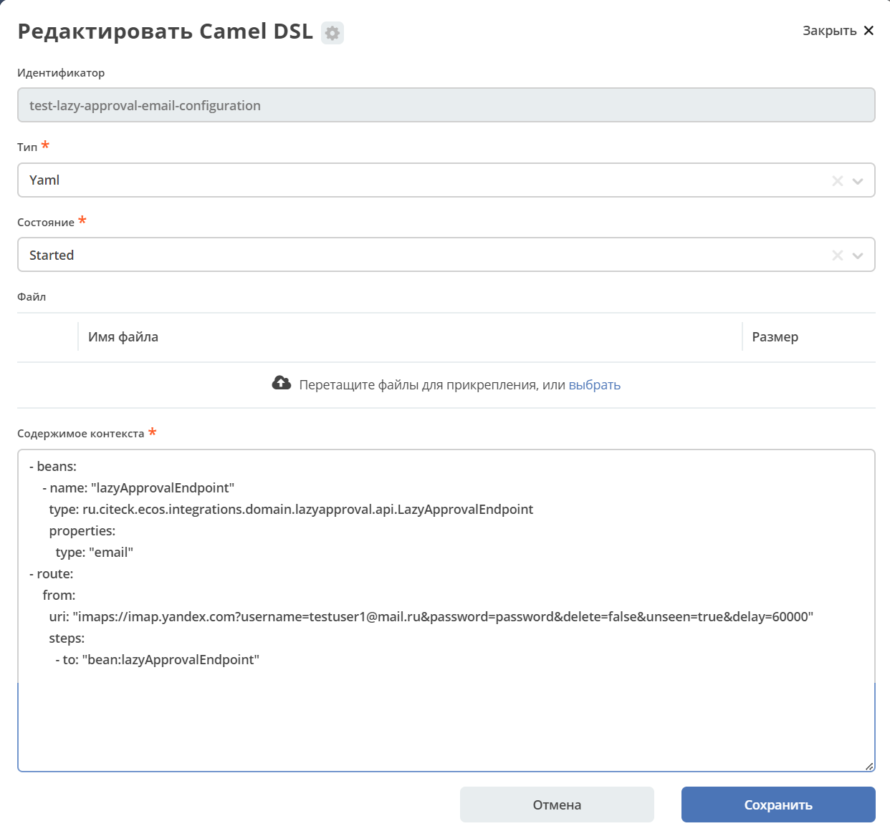
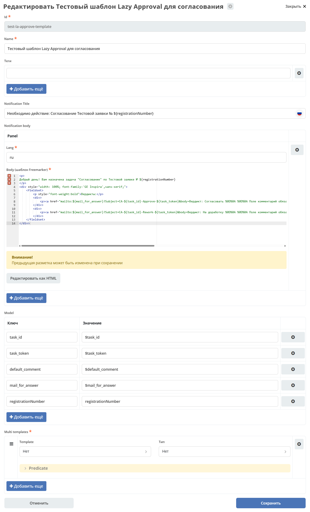

Функционал Lazy approval для задачи
===================================

.. _lazy_approval_settings:

.. _notification_lazy_approval:

.. contents::

.. note::

  Доступно только в  Enterprise версии.

**Lazy approval** – функционал, позволяющий принимать решения из электронной почты, не заходя в Citeck.

Пользователь получает письмо с кликабельными ссылками-вердиктами. При нажатии на ссылку открывается
почтовый клиент с предзаполненным ответным письмом. После отправки ответа система автоматически
завершает задачу от имени пользователя.

Для активации данного функционала необходимо иметь следующие версии микросервисов:

  - ecos-process:  **2.17.0 +**
  - ecos-integration: **2.18.0 +**

1. Принцип работы
------------------

.. code-block::

   1. Задача создаётся в BPMN-процессе (UserTask с ecos:laEnabled="true")
   2. Система отправляет email исполнителю(ям) задачи с вердиктами-ссылками
   3. Пользователь нажимает на ссылку вердикта → почтовый клиент открывает
      предзаполненное ответное письмо с нужной темой и телом
   4. Пользователь добавляет комментарий между метками [comment]...[comment]
      и отправляет письмо
   5. Apache Camel читает почтовый ящик через IMAP и передаёт письмо
      в LazyApprovalEndpoint (ecos-integrations)
   6. Система парсит тему письма: Prefix-{taskId}-{outcome}-{taskToken}
   7. Система извлекает комментарий из тела письма
   8. Задача завершается от имени пользователя с нужным вердиктом и комментарием
   9. Отправляется отчётное письмо (если настроено)

**Формат темы ответного письма:**

.. code-block::

   <Prefix>-<taskId>-<Outcome>-<taskToken>

Где:

- ``Prefix`` — произвольная строка (например ``CA``). Используется для идентификации типа письма.
- ``taskId`` — UUID идентификатор задачи Camunda. Подставляется автоматически через переменную ``${task_id}``.
- ``Outcome`` — идентификатор вердикта (``id`` из ``ecos:outcomes`` задачи). **Должен совпадать с id вердикта задачи.**
- ``taskToken`` — UUID токен безопасности, генерируемый при создании задачи. Подставляется через ``${task_token}``.

**Извлечение комментария из тела письма:**

Комментарий извлекается из текста между метками ``[comment]`` и ``[comment]``:

.. code-block::

   Вердикт: Согласовать

   Поле комментарий обязательно для заполнения

   $[comment]
   Ваш комментарий здесь
   [comment]

   ${default_comment}

Конструкция ``$[comment]`` является подсказкой-заполнителем (placeholder) и будет
заменена реальным текстом при редактировании. Финальный комментарий — текст между
``[comment]`` и ``[comment]`` в отправленном письме.

2. Переменные конфигурации
---------------------------

Для обеспечения работы Lazy approval необходимо заполнить некоторые переменные в конфигурации Citeck:

  .. image:: _static/lazy_approval/LA_02.png
        :width: 700
        :align: center

.. list-table::
   :header-rows: 1
   :widths: 40 60

   * - Ключ конфигурации
     - Описание
   * - ``lazy-approval-mail-for-reply``
     - Email-адрес, на который пользователь отправляет ответ с вердиктом.
       Именно этот адрес настраивается в Camel DSL для чтения входящих писем.
       Подставляется в шаблон через переменную ``${mail_for_answer}``.
   * - ``lazy-approval-default-comment``
     - Комментарий по умолчанию, который вставляется в тело ответного письма.
       Подставляется в шаблон через переменную ``${default_comment}``.

3. Настройка UserTask в BPMN
------------------------------

Lazy approval включается на уровне конкретного UserTask через ECOS-атрибуты.

.. list-table::
   :header-rows: 1
   :widths: 45 55

   * - Атрибут
     - Описание
   * - ``ecos:laEnabled="true"``
     - Включает Lazy approval для задачи. При создании задачи система автоматически
       отправит уведомление и сгенерирует токен безопасности.
   * - ``ecos:laNotificationType="EMAIL_NOTIFICATION"``
     - Тип уведомления. На текущий момент поддерживается только ``EMAIL_NOTIFICATION``.
   * - ``ecos:laNotificationTemplate="notifications/template@<id>"``
     - Ссылка на шаблон уведомления с вердиктами. Статически заданный шаблон.
   * - ``ecos:laManualNotificationTemplateEnabled="true"``
     - Включает режим динамического шаблона (из переменной процесса).
       Если ``true``, используется ``laManualNotificationTemplate`` вместо ``laNotificationTemplate``.
   * - ``ecos:laManualNotificationTemplate="${variable}"``
     - Шаблон уведомления из переменной процесса. Может содержать expression ``${varName}``
       или прямой ref ``notifications/template@<id>``.
   * - ``ecos:laNotificationAdditionalMeta``
     - Дополнительные переменные для модели шаблона (JSON-объект).
   * - ``ecos:laReportEnabled="true"``
     - Включает отправку отчётного письма после обработки ответа пользователя.
   * - ``ecos:laSuccessReportNotificationTemplate``
     - Шаблон отчётного письма об успешном завершении задачи (переопределяет значение из конфигурации).
   * - ``ecos:laErrorReportNotificationTemplate``
     - Шаблон отчётного письма о неудачном завершении задачи (переопределяет значение из конфигурации).

**Пример XML UserTask с Lazy approval:**

.. code-block:: xml

   <bpmn:userTask
     id="approvalTask"
     name="Согласование"
     ecos:laEnabled="true"
     ecos:laNotificationType="EMAIL_NOTIFICATION"
     ecos:laNotificationTemplate="notifications/template@my-approval-la-template"
     ecos:laReportEnabled="true">
   </bpmn:userTask>

**Пример с шаблоном из переменной процесса:**

.. code-block:: xml

   <bpmn:userTask
     id="approvalTask"
     name="Согласование"
     ecos:laEnabled="true"
     ecos:laNotificationType="EMAIL_NOTIFICATION"
     ecos:laNotificationTemplate="notifications/template@my-approval-la-template"
     ecos:laManualNotificationTemplateEnabled="true"
     ecos:laManualNotificationTemplate="${laTemplateRef}"
     ecos:laReportEnabled="false">
   </bpmn:userTask>

4. Настройка обработки ответных сообщений через Camel DSL
----------------------------------------------------------

В системе обработка ответных сообщений от пользователей обеспечивается за счет чтения почты на основе конфигурации через Camel DSL:

  .. image:: _static/lazy_approval/LA_06.png
        :width: 700
        :align: center

Пример настройки Camel DSL **lazy-approval-email-configuration**:

.. code-block::

  ---
  id: lazy-approval-email-configuration
  type: YAML
  state: STARTED
  content: |-
    - beans:
        - name: "lazyApprovalEndpoint"
          type: ru.citeck.ecos.integrations.domain.lazyapproval.api.LazyApprovalEndpoint
          properties:
            type: "email"
    - route:
        from:
          uri: "imaps://imap.yandex.com?username=testuser1@mail.ru&password=password&delete=false&unseen=true&delay=60000"
          steps:
            - to: "bean:lazyApprovalEndpoint"

**Общий принцип работы:**

В системе создается бин типа **"email"**, что указывает, что сообщения необходимо обрабатывать, как сообщения, пришедшие из почты. (В дальнейшем количество типов может быть расширено).

Затем устанавливается **route**, в котором указываются настройки параметров подключения почты и правил обработки сообщений.

Полученные сообщения из почты отправляются в систему, где бин (который описан выше) их обрабатывает и делает соответствующие действия в системе.

Параметры **route uri**:

.. list-table::
   :header-rows: 1
   :widths: 25 75

   * - Параметр
     - Описание
   * - ``username``
     - Email-адрес, на котором настроено чтение ответных писем. Должен совпадать
       со значением конфига ``lazy-approval-mail-for-reply``.
   * - ``password``
     - Пароль для подключения к почтовому серверу.
   * - ``delete``
     - Удалять ли письма из ящика после обработки. Рекомендуется ``false``.
   * - ``unseen``
     - Обрабатывать только непрочитанные письма. **Обязательно устанавливать ``true``**,
       иначе одно письмо будет обрабатываться бесконечно.
   * - ``delay``
     - Частота проверки почтового ящика в **миллисекундах**. Пример: ``60000`` = 1 минута.

5. Шаблоны уведомлений для Lazy approval
-----------------------------------------

  .. image:: _static/lazy_approval/LA_08.png
        :width: 700
        :align: center

5.1 Переменные шаблона
~~~~~~~~~~~~~~~~~~~~~~~

Помимо стандартных переменных из :ref:`модели шаблона<notification_templates>`,
в шаблонах Lazy approval автоматически доступны следующие переменные:

.. list-table::
   :header-rows: 1
   :widths: 30 70

   * - Переменная
     - Описание
   * - ``task_id``
     - UUID идентификатор задачи. Используется в теме ответного письма.
   * - ``task_token``
     - UUID токен безопасности, сгенерированный при создании задачи.
       Защищает от несанкционированного завершения задачи.
   * - ``mail_for_answer``
     - Email для отправки ответа с вердиктом. Берётся из конфигурации
       ``lazy-approval-mail-for-reply``.
   * - ``default_comment``
     - Комментарий по умолчанию. Берётся из конфигурации
       ``lazy-approval-default-comment``.

  .. image:: _static/lazy_approval/LA_03.png
        :width: 700
        :align: center

5.2 FTL-шаблон с вердиктами
~~~~~~~~~~~~~~~~~~~~~~~~~~~~

FTL шаблон с использованием вердиктов:

.. code-block::

  

  Тестовое тело нотификации!
  

  

      <fieldset>
          
Вердикты:

          

              
<a href="mailto:${mail_for_answer}?Subject=CA-${task_id}-Done-${task_token}&body=Вердикт: Согласовать %0D%0A %0D%0A Поле комментарий обязательно для заполнения %0D%0A %0D%0A $[comment] %0D%0A %0D%0A ${default_comment} %0D%0A %0D%0A [comment]" target="_top">Согласовать / Approve</a>

          

      </fieldset>
  

**Структура ссылки вердикта:**

.. code-block::

   mailto:${mail_for_answer}
     ?Subject=CA-${task_id}-<Outcome>-${task_token}
     &body=...%0D%0A$[comment]%0D%0A${default_comment}%0D%0A[comment]

- ``CA`` — произвольный префикс (может быть любым).
- ``<Outcome>`` — **id вердикта**, строго совпадающий с ``id`` в ``ecos:outcomes`` задачи.
- ``%0D%0A`` — перенос строки (URL-encoded ``\r\n``).
- ``$[comment]`` / ``[comment]`` — маркеры для извлечения комментария.

Итоговый шаблон должен выглядеть примерно следующим образом:

 .. image:: _static/lazy_approval/LA_04.png
       :width: 700
       :align: center

|

 .. image:: _static/lazy_approval/LA_05.png
       :width: 700
       :align: center

5.3 Пример уведомления Lazy approval к задаче
~~~~~~~~~~~~~~~~~~~~~~~~~~~~~~~~~~~~~~~~~~~~~~

Рассмотрим пример уведомления Lazy approval к задаче согласования со следующими вердиктами:

 .. image:: _static/lazy_approval/sample_01.png
       :width: 400
       :align: center

Тело шаблона:

.. code-block::

  

  Добрый день! Вам назначена задача "Согласование" по Тестовой заявке № ${registrationNumber}
  

  

      <fieldset>
          
Вердикты:

          

              
<a href="mailto:${mail_for_answer}?Subject=CA-${task_id}-Approve-${task_token}&body=Вердикт: Согласовать %0D%0A %0D%0A Поле комментарий обязательно для заполнения %0D%0A %0D%0A $[comment] %0D%0A %0D%0A ${default_comment} %0D%0A %0D%0A [comment]" target="_top">Согласовать / Approve</a>

          

          

              
<a href="mailto:${mail_for_answer}?Subject=CA-${task_id}-Rework-${task_token}&body=Вердикт: На доработку %0D%0A %0D%0A Поле комментарий обязательно для заполнения %0D%0A %0D%0A $[comment] %0D%0A %0D%0A ${default_comment} %0D%0A %0D%0A [comment]" target="_top">На доработку / On rework</a>

          

      </fieldset>
  

Помимо описанных выше задана дополнительная переменная **registrationNumber**- номер тестовой заявки, который берется из карточки.

.. list-table::
        :widths: 5 5
        :header-rows: 1
        :align: center
        :class: tight-table

        * - Уведомление
          - Ответ с вердиктом
        * -
             .. image:: _static/lazy_approval/sample_03.png
                  :width: 400
                  :align: center

          -

             .. image:: _static/lazy_approval/sample_04.png
                  :width: 400
                  :align: center

             |

             .. image:: _static/lazy_approval/sample_05.png
                  :width: 400
                  :align: center

6. Сообщения с отчетами об обработке
--------------------------------------

.. _lazy_approval_reports:

В системе предусмотрены ответные сообщения пользователю об успешно выполненных задачах через Lazy approval или о неудачных выполнениях.

Они делятся на 3 типа:

  -	Базовые шаблоны об ошибке (задается в конфигурации);
  -	Уведомление об успешном выполнении задачи (задается у задачи, либо через конфигурацию);
  -	Уведомление о неудачном выполнении задачи (задается у задачи, либо через конфигурацию).

**Базовое сообщение об ошибке** отличаются от уведомлений о неудачном согласовании тем, что базовые отправляются всегда (если шаблон задан в конфигурации), а уведомление о неудачном согласовании можно отключить через свойство в задаче. Базовые сообщения об ошибке отправляются ответным письмом, на сообщение пользователя и обрабатывает такие ошибки, которые возникли раньше, чем система смогла добраться до самой задачи и посмотреть конфигурации задачи (Например: не удалось распарсить тему письма).

**Уведомления об успешном или неудачном выполнении задачи** можно задать у самой задачи. В таком случае в качестве ответного сообщения будет сгенерировано письмо на основе данных шаблонов. Если в задаче не указывать шаблоны, то шаблон будет взять базовый из конфигурации Citeck.

Установление шаблонов по умолчанию для ответных сообщений Lazy approval.

Через конфигурацию Citeck устанавливаются базовые версии шаблонов для отправки ответных сообщений пользователям о результатах обработки их сообщений, отправленных через Lazy Approval.

 .. image:: _static/lazy_approval/LA_message_01.png
       :width: 700
       :align: center

|

 .. image:: _static/lazy_approval/LA_message_02.png
       :width: 400
       :align: center

Данный шаблон будет выбран в том случае, если необходимо отправить сообщение пользователю, но в задаче не указан шаблон.

В случае, если шаблон нигде не указан (ни в конфигурации, ни в задаче), то сообщение отправлено не будет.

6.1 Коды ошибок
~~~~~~~~~~~~~~~~

Все коды ошибок, доступные в переменной ``error_code`` отчётных шаблонов:

.. list-table::
   :header-rows: 1
   :widths: 35 65

   * - Код
     - Описание
   * - ``INCORRECT_DATA``
     - Не удалось разобрать тему письма (неверный формат ``Prefix-taskId-Outcome-token``).
       Возникает до поиска задачи.
   * - ``USER_NOT_FOUND``
     - Пользователь, с email которого пришло письмо, не найден в системе.
   * - ``TASK_NOT_FOUND``
     - Задача с указанным ``taskId`` не найдена.
   * - ``TASK_ALREADY_COMPLETED``
     - Задача уже завершена ранее.
   * - ``OUTCOME_NOT_FOUND``
     - Указанный в теме письма вердикт не найден среди доступных вердиктов задачи.
   * - ``TOKEN_NOT_FOUND``
     - Токен безопасности из темы письма не совпадает с токеном задачи.
   * - ``EXCEPTION``
     - Произошла непредвиденная ошибка при завершении задачи.

6.2 Переменные шаблонов отчётов
~~~~~~~~~~~~~~~~~~~~~~~~~~~~~~~~~

 -	Базовый шаблон об ошибке:

  .. list-table::
        :widths: 5 5
        :header-rows: 1
        :class: tight-table

        * - Переменная
          - Описание
        * - **subject**
          - Тема сообщения от пользователя с префиксом "Re: " (для формирования письма как ответного сообщения)
        * - **error_code**
          - Код сообщения об ошибке. Возможные варианты: ``INCORRECT_DATA``, ``USER_NOT_FOUND``, ``TASK_NOT_FOUND``

 -	Уведомление об успешном выполнении задачи:

  .. list-table::
        :widths: 5 5
        :header-rows: 1
        :class: tight-table

        * - Переменная
          - Описание
        * - **task_name**
          - Название задачи

 -	Уведомление о неудачном выполнении задачи:

  .. list-table::
        :widths: 5 5
        :header-rows: 1
        :class: tight-table

        * - Переменная
          - Описание
        * - **task_name**
          - Название задачи
        * - **error_code**
          - Код сообщения об ошибке. Возможные варианты: ``TASK_ALREADY_COMPLETED``, ``OUTCOME_NOT_FOUND``, ``TOKEN_NOT_FOUND``, ``EXCEPTION``
        * - **error_message**
          - Текст сообщения об ошибке
