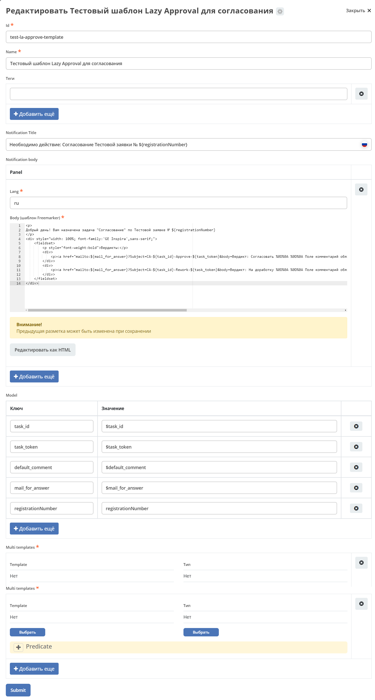

Функционал Lazy approval для задачи
===================================

.. _lazy_approval_settings:

.. contents::
  
.. note:: 

  Доступно только в  Enterprise версии.

**Lazy approval** – функционал, позволяющий принимать решения из электронной почты, не заходя в Citeck.

Для активации данного функционала необходимо иметь следующие версии микросервисов:

  - ecos-process:  **2.17.0 +**
  -	ecos-integration: **2.18.0 +**

Переменные конфигурации
-------------------------

Для обеспечения работы Lazy approval необходимо заполнить некоторые переменные в конфигурации Citeck:

  .. image:: _static/lazy_approval/LA_02.png
        :width: 700
        :align: center

 - **lazy-approval-mail-for-reply** - адрес электронной почты, который будет прописываться в почтовых уведомлениях пользователя для отправки ответных сообщений с результатом выполнения задачи. На данный почтовый адрес должна быть настроена конфигурация со считыванием ответных сообщений.
 - **lazy-approval-default-comment** - комментарий по умолчанию, который будет прописываться в ответных сообщениях у пользователей.

Настройка обработки ответных сообщений через Camel DSL
-------------------------------------------------------

В системе обработка ответных сообщений от пользователей обеспечивается за счет чтения почты на основе конфигурации через Camel DSL:

  .. image:: _static/lazy_approval/LA_06.png
        :width: 700
        :align: center

Пример настройки Camel DSL:

.. code-block::

  ---
  id: lazy-approval-email-configuration
  type: YAML
  state: STARTED
  content: |-
    - beans:
        - name: "lazyApprovalEndpoint"
          type: ru.citeck.ecos.integrations.domain.lazyapproval.api.LazyApprovalEndpoint
          properties:
            type: "email"
    - route:
        from:
          uri: "imaps://imap.yandex.com?username=testuser1@mail.ru&password=password&delete=false&unseen=true&delay=60000"
          steps:
            - to: "bean:lazyApprovalEndpoint"

.. image:: _static/lazy_approval/LA_07.png
      :width: 500
      :align: center

**Общий принцип работы:**

В системе создается бин типа **"email"**, что указывает, что сообщения необходимо обрабатывать, как сообщения, пришедшие из почты. (В дальнейшем количество типов может быть расширено). 

Затем устанавливается **route**, в котором указываются настройки параметров подключения почты и правил обработки сообщений. 

Полученные сообщения из почты отправляются в систему, где бин (который описан выше) их обрабатывает и делает соответствующие действия в системе.

Параметры **route uri**:

  -	**username** - почта, которая будет обеспечивать обработку сообщений;
  -	**password** - пароль для подключения;
  -	**delete** - удалять ли сообщения в почте после обработки;
  -	**unseen** - отмечать ли обработанные сообщения как прочитанные (обязательно выставлять как **true**, иначе сообщения будут обрабатываться бесконечно);
  -	**delay** - частота проверки почтового ящика (указывается в милисекундах) 

Шаблоны уведомлений для Lazy approval
---------------------------------------

  .. image:: _static/lazy_approval/LA_08.png
        :width: 700
        :align: center

FTL шаблон с использованием вердиктов:

.. code-block::

  

  Тестовое тело нотификации!
  

  

      <fieldset>
          
Вердикты:

          

              
<a href="mailto:${mail_for_answer}?Subject=CA-${task_id}-Done-${task_token}&body=Вердикт: Согласовать %0D%0A %0D%0A Поле комментарий обязательно для заполнения %0D%0A %0D%0A $[comment] %0D%0A %0D%0A ${default_comment} %0D%0A %0D%0A [comment]" target="_top">Согласовать / Approve</a>

          

      </fieldset>
  

**Основные моменты:**

В создание уведомления важная часть - ссылка на создание ответного письма, где указывается почтовый ящик, на которое будет отправлено сообщение с вердиктом и тема письма, которая должна быть написана по шаблону **Prefix-TaskId-Outcome-TaskToken**. (**Outcome** должен быть таким же как и в задаче).

Переменные, используемые в уведомлениях: 

  .. image:: _static/lazy_approval/LA_03.png
        :width: 700
        :align: center

  -	**task_id** - ключ задачи, по которому будет осуществляться поиск нужной задачи в системе;
  -	**task_token** - ключ, прописанный к задаче, по которому будет осуществляться проверка возможности согласования;
  -	**default_comment** - комментарий, который будет писаться по умолчанию. Задается через конфигурацию Citeck;
  -	**mail_for_answer** - почта, на которую будет отсылаться ответное сообщение. Задается через конфигурацию Citeck. Должен быть указан email, который используется для обработки ответных сообщений.

Итоговый шаблон должен выглядеть примерно следующим образом:

 .. image:: _static/lazy_approval/LA_04.png
       :width: 700
       :align: center

|

 .. image:: _static/lazy_approval/LA_05.png
       :width: 700
       :align: center

Пример уведомления Lazy approval к задаче
~~~~~~~~~~~~~~~~~~~~~~~~~~~~~~~~~~~~~~~~~~~~~

Рассмотрим пример уведомления Lazy approval к задаче согласования со следующими вердиктами:

 .. image:: _static/lazy_approval/sample_01.png
       :width: 400
       :align: center

Тело шаблона:

.. code-block:: 

  

  Добрый день! Вам назначена задача "Согласование" по Тестовой заявке № ${registrationNumber}
  

  

      <fieldset>
          
Вердикты:

          

              
<a href="mailto:${mail_for_answer}?Subject=CA-${task_id}-Approve-${task_token}&body=Вердикт: Согласовать %0D%0A %0D%0A Поле комментарий обязательно для заполнения %0D%0A %0D%0A $[comment] %0D%0A %0D%0A ${default_comment} %0D%0A %0D%0A [comment]" target="_top">Согласовать / Approve</a>

          

          

              
<a href="mailto:${mail_for_answer}?Subject=CA-${task_id}-Rework-${task_token}&body=Вердикт: На доработку %0D%0A %0D%0A Поле комментарий обязательно для заполнения %0D%0A %0D%0A $[comment] %0D%0A %0D%0A ${default_comment} %0D%0A %0D%0A [comment]" target="_top">На доработку / On rework</a>

          

      </fieldset>
  

Помимо описанных выше задана дополнительная переменная **registrationNumber**- номер тестовой заявки, который берется из карточки.
 

.. list-table::
        :widths: 5 5
        :header-rows: 1
        :align: center
        :class: tight-table 

        * - Уведомление
          - Ответ с вердиктом
        * - 
             .. image:: _static/lazy_approval/sample_03.png
                  :width: 400
                  :align: center

          - 

             .. image:: _static/lazy_approval/sample_04.png
                  :width: 400
                  :align: center

             |

             .. image:: _static/lazy_approval/sample_05.png
                  :width: 400
                  :align: center

Сообщения с отчетами об обработке сообщений с Lazy approval
------------------------------------------------------------

.. _lazy_approval_reports:

В системе предусмотрены ответные сообщения пользователю об успешно выполненных задачах через Lazy approval или о неудачных выполнениях.

Они делятся на 3 типа:

  -	Базовые шаблоны об ошибке (задается в конфигурации);
  -	Уведомление об успешном выполнении задачи (задается у задачи, либо через конфигурацию);
  -	Уведомление о неудачном выполнении задачи (задается у задачи, либо через конфигурацию).

**Базовое сообщение об ошибке** отличаются от уведомлений о неудачном согласовании тем, что базовые отправляются всегда (если шаблон задан в конфигурации), а уведомление о неудачном согласовании можно отключить через свойство в задаче. Базовые сообщения об ошибке отправляются ответным письмом, на сообщение пользователя и обрабатывает такие ошибки, которые возникли раньше, чем система смогла добраться до самой задачи и посмотреть конфигурации задачи (Например: не удалось распарсить тему письма).

**Уведомления об успешном или неудачном выполнении задачи** можно задать у самой задачи. В таком случае в качестве ответного сообщения будет сгенерировано письмо на основе данных шаблонов. Если в задаче не указывать шаблоны, то шаблон будет взять базовый из конфигурации Citeck.

Установление шаблонов по умолчанию для ответных сообщений Lazy approval.

Через конфигурацию Citeck устанавливаются базовые версии шаблонов для отправки ответных сообщений пользователям о результатах обработки их сообщений, отправленных через Lazy Approval.

 .. image:: _static/lazy_approval/LA_message_01.png
       :width: 700
       :align: center

|

 .. image:: _static/lazy_approval/LA_message_02.png
       :width: 400
       :align: center

Данный шаблон будет выбран в том случае, если необходимо отправить сообщение пользователю, но в задаче не указан шаблон.

В случае, если шаблон нигде не указан (ни в конфигурации, ни в задаче), то сообщение отправлено не будет.

Дополнительные параметры для шаблонов 
~~~~~~~~~~~~~~~~~~~~~~~~~~~~~~~~~~~~~~~

 -	Базовый шаблон об ошибке:

  .. list-table::
        :widths: 5 5
        :header-rows: 1
        :class: tight-table 

        * - Переменная
          - Описание
        * - **subject**
          - Тема сообщения от пользователя с префиксом "Re: " (для формирования письма как ответного сообщения)
        * - **error_code**
          - Код сообщения об ошибке. Возможные варианты:
            
            .. code-block::

              INCORRECT_DATA, USER_NOT_FOUND, TASK_NOT_FOUND

 -	Уведомление об успешном выполнении задачи:

  .. list-table::
        :widths: 5 5
        :header-rows: 1
        :class: tight-table 

        * - Переменная
          - Описание
        * - **task_name**
          - Название задачи

 -	Уведомление о неудачном выполнении задачи:

  .. list-table::
        :widths: 5 5
        :header-rows: 1
        :class: tight-table 

        * - Переменная
          - Описание
        * - **task_name**
          - Название задачи
        * - **error_code**
          - Код сообщения об ошибке. Возможные варианты:
            
            .. code-block::

              TASK_ALREADY_COMPLETED, OUTCOME_NOT_FOUND, TOKEN_NOT_FOUND, EXCEPTION
        * - **error_message**
          - Текст сообщения об ошибке
