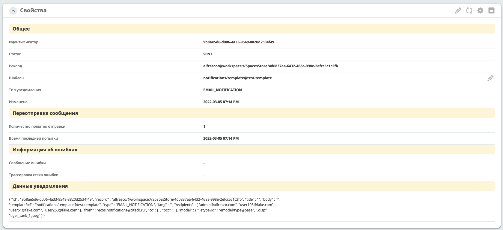
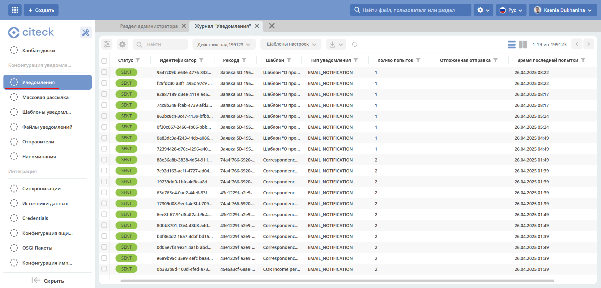

Уведомления
============

.. _notifications-label:

.. note:: 

    Отображение уведомлений добавлено в версии 2.7.0 микросервиса ecos-notifications

.. contents::

1. Сущность "Уведомление"
-------------------------

1.1 Форма, поля
~~~~~~~~~~~~~~~~~~

:Идентификатор: Уникальный id уведомления.

:Статус: Текущий статус.

:Рекорд: Базовый рекорд уведомления.

:Шаблон: Шаблон уведомления.

:Тип уведомления:

:Отложенная отправка: Время отложенной отправки сообщения

:Количество попыток отправки:

:Время последней попытки:

:Сообщение ошибки: Сообщение ошибки, возникшей при отправке сообщений.

:Трассировка стека ошибки:

:Данные уведомления: Полное json представление уведомления - вся полезная нагрузка, которая будет использовать при отправке.

1.2 Статусы
~~~~~~~~~~~~

:ERROR: При отправке сообщения возникла ошибка, будут предприняты попытки отправить сообщение повторно.

:SENT: Сообщение упешно отправлено.

:EXPIRED: Все попытки отправки сообщения окончились неудачей или время жизни сообщения (ttl) истекло.

:WAIT_FOR_DISPATCH: Сообщение ожидает отправки

:BLOCKED: Отправка сообщения блокирована.

2. Журнал уведомлений
---------------------

Журнал уведомлений располагается в инструментах администратора, блок **"Конфигурация уведомлений" - > журнал "Уведомления"**.

В данном журнале отображаетс информация о всех уведомлениях, отправленных с микросервиса ecos-notifications.

На текущий момент поддерживается только простая текстовая фильтрация полей через ``ИЛИ``.

